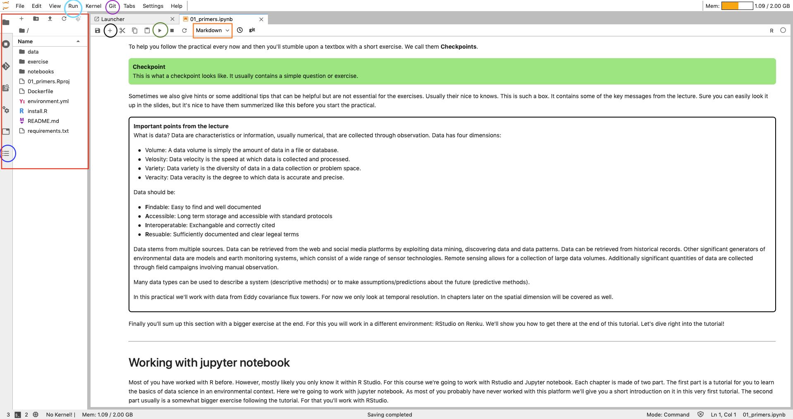
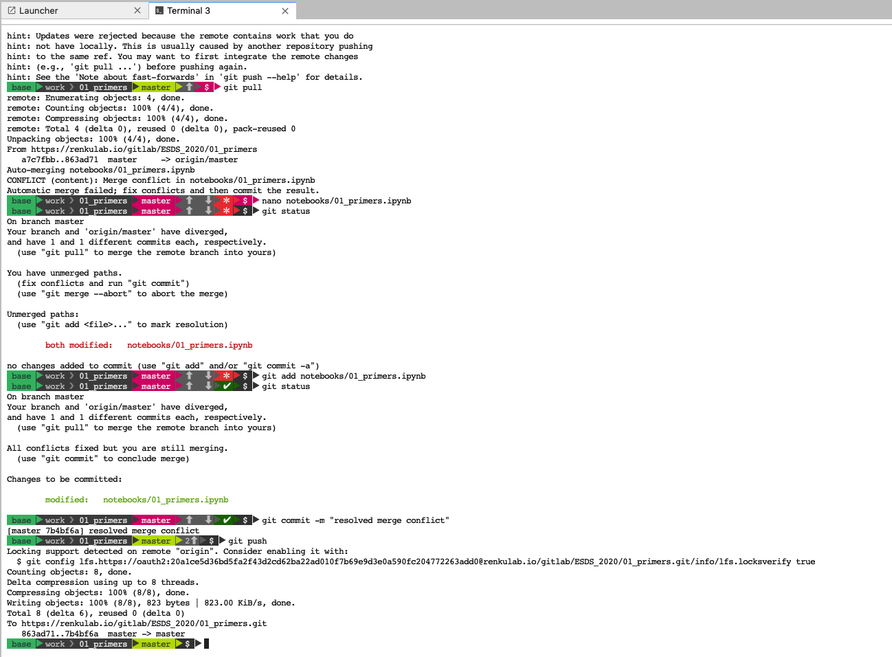

# Primers {#ch-01}

## Introduction
In this section, we'll show you how to structure a project and how to work with version control (git). You will learn how to read data into your workspace, get to know how different data is structured and what data types are, conduct simple data explorations and visualisations, and write data to files. You will also learn where you can turn to for help.

After you've gone through the lecture and solved the exercises you should be able to:

- Understand the definition of data science.
- Identify the different steps of a data science workflow.
- Recall a few typical examples of data science applications toward environmental problems.
- Explain what a system is and why system understanding is needed in environmental sciences.
- Define data, understand the structure of data, and list examples of environmental data.
- List sources of environmental data and explain the methodological difference in their collection.
- Execute R and load a dataset for data analyses.
- Apply basic Git commands for version control.
- Plot data science outputs and write them on the disk.

### Important points from the lecture 

Big data is described by four characteristics: 

- Volume: A data volume is simply the amount of data in a file or database.
- Velocity: Data velocity is the lag between time of observation observation and data ingest for analysis.
- Variety: Data variety is the diversity of data in a data collection or problem space.
- Veracity: Data veracity is the degree to which data is accurate and precise.  

FAIR data criteria are:

- **F**indable: Easy to find and well documented
- **A**ccessible: Long term storage and accessible with standard protocols
- **I**nteroperatable: Exchangeable and correctly cited
- **R**eusable: Sufficiently documented and clear legal terms

Environmental data is retrieved from a diversity of methods, including remote sensing, continuous site scale measurements (e.g., meteorological variables, hydrological variables, ecosystem-atmosphere exchange fluxes of water vapour and CO~2~), episodic observations (e.g., forest inventories, biodiversity assessments), field campaigns, or experiments in the field or under laboratory conditions. Data from these sources come in different shapes and formats. In this course, you'll learn to handle this diversity efficiently to answer research questions that you will likely encounter in the future. In many of the exercises, we will focus on data from continuous site scale observations, where meteorological variables are measured in parallel with ecosystem-atmosphere exchange fluxes of water vapour and CO~2~, collected from Eddy covariance technique. In addition, you will learn to tap into large environmental data repositories to complement your site-scale data.

At the end of each chapter, you'll sum up the section with a comprehensive exercise using RStudio on Renku. We'll show you how to set up RStudio and Renku at the end of this tutorial.

## Tutorial
### Working with Jupyter notebook
Most of you have worked with R before, most likely within RStudio. For this course, we're going to work with RStudio and Jupyter notebooks. Each chapter is made of two parts. The first part is a tutorial to learn the basics of data science in an environmental context where we will work with Jupyter notebooks (on Renku). The second part usually consists of a somewhat more extensive exercise in RStudio where the contents of the tutorials are applied.

<!---
Right now your browser should look something like this:

As you can see we've highlighted a few functionalities with colors. Jupyter notebooks are made up of a collection of cells. Each cell can be selected individually. In fact, if you click once on this text, a blue ribbon should show up on the left side. This means you've selected the cell where we wrote this text in. If you click twice you can start editing this cell. That's right, you have all the same options we had when putting this document together! Maybe this is a good thing for you as it allows you to add annotations directly in the script, maybe it isn't because you're afraid you might break something. To prevent the latter from happening you best keep your annotations to cells that look like text and do not contain any code. If you've clicked twice on this cell you might wonder how you can get back to the nice layout there was before you've double-clicked: Make sure this cell is selected (blue ribbon) and click on the small arrow we highlighted <span style="color:green">green</span> in the image above. If you hover long enough over that button it should say "run the selected cells and advance". Go on and click this button. Generally, you'll want to hit run on every cell that looks like code.

Sometimes when you double-click a cell that looks like text, it will reveal a mix of text and code. This code is usually layout options. Leave it as it is and you should be fine. For now, you've got to know text cells. In jupyter they're called Markdown. There are two more cell formats: Code and Raw. You can switch between them using the panel we've highlighted <span style="color:orange">orange</span>. Usually, there is no need for you to do so. Code we usually use to introduce you to a few new commands. Most cells marked as Code you actually have to run. Raw we tend to use for you to answer small exercises. Most of the time we provide solutions to these exercises that are hidden. You can reveal them by clicking on the three dots indicating that a section is collapsed. You can collapse a section yourself by clicking on the blue ribbon on the left side. Go ahead and do so. Afterward, make this section reappear by clicking the three dots that just appeared.

If you need to add an additional cell you can do so by clicking the +, highlighted black in the image above. On the left we've encircled an entire section <span style="color:red">red</span>. Here you have an overview of all your files. Additionally, you can change the panel to something else. For instance, if you click on the option down left that we've highlighted <span style="color:blue">blue</span> you'll be presented with a table of contents. This is very useful if you want to navigate in this file, as it's linked with titles and allows you to jump directly to a section (e.g. look up something from a previous section and go back to where you were).

If at some point in this tutorial you get an error it's likely because you've introduced a mistake further up in this script. Look through the sections you've adapted and find the mistake. Once you've corrected it, go back to where you were, select the cell, navigate to the tab <span style="color:turquoise">"Run"</span> (not the arrow, the word "Run" up left) and chose the option "Run All Above Selected Cell".

The last thing we've marked in the image is <span style="color:purple">Git</span>. This is essential to save your work permanently. Most of you have never worked with git. In the beginning, it's a bit fiddly but it is an essential skill in data science, the basics of which you're going to master soon. Pay close attention to the next subchapter!
-->

### Using Git for version control

Git is a program which lets you organise your code development and collaborate. The basic unit of a code project is a *repository*, which usually contains multiple source code files that may be orgnised in (sub) directories. It's advisable to only add code to a project, but not data. You'll soon understand why... Multiple edits and additions of new files are grouped into *commits*. The power of Git is that it knows the entire history of all the files in your repository. Therefore, it allows you to recover previous versions (previous commits) and track changes between them. Git also allows you to have multiple versions of your repository (*branches*), but we won't use this here. 

Your Git repository exists locally, that is, on your computer. But the power of Git only plays out when your local repository has its counterpart in the cloud. Different services exist to host a copy of your repository remotely (e.g., GitHub or GitLab). Git lets you *push* (upload) your commits to this *remote* copy and *pull* (download) changes that have been uploaded by your collaborator(s) or yourself from a different *clone* (local copy) of your repository.

Let's follow a simple Git workflow. Start by making a Change to this document: Add a cell at the beginning of the entire document and enter your name. Then save your changes by clicking on the floppy disk icon on the left or hit command + s.

Read the entire section before you try out any of these commands.

Click on Git and chose "Open Git Repository in Terminal"


A new tab will pop up with the terminal.


The first line shows the current working directory. In the second line, you'll add your git statements. Basically, you'll just need to know five commands:

```{r eval=F}
git status
git add
git commit
git push
git pull
```

`git status` will return which files you've modified or added. You have just added a new cell to this file, so if you type `git status` and hit enter, the terminal should return something like this:


Next, we use `git add` to specify which file should be added to the next commit:

```{r eval = F}
git add notebooks/01_primers.ipynb
```

A useful shorthand for adding all files that have modifications (updated files) at once, you can do:

```{r eval=F}
git add -u
```

You can `git add` multiple times. Once you're ready to "package" multiple such additions up, you can specify the commit and pass a text message that describes it.

```{r eval = F}
git commit -m "added a new cell with my name"
```

Lastly, we type `git push`. With this command, we upload our changes to the remote git repository, e.g. on GitHub or GitLab. Go on and type these lines in your terminal. By the end of it the terminal should look like this:


**Whenever you interrupt your work or finish a session, go through these commands!** Else your changes will be lost. Renku has an autosave function in case you forget but it can lead to conflicts when picking up your work again.

Once you pick up your work again, either stop the environment you're working within Renku and open a new one or start the next session by again opening the terminal within Jupyter and type `git pull`. As its name suggests, with it we can pull changes in our document from the *Git* repository. This might seem like an unnecessary step, which it is if it's just you working on this document. However, especially for the exercise at the end of a tutorial you might be working together with a peer and need to make sure you have her/his changes as well. If you're working together, make sure, that you do not work on the same document at the same time. This might lead to merge conflicts. Just to be clear: You can work on the same document but not on the same copy. E.g. all students work with this tutorial but each one has her/his own copy. Changes in this document won't appear in any other student's document. However, if you work on a document where changes will appear on another student's document, you're working on the same copy. In that case, avoid working at the same time. If at some point you encounter a merge conflict that *Git* cannot resolve automatically you'll have to do so manually. At the [end of this tutorial](#Git-denies-pushing-what-can-I-do?) we show how it's done. However, it's unlikely that you'll encounter such a problem in this course, which is why we don't explain it right here.

#### Supplementary: Git denies pushing what can I do?
Most of the time when git denies you to push changes, it's because of merge conflicts. If you read the error message git will probably tell you to enter `git pull`. Go ahead and do so. If git cannot resolve a merge conflict automatically, you'll have to do it manually. Here, we show you how it's done.


Once you've reached this point you will notice that if you close your file and want to reopen it, it won't work. Jupyter will prompt this warning:


To resolve the problem you have to open the terminal and open your file with an editor:

```{r eval=F}
nano notebooks/01_primers.ipynb
```

This will open your file in an editor. Scroll through the file until you reach a section that is highlighted as a merge conflict (we've marked it <span style="color:red">red</span> for you). Merge conflicts are highlighted with <<<<<<<, ======= and >>>>>>>.


In the next step, you'll have to manually remove the lines you want to get rid of and keep those you want to keep. You can also add something new like we did here.


Once you've fixed the merge conflict within the editor, type `ctrl O`. It should prompt something like this at the bottom of the editor:


If the file name is correct, hit `ctrl x`.

Back in the terminal, type `git status`, `git add notebooks/01_primers.ipyn` (or the name of the document where your merge conflict appeared), type again `git status`, make a commit `git commit -m "resolved merge conflict"` and finally `git push`.



Open your document and see if the conflict has been resolved. This is quite a bit of work! If you've not managed to resolve the conflict by yourself or feel intimidated or unsure about resolving a conflict, get in touch with a teaching assistant.


### Basics of R code

You probably all have entered individual statements into the R console. For example:

```{r}
print(mean(c(1,2,3)))
```

Congratulations, you're already coding!
But usually, multiple statments are needed to get, e.g., from the raw data you read into R to final numbers and figures that make up your thesis or paper. Together, these multiple statments constitute a *workflow*. It is essential that all workflows that underlie results of publications are *reproducible*. To achieve this, you can write multiple statements into an R script, save it, and enable your peers to reproduce the same workflow. This is what you will do as an exercise at the end of this session.

An R script is basically a text file, named with the suffix `.R` to indicate that it is executable by R. Executing the script is running each statement, line-by-line, starting from the top, and can be done in R by:

```{r eval=F}
source("my_r_script.R")
```

If you find this brief explanation for running scripts too brief, you can find more useful information in the ebook [R for Data Science](https://r4ds.had.co.nz/workflow-scripts.html). How to write good code? Good code is clean, readable, consistent, and extensible (easily modified or adapted). To achieve this, here are a few points to consider - inspired by [best practices for coding](https://www.r-bloggers.com/r-code-best-practices/).

#### Variable naming

Choose concise and descriptive variable names. Different variable naming styles are being used. In this course, we use lowercase letters, and underscores (`_`) to separate words within a name (`_`). Avoid `.` as they are reserved for S3 objects (base R). Also, don't name your objects with  names of common functions and variables since your re-definition will mask already defined object names. 

For example, `df_daily` is a data frame with data at a daily resolution. Or `clean_daily` is a function that cleans daily data. Note that a verb is used as a name for a function and an underscore (`_`) is used to separate words. 

```{r eval=F}
# Good
day_01

# Bad
DayOne
day.one
first_day_of_the_mont
djm1

# Don'ts
mean <- function(x) min(x) # mean() itself is already a function
T <- FALSE # T is an abbreviation of TRUE
c <- 10 # c() is used to create a vector (example <- c(1, 2, 3))
```

#### Comments

Adding comments helps to explain exactly what the code is doing. This makes it easy to understand and modify the code, and can be key when debugging. In R source files, comments are prefixed with a `#`, which means that all what's right of the `#` is not interpreted by R. If written well, anyone new to the code or even yourself returning to it after some time should easily be able to follow what was done and why it was done. 

#### Syntax

Adding enough white space and line brakes and adding it the right locations greatly helps the legibility of your code. Cramping it up too much leads to an unintellible sequence of characters and you'll not easily understand what parts go together (operators, variable names, brackets). Therefore, consider the following points:

- Use spaces around operators (`=`, `+`, `-`, `<-`, `>`, etc.).
- Use `<-`, not `=`, for allocating a value to a variable.
- An opening curly bracket (`{`) should be followed by a line break and never stand alone on a line. A closing curly bracket (`}`) should stand alone on a line unless followed by `else`.
- Code inside curly brackets should be *indented* (recommended: two white spaces at the beginning of each line for each indentation level).

For example, nice code looks like this:

```{r eval=F}
if (temp > 5.0){
  growth_temp <- growth_temp + temp  
}
```

#### Structure your source code

At the beginning of each file add a **header** as a fully commented text section, describing who wrote the code, what it contains, and how it fits into the larger analysis framework. For example:

```{r}
##////////////////////////////////////////
## ESDS Primers
## Author: Harry Belafonte
## Purpose: Getting up to speed with R.
##---------------------------------------
```

Next, load all **libraries** needed within the script. 

(For this chapter, we'll mostly work with functions already integrated into R directly, also known as *base R*. Additionally, you'll work with functions from *tidyverse*. *tidyverse* is a collection of packages specifically designed for writing efficient data science workflows.)

<!-- Go ahead and click the "play" icon to run on the next cell. -->

```{r message=F}
library(tidyverse)
```

This loads all the packages of the tidyverse at once (ggplot2, dplyr, tidyr, ...), some of which you will learn more about in Chapter \@ref(ch-02).

Next, **source** any scripts and **load** data.

Then, start with the sequence of statements. To visually separate parts, **break up your code** using, commented lines. For example:

```{r eval=F}
##----------------------------------------
## Load libraries
##----------------------------------------
library("tidyverse")
```

#### Organise files

Often, analyses require so many steps that your script gets excessively long. Over 2000 lines of code in one file are hard to digest. To split your code up, consider the following points:

- Avoid duplicating code. If the same sequence of multiple statements or functions are to be applied repeatedly to different objects, then it's usually advisable to "package" them up into a new function and apply this single function to each object. This may sound abstract now, but you'll encounter this again in later chapters.
- Functions can be saved in separate source files. It's advised to save all functions that belong to a project or workflow in a subdirectory (e.g., named `R/`. To use these functions in your script, you have to load them into the workspace, e.g., by `source("./R/my_function.R")`.
- Always use relative paths to load or write files. E.g., `"./R/my_function.R"` points to a file named `my_function.R` that sits in a subdirectory `R` of the current working directory (`.`).
- Write figures into a separate subdirectory (e.g., `./fig/`), and processed data files into a different one (e.g., `./data/`).
- Keep your script and all these subdirectories from/to which it loads/writes files together in a main directory - the project directory. All code of a project directory, including its subdirectories, make up a Git repository.
- Keep original data (e.g., the raw data files that you created when collecting the data in the field, or data files you downloaded from the web) outside the project directory. They are independent of the workflow of your own particular project and can be used also in other projects. 
- In RStudio, use the "project" functionality to create a new project. We won't use it in this course. See [here](https://r4ds.had.co.nz/workflow-projects.html) for more information on projects in RStudio.
- It's advisable to create an separate data directory outside (e.g., `~/data/`) that holds all the data you ever downloaded, or obtained, or gathered. Within such a data directory, you can put files from different sources into separate subdirectories and add a description file (e.g., `~/data/my_experiment/README`) definining who, from where and when the data was obtained and defining data use policy.

#### Tidy data

Not just code can be good or not-so-good, also data can be tidy or not. Even if it may look beautiful in Excel, a data file may not be "machine-readable". In the exercises at the end of this chapter, you will make a not-so-good data file tidy and machine readable. But what is [**tidy data**](https://r4ds.had.co.nz/tidy-data.html) exactly? It can be defined by the following rules:

1. Each column is a variable
2. Each row is an observation
3. Each value has its own cell

](./figures/tidy_data.png)

Having data in a tidy format greatly facilitates all data wrangling steps. The concept can even be taken further by understanding a "value" as any object type. You will learn more about this in Chapter \@ref(ch-02).

### Reading data into R

In the next step, we want to read the data. We're going to work with FLUXNET data from the site "Laegern" ([CH-Lae](https://gl.ethz.ch/infrastructure/sites/laegeren.html)), located close to Zürich. FLUXNET is a global network of sites where ecosystem-atmosphere exchange fluxes are measured (e.g., CO~2~, water vapour). In Switzerland, there is a total of six such sites. Laegern is one of them. The data is stored in a `.csv` file. To import it into the R workspace, we use the function `read_csv()` from the tidyverse packages. In the other R code, you'll also encounter the base R `read.csv()` function. However, `read_csv()` is much faster and reads data into a tidyverse-data frame (a *tibble*) which has some useful additional characteristics, on top of a common R data frame. To tell the function where the data is located, pass the data's path as an argument. You can either enter an *absolute path*, starting from `C:/` on a Windows computer or `~/` on a Mac. Or, alternatively, you can provide a *relative path*, where `./` points to the present working directory and `../` is one level up, or `../../` is two levels up, etc.

```{r eval=F}
# set working directory
setwd("~/Documents/ETH/ESDS")
```

Now, let's try to load a data set which is save in our data folder and can be accesses using the relative path below.

```{r message=F}
# use a relative path to read the data
df <- read_csv("./data/FLX_CH-Lae_FLUXNET2015_FULLSET_HH_2004-2014_1-3.csv")
print(df) # to print an overview of the data frame
```

That was easy. The file is automatically machine-readable because we have:

- Only one header row, containing the column (variable) names
- Variables organised by columns, and observations by rows
- All columns have the same length
- Each column consists of a single data type (e.g., character, numeric, logical; see below for more info) - Here, all columns are interpreted as numeric (`<dbl>')
- One value per cell
- No merged cells

In short, the data frame is tidy.

To understand the sort of object we work with, i.e. the *class*, we can do:

```{r}
class(df)
```

Fundamentally, `df` is a `data.frame`. In addition, it is also of some other classes (`spec_tbl_df","tbl_df", "tbl"`)

#### Understand the data structure

We have loaded the data frame `df` into the workspace. Now, we can check the data structure. There are several functions to help you with this. Here is a non-exhaustive list of functions to get a sense of the content and structure of the data.

- Size
  - `dim()`  - returns the size of the dimensions of an object (here: number of rows and columns)
  - `nrow()` - returns the number of rows of an object
  - `ncol()` - returns the number of columns of an object
- Content
  - `head()` - returns the first 6 rows
  - `tail()` - returns the last 6 rows
  - `View()` - look at the entire data set in the form of a table (It's not supported by the Jupyter environment. In RStudio however, it works)
- Names
  - `names()` - returns the column names (for `data.frame`-objects it's synonymous to `colnames()`)
  - `rownames()` - returns the row names
- Summary
  - `class()` - returns the class of an object
  - `str()` - returns the structure of an object and information about the class, length and content of each column
  - `summary()` - returns summary statistics for each column
  
The size of the data is quite large:

```{r}
dim(df)
```

But we can still have a look at the variable names:

```{r}
colnames(df)
```

A description of standardized FLUXNET data variables is available [here](https://fluxnet.org/data/aboutdata/data-variables/). A selection of available variables that we will use in subsequent chapters are:

- `GPP` (gC m$^{−2}$ s$^{-1}$): Gross primary production
- `WS` (m s$^{-1}$): horizontal wind speed
- `USTAR` (m s$^{-1}$): friction velocity
- `TA` (deg C): air temperature
- `RH` (%): relative humidity (range 0–100%)
- `PA` (kPa): atmospheric pressure
- `G` (W m$^{−2}$): ground heat flux, not mandatory, but needed for the energy balance closure calculations
- `NETRAD` (W m$^{−2}$): net radiation, not mandatory, but needed for the energy balance closure calculations
- `SW_IN` (W m$^{−2}$): incoming shortwave radiation
- `SW_IN_POT` (W m$^−2$): potential incoming shortwave radiation (top of atmosphere theoretical maximum radiation)
- `PPFD_IN` ($\mu$mol photons m$^{−2}$ s$^{-1}$): incoming photosynthetic photon flux density
- `P` (mm): precipitation total of each 30 or 60 minute period
- `LW_IN` (W m$^{−2}$): incoming (down-welling) longwave radiation
- `SWC` (%): soil water content (volumetric), range 0–100%
- `TS` (deg C): soil temperature
- `CO2` ($\mu$molCO~2~ mol$^{-1}$): Carbon Dioxide (CO$_2$) mole fraction in moist air

#### Selecting data and entering the tidyverse

`df` has two dimensions (rows and columns). If we want to extract specific data from it, we need to specify the "coordinates" of this data. Row numbers come first, columns second.

```{r}
# Selecting data in base R  ================================
df[1] # reduces the data frame (tibble) to its first column
df[1, 1] # reduces the data frame (tibble) to its first column and first row
df[, 1] # reduces the data frame (tibble) to its first column, equivalent to 'fluxes[1]'
df[1, ] # reduces the data frame (tibble) to its first row
df[1:3, 3] # reduces the data frame (tibble) to its first three rows and the 3rd column
df[, c(1,4,7)] # reduces the data frame (tibble) to its 1st, 4th and 7th column
```

Another method is to select the columns by column names, i.e. giving as input a string vector with the name of each column we want to select (again, this is Base R notation). This is especially useful if the columns we want to select are not contiguous. For example:

```{r}
# Selecting data by name in base R  ================================
df[,c("TIMESTAMP_START", "TIMESTAMP_END", "TA_F_MDS", "TA_F_MDS_QC")]
```

In this course, we'll use the [tidyverse](https://www.tidyverse.org/), which is a set of R packages designed for working with tidy data and writing code in such a way as to emphasize and better understand the "workflow aspect" of it. Code which does the same as above, but is written for the tidyverse can read as follows.

```{r}
select(df, 1) # reduces the data frame (tibble) to its first column
select(df, TIMESTAMP_START, TIMESTAMP_END, TA_F_MDS, TA_F_MDS_QC)  # reduces the data frame to columns specified by names
```

Let's dive even deeper into tidyverse and use the pipe `%>%` operator:

```{r}
df %>% select(1)   # still reduces the data frame (tibble) to its first column
```

It probably doesn't need much explanation, as it reads very intuitively. But just in case: We *pipe* the object `df` into the `select()` function with argument `1`. Note that the `%>%` operator can be used on any function. It tells the function to interpret what's coming from the left of `%>%` as its **first** argument.

Let's make a selection of variables to use for the remainder of this tutorial...

```{r}
df_small <- df %>% 
  select(TIMESTAMP_START, TA_F, PPFD_IN)
```

Note: In the code above, indentation was used to highlight which parts go together and make the code easily readable. Indentation and line breaks take no effect in R per se (unlike in other programming languages, e.g., Matlab, Python), but help to make the code legible.
 
#### Renaming

TIMESTAMP_START, TA_F and PPFD_IN as variable names may be hard to remember and in this section you will have to type them a lot. Therefore we change their names to something more intelligle.

```{r}
df_small <- df_small %>% 
  rename(time = TIMESTAMP_START, temp = TA_F, ppfd = PPFD_IN)
```

#### Writing (saving) data

A data frame can be written to a CSV file by:

```{r eval = F}
write_csv(df_small, path = "df_small.csv")
```

The function `saveRDS()` lets you save individual objects of any form (not just a data frame). `saveRDS()` creates a binary file that is fast to write and read, but only intelligible to R. Such files are commonly identified by the suffix `.rds`. It is recommended to name the `.rds` files according to the single object they contain. For example:

```{r eval=F}
saveRDS(temp_sum, file = "temp_sum.rds")
```

This file can then be read into the R workspace. Sometimes, it's practical to give it a new name, e.g.:

```{r eval=F}
temp_sum2 <- readRDS("temp_sum.rds")
```

Note that making a file publicly available as a `.rds` file violates the FAIR principles. It's not *interoperable*. Therefore, whenever possible, save your data in a format that is readable across platforms without requiring proprietary software. Hence use `write_csv()` whenever possible. We'll encounter other non-proprietary formats that let you save and share more complex data structures in chapter \@ref(ch-02).


### R Objects

#### Data frames

We have learned that `df` is a data frame. Data frames are the most common format used in R. You can think of them as a table that allows for different data types to be stored in each column. At the same time, all columns need to be of the same length and all values in a column need to be of the same data type. 

The most common data types in R are:

- `numeric` (num) - any number (except complex numbers) -> 2.375
- `integer` (int) - integer numbers -> 2
- `character` (chr) - any string -> "fluxes"
- `logical` (logi) - boolean -> TRUE FALSE
- `factor` (Factor) - categorical data, the variable can only be one of a defined amount of options -> female/male/other
- `function` (function) - a set of statements organized to perform a specific task -> sum()

However, there are many more data types. For now, we'll stick to these.

#### Vectors and classes

The contents of a data frame column is a *vector*. It can be "extracted" from its data frame by `pull`. Next, we're going to extract the values of the column `temp` and return the class of the entries in this vector. This type of sequence of commands (actually, a small workflow) can be implemented as a sequence of pipes:

```{r}
df_small %>% 
  pull(temp) %>% 
  class()
```

Sometimes you need to convert a numeric number into a *character*. The following takes only the first row of the data frame `fluxes_subset` using the `slice()` function with argument `1` (for the first row), extracts the single temperature value, converts it to an integer, and then to a character:

```{r}
df_small %>% 
    slice(1) %>%
    pull(temp) %>%
    as.integer() %>%
    as.character()
```

You notice that now the values are in quotes "". R interprets them as a text and you will not be able to do any numeric calculations with them anymore.

Writing each function command on a separate line, connected with the pipe operator `%>%`, allows for good readability of the entire workflow. Note that in R, a line break has no effect. Compare the above sequence of pipes to the following equivalent bit of code to understand the advantage of the tidyverse syntax:

```{r}
as.character(as.integer(df_small[1,"temp"]))
```

The sequence of pipes is much more intuitively intellible, isn't it?

An object of class **logical** can only be `TRUE` or `FALSE`. If I ask which `temperatures < 0` for example, R will return a vector of class logical.

```{r}
temperatures <- df_small %>% 
    slice(1:10) %>%
    pull(temp)

temperatures < 0
```

Indeed, the first 10 temperature values are all below freezing.

#### Lists

Lists are extremely flexible. They allow us to store different types of data, even if they are of different lengths. Here's an example where each element of the list is named.

```{r}
mylist <- list(
    temperatures = c(2.234, 1.987, 4.345), 
    my_favourite_function = mean, 
    best_course = "Environmental Systems Data Science"
    )
```

Similar to data frames, we can extract elements from lists, either by index `[[1]]` or by the name `[["temperatures"]]`. Note the double `[[]]` here, indicating an element of a list as opposed to `[]` indicating an element of a vector. To get the entire vector of temperatures, do either of the two:

```{r}
mylist[[1]]
mylist[["temperatures"]]
```

And to get the first temperature value:

```{r}
mylist[["temperatures"]][1]
```

You can also append elements to the list (either way is possible):

```{r}
mylist[["my_second_favourite_function"]] <- median
mylist$my_second_favourite_function <- median
```

**Checkpoint**

In *mylist*, we have saved a function called `my_favourite_function` and a numeric vector called `temperatures`. Use the function stored in the list and apply it on the vector temperatures, stored in the same list. Add the result in the list as a new variable and call it `mean_temperature`. The mean temperature should be equal to 2.85533333333333. To view the solution, click on the three dots below.

**Solution**

```{r}
mylist$mean_temperature <- mylist[["my_favourite_function"]](mylist[["temperatures"]])
mylist$mean_temperature
```

This was a very condensed introduction to vectors and lists. A more complete introduction is given [here](https://r4ds.had.co.nz/vectors.html).

### Data visualisation

Looking at data is an integral part of any data science workflow. In this chapter, we introduce just the very basics. In later chapters, you'll get introduced to additional methods for visualising data. Our data frame `fluxes_subset` contains three variables, one of which is `time`. In other words, we're dealing with a time series. Let's look at the temporal course of temperature in the first 1440 time steps (corresponding to 30 days) as a line plot (`type = "l"`)

```{r}
plot(1:1440, df_small$temp[1:1440], type = "l") 
```

Another useful way of looking, not at a temporal course, but rather at the distribution of your data, is to display a histogram.

```{r}
hist(df_small$temp)
```

You can save your plot in as file. As long as the file size does not get too large, write vector graphics outputs, i.e. PDF. In base-R, this can be done by:

```{r eval=F}
pdf("./figures/filename.pdf")
hist(df_small$temp)
```

**Checkpoint**

Create a scatter-plot (points) of temperature versus the incoming photosynthetic photon flux density using all data points in `df_small`. To view the solution, click on the three dots below. Can this plot intuitively be interpreted?

**Solution**

```{r}
plot(df_small$temp, df_small$ppfd)
```

### Example code: Loops

`for` and `while` loops exist in probably all programming languages. We introduce them here because they provide an essential and powerful functionality for solving many common tasks. You will encounter them later again (see Chapter \@ref(ch-05). `for` and `while` loops let us repeatedly execute the same set of commands, while changing an index, or counter variable to take a sequence of different values. The following example calculates a temperature sum of the first ten values, by iteratively adding them together. Of course, this is equivalent to just using the `sum()` function. 

```{r}
temp_sum <- 0
for (i in 1:10){
  temp_sum <- temp_sum + df_small$temp[i]
}
print(temp_sum)
print(sum(df_small$temp[1:10]))
```

Instead of directly telling R how many iterations it should do we can also define a condition. As long as the condition is TRUE, R will continue iterating. As soon as it is FALSE, R stops the loop. The following lines of code do the same operation as the for loop we just wrote. What's different? What is the same?

```{r}
i = 1
temp_sum <- 0
while (i <= 10){
  temp_sum <- temp_sum + df_small$temp[i]
  i = i+1
}
print(temp_sum)
print(sum(df_small$temp[1:10]))
```


### Where to find Help

The material covered in this course will give you a solid basis for your future projects. Even more so, it provides you with code examples that you can adapt to your own purposes. Naturally, you'll face problems we didn't cover in the course and you'll need to learn more as you go. As a beginner, it can feel daunting to write a script from scratch. The good news is, you don't have to. Many people make their code available online and often others have faced similar problems. Modifying existing code might make it easier for you to get started.

#### Within R

"*I know the name of a function that might help solve the problem but I don't know how to use it.*" Typing a `?` in front of the function will open the documentation of the function. Let's say you've learned a lot about plots by now but you don't know how to make a boxplot:

```{r eval =F}
?boxplot
```

If you do know how a function works but need to be reminded of the arguments it takes simply type:

```{r eval =F}
args(boxplot)
```

"*There must be a function that does task X but I don't know which one.*" Typing `??` will call the function `help.search()`. Maybe you want to save a plot as a JPEG but you don't know-how:

```{r eval =F}
??jpeg
```

Note that it only looks through your installed packages.

#### Online

To search in the entire library of R go to the website [rdocumentation.org](https://www.rdocumentation.org/) or turn to a search engine of your choice (ecosia, google, duckduckgo, bing,...). It will send you to the appropriate function documentation or a helpful forum where someone has already asked a similar question. Most of the time you'll end up on [stackoverflow.com](https://stackoverflow.com/), a forum where most questions have already been answered.

#### Error messages

If you don't understand the error message, start by googling it. However, this is not always useful as developers rely on the error catching provided by R. To be more specific add the name of the function and package you're using.

#### Asking for help

If you can't find a solution online, start by asking your friends and colleagues. Someone with more experience than you might be able and willing to help you. When doing so think hard about how you state the problem. The key to receiving help is to make it as easy as possible to understand the issue your facing. Try to reduce what doesn't work to a simple example. Reproduce a problem with a simple data frame instead of one with thousands of rows. Generalize it in a way that people who don't do research in your field can understand the problem. If you're asking a question online in a forum include the output of `sessionInfo()` (it provides information about the R version, packages your using,...) and other information that can be helpful to understand the problem. stackoverflow.com has its own guidelines on how to ask a good question, stick to it. If your question is well crafted and hasn't been answered before you can sometimes get an answer within 5 minutes. [https://stackoverflow.com/help/how-to-ask](https://stackoverflow.com/help/how-to-ask)

Finally, many packages have a mailing list or allow you to open a query on the code repository, where you can ask specific questions. The same is true for R itself. The R-Help mailing list [https://stat.ethz.ch/mailman/listinfo/r-help](https://stat.ethz.ch/mailman/listinfo/r-help) is read by many people. However, the tone of such mailing lists can be pretty dry and unwelcoming to new users. Be sure to use the right terminology or else you might get an answer pointing out your misuse of language instead of your problem. Also, be sure your question is valid. Or else you won't get an answer.

### Further reading

A great tutorial to using R for Data Science in general is the freely available online-book by [Grolemund & Wickham](https://r4ds.had.co.nz/). The material covered in this chapter should serve as a "primer". That is, its purpose is to get you started with R and git and make sure you know the basics. If you feel that you are still missing some basic concepts of R, a good starting point to fill up your gaps is the [Chapter *Workflow: basics* in Grolemund & Wickham](https://r4ds.had.co.nz/workflow-basics.html). 

## Exercise

Congratulations, you've reached the end of the first tutorial! 

This exercise will have you working on an Excel file and then in Renku's Rstudio. You'll need to download the provided datafile from moodle. Your task will be to tidy the data and then read it into Renku's Rstudio.

Download data from Groenigen et al., 2014, containing soil organic matter content data from a meta analysis of CO2 experiments, and available on Moodle. Open the file in Excel and navigate to the tab 'Database S1'. You'll find a short description in the top-left cell: "Database S1. Overview of CO2 enrichment studies reporting soil C contents that were used in our analysis.". There is an issue with this dataset. Of course, .xls files are not easily readable into R without an extra package. What's more is that even after saving the tab 'Database S1' as a CSV file, the table you get is not **machine-readable** into a data frame that we can work with in R. The way the data is organised into cells doesn't follow the structure of a dataframe and is not tidy. Recall the **tidy data** rules from the 01_primers.ipynb tutorial.

Your task is to:

1. Manually manipulate the .xls file to make it tidy.
2. Save the data as a .csv file (comma-separated-values).
3. Read the .csv file into RStudio.
4. Calculate the logarithmic response ratio as the logarithm of the ratio of soil C contents at elevated CO2 divided by soil C contents at ambient CO2, for each data point (experiment and sample date).
5. Visualise the distribution of the response ratio and save the plot as a .pdf file.

Implement steps 3.-5. in an RMarkdown (.Rmd), applying some of the points for good coding practices. For the peer review round, share your code and the figure file (as html file via the `knit` button at the top, left of the git menu, see Figure below) with your partner.

<!-- Follow the steps outlined below to get a more detailed instruction on your task: 

For the final exercise, you will move to RStudio on Renku. Since you're doing this for the first time, we'll quickly remind you how to get there:
- Save all your changes to this file using git (git status, git add, git commit, git push)
- Close this tab and go back to the [Renku](https://renkulab.io/) website.
- Navigate to your environments and stop the environment.
- Create a new environment, select `/rstudio` instead of `/lab`
- Connect to the environment, navigate to the folder `/exercise/scripts/` and open the R file called 'exercise_01.R' -->

Before you go: Git looks a little different in Rstudio but essentially works the same way. Instead of typing the commands, you use a graphical user interface. Click on git (highlighted red in the following image), there you'll find the three options you're familiar with. `git status` and `git add` are not needed.

