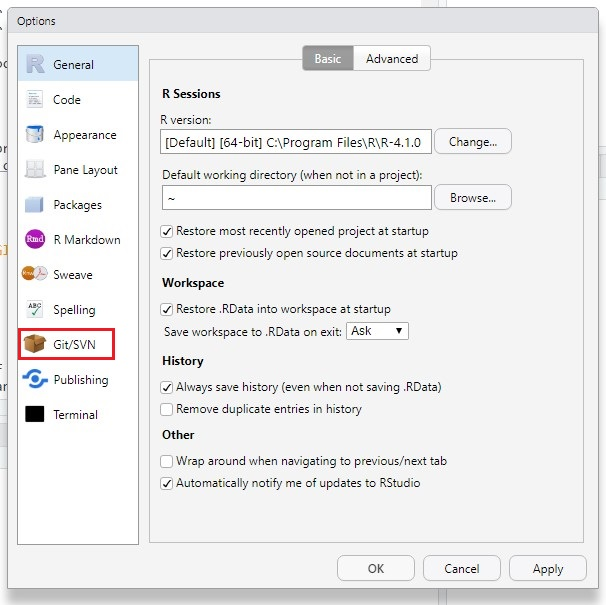
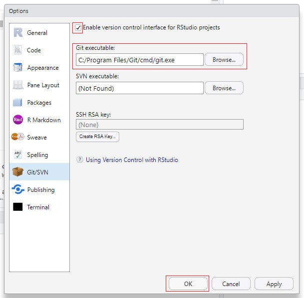
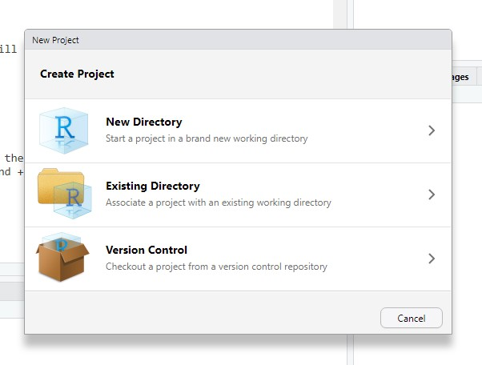
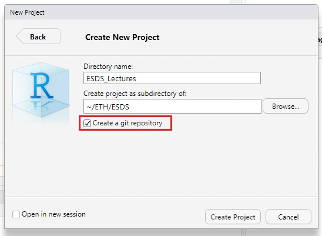
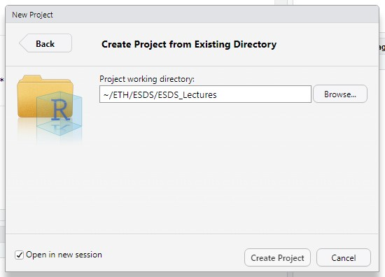
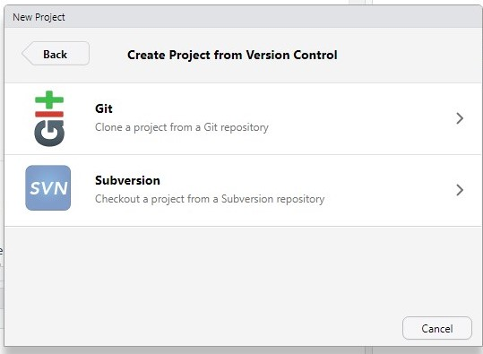
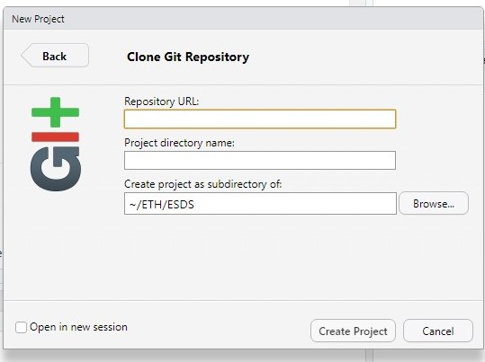
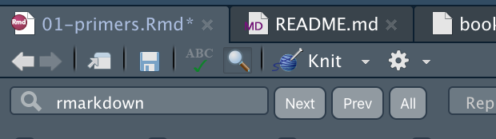
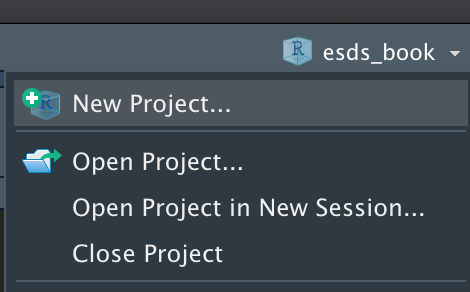

# Primers {#ch-01}

## Introduction

This tutorial gets you started to working with *R* and *Git* for a data science project. This chapter also includes some basics for programming in R (reading and writing data, types of objects, simple vizualisations). If you've had previous experience with R, you may skip this part. 

After you've gone through the lecture and solved the exercises, you should be able to:

- Understand the definition of data science.
- Identify the different steps of a data science workflow.
- Recall a few typical examples of data science applications toward environmental problems.
- Explain what a system is and why system understanding is needed in environmental sciences.
- Define data, understand the structure of data, and list examples of environmental data.
- List sources of environmental data and explain the methodological difference in their collection.
- Execute R and load a dataset for data analyses.
- Apply basic Git commands for version control.
- Plot data analysis outputs and write them on the disk.

### Important elements from the lecture 

The four 'Vs' of *Big Data*: 

- Volume: Data volume is simply the amount of data in a file or database.
- Velocity: Data velocity is the lag between time of observation and data ingest for analysis.
- Variety: Data variety is the diversity of data in a data collection or problem space.
- Veracity: Data veracity is the degree to which data is accurate and precise in comparison with a measured phenomenon  

*Open Science* is enabled by the *FAIR* criteria for data use and sharing:

- **F**indable: Easy to find and well documented.
- **A**ccessible: Long term storage and accessible with standard protocols.
- **I**nteroperatable: Exchangeable and correctly cited.
- **R**eusable: Sufficiently documented and clear legal terms.

Environmental data is collected from a diversity of methods, including remote sensing, continuous site-scale measurements (e.g., meteorological variables, hydrological variables, ecosystem-atmosphere exchange fluxes of water vapour and CO~2~), episodic observations (e.g., forest inventories, biodiversity assessments), field campaigns, or experiments in the field or under laboratory conditions. Data from these sources come in different shapes and formats. In this course, we will learn to handle this diversity efficiently to answer research questions that you will likely encounter in the future. In many of the exercises, we will focus on data from continuous site scale observations, where meteorological variables are measured in parallel with ecosystem-atmosphere exchange fluxes of water vapour and CO~2~, collected by the eddy covariance technique. In addition, you will learn to tap into large environmental data repositories to complement your site-scale data.

At the end of each chapter, you will find an exercise that you can complete using the [Renku](https://datascience.ch/renku/) cloud computing environment and the [RStudio](https://www.rstudio.com/) integrated development environment.

## Tutorial

### Libraries

This tutorial uses a set of libraries. Libraries provide a set of functions and/or other objects targeted for specific applications and are not available through *base R*. To run commands of this tutorial, make sure to install and load all packages on your computer. This can be done by:

```{r eval=TRUE}
list_pkgs <- c("tidyverse")
new_pkgs <- list_pkgs[!(list_pkgs %in% installed.packages()[, "Package"])]
if (length(new_pkgs) > 0) install.packages(new_pkgs)
library(tidyverse)
```

In each chapter of this tutorial, you'll find a similar statement to specify which package the respective chapter's tutorial will use and to install them if not available.

### Working with RStudio on Renku

XXX 

<!---
Right now your browser should look something like this:

As you can see we've highlighted a few functionalities with colors. Jupyter notebooks are made up of a collection of cells. Each cell can be selected individually. In fact, if you click once on this text, a blue ribbon should show up on the left side. This means you've selected the cell where we wrote this text in. If you click twice you can start editing this cell. That's right, you have all the same options we had when putting this document together! Maybe this is a good thing for you as it allows you to add annotations directly in the script, maybe it isn't because you are afraid you might break something. To prevent the latter from happening you best keep your annotations to cells that look like text and do not contain any code. If you've clicked twice on this cell you might wonder how you can get back to the nice layout there was before you've double-clicked: Make sure this cell is selected (blue ribbon) and click on the small arrow we highlighted <span style="color:green">green</span> in the image above. If you hover long enough over that button it should say "run the selected cells and advance". Go on and click this button. Generally, you will want to hit run on every cell that looks like code.

Sometimes when you double-click a cell that looks like text, it will reveal a mix of text and code. This code is usually layout options. Leave it as it is and you should be fine. For now, you've got to know text cells. In jupyter they're called Markdown. There are two more cell formats: Code and Raw. You can switch between them using the panel we've highlighted <span style="color:orange">orange</span>. Usually, there is no need for you to do so. Code we usually use to introduce you to a few new commands. Most cells marked as Code you actually have to run. Raw we tend to use for you to answer small exercises. Most of the time we provide solutions to these exercises that are hidden. You can reveal them by clicking on the three dots indicating that a section is collapsed. You can collapse a section yourself by clicking on the blue ribbon on the left side. Go ahead and do so. Afterward, make this section reappear by clicking the three dots that just appeared.

If you need to add an additional cell you can do so by clicking the +, highlighted black in the image above. On the left we've encircled an entire section <span style="color:red">red</span>. Here you have an overview of all your files. Additionally, you can change the panel to something else. For instance, if you click on the option down left that we've highlighted <span style="color:blue">blue</span> you will be presented with a table of contents. This is very useful if you want to navigate in this file, as it is linked with titles and allows you to jump directly to a section (e.g. look up something from a previous section and go back to where you were).

If at some point in this tutorial you get an error it is likely because you've introduced a mistake further up in this script. Look through the sections you've adapted and find the mistake. Once you've corrected it, go back to where you were, select the cell, navigate to the tab <span style="color:turquoise">"Run"</span> (not the arrow, the word "Run" up left) and chose the option "Run All Above Selected Cell".

The last thing we've marked in the image is <span style="color:purple">*Git*</span>. This is essential to save your work permanently. Most of you have never worked with *Git*. In the beginning, it is a bit fiddly but it is an essential skill in data science, the basics of which you are going to master soon. Pay close attention to the next subchapter!
-->

### Git

*Git* is a program for code version control and managing collaborative code development. The basic unit of a Git project is a *repository*, which usually contains multiple source code files that may be organised in (sub) directories. Git keeps track of the entire history of a repository in steps of *commits*. A commit is a "bundle" of multiple edits and additions of new files and is specified by the user. Since Git knows the entire history of all the files that have ever been added or removed to and from a repository, it allows you to recover previous versions of files (previous commits) and track changes between them. Git also allows you to have multiple versions of your repository (*branches*) for parallel developments on the same code base, but we will not use this feature. Since Git stores the entire history, the content of a Git repository should always be kept light. For example, it is advisable to only add code and other (small, <10 MB) plain text files to a repository, but not data, and no other outputs that is created by the code of the repository. 

A Git repository exists locally, that is, on your computer. But the power of Git plays out when your local repository has a counterpart in the cloud, for example on [GitHub](https://github.com), or on ETH's [GitLab](https://gitlab.ethz.ch). Git lets you *push* (upload) your commits to your repository's *remote* copy, and *pull* (download) changes that have been uploaded by your collaborator(s) or yourself from a different *clone* (local copy) of your repository.

The following steps will show you how to useg Git with RStudio. 

1. **Installing Git**
If Git has not been installed on your laptop, begin by installing the appropriate version:
- Windows & macOS & Linux: [http://git-scm.com/downloads](http://git-scm.com/downloads)
- Debian/Ubuntu: sudo apt-get install git-core
- Fedora/RedHat: sudo yum install git-core

2. **Activating Git in RStudio**
Once Git has been installed, proceed by opening _RStudio_ > _Tools_  > _Global Options..._.
The following box should appear: .

Choose the tab _Git/SVN_ (red box).
Make sure to tick _'Enable version control interface for RStudio Projects'_ and set _'Git executable:'_ to the PATH for Git to be found. If you don't know where the _'Git executable'_ is located open _Tools_ again, select _Shell_ and type the following into it:
- `which git` (Mac, Linux)
- `where git` (Windows)

The output will be the location of `git.exe`, for example: `C:\Program Files\Git\cmd\git.exe`. This can now be copied into the _'Git executable:'_ cell.



Press _OK_.

3. **Using Git in RStudio**

If you close and open up RStudio now nothing will have changed and here will not be a visible Git tab. To get this working there are several option, all of which involve making a new project.
Go to _File_ and select _New Project_.

You can choose either option depending on your aim.
- Option 1: New Directory
  
To start a new directory and project choose _New Directory_ > **Project Type** _New Project_:

The key here is that the box _'Create a git repository'_ is ticked. 
If you want the project to open in a new session, make sure _'Open in new session'_ is selected. Otherwise RStudio immediately opens the new project and your open scripts will be closed. 
Click _Create Project_ to create the new project.

The new project will open and you should now see the Git related tabs appear in your RStudio.

- Option 2: Existing Directory 
Choose _Existing Directory_ to create a project in an existing Directory containing other projects.
Select the _Project working directory:_ and _Create Project_. Again there is the option to _'Open in a new session'_.

- Option 3: Version Control

Choose _Version Control_ if you would like to clone a remote repository from Git. You will need the URL of the remote repository for this.



#-----------------------------------
Start by making a change to this document: add a cell at the beginning of the entire document and enter your name. Then save your changes by clicking on the floppy disk icon on the left or hit command + s.

Read the entire section before trying out any of these commands.

Click on Git and chose "Open Git Repository in Terminal"


A new tab will pop up with the terminal.


The first line shows the current working directory. In the second line, ywe can add your Git statements. Only five main commands are necessary to benefit from the advantages of Git:

```{r eval=F}
git status
git add
git commit
git push
git pull
```

`git status` will return which files you've modified or added. You have just added a new cell to this file, so if you type `git status` and hit enter, the terminal should return the following:


Next, we use `git add` to specify which file should be added to the next commit:

```{r eval = F}
git add notebooks/01_primers.ipynb
```

A useful shorthand for adding all files that have modifications (updated files) at once, we can do:

```{r eval=F}
git add -u
```

We can `git add` multiple times. In addition, it is possible to specify the commit and pass a text message with it that describes it. For instance, we can enter the following: 

```{r eval = F}
git commit -m "added a new cell with my name"
```

Lastly, we can type `git push`. With this command, we upload our changes to the remote Git repository, e.g. on GitHub or GitLab. Go on and type these lines in your terminal. By the end of it the terminal should look as follows:


**Whenever you interrupt your work or finish a session, go through these commands.** Else your changes will be lost. Renku has an autosave function in case you forget but it can lead to conflicts when picking up your work again.

Once you start your work again, either stop the environment in which you are working within Renku and open a new one or start the next session by again opening the terminal within Jupyter and type `git pull`. As its name suggests, with it we can pull changes in our document from the Git repository. This might seem like an unnecessary step, when you are working alone on the document. However, in projects where you might be working together with a peer and need to make sure you integrate her/his changes as well. If you are working together, make sure, that you do not work on the same document at the same time, which could lead to merge conflicts. If at some point you encounter a merge conflict that Git cannot resolve automatically you will have to do so manually. At the [end of this tutorial](#Git-denies-pushing-what-can-I-do?) we show how this is done. However, it is unlikely that you will encounter such a problem in this course, which is why we do not explain it here.

#### Supplementary: Git denies pushing what can I do?

Most of the time when Git denies you to push changes, it is because of merge conflicts. If you read the error message Git will probably tell you to enter `git pull`. Go ahead and do so. If Git cannot resolve a merge conflict automatically, you will have to do it manually. Here, we show you how it is done.


Once you have reached this point you will notice that if you close your file and want to reopen it, it will not work. Jupyter will prompt this warning:


To resolve the problem you have to open the terminal and open your file with an editor:

```{r eval=F}
nano notebooks/01_primers.ipynb
```

This will open your file in an editor. Scroll through the file until you reach a section that is highlighted as a merge conflict (we've marked it <span style="color:red">red</span> for you). Merge conflicts are highlighted with <<<<<<<, ======= and >>>>>>>.


In the next step, you will have to manually remove the lines you want to remove and keep those you want to maintain. You can also add try to add a new line with the original content.


Once you have fixed the merge conflict within the editor, type `ctrl O`. It should prompt something like this at the bottom of the editor:


If the file name is correct, hit `ctrl x`.

Back in the terminal, type `git status`, `git add notebooks/01_primers.ipyn` (or the name of the document where your merge conflict appeared), type again `git status`, make a commit `git commit -m "resolved merge conflict"` and finally `git push`.


Open your document and see if the conflict has been resolved.  Avoid this if you have not managed to resolve the conflict by yourself or feel intimidated or unsure about resolving a conflict, you can ask a teaching assistant for help.


### R scripts

A single statement can be entered in the R console. For example, to calculate the mean of 1, 2, and 3, we enter:

```{r}
mean(c(1,2,3))
```

The output of a statement can be saved as a new *object*:

```{r}
my_new_object <- mean(c(1,2,3))
```

The value of an object can be accessed or printed by referring to its name:
```{r}
my_new_object
```

You will learn more about different types of objects in R further below. The set of objects defined during an R session are referred to as the *environment*.

Usually, multiple statements are needed to get, e.g., from reading data into R to final numbers and figures that make up a further analysis. Together, these multiple statments constitute a *workflow*. It is essential that all workflows that underlie results of publications are *reproducible*.

After closing an existing R session (e.g. after quitting RStudio), the environment defined by the user during that session, will not be saved automatically and will be lost. To make a workflow reproducible, the sequence of statements that you needed to carry out your analysis and produce outputs can be saved as an R *script*. Instead of saving the environment, we should save the steps (i.e. the script) to reproduce the same environment - starting from reading in the (raw) data. This will be the objective of an exercise at the end of this session.

An R script is basically a text file, named with the suffix `.R` to indicate that it is executable by R. Executing the script is running each statement, line-by-line, starting from the top, and can be done in R by:

```{r eval=F}
source("my_r_script.R")
```

You can find more useful information about scripts and workflows in [R for Data Science XXXrefXXX](https://r4ds.had.co.nz/workflow-scripts.html). 

We should always strive to write nice scripts and good code. Good code is clean, readable, consistent, and extensible (easily modified or adapted). To achieve this, here are a few points to consider - inspired by [best practices for coding](https://www.r-bloggers.com/r-code-best-practices/) and by the [Tidyverse style guide XXXrefXXX](https://style.tidyverse.org/).

#### Variable naming

It is preferable to use concise and descriptive variable names. Different variable naming styles are being used. In this course, we use lowercase letters, and underscores (`_`) to separate words within a name (`_`). Avoid (`.`) as they are reserved for S3 objects (base R). Also, you should avoid naming your objects with names of common functions and variables since your re-definition will mask already defined object names. 

For example, `df_daily` is a data frame with data at a daily resolution. Or `clean_daily` is a function that cleans daily data. Note that a verb is used as a name for a function and an underscore (`_`) is used to separate words. 

It is also recommendable, to avoid variable names consisting of only one character. This makes it practically impossible to search for that variable.

```{r eval=F}
# Good
day_01

# Bad
DayOne
day.one
first_day_of_the_month
djm1

# Very bad
mean <- function(x) sum(x)/length(x) # mean() itself is already a function
T <- FALSE # T is an abbreviation of TRUE
c <- 10 # c() is used to create a vector (example <- c(1, 2, 3))
```

#### Comments

Adding comments in the code helps to explain exactly what the code is doing and why. This makes it easy to understand and modify the code, and can be key when debugging. In R source files, comments are prefixed with a `#`, which means that all what is right of the `#` is not interpreted by R. Avoid obsolete comments like

```{r eval=F}
## take the mean 
myvar_mean <- mean(myvar)
```


#### Add space and breaks

Adding enough white space and line brakes and adding it the right locations greatly helps the legibility of your code. Cramping it up too much leads to an unintelligible sequence of characters and you will not easily understand what parts go together (operators, variable names, brackets). Therefore, consider the following points:

- Use spaces around operators (`=`, `+`, `-`, `<-`, `>`, etc.).
- Use `<-`, not `=`, for allocating a value to a variable.
- An opening curly bracket (`{`) should be followed by a line break and never stand alone on a line. A closing curly bracket (`}`) should stand alone on a line unless followed by `else`.
- Code inside curly brackets should be *indented* (recommended: two white spaces at the beginning of each line for each indentation level - don't use tabs).

For example, well written code looks like this:

```{r eval=F}
if (temp > 5.0){
  growth_temp <- growth_temp + temp  
}
```

#### Structure your script

At the beginning of each file add a **header** as a fully commented text section, describing what the code contains, and how it fits into the larger analysis framework.

Note that Git stores all meta information about the file, including who created it, who modified it and when. This information should not be added to the header. Then, load all libraries needed within the script. Then, source any scripts and load data, and only then, start with the sequence of statements. To visually separate parts, break up your code using, commented lines.

For example, a script could look like this:

<!-- For this chapter, we will mostly work with functions already integrated into R directly, also known as *base R*. Additionally, you will work with functions from the [*tidyverse*](https://www.tidyverse.org/). *tidyverse* is a collection of packages specifically designed for writing efficient data science workflows. Code written for the tidyverse follows its own "dialect" within the R langague. It will be introduced in \@ref(ch-02). -->

```{r eval=FALSE, message=F}
##////////////////////////////////////////
## Demonstrating script structure
##---------------------------------------
library(tidyverse)
source("R/my_functions.R")
my_df <- read_csv("data/my_df.csv")

##---------------------------------------
## Main part
##---------------------------------------
## convert units
my_df$temp <- my_df$temp + 273.15  # deg C -> K

##---------------------------------------
## Writing output
##---------------------------------------
filn <- "data/my_df_kelvin.csv"
print(paste("Writing file", filn, "..."))
write_csv(my_df, filn)
```

### RMarkdown

[RMarkdown](https://rmarkdown.rstudio.com/) files are an enhanced version of scripts. They combine formatted text and executable code chunks. They can either be compiled (*knitted*) into an HTML or PDF output, where code chunks are executed upon compilation and visualization outputs are directly placed into the output, or they can be run like a script entirely or each code chunk separately. When run (not knitted), objects defined by the executed code are available in the environment.

Text can be formatted using the [Markdown syntax](https://rmarkdown.rstudio.com/authoring_pandoc_markdown.html). For example, a top-level section title is specified by `#` and a title of a section one level lower by `##`.

RMarkdown documents are also the basis of this book, with each chapter written in a separate RMarkdown file. This lets you use the book in an interactive fashion. 

When opened in RStudio, you can knit an RMarkdown document by clicking the "Knit" button:



You can run all chunks by selecting clicking "Run All" from the drop-down menu available under "Run":


Individual chunks can be executed by clicking the green right-pointing triangle in the upper right corner of the chunk:


### Functions

Often, analyses require many steps and your scripts may get excessively long. Over 2000 lines of code in one file are hard to digest. An important aspect of good programming is to avoid duplicating code. If the same sequence of multiple statements or functions are to be applied repeatedly to different objects, then it is usually advisable to bundle them into a new *function* and apply this single function to each object. This also has the advantage that if some requirement or variable name changes, it has to be edited only in one place. A further advantage of writing functions is that you can give the function an intuitively understandable name, so that your code reads like a sequence of orders given to a human, 

For example, the following code, converting temperature values provided in Fahrenheit to degrees Celsius, could be made into a function.
```{r eval=FALSE}
## NOT ADVISABLE
temp_soil <- (temp_soil - 32) * 5 / 9
temp_air  <- (temp_air  - 32) * 5 / 9
temp_leaf <- (temp_leaf - 32) * 5 / 9
```

The same, but using our own function `convert_fahrenheit_to_celsius()`:
```{r eval=FALSE}
## ADVISABLE
convert_fahrenheit_to_celsius <- function(temp_f){
  temp_c <- (temp_f - 32) * 5 / 9
}

temp_soil <- convert_fahrenheit_to_celsius(temp_soil)
temp_air  <- convert_fahrenheit_to_celsius(temp_air)
temp_leaf <- convert_fahrenheit_to_celsius(temp_leaf)
```

Functions (particularly long ones) can be written to separate source file (text files containing executable code).


### Tidy data

Similarly as code, data can be tidy or not. Even if a data file (for example an Excel spreadsheet) may look visually appealing, its structure determines how easy it is to perform further processing steps and calculations on it. The concept of [**tidy data**](https://r4ds.had.co.nz/tidy-data.html) can be defined by the following rules ([Wickham, 2014 XXXrefXXX](http://www.jstatsoft.org/v59/i10/paper)):

1. Each column is a variable.
2. Each row is an observation.
3. Each value has its own cell.

](./figures/tidy_data.png)

Having data in a tidy format greatly facilitates all steps of data wrangling. When creating a spreadsheet, remember to design it in a tidy structure from the beginning. For example, put variable names in the first row, avoid merged cells, create separate tabs for each table, and make it *machine readable*. For example, avoid entries like ">10 g m-2 s-1". A cell should only contain one value. Here, this is "10". Create a separate column for units, and enter the information there as a character string ("g m-2 s-1"). The information conveyed by the greater-than (">") symbol should be encoded in a machine readable manner. This may not be straight forward. A possibility could be to add a column "is_minimum" and add the entry "TRUE" in the respective cell. 

The concept of tidy data can even be taken further by understanding a "value" as any object type, e.g. a list. This leads to a list "nested" within a data frame. You will learn more about this in Chapter \@ref(ch-02).

In the exercises at the end of this chapter, you will transform a visually appealing but poorly formatted data file into tidy and machine readable data. 


### R projects

Using R *projects* in combination with Git is the essence of efficient workspace management in R. All files that belong together are organised within one directory. This can be regarded as the *project directory* and is typically congruent with what belongs to the respective Git repository. When working in RStudio, you can create a new R project or switch to an existing project by navigating the drop-down menu in the top right corner of RStudio.



When starting a new project, a file `<project_name.Rproj>` is created. It sits in the project directory and stores information about your last session (settings, open files, etc.) and optionally (not recommended) the *environment* of that session. The use of R projects also automatically enables useful features in RStudio for easy package, website, or book building and lets you manage Git for the repository corresponding to the project.

It's advisable to write files, created by the code of your project, to sub-directories within the project directory. For example, keep source files where R functions are defined in `./R` (where `.` refers to the project directory), data files in `./data` and visualizations in `./fig`. To read and write from/to files should be done using relative paths: 
```{r eval=F}
source("./R/my_r_script.R")
```

or equivalently:
```{r eval=F}
source("R/my_r_script.R")
```

A project directory should only contain code and outputs that belong to this one project. Stuff that may belong to multiple projects should be kept somewhere else. For example, keep original data (e.g., the raw data files that you created when collecting the data in the field, or data files you downloaded from the web) outside the project directory.

It is advisable to create a separate data directory outside (e.g., `~/data/`) that holds all the original data you ever downloaded, or obtained from peers, or gathered yourself. Within such a data directory, you can put files from different sources into separate sub-directories and add a description file (e.g., `~/data/some_data_source/README`) defining who, from where and when the data was obtained and defining data use policy.


### Working with data frames

Now, let's get our hands on actual data for demonstrating how data is read and written. As most of the code displayed in this book, the code chunks below are executable. You can try it out by opening the the book's R project in RStudio. 

We are going to work with data from ecosystem flux measurements, taken by the eddy covariance technique, and provided as part of the FLUXNET2015 dataset (XXXrefXXX, cite https://www.nature.com/articles/s41597-020-0534-3). The data we're using below comes from a flux tower near Zürich ([CH-Lae](https://gl.ethz.ch/research/bage/fluxnet-ch.html), located on the Laegern mountain between Regensberg and Baden and run by our colleagues here at ETH.

The data is stored as a Comma Separated Values file (`.csv`). This is a plain-text, and therefore a non-proprietary format. To follow the FAIR data principles, distribute your data in a format that is non-proprietary and readable across platforms and applications. For example, avoid distributing your data as an *Excel* spreadsheat (`.xlsx`), or a *Matlab* data object (`.mat`), or an R data object (`.RData`, or `.rds`). 

#### Reading data

To import the data into the R workspace (environment), we use the function `read_csv()` from the tidyverse package. In other R code, you will also encounter the base R `read.csv()` function. However, `read_csv()` is much faster and reads data into a tidyverse-data frame (a *tibble*) which has some useful additional characteristics, on top of a common R data frame. To tell the function where the data is located, pass the data's path as an argument. You can either use an *absolute path*, starting from `C:/` on a Windows computer or `~/` on a Mac or Linux. Or, alternatively, you can provide a *relative path*, where `./` points to the present working directory and `../` is one level up, or `../../` is two levels up, etc.

```{r message=FALSE}
# use a relative path to read the data
df <- read_csv("./data/FLX_CH-Lae_FLUXNET2015_FULLSET_DD_2004-2014_1-3.csv")
print(df) # to print an overview of the data frame
```

The file is automatically machine-readable because we have:

- Only one header row, containing the column (variable) names.
- Variables organised by columns, and observations by rows.
- Each column consists of a single data type (e.g., character, numeric, logical; see below for more info) - Here, all columns are interpreted as numeric (`<dbl>').
- One value per cell.
- No merged cells.

In short, the data frame is tidy.

To understand the sort of object we work with, i.e. the *class*, we can do:

```{r}
class(df)
```

Fundamentally, `df` is a `data.frame`. In addition, it is also of some other classes (`spec_tbl_df","tbl_df", "tbl"`) which gives it additional features. 

#### Understanding the data structure

There are several base R functions to help you understand the structure of a data frame. Here is a non-exhaustive list of of them:

- Size
  - `dim()`  - Returns the size of the dimensions of an object (here: number of rows and columns).
  - `nrow()` - Returns the number of rows of an object.
  - `ncol()` - Returns the number of columns of an object.
- Content
  - `head()` - Returns the first 6 rows.
  - `tail()` - Returns the last 6 rows.
  - `View()` - look at the entire data set in the form of a table (It is not supported by the Jupyter environment. In RStudio however, it works).
- Names
  - `names()` - Returns the column names (for `data.frame`-objects it is synonymous to `colnames()`).
  - `rownames()` - Returns the row names.
- Summary
  - `class()` - Returns the class of an object.
  - `str()` - Returns the structure of an object and information about the class, length and content of each column.
  - `summary()` - Returns generic statistics information, depending on the class of the object.
  
For example, the data frame `df` has 4018 rows and 334 columns:

```{r}
dim(df)
```


A description of standardized FLUXNET data variables is available [here](https://fluxnet.org/data/aboutdata/data-variables/). A selection of available variables that we will use in subsequent chapters are:

- `GPP` (gC m$^{−2}$ s$^{-1}$): Gross primary production
- `WS` (m s$^{-1}$): horizontal wind speed
- `USTAR` (m s$^{-1}$): friction velocity
- `TA` (deg C): air temperature
- `RH` (%): relative humidity (range 0–100%)
- `PA` (kPa): atmospheric pressure
- `G` (W m$^{−2}$): ground heat flux, not mandatory, but needed for the energy balance closure calculations
- `NETRAD` (W m$^{−2}$): net radiation, not mandatory, but needed for the energy balance closure calculations
- `SW_IN` (W m$^{−2}$): incoming shortwave radiation
- `SW_IN_POT` (W m$^−2$): potential incoming shortwave radiation (top of atmosphere theoretical maximum radiation)
- `PPFD_IN` ($\mu$mol photons m$^{−2}$ s$^{-1}$): incoming photosynthetic photon flux density
- `P` (mm): precipitation total of each 30 or 60 minute period
- `LW_IN` (W m$^{−2}$): incoming (down-welling) longwave radiation
- `SWC` (%): soil water content (volumetric), range 0–100%
- `TS` (deg C): soil temperature
- `CO2` ($\mu$molCO~2~ mol$^{-1}$): Carbon Dioxide (CO$_2$) mole fraction in moist air

#### Selecting data and entering the tidyverse

`df` is a data frame. This is similar to a matrix and has two dimensions (rows and columns). If we want to extract specific data from it, we specify the indices, i.e. the "coordinates", of the data. For two-dimensional objects (data frames, matrices), the first index refers to rows and the second to columns. For example, to refer to the element on the third row in the first column, we write:
```{r}
df[3,1]
```

Reducing a data frame (tibble) to only the first columns can be done by:
```{r}
df[, 1]
```

The method of selecting parts of a data frame by index is quite flexible. For example, we may require the information in the third column for the first three rows. Putting a colon between two numbers, e.g. `[1:3,]`, indicates we want to select the rows numbers starting at the first and ending with the second number. So here `[1:3,]` will give us rows one, two and three.
```{r}
df[1:3, 3] # reduces the data frame (tibble) to its first three rows and the 3rd column
```

To reduce the data frame (tibble) to several columns, the function `c()` is used. `c()` stands for concatenate, which means to link together in a series or chain. This outputs the data frame (tibble) reduced to the selected row or column numbers inside `c()`. 
```{r}
df[, c(1,4,7)]
```

Another method is to select the columns by column names, i.e. giving as input a string vector with the name of each column we want to select (again, this is Base R notation). This is especially useful if the columns we want to select are not contiguous. For example:

```{r}
# Selecting data by name in base R  ================================
df[,c("TIMESTAMP", "TA_F_MDS", "TA_F_MDS_QC")]
```

In Chapter \@ref(ch-02) of this tutorial tutorial, we will use the [tidyverse](https://www.tidyverse.org/), which is a set of R packages designed for working with tidy data and writing code in such a way as to emphasize and better understand the "workflow aspect" of it. A code chunk which does the same as above, but is written for the tidyverse can read as follows.

```{r}
select(df, 1) # reduces the data frame (tibble) to its first column
select(df, TIMESTAMP, TA_F_MDS, TA_F_MDS_QC)  # reduces the data frame to columns specified by names
```

As a further shortcut in tidyverse, we can use the pipe `%>%` operator. The data frame is still reduced to its first column:

```{r}
df %>% select(1)
```

We *pipe* the object `df` into the `select()` function with argument `1`. Note that the `%>%` operator can be used on any function. It tells the function to interpret what's coming from the left of `%>%` as its **first** argument.

For the remainder of the tutorial several variables will be required. The methods of variable selection demonstrated above will be utilised below to get the desired variables.

```{r}
df_small <- df %>% 
  select(TIMESTAMP, TA_F, PPFD_IN)
```

Note: In the code above, an indentation was used to highlight which parts go together and make the code easy to understand. Indentations and line breaks take no effect in R per se (unlike in other programming languages, e.g., Matlab, Python), but help to make the code easier to read.
 
#### Renaming

TIMESTAMP_START, TA_F and PPFD_IN as variable names may be hard to remember and in this section you will have to type them a lot. Therefore we change their names to something more intelligle.

```{r}
df_small <- df_small %>% 
  rename(time = TIMESTAMP, temp = TA_F, ppfd = PPFD_IN)
```

#### Writing data

A data frame can be written to a CSV file by:

```{r eval = F}
write_csv(df_small, path = "data/df_small.csv")
```

The function `saveRDS()` allows you save individual objects of any form (not just a data frame). `saveRDS()` creates a binary file that is fast to write and read, but only intelligible to R. Such files are commonly identified by the suffix `.rds`. It is recommended to name the `.rds` files according to the single object they contain. For example:

```{r eval=F}
saveRDS(temp_sum, file = "data/temp_sum.rds")
```

This file can then be read into the R workspace. Sometimes, it is useful to give it a new name, e.g.:

```{r eval=F}
temp_sum <- readRDS("data/temp_sum.rds")
```

Note that making a file publicly available as a `.rds` file violates the FAIR principles. It is not *interoperable*. Therefore, whenever possible, save your data in a format that is readable across platforms without requiring proprietary software. Hence use `write_csv()` whenever possible. We will encounter other non-proprietary formats that let you save and share more complex data structures in chapter \@ref(ch-02).


### R objects

Each object in R is of a certain *class*, specifying some attributes and how functions act upon it. The most basic classes are:

XXX needs revision: formatting, better explanation, more info on factor, add lists,  XXX
- `numeric`. any number (except complex numbers) -> 2.375
- `integer` (int) - integer numbers -> 2
- `character` (chr) - any string -> "fluxes"
- `logical` (logi) - boolean -> TRUE FALSE
- `factor` (Factor) - categorical data, the variable can only be one of a defined amount of options -> female/male/other
- `function` (function) - a set of statements organized to perform a specific task -> sum()

#### Data frames

We have learned that the object `df` is a data frame. That is, it is of class `"data.frame"`. You can think of a data frame as a table. Columns need to be of the same length and all values in a column need to be of the same data type. 

The most common data types in R are:


However, there are many more data types. For now, we will mainly consider those mentioned above.

#### Vectors and classes

The contents of a data frame column is a *vector*. It can be "extracted" from its data frame by `pull`. Next, we are going to extract the values of the column `temp` and return the class of the entries in this vector. This type of sequence of commands (actually, a small workflow) can be implemented as a sequence of pipes:

```{r}
df_small %>% 
  pull(temp) %>% 
  class()
```

Sometimes you need to convert a numeric number into a *character*. The following takes only the first row of the data frame `fluxes_subset` using the `slice()` function with argument `1` (for the first row), extracts the single temperature value, converts it to an integer, and then to a character:

```{r}
df_small %>% 
    slice(1) %>%
    pull(temp) %>%
    as.integer() %>%
    as.character()
```

You notice that now the values are in quotes "". R interprets them as a text and you will not be able to do any numeric calculations with them anymore.

Writing each function command on a separate line, connected with the pipe operator `%>%`, allows for good readability of the entire workflow. Note that in R, a line break has no effect. Compare the above sequence of pipes to the following equivalent part of the code to understand the advantage of the tidyverse syntax:

```{r}
as.character(as.integer(df_small[1,"temp"]))
```

Arguably, a sequence of pipes is more easily legible than a complex nesting of brackets.

An object of class **logical** can only be `TRUE` or `FALSE`. If I ask which `temperatures < 0` for example, R will return a vector of class logical.

```{r}
temperatures <- df_small %>% 
    slice(1:10) %>%
    pull(temp)

temperatures < 0
```

Indeed, the first 10 temperature values are all below freezing.

#### Lists

Lists are extremely flexible. They allow us to store different types of data, even if they are of different lengths. Here is an example where each element of the list is named.

```{r}
mylist <- list(
    temperatures = c(2.234, 1.987, 4.345), 
    my_favourite_function = mean, 
    best_course = "Environmental Systems Data Science"
    )
```

Similar to data frames, we can extract elements from lists, either by index `[[1]]` or by the name `[["temperatures"]]`. Note the double `[[]]` here, indicating an element of a list as opposed to `[]` indicating an element of a vector. To get the entire vector of temperatures, do either of the two:

```{r}
mylist[[1]]
mylist[["temperatures"]]
```

And to get the first temperature value:

```{r}
mylist[["temperatures"]][1]
```

You can also append elements to the list (either way is possible):

```{r}
mylist[["my_second_favourite_function"]] <- median
mylist$my_second_favourite_function <- median
```

**Checkpoint**

In *mylist*, we have saved a function called `my_favourite_function` and a numeric vector called `temperatures`. Use the function stored in the list and apply it on the vector temperatures, stored in the same list. Add the result in the list as a new variable and call it `mean_temperature`. The mean temperature should be equal to 2.85533333333333.

**Solution**

```{r}
mylist$mean_temperature <- mylist[["my_favourite_function"]](mylist[["temperatures"]])
mylist$mean_temperature
```

This was a very condensed introduction to vectors and lists. A more complete introduction is given [here](https://r4ds.had.co.nz/vectors.html).

### Data visualisation

Visualising data is an integral part of any data science workflow. In this chapter, we introduce just the very basics. In later chapters, you will get introduced to additional methods for visualising data. Our data frame `fluxes_subset` contains three variables, one of which is `time`. In other words, we are dealing with a time series. Let's look at the temporal course of temperature in the first 1440 time steps (corresponding to 30 days) as a line plot (`type = "l"`).

```{r}
plot(1:1440, df_small$temp[1:1440], type = "l") 
```

Another useful way of looking, not at a temporal course, but rather at the distribution of your data, is to display a histogram. 
A histogram visualises the frequency or proportion of data that has a metric value that falls within a certain interval known as a 'bin'. Below you will see the temperature on the x-axis split into these 'bins' ranging across 2°. The number of times a data point falls between say 2° to 4° is then tallied and displayed as the frequency on the y-axis. Here there are around 1500 temperature values between 2° and 4°.

```{r}
hist(df_small$temp, xlab = "Temperature (°C)")
```

Plots can be saved as files, as long as the file size does not get too large.It will write vector graphics as outputs, i.e. PDF. In base-R, this can be done by:

```{r eval=F}
pdf("./figures/filename.pdf")
hist(df_small$temp)
```

**Checkpoint**

Create a scatter-plot (points) of temperature versus the incoming photosynthetic photon flux density using all data points in `df_small`. Can this plot intuitively be interpreted?

**Solution**

```{r}
plot(df_small$temp, df_small$ppfd)
```

### Conditionals

In cases where certain statements are executed or not, depending on a criterion, we can use conditional statements `if`, `else if`, and `else`. Conditionals are an essential feature of programming and available in all languages. The R syntax for conditionals looks like this:
```{r eval=FALSE}
if (temp < 0.0){
  is_frozen <- TRUE
} else {
  is_frozen <- FALSE
}
```

The evaluation of the criterion (here `(temp < 0.0)`) has to return either `TRUE` or `FALSE`.

### Loops

Loops are another essential essential feature of programming. `for` and `while` loops exist in probably all programming languages. We introduce them here because they provide an essential and powerful functionality for solving many common tasks. You will encounter them later again (see Chapter \@ref(ch-05). `for` and `while` loops let us repeatedly execute the same set of commands, while changing an index, or counter variable to take a sequence of different values. The following example calculates a temperature sum of the first ten values, by iteratively adding them together. Of course, this is equivalent to just using the `sum()` function. 

```{r}
temp_sum <- 0
for (i in 1:10){
  temp_sum <- temp_sum + df_small$temp[i]
}
print(temp_sum)

print(sum(df_small$temp[1:10]))
```

Instead of directly telling R how many iterations it should do we can also define a condition. As long as the condition is TRUE, R will continue iterating. As soon as it is FALSE, R stops the loop. The following lines of code do the same operation as the for loop we just wrote. What's different? What is the same?

```{r}
i = 1
temp_sum <- 0
while (i <= 10){
  temp_sum <- temp_sum + df_small$temp[i]
  i = i+1
}
print(temp_sum)
print(sum(df_small$temp[1:10]))
```


### Where to find Help

The material covered in this course will give you a solid basis for your future projects. Even more so, it provides you with code examples that you can adapt to your own purposes. Naturally, you will face problems we did not cover in the course and you will need to learn more as you go. The good news is, you do not have to. Many people make their code available online and often others have faced similar problems. Modifying existing code might make it easier for you to get started.

#### Within R

"*I know the name of a function that might help solve the problem but I do not know how to use it.*" Typing a `?` in front of the function will open the documentation of the function, giving lots of information on the uses and options a function has. You have learned a few things about plots but you may not know how to make a boxplot:

```{r eval =F}
?boxplot
```
Running the above code will open the information on making boxplots in R.

If you do know how a function works but need to be reminded of the arguments it takes, simply type:

```{r eval =F}
args(boxplot)
```

"*There must be a function that does task X but I do not know which one.*" Typing `??` will call the function `help.search()`. Maybe you want to save a plot as a JPEG but you do not know how:

```{r eval =F}
??jpeg
```

Note that it only looks through your installed packages.

#### Online

To search in the entire library of R go to the website [rdocumentation.org](https://www.rdocumentation.org/) or turn to a search engine of your choice. It will send you to the appropriate function documentation or a helpful forum where someone has already asked a similar question. Most of the time you will end up on [stackoverflow.com](https://stackoverflow.com/), a forum where most questions have already been answered.

#### Error messages

If you do not understand the error message, start by searching the web. Be aware, that this is not always useful as developers rely on the error catching provided by R. To be more specific add the name of the function and package you are using, to get a more detailed answer.

#### Asking for help

If you cannot find a solution online, start by asking your friends and colleagues. Someone with more experience than you might be able and willing to help you. When asking for help it is important to think about how you state the problem. The key to receiving help is to make it as easy as possible to understand the issue your facing. Try to reduce what does not work to a simple example. Reproduce a problem with a simple data frame instead of one with thousands of rows. Generalize it in a way that people who do not do research in your field can understand the problem. If you are asking a question online in a forum include the output of `sessionInfo()` (it provides information about the R version, packages your using,...) and other information that can be helpful to understand the problem. stackoverflow.com has its own guidelines on how to ask a good question, which you should follow. If your question is well crafted and has not been answered before you can sometimes get an answer within 5 minutes. [https://stackoverflow.com/help/how-to-ask](https://stackoverflow.com/help/how-to-ask)

Finally, many packages have a mailing list or allow you to open a query on the code repository, where you can ask specific questions. The same is true for R itself. The R-Help mailing list [https://stat.ethz.ch/mailman/listinfo/r-help](https://stat.ethz.ch/mailman/listinfo/r-help) is read by many people. However, the tone of such mailing lists can be pretty dry and unwelcoming to new users. Be sure to use the right terminology or else you might get an answer pointing out your misuse of language instead of your problem. Also, be sure your question is valid. Or else you won't get an answer.

### Further reading

A complete tutorial to using R for Data Science in general is the freely available online-book by [Grolemund & Wickham](https://r4ds.had.co.nz/). The material covered in this chapter should serve as a "primer". That is, its purpose is to get you started with R and Git and make sure you know the basics. If you feel that you are still missing some basic concepts of R, a good starting point to fill up your gaps is the [Chapter *Workflow: basics* in Grolemund & Wickham](https://r4ds.had.co.nz/workflow-basics.html). 

## Exercise

This exercise will have you working on an Excel file and then in Renku's Rstudio. You will need to download the provided datafile from moodle. Your task will be to tidy the data and then read it into Renku's Rstudio.

Download data from Groenigen et al., 2014, containing soil organic matter content data from a meta analysis of CO2 experiments, and available on Moodle. Open the file in Excel and navigate to the tab 'Database S1'. You will find a short description in the top-left cell: "Database S1. Overview of CO2 enrichment studies reporting soil C contents that were used in our analysis.". There is an issue with this dataset. Of course, .xls files are not easily readable into R without an extra package. In addition, even after saving the tab 'Database S1' as a CSV file, the table you get is not **machine-readable** into a data frame that we can work with in R. The way the data is organised into cells does not follow the structure of a dataframe and is not tidy. Recall the **tidy data** rules from the 01_primers.ipynb tutorial.

Your task is to:

1. Manually manipulate the .xls file to make it tidy.
2. Save the data as a .csv file (comma-separated-values).
3. Read the .csv file into RStudio.
4. Calculate the logarithmic response ratio as the logarithm of the ratio of soil C contents at elevated CO2 divided by soil C contents at ambient CO2, for each data point (experiment and sample date).
5. Visualise the distribution of the response ratio and save the plot as a .pdf file.

Implement steps 3.-5. in an RMarkdown (.Rmd), applying some of the points for good coding practices. For the peer review round, share your code and the figure file (as html file via the `knit` button at the top, left of the Git menu, see Figure below) with your partner.

<!-- Follow the steps outlined below to get a more detailed instruction on your task: 

For the final exercise, you will move to RStudio on Renku. Since you are doing this for the first time, we will quickly remind you how to get there:
- Save all your changes to this file using Git (git status, git add, git commit, git push)
- Close this tab and go back to the [Renku](https://renkulab.io/) website.
- Navigate to your environments and stop the environment.
- Create a new environment, select `/rstudio` instead of `/lab`
- Connect to the environment, navigate to the folder `/exercise/scripts/` and open the R file called 'exercise_01.R' -->

Before you go: Git looks a little different in Rstudio but essentially works the same way. Instead of typing the commands, you use a graphical user interface. Click on Git (highlighted red in the following image), there you will find the three options you are familiar with. `git status` and `git add` are not needed.

