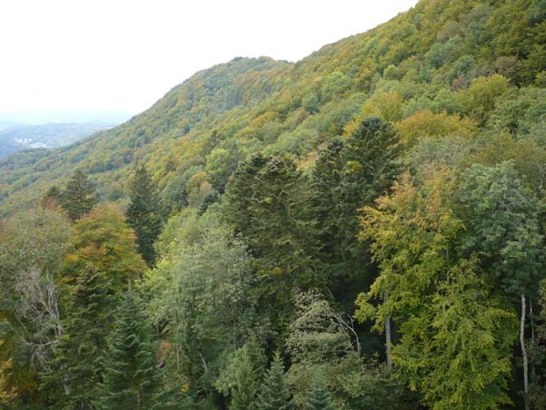

# Data variety

```{r include=FALSE}
# Preferences for conflicting packages
library(conflicted)
conflict_prefer("select", "dplyr")
conflict_prefer("filter", "dplyr")
conflict_prefer("levelplot", "rasterVis")
conflict_prefer("origin", "raster")
conflict_prefer("extract", "raster")
conflict_prefer("partial", "pdp")
conflict_prefer("mse", "Metrics")
```

## Introduction

### Overview

In this practical we will look at data variety in environmental sciences. We will start with the data from one eddy covariance measurement site in Switzerland encountered in Chapter 1, and complement it with remote sensing data. Specifically, we will download remote sensing data that measures vegetation greenness data, quantified by the normalised difference vegetation index, NDVI. We are interested in this data, because we expect ecosystem photosynthesis (gross primary production), measured at the eddy covariance tower, to covary with NDVI. Such covariation can provide powerful information for modelling. For example, we can train a machine learning model with the observed covariation between measured GPP and NDVI at eddy covariance sites and use that model to predict GPP from data obtained in space (NDVI is available for the whole globe, while GPP can only be measured locally.) You will be doing this kind of modelling in session 13. For now, we will focus on working with the spatial aspects of the data (since remote sensing data is inherently spatial) and introduce you to the toolset to work with spatial, in particular, geo-spatial data. 

To get you familiar with spatial data types we will use a variety of data from freely accessible sites. We can obtain abiotic and biotic conditions for the tower locations. We will be spatially plotting the eddy towers you have already encountered in the first two chapters and extracting values for these locations from other data. By doing this we can show that the climate at these sites spans a gradient temperature and landcover. There are also biotic components that could explain variation in productivity among sites, including species composition and functional traits of plants. 

### Learning objectives

After this learning unit, you will be able to ...

* explain the possible sources of data in environmental sciences;
* understand the range of operations applied to data from basic to complex;
* read various types of data in R and apply basic operations;
* understand the structure of spatial data, including rasters and shapefiles;
* apply a range of operations to prepare data for analyses.

### Key points of the lecture

Data operations range in complexity, here they are listed from simplest to extremely complex:  

* Statistical operations 
* Similarity metrics
* Ordinations
* Clustering 
* Classifications
* Regressions
* Neural network deep learning

Examples of methods for the computing differences between datasets:

* _Euclidean distance_ is used for the simple quantification of variation
* _PCA_ is a valuable tool to explore variation and reduce dimension
* _Hamming distance_ helps measure the difference between strings
* _Jaccard index_ describes the similarity between two or more binary data sets

Machine learning is loosely defined as any learning done by a computer. It can be divided into…

* _Unsupervised learning_: without explanatory data, which uses clustering to obtain a categorical output
* _Supervised learning_: with explanatory data, which uses either classification also resulting in a categorical output, or regression when a numerical output is required

Data errors are divided into errors of accuracy and precision. If data is inaccurate, it strays from the true value. If data is imprecise, individual data points are variable under the same conditions. Systematic errors and inaccurate data is much harder to correct! 

Errors can arise throughout the data science workflow.

* _Inherent error_ refers to the error present in the source documents and data.
* _Operational error_ is created after data collection.

Data can be cleaned from errors by looking for:

* Non-uniform data
* Missing data
* Duplicated data
* Outliers
* Measurement errors

Quantifying uncertainty is extremely important, as undetectable errors will persist even after data cleaning. Examples of uncertainty quantification include…

* Confidence interval (CI)
* Prediction interval

Error propagation is used for datasets containing different uncertainties to determine the overall uncertainty.

## Tutorial

### Overview

In this practical, you will be downloading and getting to know spatial data. There are three types of spatial data:

* points;
* shapefiles;
* rasters.

The first part of this practical is mandatory and will start with a little introduction on downloading remote sensing data for our tower sites and seeing what kinds of information we can gather from this. Then we will get into the nitty-gritty aspects of the afore mentioned spatial data types. 

The second part is the bonus part, there we will discuss trait data and the principal component analysis (PCA), which is a method to reduce the dimensions of datasets.

### MODIS remote download

We'll be starting off this tutorial with an example on using remote sensing data. We'll focus on a Fluxnet site already familiar to you: CH-Lae. The Lägern site is located on a mountain in the Swiss Plateau NW of Zürich and is surrounded by managed mixed deciduous mountain forests. The forest is highly diverse and dominated by beech. In the following figures, you can get an impression of the tower and its surroundings. 




As always we start by loading `tidyverse`and our fluxnet site data.

```{r warning=F, message=F}
library(tidyverse)
df_sites <- read_csv("./data/fluxnet_site_info_reduced.csv")
```

Since for this section we will only be working with the Lägern site we can directly extract its latitude and longitude.

```{r}
lon_lae <- df_sites %>% 
  filter(site == "CH-Lae") %>% 
  pull(lon)

lat_lae <- df_sites %>% 
  filter(site == "CH-Lae") %>% 
  pull(lat)
```

In this first analysis, we want to complement temporal data measured by the Fluxnet tower with remote sensing data. _Remote sensing_ is the detection or monitoring of physical characteristics of the Earth’s surface by measuring reflected and emitted radiation at a distance. Data is collected in the form of images by special cameras typically from aircrafts or satellites. With this method, a huge amount of global data at large spatial scales gets easily accessible and therefore represents a useful method for the monitoring of ecosystems. However, this remotely acquired data requires validation from ground measurements, which can be done for example using the Eddy towers from the previous practicals.

One of these satellite remote sensing instruments is MODIS (Moderate Resolution Imaging Spectroradiometer). Terra MODIS and Aqua MODIS are viewing the entire Earth's surface every 1 to 2 days, acquiring data in 36 spectral bands, or groups of wavelengths. 

You used to have to visit an website to be able to download the data file by file, which was a long and tedious process. Luckily, now we have access to tools that make it much more straightforward to download remote sensing data from satellites. It provides Atmosphere, Ocean, Cryosphere and Land data series. The `MODISTools` package provides a programmatic interface to the [MODIS Land Products Subsets web services](https://modis.gsfc.nasa.gov/) allows for easy downloads of "MODIS" time series (of single pixels or small regions of interest) directly to your R workspace or your computer. 

* Using the `mt_...()` functions of the MODISTools we can check which products are available in MODIS, how the product we are searching for is called, and what temporal and spatial resolutions are available. 
* `t_products()` lists all available products from MODIS with their temporal and spatial resolution. Products are parent categories of variables measured by the satellites, such as vegetation indices. 
* `mt_bands()` requires the entry of a product chosen from "products" and list the available data variables that are represented by the different actually measured wavelengths. 
* Finally, `mt_dates()` lists all dates of which data from the chosen product and band are available.

We will make use of this by loading NDVI data around our towers directly from MODIS.

```{r}
library(MODISTools)
products <- mt_products() %>% as_tibble()
bands <- mt_bands(product = "MOD13Q1") %>% as_tibble()
dates <- mt_dates(product = "MOD13Q1", lat = lat_lae, lon = lon_lae) %>% as_tibble()
```

Now, we'll get the NDVI data for 6 years for a square of 2km x 2km around the tower site. We use the function `mt_subset()` for this. The parameters of this function download a subset of data within the chosen product (here 'MOD13Q1'). We specify the location as latitude and longitude, and the band we chose, which is at 250m spatial resolution and 16-day temporal resolution. The time period can be chosen as a subset of “dates” and must be provided in the form of start and end date. We will be looking at the beginning of 2009 to the end of 2014. `km_lr` and `km_ab` define the kilometers to the left and right of the location and kilometers above and below respectively. Since these values are being rounded to the nearest integer, we chose this minimum of 1, corresponding to 2km2. Sitename is used in writing data to file, internal gives the command whether the data should be returned as an internal structure. The progress setting defines whether the download progress should be shown or not.

```{r eval = F}
df_ndvi <- mt_subset(product = "MOD13Q1",            # the chosen product
                  lat = lat_lae,                     # desired lat/lon
                  lon = lon_lae,
                  band = "250m_16_days_NDVI",        # chosen band defining spatial and temporal scale
                  start = "2009-01-01",              # start date: 1st Jan 2009
                  end = "2014-12-19",                # end date: 19th Dec 2014
                  km_lr = 1,                         # kilometers left & right of the chosen location (lat/lon above)
                  km_ab = 1,                         # kilometers above and below the location
                  site_name = "CH-Lae",              # the site name we want to give the data
                  internal = TRUE,
                  progress = FALSE
                  ) %>% 
  as_tibble()
```

```{r echo=F}
df_ndvi <- readRDS("./data/df_ndvi.rds")
```

```{r paged.print=TRUE}
head(df_ndvi) %>% select(2:7) # Only displaying 6 of 21 features
```

This dataframe takes some effort to make sense of. Let's make our lives a little easier and put this data into a useful spatial context. For that it needs to be converted to a raster. This is a key spatial data type and will be described in more detail in the section Raster below. 
MODISTools provides a handy integrated function for converting the data to a raster `mt_to_raster()`.

```{r echo=F, message=FALSE, warning=FALSE}
library(sf)
library(rgdal)
library(raster)
raster_ndvi <- mt_to_raster(df_ndvi, reproject=TRUE)
```

By plotting the data we can verify that we loaded a square of NDVI data around our tower for every 16-day time step. 
We plot four images in the winter season.

```{r}
plot(raster_ndvi[[1:4]], zlim=c(-0.1, 0.95))
```

Just out of interest let's calculate the minimum and maximum of these plots.

```{r}
min_winter <- min(minValue(raster_ndvi[[1:4]]))
max_winter <- max(maxValue(raster_ndvi[[1:4]]))
cat(" Minimum Winter: ", min_winter, "\n",
    "Maximum Winter: ", max_winter)
```

We do the same for the summer season.

```{r}
plot(raster_ndvi[[13:16]], zlim=c(-0.1, 0.95))
```

We compute minimum and maximum.

```{r}
min_summer <- min(minValue(raster_ndvi[[13:16]]))
max_summer <- max(maxValue(raster_ndvi[[13:16]]))
cat(" Minimum Summer: ", min_summer, "\n",
    "Maximum Summer: ", max_summer)
```

From the two plots, we can clearly distinguish summer and winter time steps due to the differences in NDVI. Summer NDVI is much higher since our tower site is located in the Northern hemisphere where leaves get lost during winter for many vegetation types. Heterogeneity in winter is higher which might be due to conifers that don't lose their leaves.

However, we are also interested in the mean across all (spatial) pixels for each date. To clarify this means we collapse the pixel dimension into a single mean value for each date. This is can done using `group_by()` in combination with `summarise()`, which were explained in chapter 2. 

```{r, warning=F, message=F}
library(lubridate) # lubridate is loaded to work with dates

## first determine the scaling factor that is to be applied to the NDVI values. This has practical reasons: reduces disk space
scale_factor <- bands %>% 
  filter(band == "250m_16_days_NDVI") %>% 
  pull(scale_factor) %>% 
  as.numeric()
  
df_ndvi_spatialmean <- df_ndvi %>% 
  mutate(calendar_date = ymd(calendar_date)) %>%  # make the dates into comprehensible values not X.yyyy.mm.dd
  group_by(calendar_date) %>%                     # group the data by day 
  summarise(mean = mean(value), min = min(value), max = max(value)) %>%   # calculate mean, min and max across pixels
  mutate(mean = mean * scale_factor, min = min * scale_factor, max = max * scale_factor)  # apply scale_factor (see )
```

We can now plot our NDVI time series across our years (2009 to 2014) using the means we calculated above.

```{r}
df_ndvi_spatialmean %>% 
  ggplot(aes(x = calendar_date)) +
  geom_ribbon(aes(ymin = min, ymax = max), fill = "grey70") +
  geom_line(aes(y = mean))
```

After having aggregated the data to the mean NDVI across all 81 pixels for each date, we have reduced the dimensions of the data frame to only one (time). It now has a structure that can easily be combined with the time series data from the eddy covariance tower (each site is a point in space).

```{r message=F}
# this can now be combined to the data frame with flux data that also has dates along rows
ddf_ch_lae <- read_csv("./data/ddf_ch_lae.csv")
```

```{r, message=F}
# now we can combine the two data frames along dates. 
ddf_ch_lae_ndvi <- ddf_ch_lae %>%
  dplyr::rename(date = TIMESTAMP) %>% 
  dplyr::mutate(year = year(date)) %>% 
  dplyr::filter(year %in% 2009:2014) %>%  # NDVI data was downloaded only for these years
  left_join(df_ndvi_spatialmean %>% rename(date = calendar_date), by = "date") %>% 
  dplyr::select(-year)
```

NDVI data is provided every 16 days. In order to predict values at other time steps, we can fit a cubic smoothing spline to our daily values. (Cubic smoothing splines embody a curve fitting technique that blends the ideas of cubic splines and curvature minimization to create an effective data modeling tool for noisy data. Traditional interpolating cubic splines represent the tabulated data as a piece-wise continuous curve which passes through each value in the data table. The curve spanning each data interval is represented by a cubic polynomial, with the requirement that the endpoints of adjacent cubic polynomials match in location and in their first and second derivatives). 

```{r}
ddf_ch_lae_ndvi <- ddf_ch_lae_ndvi %>% 
  mutate(date_dec = decimal_date(date))

df_nona <- ddf_ch_lae_ndvi %>% 
  drop_na()

out_spline <- smooth.spline( df_nona$date_dec, df_nona$mean, spar=0.1 )
vals_spline <- predict( out_spline, ddf_ch_lae_ndvi$date_dec )$y

ddf_ch_lae_ndvi <- ddf_ch_lae_ndvi %>% 
  mutate(ndvi_splined = vals_spline)
```

Let's take a look...

```{r warning=F}
ddf_ch_lae_ndvi %>% 
  ggplot() +
  geom_point(aes(x = date, y = mean)) +
  geom_line(aes(x = date, y = ndvi_splined), color = "red")
```

To see how well this data correlates with measurements from the fluxnet tower, we look at the relationship of GPP vs. NDVI*PPFD.

```{r}
ddf_ch_lae_ndvi <- ddf_ch_lae_ndvi %>% 
  mutate(ppfd_abs = ndvi_splined * PPFD_IN)
```

Does NDVI affect the relationship between GPP and PPFD?

```{r}
linmod1 <- lm(GPP_NT_VUT_REF ~ PPFD_IN, data = ddf_ch_lae_ndvi)
summary(linmod1)
```

```{r}
linmod2 <- lm(GPP_NT_VUT_REF ~ ppfd_abs, data = ddf_ch_lae_ndvi)
summary(linmod2)
```

Indeed, R2 increased from 0.5229 to 0.603 when including considering NDVI * PPFD, instead of just PPFD. In other words, it also matters whether leaves are actually out and green for modelling the relationship between GPP and PPFD. NDVI * PPFD approximates the amount of *absorbed* incoming light (not just the incoming light) and is therefore closer to being a physiologically relevant quantity. 

### Points on the globe

Documenting the coordinates of data as it is collected allows us to assign a precise location to that data, which can be important in further analysis when, for example, comparing location. As you all undoubtedly know coordinates come with a latitude (defining the position N or S of the equator) and longitude (defining the position E or W of the meridian). With the coordinates we can already plot our data points, remembering that the latitude is equivalent to the y-axis and longitude to the x-axis.

In this section, we look at the position of the Fluxnet sites. The Fluxnet network measures land-atmosphere exchanges of greenhouse gases and energy for sites across the globe using the eddy covariance technique. High-frequency measurements of vertical wind velocity and a scalar mixing ratio (CO2, H2O, temperature, etc.) provides estimates of the net exchange of the scalar. Eddy covariance is currently the standard method to measure fluxes of trace gases between ecosystems and the atmosphere (sources:
https://fluxnet.org/about/, https://www.nature.com/articles/s41597-020-0534-3.pdf).

Right at the beginning of this tutorial we loaded the dataset containing information on sites in Europe. We treat site locations as a geographical position. So we will extract the name, longitude and latitude of our sites.

```{r}
head(df_sites)
```

Our dataset _'df_sites'_ contains two sites in Greenland and Siberia. We'll focus on a smaller spatial domain, restricted to "mainland" Europe, therefore, we exclude sites RU-Cok and DK-ZaH.

```{r}
df_sites <- df_sites %>% 
  filter(!(site %in% c("RU-Cok", "DK-ZaH")))
```

Already now we can plot our data points without any further adjustments.

```{r}
ggplot() +
  geom_point(data = df_sites, aes(x = lon, y = lat), color = "red") +
  labs(title = "Selected FLUXNET sites", x = "Longitude", y = "Latitude")+
  theme_bw()
```

We can make an educated guess where the points are but this plot doesn't tell us much by itself without a map as a reference.

So to visualize the location of our points we plot them on a map. We use the package `SpData` to get the world map and crop it to Europe.

```{r message=FALSE, warning=FALSE}
library(sf)
library(spData)

ggplot() +
  geom_sf(data = world) +
  geom_point(data = df_sites, aes(x = lon, y = lat), color = "red") +
  labs(x = "Longitude", y = "Latitude") +
  coord_sf(xlim = c(-30,40), ylim = c(35,80), expand = FALSE) +
  theme_bw()
```

Of course, we can carry on using the data points as they are (for plotting or analysis) but for more detailed spatial analysis we will turn them into _SpatialPoints_. 

_SpatialPoints_ consist of a matrix with _n_ rows and 2 columns, one for each coordinate (latitude & longitude). _n_ is the number of points in the data. These points also have a so-called _'projection string'_ or _'crs'_ indicating the coordinate reference system in which coordinates of points are expressed. 
There are different ways (formulas) to project the earth (an ellipsoid) onto a 2-dimensional map. You can only perform calculations, if the same method (projection, coordinate reference system (crs)) is used. Having points in different coordinate reference systems can cause data to look very skewed. It's good to know which coordinate reference system your data is in, the most commonly used one is **WGS84 (EPSG: 4326)**. There are some useful resources to convert help you find the correct [spatial reference](https://spatialreference.org/ref/epsg/4326/).

To transform points into _SpatialPoints_ we use the function `SpatialPoints` in the r package `sp`.

```{r message=FALSE, warning=FALSE}
library(sp)
sp_sites <- SpatialPoints(dplyr::select(df_sites, -site)) # remove character column
```

Below you can see how with the R-base call `plot()` you can plot the _SpatialPoints_ directly. But we'll have to also provide a map to plot them onto. The loaded shapefile of europe will also be used in the next part called Shapefiles.

```{r warning=F, message=F}
library(rgdal)
europe_shape <- readOGR(dsn="./data/shapefiles", layer="europe_map")

plot(europe_shape, col="grey")
plot(sp_sites, col = "red", add = TRUE, pch = 16)
```

### Shapefiles

Above we looked at points on the globe and transformed our data to _SpatialPoints_. This was already the first example of what forms a shapefile can come in. Shapefiles basically store geographic information, meaning location and any additional information, in shape objects. Shape objects in R are defined by _SpatialPoints_, _SpatialLines_, and _SpatialPolygons_ classes of the `sp` package. The corresponding _SpatialPointsDataFrame_, _SpatialLinesDataFrame_, and _SpatialPolygonsDataFrame_ classes allow storing shape objects together with a dataframe. The number of rows in the dataframe corresponds to the number of points (number of rows in coordinate matrix), lines (size of the list of Lines), or polygons (size of the list of Polygons). This allows us to associate a vector of variables (a row of the dataframe) to each shape object.
In the next step, we load a shapefile containing the countries of the world provided by [Natural Earth](www.naturalearthdata.com), as a reference with which we can contextualize our spatial data. Since we only are looking at towers in Europe, we have cropped the raster to Europe for you.

```{r warning=F, message=F}
library(rgdal)
europe_shape <- readOGR(dsn="./data/shapefiles", layer="europe_map")
```

Let's see what class _europe_shape_ is:

```{r}
class(europe_shape)
```

Above we mentioned that _SpatialPolygonsDataFrame_ contains both a list of _SpatialPolygons_ and a dataframe with information on each polygon. Here's how you can access the information in the dataframe. We'll just display the header of some of the 94 features for now.

```{r}
europe_shape@data %>% select(c(NAME, SOVEREIGNT, SUBREGION, POP_EST))%>% head()
```

Let's first plot our towers on this map of Europe. Remember, how when you transformed the tower locations we mentioned each point has a designated coordinate reference system? Here, we need to extract this projection from _europe_shape_ using `proj4string()` and add it to our _SpatialPoints_. This way we can make sure they are in the same reference system for plotting them together.

```{r message=F}
geo.proj <- sp::proj4string(europe_shape)
pts <- sp::SpatialPoints(sp_sites, proj4string = sp::CRS(geo.proj))
```

Then we can take the _SpatialPoints_, now in the correct coordinate reference system, the data from _europe_shape_ and bind them to our tower sites in the dataframe _df_sites_.

```{r paged.print=TRUE}
df_sites_country_info <- sp::over(pts, europe_shape) %>% 
    as_tibble() %>% 
    bind_cols(df_sites, .)

head(df_sites_country_info) %>% select(1:6)
```

For the next part we will be using a map European with country boarders. For this, we'll make an object called _shp_df_, this we do using the column _SOVEREIGNT_, which we saw when looking at `europe_shape@data`. This preserves only the data we need for further analysis and plotting. 

```{r message=F}
library(maptools)

shp_df <- broom::tidy(europe_shape, region = "SOVEREIGNT")
head(shp_df)

ggplot() + 
  geom_polygon(data = shp_df, aes(x = long, y = lat, group = group, fill = id), colour = "black") +
  theme_bw() +
  theme(legend.position = "none")
```

As we saw in the earlier plot of the tower locations only some countries in Europe contain towers. Therefore, we want to crop our map to include only those countries.

To do this we first make a vector which is a list of the country each tower is located in. We get this from _df_site_country_info_. 
Then we filter out only those countries with a tower in them and voilà, plot the countries and tower locations as a result.

```{r}
countries_with_site <- df_sites_country_info %>% pull(SOVEREIGNT) %>% as.character()

# resulting character vector (without NAs)
countries_with_site %>% na.omit()

# country with towers filtered
shp_df_sub <- shp_df %>% 
  filter(id %in% countries_with_site)

# plot result
ggplot() + 
  geom_polygon(data = shp_df_sub, aes(x = long, y = lat, group = group, fill = id), colour = "black") +
  geom_point(data = df_sites, aes(x = lon, y = lat)) +
  theme_bw()
```


**Checkpoint**

You just learnt how to plot _europe_shape_ coloured by country ("SOVREIGNT"), now plot it coloured by region in europe.
Start by finding the column that gives you this information in `europe_shape@data`.

**Solution**

```{r message=F, warning=F}
# take a look at the first 6 column names
names(europe_shape@data)[1:10]

# make a df of the data needed from europe_shape
shp_df_region <- broom::tidy(europe_shape, region = "SUBREGION")
head(shp_df_region)

# plot europe coloured by region
ggplot() + 
  geom_polygon(data = shp_df_region, aes(x = long, y = lat, group = group, fill = id), colour = "black") +
  geom_point(data = df_sites, aes(x = lon, y = lat)) +
  theme_bw()
```

### Rasters
 
Next up are rasters. A raster is a matrix or grid of cells each of which contains information in the form of a value.

A raster object consists primarily of:

* A grid of cells;  
* A coordinate reference system (CRS) for the grid and its cells so that we know the location to which the grid refers;
* A variable of interest for which each cell in the grid has a value, and;
* Other information relating to the CRS, projection, resolution, etc.

Let's take a look at some rasters and get familiar with some functions to analyse them.

Since our goal ultimate goal is to predict productivity, we will consider different factors that might explain productivity, for example, landcover and temperature. 
To start off we'll look at some landcover data. With this data, we can investigate the surroundings of the Fluxnet towers. This data gives us the different classes of physical coverage of the Earth’s surface, such as forests, grasslands, croplands, lakes, etc. Landcover types affect fluxes measured by the tower through the vegetation that characterizes them, or by influencing the radiation budget through albedo, or water availability. Although we have some information from the overview file of the towers, we can still check whether we can confirm this information. We will load landcover data from GlobCover provided by the [European space agency (ESA)](http://due.esrin.esa.int/page_globcover.php). This project provides landcover maps observations of surface reflectance from the 300m MERIS sensor on board the ENVISAT satellite mission as their input.

```{r}
# library(raster) -> we have already done this but remember you need this to load rasters!
raster_landcover <- raster("./data/Globcover_EU.tif")
```

This landcover data consists of different categories, these GlobCover categories are based on the Land Cover Classification System (LCCS) which was
developed by the Food and Agricultural Organization of the United Nations (FAO) to provide a consistent framework for the classification of mapping land cover. They include various types of forest, shrub- and grasslands, cropland and artificial surfaces.

Before we look at the data, we first reduce the spatial extent that the raster covers. We crop it to a rectangle around the site location of CH-Lae (+/- 2 degrees in longitudinal direction, +/- 1 degree in latitudinal direction).

```{r}
bounding_box <- extent(lon_lae-2, lon_lae+2, lat_lae-1, lat_lae+1)
raster_landcover_crop <- crop(raster_landcover, bounding_box)
```

We can plot our raster as the region around our tower. To indicate the position of our tower, we add a red dot.

```{r eval = F}
plot(raster_landcover_crop, legend=FALSE, xlab="longitude", ylab="latitude")
points(lon_lae, lat_lae, pch = 16, col = "red")
```

If we want to conduct analysis using two different rasters, we have to make sure they have the same resolution and are aligned on the same grid. Let's read a second raster and compare the grids. We load spatio-temporal temperature rasters available from [CHELSA](https://chelsa-climate.org) to complement our flux tower measurements for further analysis.
The temperature raster data from CHELSA provides free high-resolution climate data (temperature and precipitation) for the past and the future. The past data we use here are downscaled model output temperature and precipitation estimates of the ERA-Interim climatic reanalysis (forecast models and data assimilation systems reanalysing archived observations). While the temperature algorithm is based on statistical downscaling of atmospheric temperatures, the precipitation algorithm incorporates orographic predictors including wind fields, valley exposition, and boundary layer height, with subsequent bias correction. The data we use consists of a monthly temperature and precipitation time series over the area of Europe from 2006 to 2012 in January. To compare this new raster with the previous one we need to crop it to the same region as the tower.

```{r}
raster_chelsa <- raster("./data/Chelsa_t_mean_2006-2012.tif")
raster_chelsa_crop <- crop(raster_chelsa, bounding_box)
```

We now plot our raster.

```{r}
pal <- colorRampPalette(c("purple","blue","cyan","green","yellow","red"))
plot(raster_chelsa_crop, col = pal(20), xlab="longitude", ylab="latitude")
points(lon_lae, lat_lae, pch = 16, col = "red")
```

We see that the temperature units are not in a comprehensive format. To change the unit from Kelvin x10 to degree Celsius we have to divide the data by 10 and subtract 273.15. 

```{r}
raster_chelsa_crop <- raster_chelsa_crop/10-273.15
```

We plot our raster again.

```{r}
pal <- colorRampPalette(c("purple","blue","cyan","green","yellow","red"))
plot(raster_chelsa_crop, col = pal(20), xlab="longitude", ylab="latitude")
points(lon_lae, lat_lae, pch = 16, col = "red")
```

We have seen some of the basic functions in the package `raster`. Now we will load one more package to work with raster files. We use the package `rasterVis`. This package contains methods for enhanced visualization and interaction with raster data. It implements visualization methods for quantitative data and categorical data, both for univariate and multivariate rasters. It also provides methods to display spatiotemporal rasters, and vector fields. 

```{r message=F}
library(rasterVis)
library(RColorBrewer)

mapTheme <- rasterTheme(region = rev(brewer.pal(8,"RdYlBu")))
plt <- levelplot(raster_chelsa_crop, margin=FALSE, par.settings = mapTheme)
plt
```

**Checkpoint**

Create your own small raster with 100 grid cells. Give it values, a projection (e.g. '+proj=utm +zone=48 +datum=WGS84') and plot it.
    
_Bonus_: If you chose the example projection provided, add _europe_shape_ to your plot.

**Solution**

```{r message=F, warning=F}
# create a raster
# short compact version
myraster <- raster(ncol=10, nrow=10)
# OR 
# longer version
myraster <- raster()
ncol(myraster) <- 10
nrow(myraster) <- 10

# add values to the raster, this can be done in many ways here are two examples:
values(myraster) <- 1:ncell(myraster)
# OR 
values(myraster) <- runif(ncell(myraster))

# add a projection
projection(myraster) <- "+proj=utm +zone=48 +datum=WGS84"

# plot it
plot(myraster)
# for fun let's see where europe would be on our raster, since it has a projection...
plot(europe_shape, add=TRUE)
```

#### Aggregating

A **raster grid** is uniquely defined by an _origin_, a point that one of the intersections of grid lines, and its resolution, the magnitude of each cell-side. In the R package `raster`, the origin is defined as the point closest to (0,0) that is still an intersection of grid lines. The functions `origin()` and `res()` from the R package `raster` return the origin and resolution of a raster object. So let's see what the resolution and origin of the rasters we loaded before are.

```{r}
cat(" Resolution Raster Landover: ", res(raster_landcover), "\n",
    "Resolution Raster Chelsa: ", res(raster_chelsa))
```

```{r}
cat(" Origin Raster Landover: ", origin(raster_landcover), "\n",
    "Origin Raster Chelsa: ", origin(raster_chelsa))
```

Landcover has a much higher resolution. Let's re-grid the Landcover raster to match the grid of the Chelsa raster. Aggregating means resampling an input raster to a coarser resolution based on a specified aggregation strategy. We now determine the aggregation factor by dividing the resolution of the landcover raster by that of the Chelsa raster. We do it both for the longitude and latitude to make sure they match.

```{r}
res_landcover <- res(raster_landcover)
res_chelsa <- res(raster_chelsa)
factor_agg_lon <- res_chelsa[1] / res_landcover[1]
factor_agg_lat <- res_chelsa[2] / res_landcover[2]


cat(" Longitudinal Aggregation Factor: ", factor_agg_lon, "\n",
    "Latitudinal Aggregation Factor: ", factor_agg_lon)
```

First, we observed that the land cover raster has a higher resolution than the temperature raster, now we now it is 3 times higher. So we need to transform the landcover raster to make sure it has the same grid (same _origin_ and _resolution_) as the temperature raster. This will allow us to combine them in a potential analysis. We achieve this using `aggregate()` from the R package `raster` to obtain a sum of edges raster at 1000m x 1000m resolution. 

The aggregate function takes three main arguments. 
* **_x_** : the raster object to aggregate,
* **_fact_** : aggregation factor, i.e. the number of current cells that will make up the side of one of the new cells, and, 
* **_fun_** : the function to apply to summarize the raster values of the fact^2 (in this case 3ˆ2=9) cells.

We aggregate the landcover raster at 1km using the aggregation factor calculated above.

```{r}
raster_landcover_crop_agg <- aggregate(raster_landcover_crop, fact = factor_agg_lon, fun = modal)
```

We check the resolutions and origin of the two rasters and plot our the new landcover one.

```{r}
cat(" Resolution Landcover: ", res(raster_landcover_crop_agg), "\n",
    "Resolution Chelsa:    ", res(raster_chelsa), "\n",
    "Origin Landcover:    ", origin(raster_landcover_crop_agg), "\n",
    "Origin Chelsa:       ", origin(raster_chelsa), "\n")

plot(raster_landcover_crop_agg, legend=FALSE, xlab="longitude", ylab="latitude")
```

We can see that the resolutions are now the same but the origin still differs. To get matching origins we must do another step: align the rasters.

#### Aligning

Aligning rasters is done using the function `resample()`. There are two main resampling methods: _Nearest Neighbour_ or _Bilinear Interpolation_, which method is used depends upon the input data and its use after the operation is performed.

**_Nearest Neighbour_** is best used for categorical data like land-use classification or slope classification. The values that go into the grid stay exactly the same, a 2 comes out as a 2, and 99 comes out as 99. The value of the output cell is determined by the nearest cell center on the input grid. Nearest Neighbor can be used on continuous data but the results can be blocky.

**_Bilinear Interpolation_** uses a weighted average of the four nearest cell centers. The closer an input cell center is to the output cell center, the higher the influence of its value is on the output cell value. This means that the output value could be different than the nearest input, but is always within the same range of values as the input. Since the values can change, Bilinear is not recommended for categorical data. Instead, it should be used for continuous data like elevation and raw slope values.

```{r eval = F}
raster_landcover_crop_resampl <- resample(raster_landcover_crop, raster_chelsa_crop, method="ngb")
plot(raster_landcover_crop_resampl, legend=FALSE, xlab="longitude", ylab="latitude")
```

```{r include=FALSE}
raster_landcover_crop_resampl <- resample(raster_landcover_crop, raster_chelsa_crop, method="ngb")
```

[ ](./figures/04_output-crop.png)

Now we check if the two rasters are aligned.

```{r}
cat(" Resolution Landcover: ", res(raster_landcover_crop_resampl), "\n",
    "Resolution Chelsa:    ", res(raster_chelsa), "\n",
    "Origin Landcover:   ", origin(raster_landcover_crop_resampl), "\n",
    "Origin Chelsa:      ", origin(raster_chelsa), "\n")
```

Now the two rasters are aligned.

#### Point extraction

In this section, we will show you how to extract data from our rasters or spatial data. We will be extracting the values for the locations of our towers. The function to extract values is aptly named `extract()`. First, we specify the raster from which the values should be extracted and then the exact sites at which the values should be extracted. Here, we combine all this into a neat dataframe.

```{r message=F}
df_sites_temp <- read_csv("./data/fluxnet_site_info_reduced.csv")

df_sites_temp <- extract(raster_chelsa, sp_sites, sp = TRUE) %>% 
  as_tibble() %>% 
  right_join(df_sites_temp, by = c("lon", "lat")) %>% 
  dplyr::rename(temp_chelsa = Chelsa_t_mean_2006.2012)
```

In the lectures, you have already, heard that we must always be aware of modelled data and be aware of its limitations. Therefore, we don't just want to use CHELSA temperature data. It is important to consider different models and compare them. Hence, we'll look at another climate model. We load and plot the provided rasters showing the mean annual temperatures for the Worldclim data for the years 2006-2012. WorldClim is a set of global climate layers (gridded climate data) with a spatial resolution of about 1 km2. We extract values from Worldclim at the same tower sites and add them to the _df_sites_ data frame. Now we have a tidy dataframe with the site, latitude and longitude, temperatures for Chelsa and WorldClim at each tower location.

```{r}
raster_worldclim <- raster("./data/WC_mean_t_2006-2012.tif")

df_sites_temp <- extract(raster_worldclim, sp_sites, sp = TRUE) %>% 
  as_tibble() %>% 
  right_join(df_sites_temp, by = c("lon", "lat")) %>% 
  dplyr::rename(temp_wc = WC_mean_t_2006.2012)

head(df_sites_temp)
```

We get the monthly mean temperature of Jan 2006 from FLUXNET data.

```{r message=F}
library(lubridate)
load("./data/ddf_allsites_nested_joined.RData")

df_sites_temp <- ddf_allsites_nested_joined %>% 
  dplyr::select(site = siteid, data) %>% 
  unnest(data) %>% 
  dplyr::select(site, TIMESTAMP, TA_F) %>% 
  mutate(month = month(TIMESTAMP), year = year(TIMESTAMP)) %>% 
  filter(month == 1, year == 2006) %>% 
  group_by(site) %>% 
  summarise(temp_fluxnet = mean(TA_F)) %>% 
  
  # add temp data extracted from spatial files (chelsa and worldclim)
  left_join(df_sites_temp, dplyr::select(site, temp_wc, temp_chelsa),
            by = "site")
```

We compare the climate models by showing the correlations with the tower's data. The dotted line shows what the linear model would look like if the values of our model and the tower data overlapped. The red line shows the actual linear model of the relationship between the climate model and the tower data. The closer the red line to the dotted line the better the model is at predicting the temperatures measured by the towers.

```{r message=F, warning=F}
df_sites_temp$temp_chelsa <- df_sites_temp$temp_chelsa/10 -273.15

# we remove the sites we removed before
df_sites_temp <- df_sites_temp[-c(16, 34), ]

df_sites_temp %>% 
  ggplot(aes(x = temp_fluxnet, y = temp_chelsa), xlim=c(-10,5)) +
  geom_point() +
  geom_abline(intercept=0, slope=1, linetype="dotted") +
  geom_smooth(method='lm', color="red", size=0.5, se=FALSE) +
  theme_classic()
```

We compute the mean squared error (MSE). The MSE calculates the average of the squares of errors of all the data points from a fitted line or model. Put simply this is the difference between the data points (the actual data) and the estimated points given by the line or model. The values are squared to get positive values even if the difference is negative. Smaller values reflect less variation of the data. In a model you want to minimise the MSE, as this reflects that the model's predicted or estimated points are closer to your actual data.

```{r}
library(Metrics)
mse(df_sites_temp$temp_fluxnet, df_sites_temp$temp_chelsa)
```

```{r message=F}
df_sites_temp %>% 
  ggplot(aes(x = temp_fluxnet, y = temp_wc), xlim=c(-10,5)) +
  geom_point() +
  geom_abline(intercept=0, slope=1, linetype="dotted") +
  geom_smooth(method='lm', color="red", size=0.5, se=FALSE) +
  theme_classic()
```

We compute the mean squared error.

```{r}
mse(df_sites_temp$temp_fluxnet, df_sites_temp$temp_wc)
```

We see that Chelsa correlates better (because the mean squared error is smaller) with the temperature values at the towers. We also see that Worldclim compared to CHELSA tends to predict colder temperatures.

**Checkpoint**

Above, we compared the CHELSA temperatures with the tower temperatures. Now we want to visually see which of the two data had the higher mean for each tower location.
Plot the map of europe and add the tower locations as points. Colour the points so that for a higher CHESLA mean they are one colour and a higher tower temperature another.

**Solution**

```{r message=F, warning=F}
# There are more way to do this but we used the function ifelse(). 
# It takes 3 components: a condition, what to do if the condition applies and what to do if it doesn't apply.
# So here if chelsa temperatures are higher we want the point to be purple otherwise orange:
cols_chelsa_flux <- ifelse(df_sites_temp$temp_chelsa > df_sites_temp$temp_fluxnet,"purple","orange")

# We could also do different shapes if we wanted...
pch_chelsa_flux <- ifelse(df_sites_temp$temp_chelsa > df_sites_temp$temp_fluxnet, 19 ,17)

## Plot the result using base R:
# plot(europe_shape)
# points(df_sites_temp$lon,df_sites_temp$lat, pch=pch_diff, col = col_checkpoint)

## Plot the result using ggplot:
ggplot() +
  geom_polygon(data = europe_shape, aes(x = long, y = lat, group = group), fill=NA, colour = "black") +
  geom_point(data = df_sites_temp, aes(x = lon, y = lat), color = cols_chelsa_flux, shape = pch_chelsa_flux, size=2) +
  labs(x = "Longitude", y = "Latitude") +
  theme_classic()+ 
  coord_quickmap()
```


#### Correlations with GPP

We already had a look at GPP in Chapter 2. In this section we want to correlate Chelsa temperature and landcover with GPP. 

In models we often take multiple variables and correlate them to another variable (here GPP). By seeing if they correlate well we can see if any of the variables make good so-called _predictors_.  Let's see how well landcover and temperature correlate with GPP.

We start off by extracting the mean GPP at the tower sites. To do this we group our data by the _siteid_ (or tower) and the year. This way we can get the GPP across a year and then an average across all years for each site. 

```{r message=F}
GPP <- ddf_allsites_nested_joined %>% 
  unnest(data) %>% 
  mutate(year = year(TIMESTAMP)) %>% 
  group_by(siteid, year) %>% 
  summarise(gpp_ann = sum(GPP_NT_VUT_REF)) %>% 
  ungroup() %>% 
  group_by(siteid) %>% 
  summarise(gpp_meanann = mean(gpp_ann)) %>% 
  dplyr::select(siteid, gpp_meanann)

# we remove the data we don't have in the other datasets for the correlations
GPP <- GPP[-c(14, 16, 34), ]
```

We then extract landcover data at the tower sites.

```{r message=F, warning=F}
df_sites_landcover <- extract(raster_landcover, sp_sites, sp = TRUE)
df_sites_landcover <- as.tibble(df_sites_landcover)

# we remove the sites we removed before
df_sites_landcover <- df_sites_landcover[-c(16, 34), ]
```

And create a dataframe with all the extracted data from the tower sites to then make correlations.

```{r}
landcover <- df_sites_landcover$Globcover_EU
chelsa <- df_sites_temp$temp_chelsa
df_corr <- cbind(landcover, chelsa, GPP)
df_corr <- as.data.frame(df_corr)
head(df_corr)
```

Though the landcover column contains numbers, it is actually categorical data. Each number represents a specific landcover type, so we add a column with the corresponding the landcover category name.

```{r}
df_corr <- df_corr %>%
  mutate(landcover_cat = case_when(landcover == 14 ~ "cropland",
        landcover == 20 ~ "mosaic cropland",
        landcover == 50 ~ "deciduous forest",
        landcover == 70 ~ "evergreen forest",
        landcover == 90 ~ "needleleaved forest",
        landcover == 110 ~ "mosaic forest",
        landcover == 120 ~ "mosaic forest/shrub/grass",
        landcover == 130 ~ "mosaic shrubland",
        landcover == 140 ~ "mosaic grassland",
        landcover == 150 ~ "sparse vegetation"))
```

Back to correlations! Let's start by correlating the Chelsa temperatures with GPP. We do this by building a simple linear model using the function `lm()`.

```{r}
reg1 <- lm(gpp_meanann~chelsa, data = df_corr) 
```

To visualise the correlation we plot our temperature data with the linear model.

```{r message=F, warning=F}
df_corr %>% 
  ggplot(aes(x = chelsa, y = gpp_meanann)) +
  geom_point() +
  geom_smooth(method='lm', color="red", size=0.5, se=FALSE) +
  xlab("Chelsa temperature") +
  ylab("GPP mean [µmolCO2 m-2 s-1]") +
  theme_classic()
```

Then we make a linear model for GPP and landcover.

```{r}
reg2 <- lm(gpp_meanann~landcover, data=df_corr)
```

... and again plot it. However, since landcover is categorical data we make a boxplot instead. We've also added a general trendline but remember this could be quite different if we correclated data from a specific landcover category with GPP.

```{r warning=F}
ggplot(data=df_corr, aes(x=landcover_cat, y=gpp_meanann, group=as.factor(landcover_cat)))+ 
        geom_boxplot() + 
        labs(x = "Landcover Category", y = "GPP mean [µmolCO2 m-2 s-1]") +
        theme_classic() +
        theme(axis.text.x = element_text(angle = 90, size=12))
```

We don't see a particularly strong correlation, thus we need to consider other predictors and more complex models. You will discuss that later in the class.

### Key points of the tutorial
    
Integrating remote sensing data: we extract NDVI in the area around our eddy flux towers from the MODISTools package and conver it into a raster format.

* Collapse NDVI measured within an area around the eddy flux towers to calculate the mean across years
* Merge this temporal data with our eddy flux data
* Apply linear regression to test whether the addition of NDVI data to our model of GPP and PPFD_IN improves its accuracy
    
    
Points:
the eddy flux tower sites are plotted as points on a map of Europe.

* Extract coordinates of the tower sites from the metadata 
* Transform the points into SpatialPoints with the sp package and plot them on a map of Europe

    
    
Shapefiles: we add country and border information to our tower site plots.

* Extract the information about the spatial polygons in the europe_shape shapefile and apply one coordinate reference system
* Add the SpatialPoints matrix and shapefile data europe_shape to the tower site dataframe
* Filter out the countries with towers and visualize only them
    
    
Rasters: we investigate whether the variables landcover and temperature can explain GPP.

* Load landcover data from Globcover temperature data from CHELSA in the form of rasters and plot them around our tower sites with the raster and rasterVis packages
* Apply the same resolution (aggregate) and origin (align) to the climate and landcover rasters 
* Compare modeled climate data from CHELSA and Worldclim to our fluxnet data by extracting the temperatures at the tower sites and calculating the MSE
* Finally, landcover and CHELSA modeled temperatures are plugged into a linear regression to see if they are significantly correlated with GPP

Bonus: here we incorporate plant species data from GBIF to determine their effect on GPP with the help of PCA.

* Create a presence-absence matrix for all locations and species
* Check species data for possible sampling biases by visualizing the number of occurrence records
* Plot species richness on the map
* Add species traits to our dataset with a for loop
* Use PCA to determine which traits explain the most variation in GPP

### Bonus: Species Occurrence, Trait Data and PCAs

In functional ecology, we focus on the function that a species has in a community. This sub-discipline of ecology represents the intersection between ecological patterns and the mechanisms that underlie them and focuses on traits represented in large number of species. Here, we use plant distribution data around the fluxnet towers to investigate the plant community composition for each location. The community composition will allow us to get insights on which plant traits that are dominant. This is relevant because plant traits are both responsive to local climate and strong predictors of primary productivity. For example, Specific Leaf Area (SLA) and plant height, are linked to GPP and affected by local climate. Functional traits capture core differences in the strategies plants use to acquire and invest resources. Most woody plants have the same basic physiological function and key resource requirements, however species differ considerably in the rates at which resources are acquired, invested into different tissues, and lost via turnover. Traits for example moderate plant responses to light environment and determine shade tolerance. They have been shown to affect growth depending on plant size. In the first step, we use distribution data from the Global Biodiversity Information Facility (GBIF) to obtain the community composition in each location. 

GBIF is an international organization that makes biodiversity data publicly available. The data are provided by many institutions from around the world and GBIF gathers these data and makes them accessible and searchable through their platform. Data available on GBIF are primarily distribution records on plants, animals, fungi, and microbes for the world, and scientific names data. This is very useful information for ecological analysis. With the "rgbif" package we can download occurrence data directly from the GBIF database to R.

##### Species Occurrences

We start by to loading the relevant packages.

```{r message=F}
library(rgbif)
library(rgeos)
```

In this first, section we will give you an example of how to download data from gbif for the CH-Lae site.

```{r message=F, warning=F}
# combine the CH-Lae latitude and longitude
CHLae_lonlat <- as.data.frame(cbind(longitude=lon_lae, latitude=lat_lae))

# make them into 'SpatialPoints', this is an alternative method to the one used above
coordinates(CHLae_lonlat) <- ~longitude + latitude

# assign a projection and coordinate reference system
crs(CHLae_lonlat) <- "+init=epsg:4326 +proj=longlat +datum=WGS84 +no_defs"

# create a roughly 5.5km buffer around the CH-Lae tower
TowerBuffer <- gBuffer(CHLae_lonlat, width=0.05)

# transform the tower buffer into polygons
tower.polygon <- polygons(TowerBuffer)
```

Then transform the polygon to wkt format which is needed for the gbif input:

```{r}
tower.polygon.wkt <- writeWKT(tower.polygon)
```

Now we are ready to download occurrence records of plants around the CH-Lae tower from gbif with `occ_search()` function.
We add the hasCoordinate = T, to make sure we only download data with coordinates.
The _geometry_ argument will be equal to our constructed polygon of the buffer.

```{r eval=F}
occ_CHlae <- occ_data(taxonKey = 7707728, hasCoordinate = T, 
                     geometry = tower.polygon.wkt, limit = 50000)

# The output is a list so we extract the actual data since this is of interest
occ_CHlae <- as.data.frame(occ_CHlae$data)

```

```{r echo=F, paged.print=TRUE}
occ_CHlae <- readRDS("./data/occ_CHlae.RDS")
head(occ_CHlae) %>% select(1:6) # Only displaying 6 of the 303 features of occ_CHlae
```

Let's have a quick look at the orders of the species in the polygon around our tower.

```{r}
# first we make the maine plot of the points coloured by order with the buffer polygon around them
plot_sp_occ <- ggplot()+
  geom_point(data=occ_CHlae, aes(x=decimalLongitude, y=decimalLatitude, color=order))+
  geom_polygon(data=tower.polygon, 
               aes(x=tower.polygon@polygons[[1]]@Polygons[[1]]@coords[,1], y=tower.polygon@polygons[[1]]@Polygons[[1]]@coords[,2]), fill = NA, colour = "black")+
  theme_classic() + 
  xlab("Longitude") + 
  ylab("Latitude") +
  theme(legend.position = "none")

# then we add the CH-Lae tower in the middle in red
plot_sp_occ + geom_point(aes(x=lon_lae, y=lat_lae, fill="#FC717F"), size=5, colour="black", shape=21, stroke=1)
```

To make a species list and calculate the species richness for that tower we simply extract the unique species

```{r}
sp.list <- unique(occ_CHlae$scientificName)
length(unique(occ_CHlae$scientificName))
```

Normally at this point a species name filtration step would be done. That means the plant names from our species list would be compared to that of 'The Plant List' (TPL) using the package `Taxonstand`.
This is quite time consuming, so we have already done it for the species lists of each tower.
Below is the example code:

```{r eval=F}
# We retrieve name from taxonstand. To specify how much difference in the names we want to allow we specify diffchar=.
library(Taxonstand)
name <- TPL(sp.list.final, diffchar = 4, drop.lower.level = T)

# select columns of interest
name <- name[, c("Taxon", "New.Genus", "New.Species", "New.Taxonomic.status", "Typo")]

# create column with new species name
name$autocorrected <- paste(name$New.Genus, name$New.Species)

# drop new.species and new.genus column
name <- name[, c("Taxon", "autocorrected", "New.Taxonomic.status", "Typo")]

# change column names
colnames(name) <- c("submittedname", "autocorrected", "taxo_status", "typo")

# Finally, we can drop all species for which we did not find a matching scientific name.
names.accepted <- unique(name[name$taxo_status=="Accepted",])
```

```{r}
# read in the resolved species names .csv
species_list_full <- read.csv("./data/resolved_species_names.csv",sep=";")
```

```{r}
# check how many species are in the list
dim(species_list_full)
```

Next, we can use this information to build a presence-absence matrix for all locations and species, this will allow us to see where each species is found. This can be the basis for many community ecology calculations or species distribution models linking the environmental variables to species' occurrences to see which are most correlated with certain factors.

```{r message=F, warning=F, eval=F}
# select all files with resolved in their name
paths <- list.files(file.path("./data/", "species_occurrences"), pattern='resolved_*', recursive = F, full.names = T)

# create a function to read them all in
read_species = function(file_path){
  return(read.csv(file_path,sep=";"))
}

# read all the files in paths in using the function read_species
species_occurrences <- lapply(paths, read_species)

# bind them into a df and give an identifier with .id=
species_occ_df <- bind_rows(species_occurrences, .id="id")

# make a species occurrence (or presence-absence) matrix
species_occ_mat <- species_occ_df %>%
  group_by(id)%>%                           # group the species lists by the sites
  distinct() %>%                            # select only unique species names since some occur multiple times
  mutate(present = 1) %>%                   # create a column where all the species get a 1 (for presence)
  pivot_wider(names_from = names.accepted.autocorrected, values_from = present) %>%   # turn (spread) the column of species names to the column names
  mutate_all(funs(ifelse(is.na(.), 0, .)))  # replace the missing values with 0
```

```{r echo=F}
load("./data/species_occ_mat.RData")
```

```{r paged.print=TRUE}
head(species_occ_mat) %>% select(1:6) # Only displaying the first 6 featurs of species_occ_mat
```

GBIF is a great source for species occurrences. However, we have to keep in mind that the data collection is biased by regions. For example, we find much fewer plant records in Africa than in Europe. But also within Europe, there are some biases. Therefore we need to be careful with the interpretation.

```{r message=F}
nr_occurrences <- read_csv("./data/flx_tower_occurrences.csv")

occurrences <- nr_occurrences$nr_occurrences
```

```{r message=F, warning=F}
ggplot() +
  geom_polygon(data = europe_shape,
               aes(x = long, y = lat, group = group), fill = NA, colour = "black") +
  geom_point(aes(colour = occurrences, x = df_sites$lon,
                              y = df_sites$lat)) +
  scale_colour_gradient(low = "yellow", high = "red", na.value = NA) +
  theme_classic() + xlab("Longitude") + ylab("Latitude") + coord_quickmap()
```

We see that the numbers of occurrence records in southern Europe are lower than in central Europe. This suggests there is a sampling bias, with a higher sampling effort in central European countries.

Knowing the species richness of the different sites can help us learn more about the ecological context the towers are located in. We made the occurrence matrix above and now we'll use that to plot the richness. The richness is the number of species at each site. Since each row in the matrix is a site we can just sum the rows and we'll get the number of species per site. We don't have data for all our towers in _df_sites_ so we will make a new dataframe with only the relevant sites and call it _df_sp_sites_.

```{r message=F, warning=F}
# remove the sites for which we have no species lists
df_sp_sites <- df_sites %>% 
  filter(!(site %in% c("CH-Oe1", "DE-Obe", "FR-LBr", "IT-Cpz", "IT-Ro1")))

# the first column is the 'id', so we exclude that
richness <- rowSums(species_occ_mat[,-1])

ggplot() +
  geom_polygon(data = europe_shape,
               aes(x = long, y = lat, group = group), fill = NA, colour = "black") +
  geom_point(aes(colour = richness, x = df_sp_sites$lon,
                              y = df_sp_sites$lat)) +
  scale_colour_gradient(low = "yellow", high = "red", na.value = NA) +
  theme_classic() + xlab("Longitude") + ylab("Latitude") + coord_quickmap()
```

#### Species Traits

In the next step, we will study the relationship between plant traits, GPP, and climatic variables for our fluxnet towers. We obtained data from the TRY database, which is a database containing plant trait data. You can make data requests on [their website](www.https://www.try-db.org). You can select the traits that you are interested in and the species for which you would like to look at the traits. 
For this tutorial we already requested a dataset, because usually, it takes time to receive the data. We downloaded data on 9 different traits for all species available. We extracted the trait data for all the species we have in our species list (and therefore also in our species occurrence matrix). 

Let's load the data.

```{r paged.print=TRUE}
trait_df <- read.csv("./data/Trait_df.csv")
head(trait_df) %>% select(1:3, 5) # Only displaying 4 of 9 features
```

Some examples of traits are are leaf texture, leaf thickness, eaf chlorophyll content per leaf area, specific leaf area, etc.

As a next step, we can combine the species occurrence data with the trait data. The presence/absence matrix (_species_occ_mat_) we made earlier, gives us the species present at each site. From that we can then extract these species and their respective trait values from the trait dataframe (_trait_df_). Then we go on to summarise this data by calculating the mean value for each trait across all the species at the tower sites. 

We start by doing this for one site.

```{r}
ba <- trait_df

# select all the species (species names= column names) which are present (so ==1)
species_present <- colnames(species_occ_mat)[which(species_occ_mat[1, ] == 1)]

# filter out the trait data for the species present at that site
trait_subset <- ba[ba$SpeciesName %in% species_present,]

# calculate the mean of each trait across all species present
bac <- aggregate(trait_subset$OrigValueStr, list(trait_subset$TraitID), mean, na.rm=T)
```

To finish preparing the data for the PCA, we do the above steps for all the remaining sites by using a _'for loop'_.

```{r}
df_pca <- bac$x
for(i in c(2:28)){
    species_present <- colnames(species_occ_mat)[which(species_occ_mat[i, ] == 1)]
    trait_subset <- ba[ba$SpeciesName %in% species_present,]
    bac <- aggregate(trait_subset$OrigValueStr, list(trait_subset$TraitID), mean, na.rm=T)
    df_pca <- rbind(df_pca, bac$x)
}
```

For the PCA we use only the traits with traitIDs: 46, 47, 3106 and 3117. This is because the other traits are just slightly modified versions of these four traits. These four traitIDs correspond to the traits: _leaf thickness_, _leaf dry matter content (LDMC)_, _plant height_ and _specific leaf area (SLA)_. _Leaf dry matter content_ is calculated as leaf dry mass per leaf fresh mass and _specific leaf area_ is defined as leaf area per leaf dry mass.

```{r}
# we select the columns corresponding to our desired traits
df_pca <- cbind(df_pca[,2],df_pca[,3],df_pca[,5],df_pca[,9])

# to make the data easier to understand we name the columns after the trait
colnames(df_pca) <- c("leaf thickness", "leaf dry matter content (LDMC)", "plant height vegetative", "specific leaf area (SLA)")

head(df_pca)
```

Principal Component Analysis (PCA) is one of famous techniques for dimension reduction, feature extraction, and data visualization. In general, PCA is defined as the transformation of a high dimensional vector space to a low dimensional space. Just imagine having to visualise data with 10 dimensions... we often stuggle already with three. It's almost impossible to effectively show the shape of such a high dimensional data distribution. PCA provides an efficient way to reduce the dimensionalty (i.e. from 10 to 2), so it is much easier to visualize the shape of data distribution. In a nutshell, this reduction happens by the PCA taking the two axes that best explain the variation in the data.

PCA is also useful in the modeling a robust classifier where considerably small number of high dimensional training data is provided. By reducing the dimensions of learning data sets, PCA provides an effective and efficient method for data description and classification.
For a more mathematical description of PCA you can check https://www.projectrhea.org/rhea/index.php/PCA_Theory_Examples.

So now let's reduce the dimensions of our trait data as an example... For this we use the function `prcomp()`.

```{r}
traits_pca <- prcomp(df_pca, center = TRUE, scale = TRUE)
summary(traits_pca)
```

From the information above we can see how much of the variation in the data is explained by each axis or dimensionality. Ideally, you want the first to axes to explain the vast majority of the variation, while the subsequent ones are much less important. 
But what do all these numbers mean and how does the data look. It's time to visualise the PCA.

```{r}
library(ggfortify)
autoplot(traits_pca, data = df_pca, col ="#138D37", loadings = TRUE, loadings.colour = 'blue', loadings.label = TRUE, loadings.label.size = 3) + theme_classic()
```

We have successfully reduced the dimensionality of our data! We started with four traits and now we have reduced the variation to two main axes. We see that PC1 is mainly associated to leaf dry matter content, and plant height, while PC2 is associated with specific leaf area and leaf thickness.

It can be interesting to see how the points relate spatially, this could, for example, allow us to identify clusters. Therefore, we will visualise our tower sites coloured by the corresponding position (positive or negative) on the PC1 axes.

```{r}
# start by designating trait and axis values to vector objects
tr1 <- df_pca[,1] # these are the traits
tr2 <- df_pca[,2] # these are the traits

pc1 <- traits_pca$x[,1] # these are the axis values
pc2 <- traits_pca$x[,2] # these are the axis values
```

```{r}
# specify the colour palettes for positive and negative values
pospal <- colorRampPalette(c("#E9E15C", "#CF2B1E"))
negpal <- colorRampPalette(c("#1E3498", "#95D7DB"))

# we separate positive from negative values for visualization
neg_pc1 <- pc1 
neg_pc1[neg_pc1 > 0 ] <- NA
pos_pc1 <- pc1 
pos_pc1[pos_pc1 < 0 ] <- NA

datColpos <- pospal(100)[as.numeric(cut(pos_pc1,breaks = 100))] 
datColneg <- negpal(100)[as.numeric(cut(neg_pc1,breaks = 100))]
```

Once the colours are defined, we can plot PC1.

```{r}
#PC1 
plot(europe_shape)
points(df_sp_sites$lon, df_sp_sites$lat, col=datColpos,cex=1, pch = 19) 
points(df_sp_sites$lon, df_sp_sites$lat, col=datColneg,cex=1, pch = 19)
```

And then repeat the process for PC2:

```{r}
# PC2
neg_pc2 <- pc2 
neg_pc2[neg_pc2 > 0 ] <- NA
pos_pc2 <- pc2 
pos_pc2[pos_pc2 < 0 ] <- NA

datColpos <- pospal(100)[as.numeric(cut(pos_pc2,breaks = 100))] 
datColneg <- negpal(100)[as.numeric(cut(neg_pc2,breaks = 100))]

# and plot it on the map
plot(europe_shape)
points(df_sp_sites$lon, df_sp_sites$lat, col=datColpos,cex=1, pch = 19)
points(df_sp_sites$lon, df_sp_sites$lat, col=datColneg,cex=1, pch = 19)
```

The last step in our trait data PCA is to compare the results with GPP. Since GPP has more sites than we used for this analysis we start by removing these sites.

```{r}
GPP_pca <- GPP %>% 
  filter(!(siteid %in% c("CH-Oe1", "DE-Obe", "FR-LBr", "IT-Cpz", "IT-Ro1")))
```

Then we make a linear model for PC1 and GPP and plot it.

```{r message=F, warning=F}
reg_gpp_pc1 <- lm(gpp_meanann~pc1, data = GPP_pca)

GPP_pca %>% 
  ggplot(aes(x = pc1, y = gpp_meanann)) +
  geom_point() +
  geom_smooth(method='lm', color="red", size=0.5, se=FALSE) +
  xlab("PC1") +
  ylab("GPP mean [µmolCO2 m-2 s-1]") +
  theme_classic()
```

We repeat this for GPP and PC2.

```{r message=F, warning=F}
reg_gpp_pc2 <- lm(gpp_meanann~pc2, data = GPP_pca)

GPP_pca %>% 
  ggplot(aes(x = pc2, y = gpp_meanann)) +
  geom_point() +
  geom_smooth(method='lm', color="red", size=0.5, se=FALSE) +
  xlab("PC2") +
  ylab("GPP mean [µmolCO2 m-2 s-1]") +
  theme_classic() 
```

Once again we see weak correlations with GPP. Therefore, we can conclude that this further search for predictors that explain the variation in GPP has not yielded any good results. We will have to continue looking for better predictors, which explain this variation in GPP between the sites.

**Checkpoint**

Plot the spatial distribution of the trait 'leaf thickness', make the colour or size related to the leaf thickness values. Describe what you can gather from this plot.

**Solution**

```{r message=F, warning=F}
leaf_t <- df_pca[,1]

leavepal <- colorRampPalette(c("#E2C151","#138D37"))

datColleaves <- leavepal(10)[as.numeric(cut(leaf_t,breaks = 10))]

plot(europe_shape)
points(df_sp_sites$lon, df_sp_sites$lat, col=datColleaves,cex=leaf_t/18, pch = 19) 
```

The distribution of leaf thickness seems to depend on latitude. In Southern regions, leaves are generally thinner than in Northern regions. To confirm this we would have to make a model and test our observation.

## Exercise: Using Spatial Data 

### Part 1: Plotting Elevation differences


In this first part of the exercise, we consider elevation data from the ETOPO dataset. ETOPO is a 1 arc-minute global relief model of the Earth's surface that integrates land topography and ocean bathymetry. Since it is modelled date there is a certain level of uncertainty associated with it. In this exercise, you will look at the differences between the elevations from the tower data, which is directly measured at the site, and the values you will extract from this modelled ETOPO data.

_Note:_ think about which packages you need to load to complete each of the tasks.

a. Load the _'dataset_ex3.csv'_ file containing the elevations of the towers.

b. Load both the _'ETOPO.tif'_ raster and the _'europe_shape'_ shapefile. Plot the shape of Europe over the raster. 
(Since we used the shapefile in the tutorial too, it isn't located in the same folder as the data for this exercise. You'll have to use the correct pathway to load it, if you are unsure about how to find this use the 'Files' tab on the right can help you figure it out.)

c. Extract the elevations from the raster at the tower sites.

d. Calculate the difference between the elevations of the towers and the one extracted from the ETOPO.

e. Plot the difference in elevation calculated for each site on a map of Europe.
_Hint:_ there are several ways to do this, one could be to using ifelse().

### Part 2: Temperature and Elevation Correlations

In this second part, we want to find out which of the elevations we gathered in the first part (ETOPO and towers) correlates better with the temperatures measured at the towers.

a. Correlate the ETOPO elevations at the towers sites with the temperatures measured at the towers. 

b. Correlate the elevations measured at the tower sites with the temperatures measured at the towers.

c. What is the mean squared errors of the two models above. Which of the two correlates better?

d. The _'lapse rate'_ is known as the rate of decrease of an atmospheric variable, in our case temperature, with increased elevation (also altitude). This _lapse_ (gradual fall)  in temperature with increasing altitude at a given time and place, is the slope of your models above. Find and compare the _lapse rate_ of the two models. _Hint:_ if you are stuck take a closer look at your model with summary().

Now, that you've made it to the end of the exercise, remember to 'knit' this document so you can upload the html to moodle.

