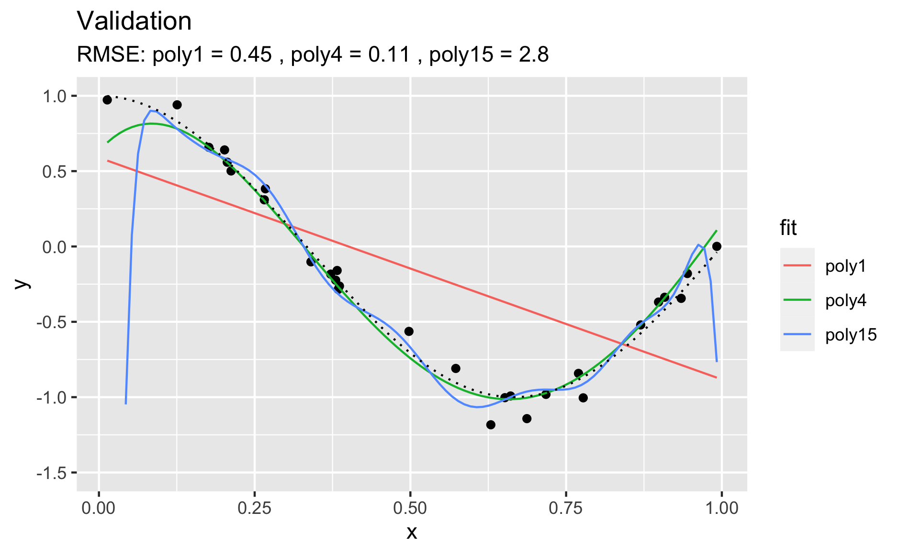
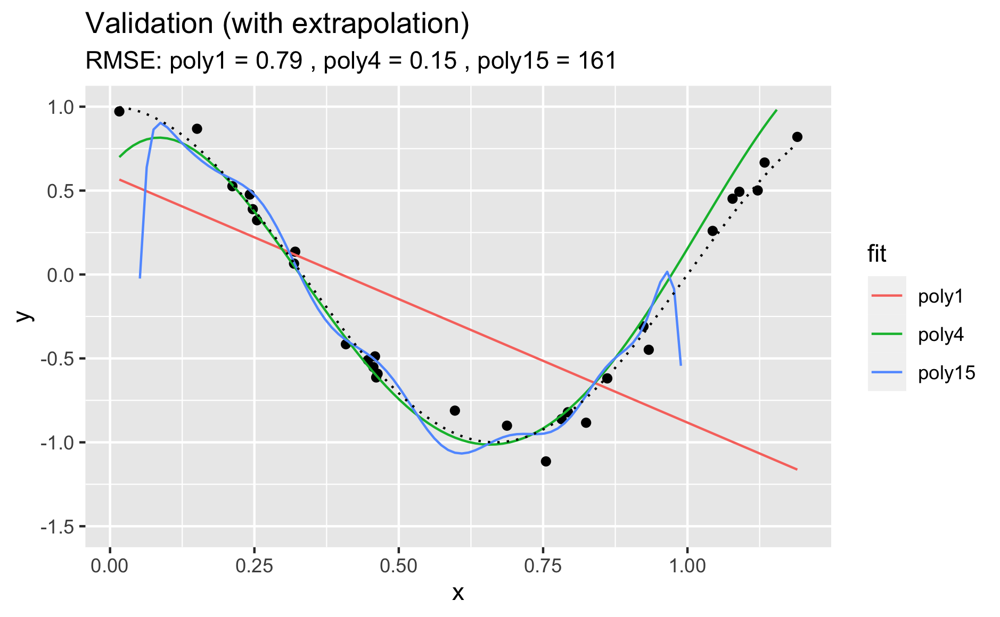
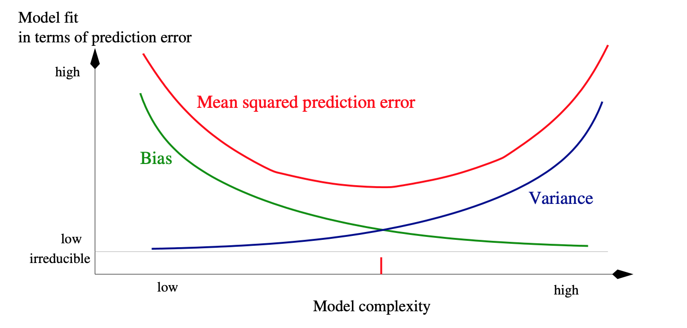
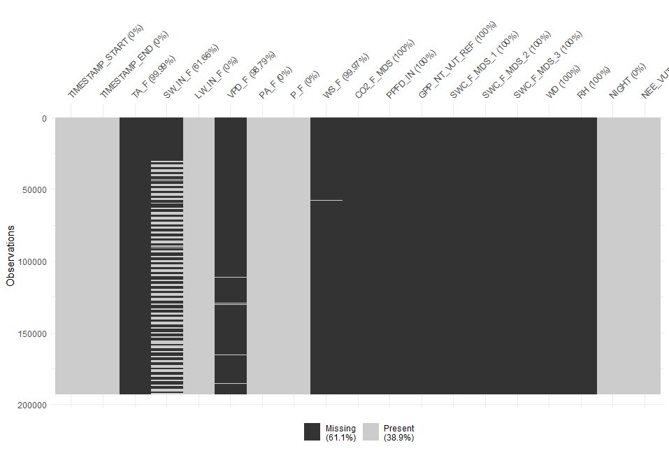

# Supervised Machine Learning I {#ch-06}

## Introduction 

### Learning objectives

After this learning unit, you will be able to ...

* Differentiate machine learning from classical programming
* Describe the different variants of machine learning
* Conceptualize model training as an optimization problem
* Describe overfitting and how it can be measured (training vs. validation error).
* Formulate a model in R.
* Discuss why, when, and how to pre-process data.
* Measure and minimize loss for regression and classification (video)
* Describe the fundamentals of gradient descent (video)

### Important points from the lecture

Machine learning refers to a class of algorithms that automatically generate statistical models of data.
    
There are two main types of machine learning:
    
Machine learning refers to a class of algorithms that generate statistical models of data.
    
There are two main types of machine learning:
    
**Unsupervised machine learning**: A class of algorithms that automatically detect patterns in data without using labels or ‘learning without a teacher’. Examples are: PCAs, k-means clustering, autoencoders, self-organizing maps, etc.

**Supervised machine learning**: A class of algorithms that automatically learn an input-output relationships based on example input-output pairs. Examples include: support vector machines, random forests, decision trees, neural networks, etc. Supervised machine learning requires three ingredients: (1) Input data (2) Output data (3) A measure of model performance (a.k.a. "loss"). Supervised machine learning be used for regression (predict a continuous label) or classification (predict a categorical label).
    
**Loss** is a concept central to many supervised machine learning algorithms. It measures how well our predicted model values fit the actual observed model values, a higher value indicates a higher loss, essentially meaning the model fits less well. Ideally, loss should be minimised. Loss can be used to update our model parameters in the next iteration of model training, this is called learning.

## Tutorial

Machine learning (ML) may appear magical. The ability of ML algorithms to detect patterns and make predictions is fascinating. However, several challenges have to be met in the process of formulating, training, and evaluating the models. In this practical we will discuss some basics of supervised ML and how to achieve best predictive results.

In general, the aim of supervised ML is to find a model $\hat{Y} = f(X)$ that is *trained* (calibrated) using observed relationships between a set of *features* (also known as *predictors*, or *labels*, or *independent variables*) $X$ and the *target* variable $Y$. Note, that $Y$ is observed. The hat on $\hat{Y}$ denotes an estimate. Some algorithms can even handle predictions of multiple target variables simultaneously (e.g., neural networks). ML algorithms consist of (more or less) flexible mathematical models with a certain structure and set of parameters. At the simple extreme end of the model spectrum is the univariate linear regression. You may not want to call this a ML algorithm because there is no iterative learning involved. Nevertheless, also univariate linear regression provides a prediction $\hat{Y} = f(X)$, just like other (proper) ML algorithms do. The functional form of a linear regression is not particularly flexible (just a straight line for the best fit between predictors and targets) and it has only two parameters (slope and intercept). At the other extreme end are, for example, deep neural networks. They are extremely flexible, can learn highly non-linear relationships and deal with interactions between a large number of predictors. They also contain very large numbers of parameters, typically on the order of thousands. You can imagine that this allows these types of algorithms to very effectively learn from the data, but also bears the risk of *overfitting*.

What is overfitting? The following example illustrates it. Let's assume that there is some true underlying relationship between a predictor $x$ and the target variable $y$. We don't know this relationship (in the code below, this is `true_fun()`) and the observations contain a (normally distributed) error (`y = true_fun(x) + 0.1 * rnorm(n_samples)`). Based on our training data (`df_train`), we fit three polynomial models of degree 1, 4, and 15 to the observations. A polynomial of degree N is given by:
$$
y = \sum_{n=0}^N a_n x^n
$$
$a_n$ are the coefficients, i.e., model parameters. The goal of the training is to get the coefficients $a_n$. From the above definition, the polynomial of degree 15 has 16 parameters, while the polynomial of degree 1 has two parameters (and corresponds to a simple linear regression). You can imagine that the polynomial of degree 15 is much more flexible and should thus yield the closest fit to the training data. This is indeed the case. 

```{r, echo = FALSE, echo=FALSE, fig.cap="Comparing model fits on training data set."}
knitr::include_graphics("./figures/training.png")
```

We can use the same fitted models on unseen data - the *validation data*. This is what's done below. Again, the same true underlying relationship is used, but we sample a new set of data points in x and add a new sample of errors on top of the true relationship.

```{r, echo = FALSE, echo=FALSE, fig.cap="Comparing model fits on validation data set."}

```

You see that, using the validation set, we find that "poly4" actually performs the best - it has a much lower RMSE that "poly15". Apparently, "poly15" was overfitted. Apparently, it indeed used its flexibility to fit not only the shape of the true underlying relationship, but also the observation errors on top of it. This has obviously the implication that, when this model is used to make predictions for data that was not used for training (calibration), it will yield misguided predictions that are affected by the errors in the training set. In the above pictures we can also conclude that "poly1" was underfitted.

It gets even worse when applying the fitted polynomial models to data that extends beyond the range in $x$ that was used for model training. Here, we're extending just 20% to the right.

```{r, echo = FALSE, echo=FALSE, fig.cap="Comparing model fits when extrapolating."}

```

You see that the RMSE for "poly15" literally explodes. The model is hopelessly overfitted and completely useless for prediction, although it looked like it fit the data best when we considered at the training results. This is a fundamental challenge in ML - finding the model with the best *generalisability*. That is, a model that not only fits the training data well, but also performs well on unseen data. 

The phenomenon of fitting/overfitting as a function of the model "flexibility" is also referred to as *bias vs. variance trade-off*. The bias describes how well a model matches the training set (average error). A model with low bias will match the data set closely and vice versa. The variance describes how much a model changes when you train it using different portions of your data set. "poly15" has a high variance, but much of its variance is the result of misled training on observation errors. On the other extreme, "poly1" has a high bias. It's not affected by the noise in observations, but its predictions are also far off the observations. In ML, we are challenged to balance this trade-off. In Figure \@ref(fig:tradeoff) you can see a schematic illustration of the bias–variance trade-off.

```{r tradeoff, echo=FALSE, fig.cap="Trade-off between bias and variance"}

```

This chapter introduces the methods to achieve the best model generalisability and find the sweet spot between high bias and high variance. The steps to get there include the preprocessing of data, splitting the data into training and testing sets, and model training that "steers" the model towards what is considered a good model fit in terms of its generalisation power. 

You have learned in video 6a about the basic setup of supervised ML, with input data containing the features (or predictors) $X$, predicted ($\hat{Y}$) and observed target values ($Y$, also known as *labels*). In video 6b (title 6c: loss and it's minimization), you learned about the loss function which quantifies the agreement between $Y$ and $\hat{Y}$ and defines the objective of the model training. Here, you'll learn how all of this can be implemented in R. Depending on your application or research question, it may also be of interest to evaluate the relationships embodied in $f(X)$ or to quantify the importance of different predictors in our model. This is referred to as *model interpretation* and is introduced in the respectively named subsection. Finally, we'll get into *feature selection* in the next Application session. 

The topic of supervised machine learning methods covers enough material to fill two sessions. Therefore, we split this part in two. Model training, implementing the an entire modelling workflow, model evaluation and interpretation will be covered in the next session's tutorial (Supervised Machine Learning Methods II).

Of course, a plethora of algorithms exist that do the job of $Y = f(X)$. Each of them has its own strengths and limitations. It is beyond the scope of this course to introduce a larger number of ML algorithms. Subsequent sessions will focus primarily on Artificial Neural Networks (ANN) - a type of ML algorithm that has gained popularity for its capacity to efficiently learn patterns in large data sets. For illustration purposes in this and the next chapter, we will briefly introduce two simple alternative "ML" methods, linear regression and K-nearest-neighbors. They have quite different characteristics and are therefore great for illustration purposes in this chapter.

**Checkpoint**

What can you say about the bias and the variance of the following graphs?

```{r simple-complex, echo=FALSE, fig.cap="Comparison of simple and complex model fits."}
knitr::include_graphics("./figures/bias-variance_2.png")
```   
    
**Solution**

In Figure \@ref(fig:simple-complex), the right plot shows low bias and high variance. While in the left plot we see a high bias and a low variance.

### Linear regression

**Theory**

In its simplest form, the univariate linear regression, we assume a linear relationship between $X$ and $Y$:
$$
Y_i = \beta_0 + \beta_1 X_i + \epsilon_i, \;\;\; i = 1, 2, ...n \;,
$$
where $Y_i$ is the i-th observation of the target variable, and $X_i$ is the i-th value of the (single) predictor variable. The errors $\epsilon_i$ are assumed to be independent from each other (no autocorrelation), normally distributed, have mean of zero and a constant variance. $\beta_0$ and $\beta_1$ are constant coefficients (model parameters). Fitting a linear regression is finding the values for $\beta_0$ and $\beta_1$ so that the sum of the square errors is minimized, that is:
$$
\sum_i \epsilon_i^2 = \sum_i (Y_i - \beta_0 - \beta_1 X_i)^2 = \text{min}.
$$

Since the expected value of $\epsilon$ is zero (because it's normally distributed with mean zero), predictions of a linear regression model are obtained by $Y_\text{new} = \beta_0 + \beta_1 X_\text{new}$. 

It's not hard to imagine that the univariate linear regression can be generalized to a multivariate linear regression, where we assume that the target variable is a linear combination of $p$ predictor variables:
$$
Y = \beta_0 + \beta_1 X_1 + \beta_2 X_2 + \; ... \; + \beta_p X_p + \epsilon \;.
$$
Note that here, $X$, $Y$, and $\epsilon$ are vectors of length corresponding to the number of observations in our data set ($n$ - as above). Analogously, calibrating the $p$ coefficients $\beta_1, \beta_2, ..., \beta_p$ is to minimize the sum of square errors $\sum_i \epsilon_i^2$. While the regression is a line in two-dimensional space for the univariate case, it is a plane in three-dimensional space for bi-variate regression, and so on. 

**Implementation**

First, let's load some packages that we will use in this tutorial.

```{r message=F, warning=F}
library(tidyverse)
library(ggplot2)
library(modelr)
library(forcats)
library(yardstick)
library(recipes)
library(caret)
library(broom)
```

To fit a univariate linear regression model in R, we can use the `lm()` function. Already in Chapter \@ref(ch-02), we made linear models by doing:

```{r message=F}
ddf_ch_lae <- read_csv("./data/ddf_ch_lae.csv") # loads 'ddf_ch_lae'

df <- ddf_ch_lae %>% 
  dplyr::select(-NEE_VUT_REF_QC, -TIMESTAMP) %>%  # not numeric features
  drop_na() 
```

```{r}
linmod1 <- lm(GPP_NT_VUT_REF ~ PPFD_IN, data = df)
```

Here, `GPP_NT_VUT_REF` is $Y$, and `PPFD_IN` is $X$. We can include multiple predictors for a multivariate regression, for example as:

```{r}
linmod2 <- lm(GPP_NT_VUT_REF ~ PPFD_IN + VPD_F + TA_F, data = df)
```

or all available features in our data set (all columns other than  `GPP_NT_VUT_REF` in `df`) as:

```{r}
linmod3 <- lm(GPP_NT_VUT_REF ~ ., data = df)
```

`linmod` is now a model object of class `"lm"`. It is a list containing the following components:

```{r}
ls(linmod1)
```

Enter `?lm` in the console for a complete documentation of these components. 

R offers a set of generic functions that work with this type of object. The following returns a human-readable report of the fit.

```{r}
summary(linmod1)
```

We can also extract coefficients $\beta$ with

```{r}
coef(linmod1)
```

Under the assumption of normally distributed errors $\epsilon$ with mean zero and constant variance $\sigma^2$, the magnitude of the variance can be estimated by

$$
\widehat{\sigma}^2 = \frac{1}{n-p} \sum_{i=1}^n \epsilon_i^2
$$
- $\widehat{\sigma}^2$ is also referred to as the *mean square error* (MSE), and its root, 
- $\widehat{\sigma}$ is the *root mean square error* (RMSE). 

The RMSE can be extracted from the linear regression model object by:

```{r}
sigma(linmod1)
```

The RMSE is also reported in the output of `summary()` as the `Residual standard error`. The MSE can be calculated accordingly as:

```{r}
sigma(linmod1)^2
```

Although `summary()` provides a nice, human-readable output, you may find it unpractical to work with. A set of relevant quantities are returned in a tidy format using `tidy()` from the broom package:

```{r}
library(broom)
tidy(linmod1)
```

**Model advantages and concerns**

An advantage of linear regression is that the coefficients provide information that is straight-forward to interpret. We've seen above, that `GPP_NT_VUT_REF` increases by 0.014 for a unit increase in `PPFD_IN`. Of course, the units of the coefficients depend on the units of `GPP_NT_VUT_REF` and `PPFD_IN`. This has the advantage that the data does not need to be normalised. That is, a linear regression model with the same predictive skills can be found, irrespective of whether `GPP_NT_VUT_REF` is given in g Cm$^{-2}$s$^{-1}$ or in kg Cm$^{-2}$s$^{-1}$. 

Another advantage of linear regression is that it's much less prone to overfit than other algorithms. We've seen this in the overfitting example above. But this can also be a disadvantage. Indeed, we found that the linear model "poly1" is rather under-fitting. It's not able to capture non-linearities in the observed relationship and exhibits a poorer performance than "poly4" also on the validation data set.

A further limitation is that least squares regression requires $n>p$. In words: the number of observations must be greater than the number of predictors. If this is not given, one can resort to step-wise forward regression, where predictors are sequentially added based on which predictor adds the most additional information at each step. You'll encounter stepwise regression in the Application session 8.

When multiple predictors are linearly correlated, then linear regression cannot discern individual effects and individual predictors may appear statistically insignificant when they would be significant if covarying predicotrs were not included in the model. Such instability can get propagated to predictions. Again, stepwise regression can be used to remedy this problem. However, when one predictor covaries with multiple other predictors, this may not work. For many applications in environmental sciences, we deal with limited numbers of predictors. We can use our own knowledge to examine potentially problematic covariations and make an informed pre-selection rather than throwing all predictors we can possibly think of at our models. Such a pre-selection can be guided by the model performance on a validation data set (more on that below).

An alternative strategy is to use *dimension reduction* methods. Principal Component regression reduces the data to capture only the complementary axes along which our data varies and therefore collapses covarying predictors into a single one that represents their common axis of variation. Partial Least Squares regression works similarly but modifies the principal components so that they are maximally correlated to the target variable. You can read more on their implementation in R [here](https://bradleyboehmke.github.io/HOML/linear-regression.html#PCR). 

**Checkpoint**

Considering the univariate linear regression model `GPP_NT_VUT_REF ~ PPFD_IN`, how do coefficients $\beta_0$ and $\beta_1$ change when you add 1 to all values `GPP_NT_VUT_REF`?

**Solution**

```{r}
lm(GPP_NT_VUT_REF ~ PPFD_IN, data = df %>% mutate(GPP_NT_VUT_REF = GPP_NT_VUT_REF + 1))
lm(GPP_NT_VUT_REF ~ PPFD_IN, data = df)
```

Of course, this simply corresponds to an upward shift of all points by 1, and thefore an upward shift of the regression line by 1. The slope $\beta_1$ doesn't change, but the y-axis intercept $\beta_0$ increases by 1.

### K-nearest neighbours

As the name suggests, the K-nearest neighbour (KNN) uses the $k$ observations that are "nearest" to the new record for which we want to make a prediction. It then calculates their average (in regression) or most frequent value (in classification) as the prediction. "Nearest" is determined by some distance metric evaluated based on the values of the predictors. In our example (`GPP_NT_VUT_REF ~ .`), KNN would determine the $k$ days where conditions, given by our set of predictors, were most similar (nearest) to the day for which we seek a prediction. Then, it calculates the prediction as the average (mean) GPP value of these days. Determining "nearest" neighbors is commonly based on either the Euclidean or Manhattan distances between two data points $x_a$ and $x_b$, considering all $p$ predictors $j$.
$$
\text{Euclidean: } \sqrt{ \sum_{j=1}^p (x_{a,j} - x_{b,j})^2  } \\
\text{Manhattan: } \sum_{j=1}^p | x_{a,j} - x_{b,j} |
$$

In two-dimensional space, the Euclidean distance measures the length of a straight line between two points (remember Pythagoras!). The Manhattan distance is called this way because it measures the distance you would have to walk to get from point $a$ to point $b$ in Manhattan, New York, where you cannot cut corners but have to follow a rectangular grid of streets. $|x|$ is the positive value of $x$ ( $|-x| = x$).

KNN is a simple algorithm that uses knowledge of the "local" data structure for prediction. A drawback is that the model training has to be done for each prediction step and the computation time of the training increases with $x \times p$. KNNs are used, for example, to impute values (fill missing values) and have the advantage that predicted values are always within the range of observed values of the target variable. 

To use the KNN algorithm for prediction, we have to apply two essential methods in machine learning applications: *pre-processing* and *hyperparameter tuning*. These are described in respective sections below.

**Checkpoint**
Compute the Euclidean metric and Manhattan distances between two points $x_a = (1,1)$ and $x_b = (4, 5)$.

**Solution**

$$
d_\text{Euclidean}(x_a, x_b) = \sqrt{ \sum_{j=1}^2 (x_{a,j} - x_{b,j})^2  } =  \sqrt{ (4 - 1)^2  + (5 - 1)^2} = \sqrt{25} = 5\\
d_\text{Manhattan: }(x_a, x_b) = \sum_{j=1}^2 | x_{a,j} - x_{b,j} | = |4-1|+|5-1| = 7
$$

### Essential methods for the modelling process

Building a ML model is an iterative process and it is typically not possible to know which ML algorithm will perform best when you start with the process. It is also essential that you understand your data in order to apply appropriate pre-processing steps, splitting your data wisely into training and testing sets, building a robust model, and achieving an informative model evaluation. This section introduces essential methods of the modelling process that allow you to walk a safe (and hopefully still spectacular) path. This section is inspired by the fantastic tutorial [*Hands On Machine Learning in R* by Boehmke & Gladwell](https://bradleyboehmke.github.io/HOML).

#### Model formulation

Remember that the aim of supervised ML is to find a model $\hat{Y} = f(X)$ so that $\hat{Y}$ agrees well with observations $Y$. We typically start with a research question where $Y$ is given - naturally - by the problem we are addressing and we have a data set at hand where one or multiple predictors (or features) $X$ are recorded along with $Y$. With the data set that you have become familiar with in preceeding chapters, we have information about how GPP (ecosystem-level photosynthesis) depends on set of abiotic factors, mostly meteorological measurements. In R, it is common to use the *formula* notation to specify the target and predictor variables. You have encountered formulas before, e.g., for a linear regression using the `lm()` function. To specify a linear regression model for `GPP_NT_VUT_REF` with three predictors `PPFD_IN`, `VPD_F`, and `TA_F`, we write:

```{r eval=F}
lm(GPP_NT_VUT_REF ~ PPFD_IN + VPD_F + TA_F, data = df)
```

Actually, the way we formulate a model is independent of the algorithm, or *engine* that takes care of fitting $f(X)$. The R package [**caret**](https://topepo.github.io/caret/) provides a unified interface for using different ML algorithms implemented in separate packages. In other words, it acts as a *wrapper* for multiple different model fitting, or ML algorithms. This has the advantage that it unifies the interface (the way arguments are provided). caret also provides implementations for a set of commonly used tools for data processing (which we won't use here), model training, and evaluation. We'll use caret for model training with the function `train()` (more on model training in Chapter \@ref(ch-07)). Note however, that using a specific algorithm, which is implemented in a specific package outside caret, also requires that the respective package be installed and loaded. Using caret for specifying the same linear regression model as above, using the base-R `lm()` function, can be done with caret in a generalized form as:

```{r message=F, warning=F}
library(caret)
```

```{r eval=F}
train(
  form = GPP_NT_VUT_REF ~ ., 
  data = df, 
  method = "lm"
)
```

Of course, this is an overkill compared to just writing `lm(...)`. But the advantage of the unified interface is that we can simply replace the `method` argument to use a different ML algorithm. For example, to use KNN, we can write:

```{r eval=F}
train(
  form = GPP_NT_VUT_REF ~ ., 
  data = df, 
  method = "knn"
)
```

Another common way of model formulation is not to use the formula notation, but to provide an argument `x` containing columns for all the predictors, and an argument `y` containing a vector of the target variable (with `length(y) = nrow(x)`). E.g., the caret function `train()` also takes such specifications:

```{r eval=F}
train(
  x = dplyr::select(df, PPFD_IN, VPD_F, TA_F),
  y = df$GPP_NT_VUT_REF,
  method = "knn"
  )
```

#### Data splitting

The introductory example impressively demonstrated the importance of validating the fitted model with data that was not used for training. Thus, we can test the model's generalisability. The essential step that enables us to assess the model's *generalization error* is to hold out part of the data from training, and set it aside (leaving it absolutely untouched) for *testing* (*validation*).

There is no fixed rule for how much data are to be used for training and testing, respectively. We have to balance the trade-off between:

- Spending too much data for training will leave us with too little data for testing and the test results may not be robust. In this case, the sample size for getting robust validation statistics is not sufficiently large and we don't know for sure whether we are safe from an overfit model.
- Spending too much data for validation will leave us with too little data for training. In this case, the ML algorithm may not be successful at finding real relationships due to insufficient amounts of training data.

Typical splits are between 60-80% for training. However, in cases where the number of data points is very large, the gains from having more training data are marginal, but come at the cost of adding to the already high computational burden of model training. 

In environmental sciences, the number of predictors is often smaller than the sample size ($p < n$), because its typically easier to collect repeated observations of a particular variable than to expand the set of variables being observed. Nevertheless, in cases where the number $p$ gets large, it is important, and for some algorithms mandatory, to maintain $p < n$ for model training.

An important aspect to consider when splitting our data is to make sure that all "states" of the system for which we have data are approximately equally represented in training and testing sets. This is to make sure that the algorithm learns relationships $f(X)$ also under rare conditions $X$, for example meteorological extreme events.

Several alternative functions for the data splitting step are available from different packages in R. Figure \@ref(fig:sample) shows an example for their implementation using base R (`sample`), caret (`createDataPartition`), and rsample (`initial_split`, combined with `training` and `testing`) and their resulting distribution of soil water content values (`SWC_F_MDS_1`) in training and testing sets.

```{r eval=F}
## using base-R
set.seed(123) # for reproducibility
index_base <- sample(1:nrow(df), round(nrow(df) * 0.7))
df_train_base <- df %>% 
  slice(index_base)
df_test_base <- df %>% 
  slice(-index_base)

## using caret
library(caret)
set.seed(123)  # for reproducibility
index_caret <- createDataPartition(df$SWC_F_MDS_1, p = 0.7, list = FALSE)
df_train_caret <- df %>% 
  slice(index_caret)
df_test_caret <- df %>% 
  slice(-index_caret)

## using rsample
library(rsample)
set.seed(123)  # for reproducibility
split_rsample <- initial_split(df, prop = 0.7)
df_train_rsample <- training(split_rsample)
df_test_rsample <- testing(split_rsample)
```

```{r sample, echo=FALSE, fig.cap="Comparison of different methods to split data. Black represent training data splits and red training data splits."}

knitr::include_graphics("./figures/datasplitting.png")

```


In Figure \@ref(fig:sample), you can see that not in all cases, data with very low soil water content values are sufficiently represented in the testing set (see red curve for 'base R'). It may be critical to have extreme values both in the testing and training sets, e.g., if we are interested to capture responses of our target variable to very dry soil conditions. A way to control for this aspect and achieve a more similar representation of data in training and testing sets across all values, we can apply a *stratified sampling*. Here, we use the `initial_split` function from the rsample package again.

```{r eval=F}
split_rsample_strat <- initial_split(df, prop = 0.7, strata = "SWC_F_MDS_1")
df_train_rsample_strat <- training(split_rsample_strat)
df_test_rsample_strat <- testing(split_rsample_strat)
```

```{r rsample, out.height="50%", echo=FALSE, fig.cap="Stratified sampling using `initial_split()` from rsample package."}
knitr::include_graphics("./figures/datasplitting_strata.png")
```

### Bonus 

To generalize this and achieve a sort of "stratification" with respect to all predictors, we can use the [`maxDissim`](https://topepo.github.io/caret/data-splitting.html#splitting-based-on-the-predictors) function from the **caret** package (uses the **proxy** package). It samples the most dissimilar data points after an initial pick and thus achieves a good representation of the entire feature space in our training set.

```{r eval=F}
library(proxy)
set.seed(123)
startSet <- sample(1:nrow(df), 5)   # initial pick of five
samplePool <- df[-startSet,]
start <- df[startSet,]
index_caret <- maxDissim(start, samplePool, n = floor(0.7 * nrow(df))-5 )
```

#### Pre-processing

Skewed data, outliers, and values covering multiple orders of magnitude can create difficulties for certain ML algorithms, e.g., or KNN or neural networks. Other algorithms, like tree-based methods (e.g., Random Forest) are more robust against such issues. This section introduces pre-processing methods that enable improved ML models and prepare the data for specific needs by the ML algorithm. There is a difference between data wrangling which we learned about in Chapter \@ref(ch-02) and pre-processing as part of the modelling workflow. Data wrangling can be considered to encompass the steps to get raw data into a format that is usable for modelling with any sort of ML algorithm. Data wrangling are the steps to prepare the data set with variable selection, removal of bad or missing data, complementing variables from different sources, and aggregating to the desired resolution or granularity (e.g., averaging over all time steps in a day, or over all replicates in a sample). In contrast, *pre-processing* refers to the additional steps that are either required by the ML algorithm (examples will be given below) or the transformation of variables guided by the resulting improvement of the predictive power of the ML model.


**Target engineering**

Target engineering refers to pre-processing of the target variable. Its application can enable improved predictions, particularly for models that make assumptions about errors (e.g., normally distributed errors in linear regression) and when the target variable follows a "special" distribution (e.g., heavily skewed distribution, or where the target variable is a fraction that is naturally bounded by 0 and 1). A simple log-transformation of the target variable can often resolve issues with skewed distributions. An implication of a log-transformation is that errors in predicting values in the upper end of the observed range do not affect the model disproportionally compared to errors in the lower range.

In our data set of half-hourly ecosystem flux and meteorological measurements, the variable `WS_F` (wind speed) is skewed. The target variable that we have considered so far (`GPP_NT_VUT_REF`) is not skewed. In a case where we would consider `WS_F` to be our target variable, we would thus consider applying a log-transformation.

```{r message=F, warning=F}
library(patchwork)  # to combine two plots into separate panels of a single plot

gg1 <- df %>% 
  ggplot(aes(x = WS_F, y = ..density..)) +
  geom_histogram() +
  labs(title = "Original")

gg2 <- df %>% 
  ggplot(aes(x = log(WS_F), y = ..density..)) +
  geom_histogram() +
  labs(title = "Log-transformed")

gg1 + gg2   # the + is from the patchwork library
```

When defining any pre-processing step, it should be specified as a "recipe" or "blueprint", and not actually executed on the data itself before we start with the model training. Such a "recipe" can then be applied to any new data, while the parameters of the data pre-processing transformations are different each time. The reason for not actually executing the data transformation is *data leakage*. It happens when information from the validation data somehow finds its way into the training step. Don't worry if this sounds incomprehensible. We'll learn more about it below. For now, you can focus on the types of pre-processing steps, what they do, and how they are implemented as part of a pre-processing "recipe" in R. 

The [**recipes**](https://recipes.tidymodels.org/) package offers a powerful way to specify pre-processing steps in R and is gaining traction as part of the [tidymodels](https://www.tidymodels.org/) ecosystem. It allows us to sequentially build a pre-processing pipeline using the pipe (`%>%`) operator.

```{r}
library(recipes)
recipe(WS_F ~ ., data = df) %>%   # it's of course non-sense to model wind speed like this
  step_log(all_outcomes())
```

The formula, specified as an argument in the `recipe()` function, defines variable "roles" (in recipes-speak). What's left of the `~` is interpreted as an "outcome" (the target variable). By writing `~ .`, we specify all remaining variables in the data frame as "predictors". As an argument in the `step_log()` function, we write `all_outcomes()` to declare that the log transformation is applied only to the "outcome" variables we specified with the formula before.

A log-transformation doesn't necessarily result in a perfect normal distribution of transformed values. The *Box-Cox* can get us closer. It can be considered a generalization of the log-transformation. Values are transformed according to the following function:
$$
y(\lambda) = \begin{cases}  
\frac{Y^\lambda-1}{\lambda}, &\; y \neq 0\\ 
\log(Y),                     &\; y = 0
\end{cases}
$$
$\lambda$ is treated as a parameter that is fitted such that the resulting distribution of values $y$ approaches the normal distribution. To specify a Box-Cox-transformation as part of the pre-processing, we can use `step_BoxCox()` from the recipes package. How do transformed values look like? The strict separation of the pre-processing recipe from its execution on the data also forces us to be explict about what part of the data (training vs. validation/testing subsets) are used for determining pre-processing parameters. Let's be clear about this in the next example and apply the initial data split first here and use the training subset for the recipe.

```{r}
library(rsample)
split <- initial_split(df, prop = 0.5)
df_train <- training(split)
df_test <- testing(split)

recipe_example <- recipe(WS_F ~ ., data = df_train) %>%
   step_BoxCox(all_outcomes())
```

Now, you may be frustrated by the fact that this doesn't actually transform any data, but you want to look at how values would change. There are two more steps involved to get there. This might seem a nuisance at first but their separation is actually quite beautiful and translates the conception of the pre-processing as a "blueprint" into the way we write the code. You'll understand why this is so useful by the end of Chapter \@ref(ch-07).

To get the parameter of the Box-Cox-transformation ($\lambda$) based on the data set `df_train`, we have to "prepare" the recipe.

```{r}
prep_example <- prep(recipe_example, training = df_train) 
```

Finally we can actually transform the data. That is, "bake" the prepared recipe.

```{r}
df_baked <- bake(prep_example, new_data = df_test)
```

The Box-Cox-transformed data now looks like this:

```{r message=F}
df_baked %>% 
  ggplot(aes(x = WS_F, y = ..density..)) +
  geom_histogram() +
  labs(title = "Box-Cox-transformed")
```

Note that the Box-Cox-transformation can only be applied to values that are strictly positive. In our example, wind speed (`WS_F`) is. If this is not satisfied, a Yeo-Johnson transformation can be applied.

```{r}
recipe(WS_F ~ ., data = df) %>%
  step_YeoJohnson(all_outcomes()) 
```

#### Standardization

Several algorithms explicitly require data to be standardized. That is, values of all predictors vary within a comparable range. The necessity of this step becomes obvious when considering KNN, where the magnitude of the distance is strongly influenced by the order of magnitude of the predictor values. To get a quick overview of the distribution of all variables (columns) in our data frame, we can use the skimr package.

```{r eval=FALSE}
library(skimr)
skim(df)
```

```{r}
knitr::include_graphics("./figures/06_output-skim.png")
```

We see for example, that typical values of `PPFD_IN` are by a factor 100 larger than values of `VPD_F`. A distance calculated based on these raw values would therefore be strongly dominated by the difference in `PPFD_IN` values, and differences in `VPD_F` would hardly affect the distance. Therefore, the data must be standardized before using it with the KNN algorithm. Standardization is done, for example, by dividing each variable, that is all values in one column, by the standard deviation of that variable, and then subtracting its mean. This way, the resulting standardized values are centered around 0, and scaled such that a value of 1 means that the data point is one standard deviation above the mean of the respective variable (column). When applied to all predictors individually, the absolute values of their variations can be directly compared and only then it can be meaningfully used for determining the distance.

Also other algorithms require data to be normalised before training. A prominent example are Artificial Neural Networks. 

Standardization can be done not only by centering and scaling (as described above), but also by *scaling to within range*, where values are scaled such that the minimum value within each variable (column) is 0 and the maximum is 1.

Using the recipes package again, we can specify centering and scaling by two separate steps as:

```{r}
recipe_example <- recipe(GPP_NT_VUT_REF ~ ., data = df_train) %>% 
  step_center(all_numeric(), -all_outcomes()) %>%
  step_scale(all_numeric(), -all_outcomes())
```

Here, we used selectors to apply the recipe step to several variables at once. The first selector, `all_numeric()`, selects all variables that are either integers or real values. The second selector, `-all_outcomes()` removes any outcome (target) variables from this recipe step.

As seen above for the feature engineering example, this does not return a standardized version of the data frame `df_train`, but rather the information that allows us to apply the same standardization also to other data sets. In other words, we use the distribution of values in the data set to which we applied the function (here `df_train`) to determine the standardization (here: mean and standard deviation). As you will learn below, this is essential and critical to avoid *data leakage* (where information from the testing data set leaks into the training data set). 

#### Zero-variance predictors

Sometimes, the data generation process yields variables that have the same value in each observation. And sometimes this is due to failure of the measurement device or some other bug in the data collection pipeline. Either way, this may cause some algorithms to crash or become unstable. Such "zero-variance" predictors are usually removed altogether. The same applies also to variables with "near-zero variance". That is, variables where only a few unique values occur in the entire data set with a high frequency. The danger is that, when data is split into training and testing sets, the variable may effectively become a "zero-variance" variable within the training subset. 

We can test for zero-variance or near-zero variance predictors by quantifying the following metrics: 

- Frequency ratio: Ratio of the frequency of the most common predictor over the second most common predictor. This should be near 1 for well-behaved predictors and get very large for problematic ones.
- Percent unique values: The number of unique values divided by the total number of rows in the data set (times 100). For problematic variables, this ratio gets small (approaches 1/100). 

The function `nearZeroVar` of the caret package flags suspicious variables (`zeroVar = TRUE` or `nzv = TRUE`). In our data set, we don't find any:

```{r}
nearZeroVar(df, saveMetrics= TRUE)
```

Using the recipes package, we can add a step that removes zero-variance predictors by:

```{r}
recipe_example <- recipe_example %>% 
  step_zv(all_predictors())
```

#### One-hot encoding

For ML algorithms that require that all predictors be numerical (e.g., neural networks, or KNN), categorical predictors have to be pre-processed and converted into new numerical predictors. The most common such transformation is *one-hot encoding*, where a categorical feature (predictor) that has $N$ levels is replaced by $N$ new features that contain either zeros or ones depending whether the value of the categorical feature corresponds to the respective column. This creates perfect collinearity between these new column, we can also drop one of them. This is referred to as *dummy encoding*. Check out Figure \@ref(fig:ohe) for a one-hot encoding visualization. Using the recipes package, one-hot encoding is implemented by:

```{r ohe, echo = F, fig.cap="Visualization of one-hot encoding from [Kaggle](https://www.kaggle.com/dansbecker/using-categorical-data-with-one-hot-encoding)."}
knitr::include_graphics("./figures/06_figure_ohe.png")
```


```{r}
recipe(GPP_NT_VUT_REF ~ ., data = df) %>% 
  step_dummy(all_nominal(), one_hot = TRUE)
```

**Checkpoint**

Apply a one-hot encoding to the to the variable Species from the data set iris (from the package data sets). Load the data by `library(datasets)`. The dataset's name is `iris`. Visualize the result.

**Solution**

```{r}
library(datasets)
rec <- recipe( ~ ., data = iris) %>% 
  step_dummy(Species, one_hot = T) %>%
  prep(training = iris)

summary(rec)
rec$template$Species_setosa
rec$template$Species_versicolor
rec$template$Species_virginica
```

#### Dealing with missingness and bad data

Several ML algorithms require missing values to be removed. That is, if any of the cells in one row has a missing value, the entire cell gets removed. We've seen how this is implemented in Chapter \@ref(ch-02) for example with `na.omit()` or `tidyr::drop_na()`. Data may be missing for several reasons. Some yield random patterns of missing data, others not. In the latter case, we can speak of *informative missingness* (Kuhn & Johnson, 2003) and its information can be used for predictions. For categorical data, we may replace such data with `"none"` (instead of `NA`), while randomly missing data may be dropped altogether. Some ML algorithms (mainly tree-based methods, e.g., random forest) can handle missing values. However, when comparing the performance of alternative ML algorithms, they should be tested with the same data and removing missing data should be done beforehand. 

Visualising missing data is essential for making decisions about dropping rows with missing data versus removing predictors from the model (which would imply too much data removal). The cells with missing data in a data frame can be visualised either using ggplot and `geom_raster()` or similarly (with additional information about the percentage of missing data for each variable) with `vis_miss()` from the `visdat` package.
Note: the code below is set to `raw` since the notebook sturggles to handle the amount of values in _hhdf_. We have provided the results as images instead.

```{r eval=F}
load("./data/FLX_CH-Lae_FLUXNET2015_FULLSET_HH_2004-2014_1-3_CLEAN.csv")

# DO NOT RUN THIS CODE IS NOT WORKING IN THE NOTEBOOK (or only for a max of 30000 values)
## Code from https://bradleyboehmke.github.io/HOML/engineering.html#dealing-with-missingness
hhdf %>%
  is.na() %>%
  reshape2::melt() %>%
  ggplot(aes(Var2, Var1, fill=value)) +
  geom_raster() +
  coord_flip() +
  scale_y_continuous(NULL, expand = c(0, 0)) +
  scale_fill_grey(name = "",
                  labels = c("Present",
                             "Missing")) +
  xlab("Observation") +
  theme(axis.text.y  = element_text(size = 100/ncol(df)))

library(visdat)
vis_miss(
  hhdf,
  cluster = FALSE, 
  warn_large_data = FALSE
  )
```


```{r, echo = FALSE, fig.cap=""}
knitr::include_graphics("./figures/missing_data.png")
```

```{r, echo = FALSE, fig.cap=""}

```

The question about what is "bad data" and whether or when it should be removed is often critical. In Chapter \@ref(ch-03), we've encountered quality control information in our data set (e.g., `NEE_VUT_REF_QC`), and removed data that didn't satisfy our own definition of the quality criterion. Such decisions are important to keep track of and should be reported as transparently as possible in publications. In reality, where the data generation process may start in the field with actual human beings writing notes in a lab book, and where the human collecting the data is often not the same as the human writing the paper that contains that data, it's often more difficult to keep track of such decisions. As a general principle, it is advisable to design data records such that decisions made during its process remain transparent throughout all stages of the workflow and that sufficient information be collected to enable later revisions of particularly critical decisions. 

Often, and particularly when humans (and more so in the case of multiple humans) collected and recorded the data, steps are necessary to make it machine-readable. For example, dates need to be formatted consistently, units need to be specified consistently, etc. An overview of common problems with bad data and their solutions is given by the [Quartz Guide to Bad Data](https://github.com/Quartz/bad-data-guide#spelling-is-inconsistent).


## Exercise

### Model formulation

Load the file `"ddf_ch_lae.RData"` and rename the data frame to `df`. First, drop columns `NEE_VUT_REF_QC` and `TIMESTAMP` and then remove any row with missing values. To have all necessary data wrangling functions available, it may be handy to load the "super-package" *tidyverse* (which contains multiple individual packages).

Train a linear regression model to predict `GPP_NT_VUT_REF` from  the variables `PPFD_IN`, `PA_F`, `TA_F` in the dataframe `df`, using (a) the suitable base-R function and (b) the caret function `train()` with argument `trControl = trainControl("none")` (This fits one model to the entire training set without resampling. You'll learn more about what this is in Chapter \@ref(ch-07)). Compare the fitted models with the function `summary()` and answer the following questions:

- What are the values for the intercept $\beta_0$ and the slope $\beta_1$? 
- Do the two packages yield identical estimates of the coefficients?
- What is the root mean square error of the fitted model?
- Is the relationship between `GPP_NT_VUT_REF` and `PPFD_IN` positive or negative? Is it significant?

### One-hot encoding

Using the dataset with daily data from multiple sites `ddf_allsites.RData`, apply a One-hot encoding and a dummy encoding on the column containing vegetation type information (`igbp_land_use`), using the recipes package. Execute the recipe by applying the functions `prep()` and `bake()`. You may avoid the data splitting here and apply all functions on the same dataframe.

How many columns does the un-processed original data frame have and how many columns are in the freshly "baked" data frames created by the One-hot encoding and how many in the one from the dummy-encoding? Explain the differences.

Determine which column was created by the One-hot-encoding but not by the dummy-encoding.

### Sequential pre-processing

You have learned about several pre-processing steps. The implementation of these steps was demonstrated using the recipes package which allows you to be specific about the order in which the pre-processing steps are applied. Does the order matter?

Apply the following three pre-processing steps on the daily dataset you used above (for the problem on 'One-hot encoding') and make sure that, after all three steps are applied by your specified order, the columns created by the dummy-encoding can be interpreted as logical variables.

- Filter out zero or near-zero variance features.
- Standardize (center and scale) numeric features.
- Dummy encode categorical features.

Visualise the distribution of numeric variables (not including the ones created by the dummy-encoding) in the original and pre-processed dataset using an appropriate plot type.

**Hint:**

We have learned in Chapter \@ref(ch-02) that ggplot2 is designed to implement the *grammar of graphics* where variables are mapped onto aesthetics. If we want to create, for example, separate boxplots for each variable, arranged side-by-side along the x-axis, we want to specify the x-axis aesthetics to be the variable identity (something like `aes(x = variable)`). However, in our dataset, we have multiple variables (eleven to be precise) in separate columns. Strictly speaking, this is not entirely *tidy* and therefore, it's not quite straight-forward to create a ggplot graphics with data from multiple separate columns and organise them along one of the available aesthetics (here, x-axis). We have to take an additional step and combine the multiple columns into a single one. The new-rearranged and very *tidy* dataframe then has a new column (e.g., called `value`) that contains all the values of all the variables, and another new column (e.g. called `variable`) that specifies which variable the value belongs to. This re-arrangement can also be described as converting a table in *wide* format (wide because of its large number of columns) to a *long* format (long because of its large number of rows). This transformation is illustrated in Figure \@ref(fig:pivot).


```{r pivot, echo=FALSE, fig.cap='Visualizsation of turning a table from wide format (right) into long format (left). Figure from [R for Data Science](https://cmdlinetips.com/2020/02/r-for-data-science-book-gets-tidyr-1-0-0-friendly/).'}
knitr::include_graphics("./figures/fig_pivot_longer_wide_to_long_tidy.jpg")
```

In R, this conversion from a wide to a long table (usable with ggplot) is done in one line by `pivot_longer()` from the tidyr package (part of the tidyverse).

### K-nearest neighbours

Load the file `"ddf_ch_lae.RData"` and split the dataset into 70% used for training and 30% for testing. Fit three KNN models of the form `GPP_NT_VUT_REF ~ .` with $k = (1, 25, 250)$ on the training set and evaluate the RMSE on the training and on the validation set. For the model training, use the caret function `train()` with arguments `trControl = trainControl("none")` and `tuneGrid = data.frame(k = 25)` (in the case of k = 25). Explain your observations. Which case (data set, k) has the lowest RMSE? Why? Is there a pattern in the difference between RMSE derived from `df_train` and `df_test`, depending on k? How do the three models relate to the bias-variance trade-off? Regarding their performance on the training set evaluation, which model has the highest bias? Which one has the highest variance? How does this relate to their performance on the validation set? Please explain.

**Hint:**

To evaluate the performance of a fitted model on a dataset `df`, you can use the object returned by the function `train()` (`modl` in the example below) in combination with `predict()` as:
```{r eval = FALSE}
values_redicted <- predict(modl, newdata = df)
```

This returns a vector of predicted values of the same length as rows in `df`. To get the RMSE of predicted vs. observed values, you can use the function `rmse()` from the tidyverse package *yardstick*. Check `?yardstick::rmse` for more information.
