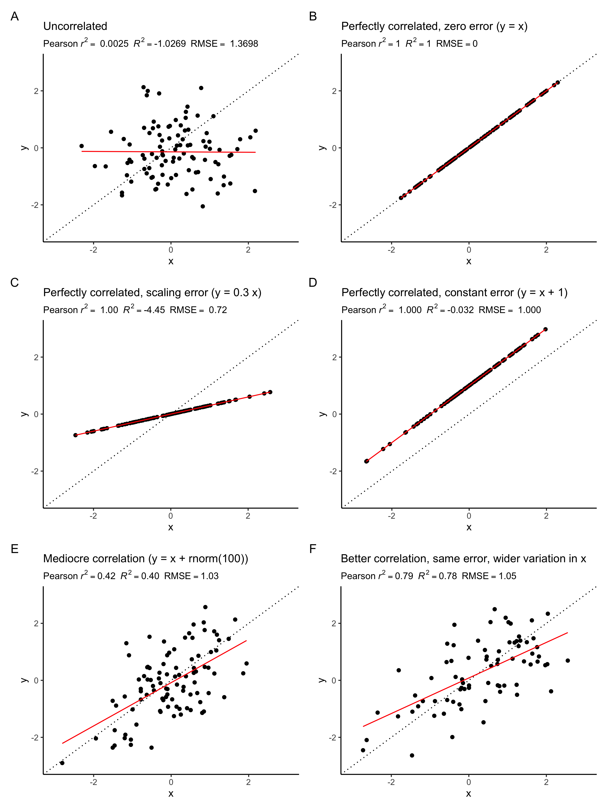

# Supervised Machine Learning II {#ch-07}

## Introduction

After this learning unit, you will be able to ...

- Explain the effect of hyper-parameter tuning in the context of the K-nearest neighbour algorithm.
- Assess the generalisability of a trained model.
- Explain the purpose and the method of cross-validation.
- Avoid data leakage during model training.

### Key points from the lecture

**Testing data** is set aside at the initial split and not "touched" during model training. It is key to test a model’s predictive power or whether it is overfitted. 

**Validation data** is used for determining the loss during model training. The reason for distinguishing between testing and validation data is to assure we're not misleading model training by some peculiarities of the validation data and we get an assessment of generalisability based on data that was not seen during model training.

**Model training** minimises the loss. In other words, it optimises the agreement between predicted and observed values. The loss is most commonly measured by the root mean square error (RMSE).

To tune a model, you can set *hyperparameters* that determine model structure or calibrate the coefficients. The *k* in KNN is such a hyperparameter.

**Generalisability** refers to the model’s performance on data not seen during the training - the testing data. To avoid overfitting, model generalisability is desired already during model training. One method to guide model training is **cross validation**.

**Data leakage** is when data from the testing dataset creeps into the training data. To avoid this the testing set must be left completely untouched! 

## Tutorial
### Model training and the loss function

Model training in supervised ML is guided by the match (or mismatch) between the predicted and observed target variable(s), that is, between $\hat{Y}$ and $Y$. The *loss* function quantifies this mismatch ($L(\hat{Y}, Y)$), and the algorithm takes care of progressively reducing the loss during model training. Let's say the ML model contains two parameters and predictions can be considered a function of the two ($\hat{Y}(w_1, w_2)$). $Y$ is actually constant. Thus, the loss function is effectively a function $L(w_1, w_2)$. Therefore, we can consider the model training as a search of the parameter space of the machine learning model $(w_1, w_2)$ to find the minimum of the loss. Common loss functions are the root mean square error (RMSE), or the mean square error, or the mean absolute error.

```{r, echo = FALSE, fig.cap = "Visualization of a loss function as a plane spanned by the two parameters $w_1$ and $w_2$."}
knitr::include_graphics("./figures/loss_plane.png")
```

Loss minimization is a general feature of ML model training. Practically all ML algorithms have some "knobs" to turn in order to achieve efficient model training and predictive performance. What these knobs are, depends on the ML algorithm.

In Video 6B you learned how the loss minimization, at least for some ML methods (e.g., artificial neural networks), is guided by *gradient descent*. It offers a principle for determining in what direction to jump and search the parameter space. *Gradient descent* changes parameters relative to a reference such that for a given "distance" of the "jump", the loss is reduced by as much as possible. In other words, it descends along the steepest gradient of the loss hyperplane (the yellow-red plane in the figure above). You can imagine this as the trajectory of a ball rolling into the loss "depression".

Model training is implemented in R for different algorithms in different packages. Some algorithms are even implemented by multiple packages (e.g., `nnet` and `neuralnet` for artificial neural networks). As described in Chapter \@ref(ch-06), the **caret** package provides "wrappers" that handle a large selection of different ML model implementations in different packages with a unified interface (see [here](https://topepo.github.io/caret/available-models.html) for an overview of available models). The **caret** function `train()` is the centre piece. Its argument `metric` specifies the loss function and defaults to RMSE for regression models and accuracy for classification (see sub-section on metrics below). A complete implementation of model training with caret is demonstrated further below.

#### Hyperparameter tuning

As for practically all ML algorithms, there are free parameters that determine their characteristics and how the learning operates - *hyperparameters*. Turning back to the analogue of the ball and the loss depression, imagine the effect of how fast the ball mentioned before is rolling. If it rolls too fast (that is if the "jump" of the parameter search is too large), it descends into the depression fast but may shoot beyond the minimum and it has to do a "180-degrees turn" and continue the search. That's not very efficient. On the other extreme, a very slowly rolling ball (the parameter space is searched with small jumps) will take much longer to arrive at the bottom of the depression. Hence, there is an optimum in between. This "size of the jump" is called the *learning rate*, and it usually has to be tuned for optimal performance of model training of artificial neural networks. Other ML algorithms have other types of hyperparameters. While some hyperparameters determine the performance of the model training, other hyperparameters are decisive for the model's predictive skills. Hyperparameters are not to be confused with the model coefficients. For example, in linear regression, the number of predictors can be considered a hyperparameter, while the values of $\beta$ are the coefficients. In general, hyperparameters determine the *structure* of the algorithm.

Let's turn to the K-nearest neighbour (KNN) algorithm as an example. In KNN, the hyperparameter is $k$. That is, the number of neighbours to consider taking their mean. With KNN, there is always an optimum $k$. Obviously, if $k = n$, we consider all observations as neighbours and each prediction is simply the mean of all observed target values $Y$, irrespective of the predictor values. This cannot be optimal and such a model will likely underfit. On the other extreme, with $k = 1$, the model will be strongly affected by the noise in the single nearest neighbour and its generalisability will suffer. This should be reflected in a poor performance on the validation data. Indeed, it is, as the Figure \@ref(fig:hyper) illustrates.

```{r hyper, echo = FALSE, fig.cap = "Improvement in RMSE on validation data with increasing number of neighbours."}
knitr::include_graphics("./figures/knn_hyperparameter_tuning.png")
```

You will encounter different hyperparameters for neural networks in later chapters.

In **caret**, hyperparameter tuning is implemented as part of the `train()` function. Values of hyperparameters to consider are to be specified by the argument `tuneGrid`, which takes a data frame with column(s) named according to the name(s) of the hyperparameter(s) and rows for each combination of hyperparameters to consider. More explicit examples follow below.

#### Resampling

At the beginning of this tutorial, we demonstrated a case of overfitting. In the example with KNN above, the increasing error on the validation data (measured by RMSE) is an indication of poor *generalisability*. The goal of model training is to achieve the best possible generalisation performance. That is, the lowest validation error measured by applying the trained model on the testing data set from the initial split. Note the distinction: validation data is what is used during model training, testing data is held out at the initial split and not used during model training.

But how can the generalisability be assessed when the testing set is held out completely during the training step? To measure the model's generalisability and "direct" the ML algorithm to minimize the validation error during the training step, we can further split the training set into one or more training and validation sub-set. This is called *resampling*. The model performance determined on this resampled validation set is then a good estimate of the generalisation error we get when evaluated against the testing data that was set aside from the initial split.

The challenge to be met here is that we further reduce the number of data points in the resampled training and validation sets which may lead to evaluation statistics not being sufficiently robust and bears the potential that we're training to some peculiarities in the (relatively small) validation set. In order to control for this, common practice is to do multiple resamples (multiple *folds* of training-validation splits), determine the validation error on each fold of the validation set and consider the mean validation error across all folds. This is called *k-fold cross validation*.

```{r, echo = FALSE, fig.cap = "Example of 5-fold cross validation. Figure taken from Figure from [Bradley & Boehmke](https://bradleyboehmke.github.io/HOML/process.html#k-fold-cross-validation)."}
knitr::include_graphics("./figures/cv.png")
```

There is no formal rule about the number of folds and hence the number of data points in each training and testing fold. _Leave-one-out_ cross validation is an extreme variant of k-fold cross validation, where k equals the number of data points in the full set of training data.

To do a hyperparameter tuning and k-fold cross validation during model training in R, we don't have to implement the loops ourselves. The resampling procedure can be specified in the **caret** function `train()` with the argument `trControl`. The object that this argument takes is the output of a function call to `trainControl()`. This can be implemented in two steps. For example, to do a 10-fold cross-validation, repeated five times, we can write:

```{r eval = F}
my_cv <- trainControl(
  method = "repeatedcv",
  number = 10,
  repeats = 5
)

train(..., trControl = my_cv)
```

**Bonus Material**

An example of model training in environmental sciences is where we have time series data from multiple sites and we are interested in making a prediction of temporal dynamics at an entirely new site. In this case, the data has an additional "dimension" (location in addition to time), and the generalisability with respect to location has to be determined where the data splitting is done along data belonging to different sites. In other words, we have to make sure that one site's data is entirely either in the training *or* testing set, but never in both. Otherwise, the validation error, measuring the generalisability of the model to a new site, is too optimistic.

This can be done using the [`groupKFold`](https://topepo.github.io/caret/data-splitting.html#simple-splitting-with-important-groups) function of the **caret** package as follows, using a site identify vector that has the same length as the training data has rows (`df_train$siteid` below).

```{r eval=F}
cv <- trainControl(
  method = "cv",  # not repeated CV
  index = groupKFold(df_train$siteid, k = 10)
)
```


### Putting it all together

Now, we know enough to turn to the implementation of a full model training workflow in R. Below, we implement the example of hyperparameter tuning of the KNN algorithm for which you saw the visualisation above. The workhorse for model training with **caret** is the function `train()`. Let's recap its arguments:

- A formula specifying the model of the form `<target> ~ <predictor1> + <predictor2> + ...`; or `x` (a data frame with predictors) and `y` (a vector of the target variable, see section *Model formulation* in Chapter \@ref(ch-06)); or a recipe (object returned by a `recipes::recipe()` function call).
- `data`: The data set containing the target and predictor variables as separate columns. This is required only when using a formula or recipe as the first argument.
- `method`: The machine learning algorithm (the "engine") to be used. We'll use `"knn"` here. For an overview of available algorithms see [here](http://topepo.github.io/caret/train-models-by-tag.html).
- `metric`: The loss function. For regression problems, it defaults to `"RMSE"`.
- `preProcess`: The pre-processing instructions given as a vector of strings. This can also be a "recipe", i.e., the output of a function call to `recipe()` of the recipes package (see sub-section *Pre-processing* in Chapter \@ref(ch-06))
- `tuneGrid`: A data frame with combinations of hyperparameter values. The columns are named the same as the tuning parameters. In the KNN example below, this is simply `k`.
- `trControl`: The output of a function call to `trainControl()` (see above).

We've learned about the danger of *data leakage*. It happens when information from the testing data somehow finds its way into the training step. This is relevant not only for leakage from the testing set to the training set determined from the initial split but also for the resampling splits within each resample fold. Therefore, we should apply the pre-processing blueprint independently on each fold. For example, we should do the centering and scaling by subtracting the mean and dividing by the standard deviation, where the mean and standard deviation are calculated separately on each fold of the training resamples (not including the validation resample). This is illustrated in Figure \@ref(fig:leakage).

```{r leakage, echo = FALSE, fig.cap='Visualization of how data leakage can be avoided. Figure taken from Figure from [Bradley & Boehmke](https://bradleyboehmke.github.io/HOML/engineering.html#proper-implementation).'}
knitr::include_graphics("./figures/minimize-leakage.png")
```

This also illustrates why the pre-processing step has to be considered as a blueprint that is applied to several different subsets of the data during model training. Of course, this also means that the pre-processing is not to actually be executed on the data before training, but will be executed, following the same general rules, several times anew during training.

Let's finally turn to the implementation with KNN. First, we make the initial data split.

```{r message=F}
# As always we start by loading the packages we'll need
library(ggplot2)
library(patchwork)
library(caret)
library(recipes)
library(broom)
library(tidyverse)
```

```{r}
## Load daily data from all sites
load("./data/ddf_allsites_nested_joined.RData")
#load("ddf_allsites.RData")

## Load daily data and rename for use below
load("./data/ddf_ch_lae.RData") # loads 'ddf_ch_lae'
#load("ddf_ch_lae.RData")

df <- ddf_ch_lae %>% 
  dplyr::select(-NEE_VUT_REF_QC, -TIMESTAMP) %>%  # not numeric features
  drop_na()                                # drop rows with missing data
```

```{r}
set.seed(123)  # for reproducibility

index_caret <- createDataPartition(
  df$GPP_NT_VUT_REF, p = 0.7,
  list = FALSE
  )

df_train <- df %>%
  slice(index_caret)

df_test <- df %>%
  slice(-index_caret)
```

We then define the pre-processing blueprint as `pp`.

```{r}
pp <- recipe(GPP_NT_VUT_REF ~ ., data = df_train) %>%
  step_center(all_numeric(), -all_outcomes()) %>%        # normalizes numeric data to have a mean of zero
  step_scale(all_numeric(), -all_outcomes())             # normalizes numeric data to have a standard deviation of one
```

Next, we specify the parameters determining the model training. Here, we're doing a 10-fold cross validation, repeated five times.

```{r}
my_cv <- trainControl(
  method = "repeatedcv",      # method define the resampling method such as 'boot', 'none', 'cv', etc.
  number = 10,                # number of folds or number of resampling iterations
  repeats = 5                 # the number of complete sets of folds to compute (only for repeated k-fold cross-validation)
)
```

Then the hyperparameter search is specified.

```{r}
# Create grid of hyperparameter values
hyper_grid <- data.frame(k = c(2, 5, 10, 15, 18, 20, 22, 24, 26, 30, 35, 40, 60, 100))
```

This object will be provided to `train()` through its argument `tuneGrid`. It requires a data frame where column names correspond to the hyperparameters available for the particular model, and rows are for each combination of hyperparameters to be assessed.

We can now combine it all with the `train()` function. We supply the pre-processing blueprint `pp` as the first argument to the train function. Using recipes in combination with **caret** offers a nice way to combine the clear way of specifying the pre-processing blueprint with recipes and the handy `train()` function of **caret**.

```{r eval=F}
set.seed(123)
knn_fit <- train(
  pp,
  data = df_train,
  method = "knn",
  trControl = my_cv,
  tuneGrid = hyper_grid,
  metric = "RMSE"
)

knn_plot <- ggplot(knn_fit) + labs( title = "KNN", subtitle = "RMSE on validation data")

knn_plot
```


```{r echo=F}
knn_fit <- readRDS(file = "./data/knn_fit_ml2.rds")
```

This illustrates the generalisation error estimated from repeated k-fold cross-validation as a function of the number of neighbours. As shown in the table above, the lowest RMSE of 2.487583 was achieved with `k=24`. This model was then saved directly in the variable `knn_fit` 

Let's apply the final _best-performing model_ on the validation data from the initial split that was held out completely during model training. The final model is automatically used when predicting values with new data using the generic `predict()` function.

```{r message=F}
df_test$GPP_NT_VUT_REF_predicted <- predict(knn_fit, newdata = df_test)

df_test %>%
  ggplot(aes(x = GPP_NT_VUT_REF_predicted, y = GPP_NT_VUT_REF)) +
  geom_point() +
  geom_abline(intercept=0, slope=1, linetype="dotted") +
  theme_classic() +
  labs(x = "Predicted GPP", y = "Observed GPP") +
  geom_smooth(method='lm', color="red", size=0.5, se=FALSE)

df_test %>% yardstick::metrics(GPP_NT_VUT_REF, GPP_NT_VUT_REF_predicted)
```

This looks reasonable. The KNN model, using 10 predictors for modelling daily GPP at the SwissFluxNet site CH-Lae (Lägern) achieves an R$^2$ of 0.67 and an RMSE of 2.46 gC m$^-2$ d$^-1$. The slope of the relationship between observed vs. modelled values falls very closely onto the 1:1 line (dotted), indicating that the model captured the relationships reliably across the full range of values. Let's keep the evaluation metrics as a reference in mind and remember it in later chapters when we model this data with other algorithms. Interestingly, the evaluation on the testing set from the initial split is even slightly better than estimated from the k-fold cross validation.

### Model evaluation

In previous chapters, you have already encountered different metrics that can be used to quantify the agreement between predicted ($\hat{y}$) and observed ($y$) values (e.g., the root mean square error). These metrics are essential to guide model training (where the metric defines the loss function) and inform the evaluation. Different metrics measure different aspects of the model-data agreement and different metrics are used for regression and classification models.

#### Metrics for regression models

Different metrics measure, for example, the correlation between modeled and observed values or the magnitude of the errors. To get an intuitive understanding of their different abilities, compare the scatterplots in Figure \@ref(fig:metrics) and how different aspects of the model-data agreement are measured by different metrics. Their definitions will follow below.

```{r metrics, echo = FALSE, fig.cap = "Comparison of model metrics on different data sets."}

```

- **MSE**: The mean squared error is defined, as its name suggests, as:
$$
\text{MSE} = \frac{1}{n} \sum_{i=1}^n (y_i - \hat{y_i})^2
$$
It measures accuracy, i.e., the magnitude of the errors, and is minimized during model training when used as a loss function. Note that since it scales with the square of the errors, the MSE is particularly sensitive to large errors in single points (including outliers). You may notice the difference to the error variance $\widehat{\sigma}^2$. It was defined in Chapter \@ref(ch-06) similar to the definition of the MSE above, but with $n-p$ in the denominator instead of $n$. The denominator $n-p$ corresponds to the *degrees of freedom* (size of our sample minus the number of parameters to estimate). Here we want to compute the mean of the errors, hence we divide by $n$.

- **RMSE**: The root mean squared error is, as its name suggests, the root of the MSE:
$$
\text{RMSE} = \sqrt{\text{MSE}} = \sqrt{\frac{1}{n} \sum_{i=1}^n (y_i - \hat{y_i})^2}
$$ 
Like the MSE, the RMSE also measures accuracy (the magnitude of the errors) and is minimized during model training. By taking the square root of mean square errors, the RMSE is in the same units as the data $y$ and is less sensitive to outliers as the MSE.

**Checkpoint**

Implement the formula for RMSE using simple "low-level" functions like `sqrt()` and `mean()`. Confirm that the function `rmse()` from the yardstick package computes the RMSE the same way.

**Solution**

```{r}
## generate random data 
df_demo <- tibble(x = rnorm(100)) %>% 
  mutate(y_obs = x + rnorm(100),
         y_pred = x)

yardstick::rmse(df_demo, y_obs, y_pred) %>% pull(.estimate)

sqrt(mean((df_demo$y_pred - df_demo$y_obs)^2))
```

- **$R^2$**, also called the *coefficient of determination*, describes the proportion of variation in $y$ that is captured by modelled values $\hat{y}$. In this case, the goal is to maximize the metric, thus trying the explain as much variation as possible. In contrast to the MSE and RMSE, $R^2$ measures consistency, or correlation, or goodness of fit, and not accuracy. It is traditionally defined as:
$$
R^2 = 1 - \frac{\sum_i (\hat{y}_i - y_i)^2}{\sum_i (y_i - \bar{y})^2}
$$
A perfect fit is quantified by $R^2 = 1$ and uninformative estimates have an $R^2$ approaching zero when compared to observations. 

- **Pearson's $r^2$**: The linear association between to variables (here $y$ and $\hat{y}$) is measured by the *Pearson's correlation coefficient* $r$. Its square is closely related to the coefficient of determination and in common cases of prediction-observation comparisons almost identical.
$$
r = \frac{\sum_i (y_i - \bar{y}) (\hat{y_i} - \hat{\bar{y}}) }{\sqrt{ \sum_i(y_i-\bar{y})^2(\hat{y_i}-\hat{\bar{y}})^2 } }
$$

The distinction between uppercase and lowercase nomenclature is often not consistent in the literature. The uppercase $R^2$ is commonly used in the context of comparing observed and predicted values with the coefficient of determination. When the *correlation* between two different variables in a sample is quantified, the lowercase $r^2$ is commonly used. In a linear regression with an estimated intercept, the coefficient of determination and the square of the Pearson's correlation coefficient are equal. However, when comparing estimated and observed values, the coefficient of determination can return negative values for uninformative estimates. 

Metrics for correlation should not be used as a loss function because they do not penalise biased models. This is illustrated also in the plots above.

The yardstick library implements the definition of the coefficient of determination with its function `rsq_trad()`.

```{r}
## generate random data 
df_demo <- tibble(x = rnorm(100)) %>% 
  mutate(y_obs = x + rnorm(100),
         y_pred = x)

## the equation given above for the coefficient of determination corresponds to 'rsq_trad()'
1 - sum((df_demo$y_pred - df_demo$y_obs)^2) / sum((df_demo$y_obs - mean(df_demo$y_obs))^2)

yardstick::rsq_trad(df_demo, y_obs, y_pred) %>% pull(.estimate)
```

The square of the Pearson's correlation coefficient, as defined above, is implemented by the yardstick function `rsq()`, and corresponds also to the value reported for `Multiple R-squared` by `summary()` on a linear model object, or simply to `cor(...)^2`.

```{r}
## the equation given above for the squared Pearson's correlation coefficient corresponds to 'rsq()', 'cor()^2', and `summary()$r.squared

(sum((df_demo$y_pred - mean(df_demo$y_pred))*(df_demo$y_obs - mean(df_demo$y_obs))))^2/
  (sum((df_demo$y_obs - mean(df_demo$y_obs))^2)*sum((df_demo$y_pred - mean(df_demo$y_pred))^2))

yardstick::rsq(df_demo, y_obs, y_pred) %>% pull(.estimate)

summary(lm(y_obs ~ y_pred, data = df_demo))$r.squared

cor(df_demo$y_obs, df_demo$y_pred)^2
```

The $R^2$ generally increases when predictors are added to a model, even if predictors are not informative. This is particularly critical in the context of machine learning when we compare alternative models that differ by their number of predictors. In other words, the $R^2$ of a model with a large number of predictors tends to give an overconfident estimate of its predictive power. We have encountered cross-validation which yields good predictive power. This is the "gold-standard". But when the number of data points is small, cross validation estimates may not be robust. Without resorting to cross validation, the effect of spuriously improving the evaluation metric by adding uninformative predictors can also be mitigated by penalising by the number of predictors $p$. Different metrics are available.

- **Adjusted $R^2$**: The adjusted $R^2$ discounts values by the number of predictors as
$$
\bar{R}^2 = 1 - (1-R^2) \; \frac{n-1}{n-p-1} \;,
$$
where $n$ (as before) is the number of observations and $p$ the number of predictors. As for $R^2$, the goal is to maximize it. For a fitted model in R `modl`, it is returned by `summary(modl)$adj.r.squared`.

- **AIC**: the Akaike’s Information Criterion is defined as
$$
\text{AIC} = n \log \Big(\frac{\text{SSE}}{n}\Big) + 2(p+2)
$$
where $N$ is the number of observations used for estimation, $p$ is the number of predictors in the model and SSE is the sum of squared estimate of errors (SSE$= \sum_i (y_i-\hat{y_i})^2$). Also in this case we have to minimize it and the model with the minimum value of the AIC is often the best model for forecasting. For large values of  
$n$, minimising the AIC is equivalent to minimising the cross-validated MSE.

- **AIC$_c$**: For small values of $n$ the AIC tends to select too many predictors. A bias-corrected version of the AIC is defined as:
$$
\text{AIC}_c = \text{AIC} + \frac{2(p + 2)(p + 3)}{n-p-3}
$$
Also AIC$_c$ is minimised for an optimal predictive model.

- **BIC**: the Schwarz’s Bayesian Information Criterion is defined as
$$
\text{BIC} = n \log \Big(\frac{\text{SSE}}{n}\Big) + (p+2)  \log(n)
$$
Also in this case our goal is to minimize the BIC. This metric has the feature that if there is a true underlying model, the BIC will select that model given enough data. The BIC tends to select the model with fewer predictors than AIC.


#### Metrics for classification

In the examples for this course, we have thus far focussed on regression models. For classification, different metrics for measuring the agreement between predicted and observed values are used. They will be introduced in a later chapter. If you're curious already now, good overviews are provided in the following links:

- [Hands On Machine Learning in R, Bradley & Boehmke](https://bradleyboehmke.github.io/HOML/process.html#model-eval) for brief definitions.
- [Wikipedia on Confusion Matrix](https://en.wikipedia.org/wiki/Confusion_matrix)
- [Blogpost by M. Sunasra on Medium](https://medium.com/@MohammedS/performance-metrics-for-classification-problems-in-machine-learning-part-i-b085d432082b)


#### Residual analysis

Quantifying metrics is one part of model evaluation. The other part is to get an intuitive understanding of the model-observation agreement and where and why they fail. Getting there is an integral part of exploratory data analysis. One of the first steps after obtaining results from your initial model is to investigate its residuals (the difference between predicted and observed values) and their pattern. If you can detect a clear pattern or trend in your residuals, then your model has room for improvement. 

Our example dataset contains time series of multiple variables. Above, we have not used time as a predictor but values in the dataframe are ordered by time along rows. An obvious first step is to look at residuals and their relationship with time (or simply row number in our case).

A handy function to add predictions and residuals from a fitted model to the data (must contain the variables used in the model), is [`augment`](https://broom.tidymodels.org/reference/data.frame_tidiers.html) from the tidyverse [*broom*](https://broom.tidymodels.org/index.html) package. It adds informations about observations to a dataset. 

Let's fit a linear regression model `GPP_NT_VUT_REF ~ PPFD_IN` and look at the residuals.

```{r}
library(broom)

linmod1 <- lm(GPP_NT_VUT_REF ~ PPFD_IN, data = df)

df1 <- augment(linmod1, data = df)

df1 %>% 
  mutate(id = row_number()) %>% 
  ggplot(aes(id, .resid)) + 
  geom_point(size = 1, alpha = .4) +
  xlab("Row number") +
  ylab("Residuals") +
  labs(title = "Univariate linear regression", subtitle = "GPP_NT_VUT_REF ~ PPFD_IN")
```

Apparently, there is a clear pattern in the residuals with an apparent autocorrelation (the residual in one data point is correlated with the residual in its preceeding data point). This suggests that there is temporal information that we did not account for in our model. This could either be from additional predictors, not included here, that have a temporal pattern (note that we only included one predictor in this model), or from the inherent dynamics of the system itself, which is not captured by the predictors (e.g., memory effects).

We can also plot residuals versus additional, potentially influential but not included predictors to guide the revision of the model. However, it is often not possible to determine effects by eye, especially if interactions between variables are important. We learn about methods to sequentially add predictors to a linear regression model in the 'Application' session (see Chapter \@ref(ch-08)).


### Model interpretation

Until now, we have seen how to build and train models, tune the hyperparameters and evaluate models. ML models work so well because they can effectively make use of large amounts of data and are flexible enough to model non-linear relationships and interactions, and predict rare and faint phenomena. This is their great advantage over classical statistical methods. However, this flexibility is underpinned by a high model complexity and a large number of parameters. This complexity also contrasts with traditional statistical methods, e.g., linear regression where fitted coefficients ($\beta_i$ in Chapter \@ref(ch-06)) can directly be interpreted and yield information about the sensitivity of the target variable to the different predictors and even about the statistical significance of their effect (we haven't looked at that part). In contrast, the complexity of ML models renders their interpretation difficult. The ML algorithms' predictive power comes at the cost of reduced *model interpretability*. ML models often appear to be "black boxes" which may limit their usefulness in typical applications in research, where we're often not only interested in *predicting*, but also in *understanding* how the model arrived at its predictions. We are often interested in identifying patterns in the data that would otherwise not be visible, but that the algorithm apparently identified and learned.

In order to interpret a ML model and understand its inner workings, we have to "ask specific questions" that can be translated into an evaluation of the trained model that then yields the answer we want. There are basically two types of questions we can ask: 

- How "important" is each predictor variable in our model? This is answered by *variable importance analysis*.
- What's the functional relationship between the target variable and each predictor?  This is answered by *partial residual analysis*.


#### Variable importance


**Model specific approach (for linear regression)**

Some of the approaches for evaluating feature importances are _model-specific_. For instance, the absolute value of *t*-statistic, in case of linear models, as a measure of feature importance. Such model-specific interpretation tools are limited to their respective model classes. There can be some advantages to using these model-specific approaches as they are more closely linked to the model and its performance, and can thus directly use parameters (coefficients) of the fitted model. 

For linear regression models, we can quantify the significance of its coefficients $\beta$, by testing a null-hypothesis that the coefficient is, in reality, zero. As an example, let's assume that our data are generated from the following linear model
$$
y = \beta_0 + \beta_1 x + \epsilon
$$
where we assume that our errors $\epsilon$ are independent and come from a normal distribution. Given only one realization of our data, our aim is to estimate $\beta_0$ and $\beta_1$. Let's generate random data for a univariate linear relationship where the true coefficients are $\beta_1 = 3$ and $\beta_0 =2$. Note that in practice we do not know the real coefficients and we don't know what the true predictors are. Let's consider an additional predictor that is available in our data but does not contribute to the actual data generation process (`x2`). We include it in the model and want to know whether the respective coefficient it yields is significant. How can we determine information about its *importance*? As we've seen before, the `summary()` function generates a human-readable output. What information does it provide about variable importance?

```{r}
## generate random data
library(dplyr)

set.seed(123)

n <- 100  # sample size
b_1 <- 3
b_0 <- 2

df_demo <- data.frame(x1 = rnorm(n), x2 = rnorm(n)) %>%
  mutate(y = b_1 * x1 + b_0 + rnorm(n ,mean = 0 , sd = 1))  # no x2 here

## fit model
linmod_demo <- lm(y ~ x1 + x2, data = df_demo)  # x2 here because it's in the data - is it significant?

summary(linmod_demo)
```

You see that the linear regression fit yields estimates of the coefficients $\beta_0$ and $\beta_1$ that are relatively close to the real ones (2.13507 for $\beta_0$ instead of 2, 2.86683 for $\beta_1$ instead of 3). We also see that the estimate (`Estimate`) for (the fake) coefficient `x2` is close to zero. The standard error of the coefficient estimate `Std. Error` is an estimate of the standard deviation of coefficient estimates we would get if the above random data generation process was repeated many times. It decreases with the sample size (`n` in the code above). The *t*-statistic (`t value`) is $\frac{\mbox{Estimate}}{\mbox{Std.Error}}$. Assuming a t-distribution of coefficient estimates, the *p*-value (`Pr(>|t|)`) quantifies the probability of our coefficient estimate (considering its *t*-statistic) if the true coefficient was zero - our null hypothesis. In our example, the *p*-value for the `x2` estimate is 0.81. This is not significant at any significance level (indicated by the `*` to the right of the reported p-value, key given by `Signif. codes`). In contrast, the estimates for coefficients $\beta_0$ and $\beta_1$ are highly significant. Their very low *p*-values indicate that it is highly unlikely that their true value was zero.

This is illustrated below.

```{r warning=F, message=F}
library(ggplot2)

n <- 100
grid <- seq(-7, 7, length.out = 1000)
t_dist <- dt(grid, df = n-3)           # 3 is the number of estimated coefficients

ggplot()+
  geom_line(aes(x = grid, y = t_dist,color = 'Null Distribution'), lwd=1.5) +
  geom_vline(aes(xintercept = 22.208, linetype = ' t value \n for intercept'), color='red') +
  scale_color_manual(name = '',values = 'black') +
  scale_linetype_manual(name='', values = 2) +
  xlim(c(-5,25)) +
  labs(x = 't value', y = 'Density', title = 'Students t-distribution') +
  theme(legend.position = 'top') +
  guides(color = guide_legend(order = 1),
         linetype = guide_legend(order = 2))

ggplot()+
  geom_line(aes(x = grid, y = t_dist, color = 'Null Distribution'), lwd=1.5) +
  geom_vline(aes(xintercept = 0.241, linetype = ' t value \n for x2'), color='red') +
  scale_color_manual(name = '',values = 'black') +
  scale_linetype_manual(name='', values = 2) +
  xlim(c(-5,25)) +
  labs(x = 't value', y = 'Density', title = 'Students t-distribution') +
  theme(legend.position = 'top') +
  guides(color = guide_legend(order = 1),
         linetype = guide_legend(order = 2))
```

Variable importance in a fitted model can be assessed in R using the **vip** package. If we provide a linear regression model as argument, it automatically uses the absolute value of the *t*-statistic for quantifying the variable importance.

```{r}
library(vip)
linmod3 <- lm(GPP_NT_VUT_REF ~ ., data = df)
vip(linmod3)
```

**Checkpoint**

Verify that the bars plotted in the vip plot correspond to the t-statistic of the linear regression model.

**Solution**

```{r}
summary(linmod3)  # compare with values under `t-value`
```

The results of the feature importance plot using `vip()`, agree with the statistics obtaind from the `summary()` function. The variables `LW_IN_F` and `VPD_F` have largest $|t|$ statistic values (thus, the values on the tail ends of the t-distribution have low measure), which results in a small p-value, thus indicating that these are the most important features. On the other end, the variable `P_F` has the smallest $|t|$ statistc, which results in a large p-value, thus indicating that this variable is not as important.  

To sum this up, variable importance can be measured for linear regression models using the *t*-statistic. 

While *t*-statistic values provide information for feature importance analysis that is straight-forward to quantify and interpret, corresponding information has to be extracted by other means for other ML algorithms (e.g., accuracy degradation in random forests). This makes it difficult to compare their results across different classes of ML models.

**Model-Agnostic approaches**

Model-Agnostic approaches offer a solution to the intercomparability problem for feature importance analysis. These treat the ML algorithm as a "black-box", and the separation of the specific model types from their interpretability measure enables us to compare the feature importance across different models and ML algorithms. *Permutation-based feature importance* is such an algorithm. Its idea is that if we _permute_ (re-shuffle) the values of a feature in the training data, we effectively destroy the relationship between that particular feature and the target variable. Thus, if the feature is important, the model performance should degrade substantially. In contrast, for unimportant features, permuting their values should not degrade the model performance much. 

Algorithmically speaking, this works as follows:

- We first compute the loss for the original model to establish a reference loss. 
- For predictor $i$ in $\{1,2, …, p\}$
    - Randomly permute values of predictor $i$ in the dataset.
    - Train the model.
    - Compute the loss.
    - Compute the feature importance, e.g., as the ratio or difference of the loss with the permuted data and the reference loss.
    - Store this as the feature importance for feature $i$
- Sort the variable by their feature importance 

This can be easily implemented using the `vip` package along with a few extra parameters


Arguments to the function vip(), for permutation based feature importance 
- `linmod3`: A fitted model object 
- `train` : the training data to be used to compute the feature importances 
- `method` : `"permute"` for permutation based method 
- `target` : specifying the target variable for the train datset
- `metric` : `"RMSE"` root mean squared error for the regression based task 
- `n_sim` : number of times the simulation is to be repeated, the result is averaged over all the simulations ; choose greater values to increase the stability of estimates 
- `sample_frac` : specifies the proportion of the training data to be used in each simulation. Default value is NULL i.e. all of training data is used  
- `pred_wrapper` : Prediction function that requires two arguments, `object` and `newdata`. The output of this function should be determined by the metric being used
    - A numeric vector of predicted outcomes for a regression task
    - A vector of predicted class labels, or a matrix of predicted class probabilitites for a classification task 
- `type` : Character string specifying how to compare the baseline and permuted performance metrics; default value is `'difference'`, and the other option is `'ratio'`

*Note: In case of large datasets, `n_sim` and `sample_frac` can be used to reduce the execution time of the algorithm, as permutation based approaches can become slow as the number of predictors grows.*

```{r}
pfun <- function(object, newdata) predict(object, newdata = newdata) # inline function defined to output the predictions for newdata given a particular model object 


## variable importance plot using the permute method, with type == 'ratio' 
vip(
  linmod3,
  train = df,
  method = "permute",
  target = "GPP_NT_VUT_REF",
  metric = "RMSE",
  nsim = 5,
  sample_frac = 0.8,
  pred_wrapper = pfun,
  type = 'ratio'
)

## variable importance plot using the permute method, with type == 'difference' 
vip(
  linmod3,
  train = df,
  method = "permute",
  target = "GPP_NT_VUT_REF",
  metric = "RMSE",
  nsim = 5,
  sample_frac = 0.8,
  pred_wrapper = pfun, 
  type = 'difference' 
)
```

Now we can compare the importance plots obtained from the model-specific t-statistic approach and the model agnostic permuation based method. The feature importances obtained from both approaches differ a little, because of the underlying differences in the feature importance evaluation. Despite of the differences, both methods robustly return the key important features, particularly their ranks.

**Checkpoint**

Compute the variable importance for the best fit knn model, which we obtained earlier in the tutorial, using the `vip()` function in default mode. Repeat the same with permuatation based method, with type as 'difference' and 'ratio'. Do the two return the same top-4 features ? Verify.

**Solution**

```{r}
vip(knn_fit)
vip(
  knn_fit,
  train = df,
  method = "permute",
  target = "GPP_NT_VUT_REF",
  metric = "RMSE",
  nsim = 5,
  sample_frac = 0.8,
  pred_wrapper = pfun, 
  type = 'difference' 
)
vip(
  knn_fit,
  train = df,
  method = "permute",
  target = "GPP_NT_VUT_REF",
  metric = "RMSE",
  nsim = 5,
  sample_frac = 0.8,
  pred_wrapper = pfun, 
  type = 'ratio' 
)
```

#### Partial dependence plots

While variable importance analysis is helpful for understanding which predictors are helping us predict, *partial dependence plots* (PDPs) yield information on what the relationship between one individual predictor and the target variable looks like. It quantifies how the response of the target variable changes when we vary one particular predictor and hold all the remaining predictors at a constant value. If this is still a little muddy, the pseudo-code of this algorithm should make things clear (from [Bradley & Boehmke](https://bradleyboehmke.github.io/HOML/iml.html#partial-dependence)). 

```{r eval=F}
For a selected predictor (x)
1. Construct a grid of j evenly spaced values across the range of x: {x1, x2, ..., xj}
2. For i in {1,...,j} do
     | Copy the training data and replace the original values of x with the constant xi
     | Apply the fitted ML model to obtain vector of predictions for each data point.
     | Average predictions across all data points.
   End
3. Plot the averaged predictions against x1, x2, ..., xj
```

As the steps explain, PDPs plot the change in the average predicted value ($\hat{y}$) as a function of a specified feature. As you will see in later chapters, PDPs become more useful when non-linear relationships are present. However, PDPs of linear models help illustrate how a fixed change in $x_i$ relates to a fixed linear change in $\hat{y_i}$ while taking into account the average effect of all the other features in the model. For linear regression models, the slope of the PDP is equal to the corresponding coefficient of the model.

Considering Figure \@ref(fig:pdp), to compute the PDP of target variable with respect to Gr_Liv_Area, we modify the values of this variable for all the rows in the data set, for each [j1, j2, ..., j20] in the grid. Feed this modified dataset to the pre-trained model and compute the mean of our target variable (mean taken over all rows). Finally at the end of the algorithm we have 20 mean responses of the target variable for 20 different values of Gr_Liv_Area. Finally we plot the mean response of the target variable with respect to the changing variable Gr_Liv_Area to get the parital dependence plot. 
```{r pdp, echo = FALSE, fig.cap = "Visualiation of a partial dependence plot (from [Bradley & Boehmke](https://bradleyboehmke.github.io/HOML/images/pdp-illustration.png))."}
knitr::include_graphics("./figures/pdp-illustration.png")
```

Lucky for us, this code has already been implemented in the `pdp` package in R.  We use the `partial()` function to plot the partial dependence plot for a single predictor variable, `PPFD_IN` or `VPD_F`, or for a subset of both these variables. Since our models are linear, we expect the PDP curves to be linear as well. The first curve shows a positive linear relationship between `PPFD_IN` and the target y_hat (`GPP_NT_VUT_REF`), i.e. as the `PPFD_IN` increases, the target increases. Whereas the second curve shows us that there is a negative linear dependence between `VPD_F` and `GPP_NT_VUT_REF`. The final plot shows a 2D partial dependence plot with `PPFD_IN` and `VPD_F`, and this follows a linear relationship too. As expected, we get the highest value for our target variable in the lower right corner and the smallest value in the upper left corner.

```{r}
library(pdp)

partial(linmod3, "PPFD_IN", plot = TRUE)

partial(linmod3, "VPD_F", plot = TRUE)

partial(linmod3, c("PPFD_IN", "VPD_F"), plot = TRUE)
```

The pdp package works with various model classes. For classes that are not available, a prediction wrapper function has to be specified as described for example [here](https://bradleyboehmke.github.io/HOML/iml.html#implementation-6).

Note: The computational demand of partial dependence analysis rapidly increases as the number of search grid points (`j` in the algorithm description above) rises. 

*For the interested: If you do not want to average the y_hat, predictions over all the rows for each value of $X_i$, look into Individual conditional expectation (ICE) curves, which rather than averaging the predicted values across all observations, observe and plot the individual observation-level predictions.*

## Exercise

### Adjusted-$R^2$

Implement the formula for the adjusted-$R^2$ using simple "low-level" functions and $R^2$ defined as (i) the coefficient of determination and then as (ii) the square of the Pearson's correlation coefficient. Compare the values of the two with what is returned by `summary(lm(..))$adj.r.squared`. Which one of the two is used by `summary(lm(..))`? For your investigations, generate correlated random data and apply functions on it.

### Cross validation

Assess the generalisability of three alternatives of a linear regression model for `GPP_NT_VUT_REF`: with one predictor (`PPFD_IN`), three predictors (`PPFD_IN`, `VPD_F`, and `TA_F,`), and all available predictors. Which model works best in terms of its generalisability, assessed by 5-fold cross-validation and using the RMSE as the loss function? Use the caret function `train()` with RMSE as the loss function.

Use data from file `ddf_ch_lae.RData` (avoid `TIMESTAMP` and `NEE_VUT_REF_QC` as predictors).

**Hint**

- To get the generalisation performance assessed during cross-validation (and not on the data held out from an initial split - which is not done here), you can use `summary(resamples(list(model1 = output_train1, ...)))`, where `output_train1` is the ouput of a `train()` function call with resampling.

We see that by including all predictors, we get the best model performance in terms of it cross-validation results, i.e., the lowest root mean square error (RMSE) and the highest $R^2$, averaged across folds.

### Exploratory modelling

Using the same data set as above (daily data for CH-Lae), find the model with the best performance, measured by evaluation against validation data held out from an initial split (30-70%). Use your own creativity to pre-process features and select variables, and chose between either a KNN or a multivariate linear regression, or any other ML model if you like (see models available with caret [here](https://topepo.github.io/caret/available-models.html)). Use all methods you've learned so far and impress your peers. Who gets the best generalisable model? Document and justify all steps you take.

Use data from file `ddf_ch_lae.RData` (avoid `TIMESTAMP` and `NEE_VUT_REF_QC` as predictors).

**Bonus problem below**

### Resampling

Define a resampling function of the form `my_resample_folds_nested(df, k)` generating $k$ folds and taking a data frame `df` as arguments. This function should return a nested data frame with $k$ rows and two columns `train` and `test` that contain nested dataframes for training and testing data with each fold. Use data from file `ddf_ch_lae.RData` (avoid `TIMESTAMP` and `NEE_VUT_REF_QC` as predictors).
Please print the dimensions of the whole data frame and run head() of fold two of the column 'train' of the nested data frame (this is just to make the peer review easier).

*"Relief option:"* You may create two separate flat data frames, one with testing, and one with training data, where one column specifies which fold each row belongs to. 

*Hints:*

- Use the caret function `createFolds` to split a vector of row indices into a list of length corresponding to the number of folds, where each list element cotains the indices of the training resamples for the respective fold.
- Use the dplyr function `slice()` to subset a dataframe by row numbers.
- Use `group_by()` in combination with `nest()` for nesting data frames for each of the $k$ folds and end up with a dataframe that has $k$ rows.

Fit a linear model of the form `GPP_NT_VUT_REF ~ PPFD_IN` (i) directly on all the data in `df`, and (ii) on the resampled **training** folds. 

Evaluate the models by calculating metrics (squared Pearson's correlation coefficient, and RMSE) of predictions made for (i) on the full dataframe `df`, and for (ii) on each respective **testing** fold separately. For (ii), report the mean across metrics calculated on each testing fold. 

If this sounds confusing: Just implement a k-fold cross-validation as described also in the tutorial and report the cross-validation metrics.

*Hints:* (Feel free to come up with a solution that doesn't make use of these hints.)

- You may use `mutate( newcol = purrr::map( nested_col, ~function_name(.)) )` to apply a function `function_name()` on each of the nested data frames in column `nested_col`. The `.` refers to the position at which the argument `nested_col` goes.
- You may use the broom function `augment()` to add a column `.fitted` to a data frame, given a model object that was generated using predictors that are available as columns in the respective data frame.
- You may use `mutate( newcol = purrr::map2( arg1, arg2, ~function_name(.x, .y)) )` to apply a function `function_name()` that takes two arguments from other columns in the same data frame. The `.x` and `.y` refer to the position at which the two arguments go.

