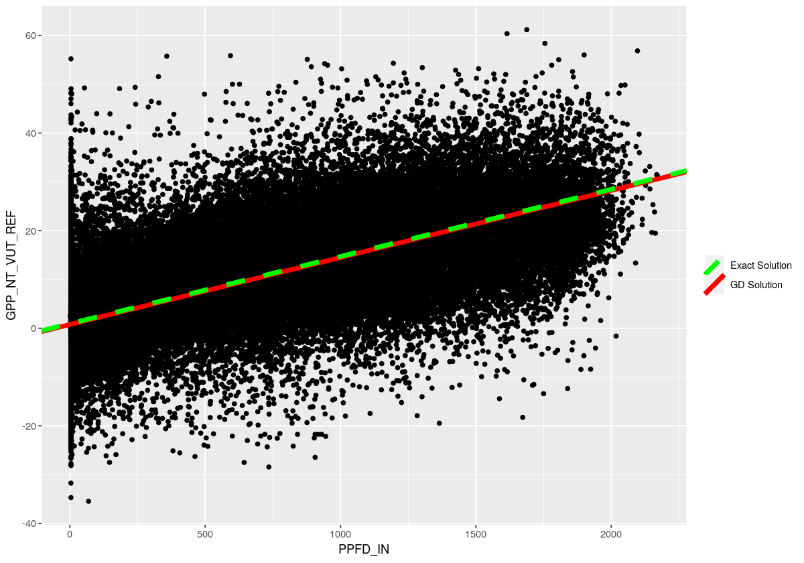
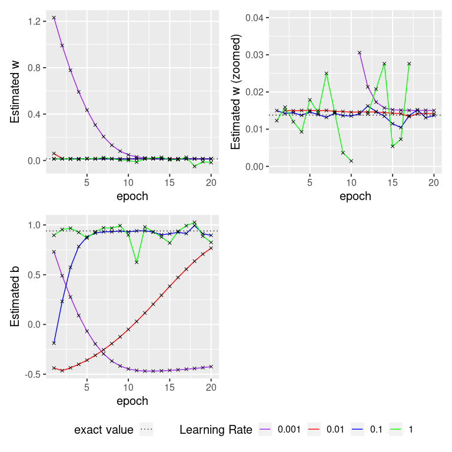

# Supervised Neural Networks II {#ch-09}

### Learning objectives
After this learning unit, you will be able to ...
* Practice some of the fundamentals of data cleaning.
* Prepare data for use in machine learning by shuffling and splitting the data into training and testing sets.
* Gain hands-on experience with a Keras, an important API for machine learning
* Apply gradient descent in the context of linear regression, specifically to learn w and b in the model y = wx + b.
* Observe how gradient descent (nearly) converges on the exact solution for y = wx + b
* Explore how a hyper-parameter (the learning rate) influences whether the model converges and if so, how quickly.
* Visualize the solution space for this problem to get an intuition for why gradient descent is so effective in finding the (nearly) optimal parameter combination.
* Apply logistic regression to a simple classification problem.
* Recall and apply measures of model performance and loss for classification, specifically accuracy and cross-entropy.

*Important points from the lecture*

* It is always worthwhile to perform an initial exploratory analysis of your data, e.g. to identify outliers, missing values, etc.
* To train a statistical model using machine learning, we split our data into training and testing sets. Sometimes we also include a validation set.
* Loss is a measure of how well our trained model predicts training labels. Loss is high when predictions are poor. Loss is low when predictions are good.
* There are several ways to measure loss. RMSE (Root Mean Squared Error) is one such measure. It is used in regression problems.
* Gradient descent is a method that searches for model parameters that minimize loss.
* Machine learning algorithms have hyper-parameters. These are parameters that are set by the user rather than learned during training. An example is the learning rate in gradient descent.
* Logistic regression is a classification technique.
* Logistic regression is similar in model structure to linear regression. It is different in that it can capture non-linearities in data. 
* As compared to regression problems, classification problems require different loss functions and measures of model performance. For example, loss can be measured using cross-entropy and model performance can be measured using accuracy.


### Import libraries
We first need to import some libraries. Most of these will be familiar from previous tutorials, with the exception of `keras`, which uses `TensorFlow` as a backend. For those who may be unfamiliar with the term *backend* this simply refers to a program's code or parts of a computer application that enable it to run but isn't accessed by the user and works in the background.

These packages will be explained in detail later.


```{r message=FALSE, warning=FALSE}
library(rjson)
library(tidyverse)
library(patchwork)
library(reticulate)
use_condaenv()
library(keras)
library(tensorflow)
library(IRdisplay)
# plot size 
options(repr.plot.width = 10, repr.plot.height = 7)
```

### Load your data
Load the hourly data from the eddy covariance flux towers. You'll be qite familiar with this by now. 

For this first example, we'll only load one feature (PPFD_IN - incoming photosynthetic photon flux density) and our dependent variable (GPP_NT_VUT_REF - gross primary production). 

Use the `head()` command to get an initial glimpse of the first few rows of data. Notice anything strange?

```{r}
#path to the file
file_path = "./data/SLNN_I/flx_ch-lae/data.rds"

#read data
df_data = readRDS(file_path)
head(df_data)
```

### Clean your data
Looks like the value of PPFD_IN has been set to -9999 in some examples. As you'll recall from previous tutorials, this is a flag to indicate missing data. Let's remove these examples and create a scatterplot of the remaining data.


```{r}
#Remove examples with PPFD_IN = -9999. They are missing values.
df_data_cleaned = df_data %>% na_if(-9999) %>% drop_na()

#Visualize the remaining data using a scatterplot
df_data_cleaned %>% 
    ggplot(aes( x = PPFD_IN, y = GPP_NT_VUT_REF))+
    geom_point()
```

### Prepare your data for learning
In previous lectures and tutorials, you've been taught the importance of splitting data into training and testing sets. Sometimes we produce a further split of the training data to include a validation set, although that won't be necessary for the purposes of this tutorial.

It is also important to shuffle your data. _Why?_ Imagine you have temporal data that is laid out in chronological order. If you do not shuffle your data, your training set may contain examples from Spring, Summer, and Fall, whereas your testing data will contain examples from Winter. If the phenomena of interest depends on the season, then the patterns you learn in the training data may not be applicable to the patterns inherent in the test data.

Let's first shuffle the data, seeding the random number generator for reproducible results:


```{r}
#We can set a seed for reproducible results.
set.seed(0) 

#Shuffle the data
shuffled_id = sample(x=1:nrow(df_data_cleaned),size = nrow(df_data_cleaned),replace = FALSE)
df_data_cleaned = df_data_cleaned[shuffled_id,]
```

Next let's split the data into training (80%) and test (20%) sets:


```{r}
#Make a breakpoint at 80%
breakpoint =as.integer(0.8 * nrow(df_data_cleaned))

#Use this breakpoint to delineate the training data from the test data
df_train = df_data_cleaned %>% slice(1:breakpoint)

#Past the breakpoint is the test data
df_test = df_data_cleaned %>% slice((breakpoint+1):nrow(df_data_cleaned))
```

## Build a Keras model for linear regression

[Keras](https://tensorflow.rstudio.com/guide/keras/) is a powerful API for machine learning. It provides a rich library of easy-to-use functions for building, training, and evaluating artificial neural networks. It interfaces with several backend machine learning libraries. Here we'll use it with the TensorFlow backend, which was developed by Google Brain for deep learning applications. 

A fundamental object in Keras is the "layer", which contains a number of computational units called _neurons_. The _neurons_ of each layer are connected to one another in sequence by directed edges, starting from the input layer, progressing through (possibly many) hidden layers, and ending in the output layer (see image below). 

Each layer except has its own bias term that is connected to all neurons in the successive layer. All edges have associated weights, which we learn during training.

```{r network, echo = F, fig.cap="Visualization of a neural network with four Layers and a multi-classification output. Figure from [Deep Learning with Python](https://www.manning.com/books/deep-learning-with-python)."}
knitr::include_graphics("./figures/Chollet_Fig1.5.jpg")
```

Below we define a function for building and training the simple model `y = wx + b` using gradient descent. While this task does not require a sophisticated artificial neural network, recall from lecture video 9B (nonlinear problems) that this task can be formulated using a network schematic, so the tools for training sophisticated artificial neural networks are also applicable in this simpler context. Thus, for this example, we only need a single layer of a single unit.

```{r network-ch, echo = F, fig.cap="Visualization of a neural network with one layer and one neuron. Figure from [Deep Learning with Python](https://www.manning.com/books/deep-learning-with-python)."}
knitr::include_graphics("./figures/network.png")
```
Notice the inputs to `build_and_train_model` function: 

The first two are for the training data. The variable _x\_train_ contains our independent variable `PPFD_IN` and _y\_train_ contains our dependent variable `GPP_NT_VUT_REF`. 

What about the other inputs?
* **learning_rate**: recall from lecture 6B (loss and its minimization) that the learning rate is a hyper-parameter for gradient descent. It controls the size of the steps we take in parameter space in the opposite direction of the gradient of the loss function. Remember, we are trying to _minimize_ loss.
* **num_epochs**: specifies the number of passes we'll make through the data during model training.
* **batch_size**: specifies the number of examples used to compute the gradient. The gradient will therefore be computed _len(x_train) / batch_size times per epoch_.
* **save_path**: is simply a file path for saving our results.

It is worthwhile to study the innerworkings of this function to get a feel for some of the basic functionality of Keras. This will become particularly valuable in later tutorials, which use Keras to train more sophisticated models.


```{r eval = F}
#Let's save our output in the current working directory
save_path_logs = './'

build_and_train_model = function(x_train,y_train,learning_rate,num_epochs,batch_size,save_path){
  
  #Most Keras models are so-called 'sequential' models
  model=keras_model_sequential()
  
  #Name the model
  model.name = 'linear_regression_'
  
  #Name the log file
  path=file.path(save_path,'logs')
  dir.create(path)
  fname=file.path(path,paste(model.name,'lr_',toString(learning_rate),'.json',sep=""))
  
  #The simple model y = wx + b requires only one layer of one unit.
  #The input shape is a scalar because we only have one independent variable x.
  #The linear activation function is the default setting for the function layer_dense.  
  #We will initialize the weights with a constant value in this tutorial, to facilitate
  #a fair comparison across different learning rates. However, in practice, you would
  #randomly initialize the weights.  
  model %>% layer_dense(units = 1, input_shape = 1,activation = 'linear',
                        kernel_initializer = initializer_constant(1.5),
                        bias_initializer = initializer_constant(1))  
  
  #Print the model description
  summary(model)
  
  #Specify the learning rate and learning algorithm for stochastic gradient descent
  opt=optimizer_adam(lr = learning_rate)
  
  #Compile the model, using mean squared error to define loss
  model %>% compile(loss = 'mse',optimizer = opt,metrics=list('mse'))
  
  #Create a callback function so we can monitor w and b during training, 
  #writing these data in json format, overwriting any existing file by
  #the same name. This is fairly advanced Keras functionality,
  #so if the code is over your head, don't worry about it.
  if (fname %in% list.files(path,full.names = TRUE)){file.remove(fname)}
  
  json_log=file(fname)
  json_logging_callback = callback_lambda(
    on_epoch_end = function(epoch, logs) {write(
      toJSON(data.frame(epoch=epoch+1,
                        loss=logs[['loss']],
                        w=get_weights(model)[[1]],
                        b=get_weights(model)[[2]])),
      file=fname,append = TRUE)},
    on_train_end = function(logs) {close(json_log)})
    
  #Fit the model y = Wx + b
  history = model %>% fit(x_train,y_train,
                        epochs=num_epochs,
                        batch_size=batch_size,
                        callbacks = json_logging_callback,
                        )
  
  #Extract W and b
  W = get_weights(model)[[1]]
  b = get_weights(model)[[2]]
  
  return (list(model=model,history=history,W,b))
  
  }
```

### A point of comparison: Exact solution of `y = wx + b`

The loss function for the linear regression is the Root Mean Squared Error, given by $L((w,b)) = \frac{1}{n}\sum_{i = 1}^{n} (wx_i + b-y_i)^2$ where $(x_i,y_i)$ are points of the training data. 

Our aim is to retrieve those _w_ and _b_, which minimize the loss function or equivalently to find the line which best fits our training data. In order to minimize this objective function with respect to _w_ and _b_ we need to solve the following system: 

\begin{align}
 \frac{\partial L}{\partial w} & = 0 \\
 \frac{\partial L}{\partial b} & = 0
\end{align}

which gives $\hat{w} = \frac{n \sum_{i = 1}^{n} x_iy_i -\sum_{i = 1}^{n}x_i\sum_{i = 1}^{n}y_i}{n\sum_{i = 1}^{n}x_i^2 - (\sum_{i = 1}^{n}x_i)^2}$ and $\hat{b} = \bar{y}-\hat{w} \bar{x}$. 

This is the so called **exact solution** for the linear regression problem where $\hat{w}$ and $\hat{b}$ denote the _slope_ and the _intercept_ of the line respectively.

As we have already seen in the previous lectures we can also use the `lm` function in order to fit our linear model. The `lm` function uses the exact solution to find the optimal w and b.


```{r}
lm_fit = lm(GPP_NT_VUT_REF ~ PPFD_IN, data = df_train)
summary(lm_fit)
```

In the output above, the intercept corresponds to _b_ and `PPFD_IN` corresponds to _w_.

### Motivation for gradient descent

Not all models have an exact solution. Consequently, we need another way to approximate a sufficient solution of the objective function for any model class. To this end, we use the so called "gradient descent", which you'll recall from lecture 6B (loss and its minimization) is the following algorithm:

* Initialize  $w_0,b_0$ 
* For _t=1,2,..._  repeat until convergence:
  \begin{align*}
    b_t &= b_{t-1}-\gamma \frac{\partial L}{\partial b}(w_{t-1},b_{t-1}) \\
    w_t &= w_{t-1} -\gamma \frac{\partial L}{\partial w}(w_{t-1},b_{t-1})
  \end{align*}

where $\gamma >0$ is the learning rate. 

The partial derivative $\frac{\partial L}{\partial b}(w_{t-1},b_{t-1})$ gives the gradient of the loss function with respect to $b$ at the point in parameter space ($w_{t-1},b_{t-1}$). 

Similarly, the partial derivative $\frac{\partial L}{\partial w}(w_{t-1},b_{t-1})$ gives the gradient of the loss function with respect to $w$ at the point in parameter space ($w_{t-1},b_{t-1}$).


*Checkpoint*
Can you apply the gradient descent algorithm in order to find the minimum of $f(x) = x^2 +1$? Use as starting point $x_0=10$, learning rate 0.01 and make 1000 iterations. Hint: Recall from Calculus I, that the derivative of $x^2$ is $2x$.

*Solution*
```{r}
### Solution

# derivative_f = 2*x
x0 = 10
learning_rate = 0.01
num_iterations = 1000 
x_new = x0

for (i in 1:num_iterations){
    x_new = x_new - learning_rate*2*x_new
}

cat('Gradient descent output: x =', round(x_new,5), "\n")

# The true minimum of the function is given at x = 0. 
# As we can see the gradient descent algorithm returns a value very close
# to zero after 1000 iterations 
```

## Fit the model using gradient descent

Let's use the function we wrote above, `build_and_train_model`, to apply gradient descent to the problem of solving `y = wx + b`, using a _learning rate_ of $0.01$. Note that we set the _batch_size_ to 512, which means that each step of the algorithm will use only 512 training examples, rather than the entire training set. We set the maximum number of _epochs_ to 20, which means that training will terminate after 20 full passes through the data. 

The algorithm will therefore make $\frac{len(training \ data)}{batch\_size}\times epochs$ steps in total, where each step corresponds to a calculation of the gradient and an update of the model parameters. 

```{r eval = F}
use_session_with_seed(0)

#Set the number of epochs to 20
num_epochs = 20

# Build and train a model
c(model,history,w,b) %<-%  build_and_train_model(
                            x_train = df_train$PPFD_IN,
                            y_train = df_train$GPP_NT_VUT_REF,
                            learning_rate = 0.01,
                            batch_size = 512,
                            num_epochs = num_epochs,
                            save_path = save_path_logs
                            )

cat('\nFinal solution: w =', w, ' b = ', b, "\n")
```

```{r eval = F}
## Model: "sequential"
## ________________________________________________________________________________
## Layer (type)                        Output Shape                    Param #     
## ================================================================================
## dense (Dense)                       (None, 1)                       2           
## ================================================================================
## Total params: 2
## Trainable params: 2
## Non-trainable params: 0
## ________________________________________________________________________________
## 
## Final solution: w = 0.01373669  b =  0.7571406 
```


Compare the solution found by gradient descent to the exact solution determined above. What do you observe?

Let's now save the model so we can retrieve it for a later use.

```{r eval = F}
# Create a file path for saving the model
file_folder = './saved_models'
dir.create(file_folder)
save_path = file.path(file_folder,'model_lr_0.01.h5')

# Save the model
save_model_hdf5(model, save_path)
```

### Gradient descent behind the scenes 

Let's build our intuition for how gradient descent works by visualizing the loss function versus the fitting line for each (w,b) pair derived from the gradient descent. This is an advantage of working with a two-parameter problem - we can actually visualize loss across the solution space. This is not easy to do with problems that have more parameters. In fact, it's typically impossible. For example, try to imagine what the surface of a loss function might look like for a four-parameter problem. Not easy right? Now consider that may problems have thousands of parameters - sometimes billions. Good luck wrapping your head around that!

Have a look at Figure \@ref(fig:gradient) - what we actually observe is the fitted line to the data (right plot) for each step of gradient descent (red point of left plot). As the gradient descent update step approaches the minimum of the loss function, the line fits the data better, i.e it minimizes $\sum_{i = 1}^{n} (\hat{y}_i-y_i)^2$. 

```{r gradient, echo = F, fig.cap="Animated gradient descent: __Left plot__: The gradient descent algorithm (red trace). __Right plot__: The fitting line for the respective step of gradient descent. Animation taken from [Miro](https://miro.medium.com/proxy/0*D7zG46WrdKx54pbU.gif)."}
knitr::include_graphics("./figures/09_gradient.gif")
```


We can also observe the convergence (gradient descent update causes tiny changes) of the algorithm by looking at either plot. 

Next let's visualize the best fit inferred by gradient descent, as compared to the exact solution, in the context of the data we're trying to fit.

```{r eval = F}
df_train %>%
    ggplot(aes(x = PPFD_IN, y = GPP_NT_VUT_REF))+
    #plot points
    geom_point()+
    # plot lines
    ##plot the best fit for learning rate = 0.01
    geom_abline(aes(intercept = b_est, slope = w_est ,color='GD Solution',linetype='GD Solution'),lwd =2) +
    ##plot exact line
    geom_abline(aes(intercept = coef(lm_fit)[1], slope = coef(lm_fit)[2],color='Exact Solution',linetype='Exact Solution'),lwd =2) +
    scale_colour_manual(values=c('GD Solution' = "red",'Exact Solution' = 'green'))+
    scale_linetype_manual(values=c('GD Solution' = 1,'Exact Solution' = 2))+
    labs(color  = "", linetype = "")
```



As we can see by the overlapping of the red and green lines, the gradient descent algorithm sufficiently approximates the exact solution. Although especially at the edges of the plot we can see that it is not a perfect match to the exact solution.

## Tune the learning rate
So far, we've only considered a single learning rate. Recall from lecture 6B (loss and its minimization) that this hyper-parameter has an important influence on the behavior of gradient descent, influencing its rate of convergence and whether it converges at all.

Let's tune the learning rate from 0.001 to 1 to see how this hyper-parameter influences model convergence. The code below calls the `build_and_train_model function` for four different learning rates.

```{r eval = F}
#Set the learning rates
learning_rates=c(0.001,0.01,0.1,1.0)

#Initialize some arrays to store our output
loss_all = c()
W_all = c()
b_all = c()

#Loop over the four learning rates
for (i in 1:length(learning_rates)){

  #Build and train a model using learning rate i  
  c(model,history,w,b) %<-%  build_and_train_model(
                              x_train = df_train$PPFD_IN,
                              y_train = df_train$GPP_NT_VUT_REF,
                              learning_rate = learning_rates[i] ,
                              batch_size = 512,
                              num_epochs = num_epochs,
                              save_path = save_path_logs
                              )
  
  #Store the loss and final solution for each learning rate
  loss_all=c(loss_all,list(history$metrics$loss))
  W_all=c(W_all,w)
  b_all=c(W_all,b)
  
}
```

```{r eval = F}
## Model: "sequential_1"
## ________________________________________________________________________________
## Layer (type)                        Output Shape                    Param #     
## ================================================================================
## dense_1 (Dense)                     (None, 1)                       2           
## ================================================================================
## Total params: 2
## Trainable params: 2
## Non-trainable params: 0
## ________________________________________________________________________________
## Model: "sequential_2"
## ________________________________________________________________________________
## Layer (type)                        Output Shape                    Param #     
## ================================================================================
## dense_2 (Dense)                     (None, 1)                       2           
## ================================================================================
## Total params: 2
## Trainable params: 2
## Non-trainable params: 0
## ________________________________________________________________________________
## Model: "sequential_3"
## ________________________________________________________________________________
## Layer (type)                        Output Shape                    Param #     
## ================================================================================
## dense_3 (Dense)                     (None, 1)                       2           
## ================================================================================
## Total params: 2
## Trainable params: 2
## Non-trainable params: 0
## ________________________________________________________________________________
## Model: "sequential_4"
## ________________________________________________________________________________
## Layer (type)                        Output Shape                    Param #     
## ================================================================================
## dense_4 (Dense)                     (None, 1)                       2           
## ================================================================================
## Total params: 2
## Trainable params: 2
## Non-trainable params: 0
## ________________________________________________________________________________
## 

```

Let's now plot the dynamics of learning, specifically how loss and the two model parameters change throughout training. Let's start with loss.

```{r eval = F}
#Set the symbol labels and colors for the four different learning rates
labels = c('0.001', '0.01', '0.1', '1')
colors = c("purple", "red", "blue","green")

#Create a data frame
df_loss = data.frame(epoch = rep(1:num_epochs,times=4), 
                     loss =c(loss_all[[1]],loss_all[[2]],loss_all[[3]],loss_all[[4]]),
                     group = as.factor(rep(1:4,each=num_epochs)))

#Plot loss for the four different learning rates
df_loss %>%
    ggplot(aes(x=epoch,y=loss,color = group))+
    geom_line()+
    geom_point(color = 'black',shape = 4)+
    scale_color_manual(labels=labels,values = colors)+
    labs(color= 'Learning Rate',y='Loss',title='Loss with different learning rates')+
    #log scale
    scale_y_continuous(trans='log')+
    theme_gray(base_size = 15)
```


What do you observe?

Using the learning rate 0.001, the algorithm slowly converges on a solution. Using the learning rates 0.01 and 0.1, we observe more rapid convergence. In stark contrast, using a learning rate of 1 causes divergence. Why is that?

To find out, let's have a look at the dynamics of our model parameters _w_ and _b_ during model training.


```{r eval = F}
#Get the list of file names
fnames = list.files(file.path(save_path_logs,'logs'),full.names = T)

#Allocate space for saving the model parameters
w = matrix(0,nrow = num_epochs, ncol=length(fnames))    
b = matrix(0,nrow = num_epochs, ncol=length(fnames))    

#Loop over the four learning rates
for (file_index in 1:length(fnames)){
  
  #read the file line by line
  file_lines=readLines(fnames[file_index])
    
  for (i in seq_along(file_lines)){
    #convert each line to json object
    row_file=fromJSON(file_lines[i])
    
    w[i,file_index]=row_file$w
    b[i,file_index]=row_file$b
  }
  
}

#plot w
df_w = data.frame(loss = c(w),group = as.factor(rep(1:4,each=num_epochs)),epoch = rep(1:20,times=4))

gg1 =df_w %>%
    ggplot(aes(x = epoch,y = loss,color = group ))+
    geom_line()+
    geom_point(shape=4,color = 'black')+
    geom_hline(aes(yintercept = 0.01378,linetype='lt'))+
    scale_color_manual(name = 'Learning Rate',values = colors,labels = labels)+
    scale_linetype_manual(labels ='',name='exact w',values = 3)+
    theme_gray(base_size = 15)+
    theme(legend.position="top",legend.direction = 'vertical')

#plot b
df_b = data.frame(loss = c(b),group = as.factor(rep(1:4,each=num_epochs)),epoch = rep(1:20,times=4))

gg2 = df_b %>%
    ggplot(aes(x = epoch,y = loss,color = group ))+
    geom_line()+
    geom_point(shape=4,color = 'black')+
    geom_hline(aes(yintercept = 0.93987,linetype='lt'))+
    scale_color_manual(name = 'Learning Rate',values = colors,labels = labels)+
    scale_linetype_manual(labels ='',name='exact b',values = 3)+
    theme_gray(base_size = 15)+
    theme(legend.position="top",legend.direction = 'vertical')

gg1+gg2
```




What do you observe?

Notice when the learning rate is 1, the value of _b_ (right figure) jumps above and below the optimal value, which we know from the exact solution to be ~0.94. Why does that happen?

When using the learning rates 0.01 and 0.1, the algorithm converges (or nearly so) on the optimal solution, but when using the learning rate 0.001, the algoritm is misled from the optimal value of _b_, although it looks like it might recover in later epochs. What is going on here? Could it be that this solution space contains local, deceptive optima? Might that explain what's happening with the lowest learning rate? What other explanations can you imagine?

To get a better understanding of what is happening here, let's visualize the surface of the loss function in relation to _w_ and _b_.


```{r eval = F}
#Define a function that calculates mean squared error, our loss function
MSE = function(observed,predicted) {
  val = mean((observed - predicted)^2)
  return (val)
}

#Get the observed PPFD_IN and GPP_NT_VUT_REF         
x_observed = df_train$PPFD_IN #PPFD_IN
y_observed = df_train$GPP_NT_VUT_REF #GPP_NT_VUT_REF

#Create 50x50 combinations of w and b
numpoints = 100
w = seq(-0.2, 0.2,length.out = numpoints)
b = seq(-2, 1, length.out = numpoints)

#Initialize space for our measure of loss across 
#the 50x50 combinations of w and b
loss = matrix(0,numpoints,numpoints)
for (i in 1:numpoints){
  for (j in 1:numpoints){
  
  #use y = wx + b to make prediction
  predicted = w[i]*x_observed + b[j]
  #calculate loss
  loss[i,j] = MSE(y_observed, predicted)
  }

}

#Visualize the surface
par(mfrow=c(1,1))
persp(w,b,loss,theta = 30, phi = 15,
      col = "deepskyblue1", shade = 0.5)
```


What features of this surface stand out to you?

Notice that it does not appear to have local optima. Notice also that the value of _w_ has a much stronger impact on loss than the value of _b_. To get a better sense of this, let's look at two slices of the data. 

First, look at loss as a function of _w_ for $b \approx 0.76$ . Second, look at loss as a function of _b_ for $w \approx 0.01$ . This pair of (_w_,_b_) are the weights found when training with a learning rate of 0.01.


```{r eval = F}
#Create data frames for w and b
df_w = data.frame(loss = loss[,92],w = w)
df_b = data.frame(loss = loss[55,],b = b)

# Load (w,b) found by model with lr = 0.01
model = load_model_hdf5("./data/SLNN_I/saved_models/model_lr_0.01.h5") 
w_est = as.numeric(get_weights(model)[1])
b_est = as.numeric(get_weights(model)[2])

#Plot loss as a function of w, when b = 0.76
gg1 = df_w %>%
        ggplot(aes(x=w,y=loss))+
        geom_point()+
        geom_vline(aes(xintercept = w_est,linetype = 'Infered w'),lwd=1,alpha = 0.6)+
        scale_linetype_manual(name='',values=2)+
        labs(title=paste("Loss for b = ",0.76,sep=" " ))+
        theme_gray(base_size = 20)+
        theme(legend.position="top")

#Plot loss as a function of b, when w = 0.01
gg2 = df_b %>%
        ggplot(aes(x=b,y=loss))+
        geom_point()+
        geom_vline(aes(xintercept = b_est,linetype = 'Inferred b'),lwd=1,alpha = 0.6)+
        scale_linetype_manual(name='',values=2)+
        labs(title=paste("Loss for w = ",0.01,sep=" "))+
        theme_gray(base_size = 20)+
        theme(legend.position="top")

gg1+gg2
```


Notice how little loss changes as a function of _b_, relative to _w_. Also notice that we can decrease loss further than what was found in our best model by decreasing b. Why didn't our model find this solution?

## Using our trained model to predict on held-out test data
Let's use our model to make predictions on our test data. First, let's calculate loss on our test data for a learning rate of 0.01.


```{r eval = F}
# Load model with lr = 0.01
model = load_model_hdf5("./data/SLNN_I/saved_models/model_lr_0.01.h5")

# Predict on test data
y_predicted =  model %>% predict(df_test$PPFD_IN)

# Compute loss on test data
y_observed = df_test$GPP_NT_VUT_REF
loss_test = MSE(y_observed, y_predicted)

# Print loss
cat('\nLoss on test data: ', loss_test, "\n")

```

```{r echo = F}
cat("Loss on test data: 34.42075 ")
```

How does this compare to the loss observed on the training data?
Next let's visualize the correlation between the predictions and observations for the test data and calculate its squared correlation. 

```{r eval = F}
# Calculate squared correlation
cor2=cor(df_test$GPP_NT_VUT_REF,y_predicted)^2

# Visualize observed vs. predicted GPP_NT_VUT_REF
df = data.frame(Observed = df_test$GPP_NT_VUT_REF, Predicted = y_predicted)
df %>% ggplot(aes(x = Observed,y = Predicted))+
       geom_point()+
       labs(title = bquote('Observed Vs Predicted' ~ cor^2 == .(round(cor2,2))))
```


Can you think of any problems with this approach?

Notice the difference in scale of the x- and y-axis. Despite the strong(ish) positive correlation, observe that our model never predicts negative values, even though they're present in the data. This highlights that the correlation between the observed and predicted values can be misleading, even though this correlation is often used as a measure of model performance. To hammer this point home, consider this simple example: Let the true data be 1,2,3,4 and the predicted data be 1001,1002,1003,1004. The correlation between them is 1, yet the error between the two sets of values is huge.

Another common approach for measuring model performance is via comparison to a less complex model. Let's compare our model to a null model that always predicts the mean of `y_train`.


```{r eval = F}
# Compare with a null model that always predicts the mean of y_train
null_model = mean(df_train$GPP_NT_VUT_REF)

# Train MSE
pred_train = model %>% predict(df_train$PPFD_IN)
mse_lm_train = MSE(df_train$GPP_NT_VUT_REF,pred_train)
mse_null_train = MSE(df_train$GPP_NT_VUT_REF,null_model)

# Test MSE  
mse_lm_test = MSE(df_test$GPP_NT_VUT_REF,y_predicted)
mse_null_test = MSE(df_test$GPP_NT_VUT_REF,null_model)

# Results 
results = data.frame(Model = c('Null',"Linear"), 
                     Train_MSE = c(mse_null_train,mse_lm_train), 
                     Test_MSE = c(mse_null_test,mse_lm_test))
results
```


What do you observe? How does the loss compare to that obtained during training? Is the linear model better than the null model?

## Logistic Regression

So far in this tutorial, we have studied gradient descent in the context of linear regression. Such a linear model is given by the following formula: $y = w_1x_1 +...+ w_nx_n + b$

where _y_ is measured on a continuous scale, $x_1$ through $x_n$ are the $n$ features of the data and $w_1$ through $w_n$ are the weights you're trying to learn.

Recall from lecture 9B (nonlinear problems), that by applying a sigmoid function to the right-hand side of the above equation, you transition from a linear regression to a logistic regression. Unlike for linear regressions, the outputs or predictions from a logistic regression are not continuous. Logistic regressions can be used to model targets that lie in the range [0,1], such as probabilities. It is also commonly used to model binary targets (e.g., this image does contain a cat (presence) vs. this image does not contain a cat (absence)).

Let's consider a hypothetical binary classification example. That is, assume $y$ either takes the value $0$ (no cat) or $1$ (cat). We are interested in modeling the relation between $P(Y=1|x)$ and $x = (x_1,x_2,...,x_n)$. The aforementioned relation can be defined as $P(Y=1|x) = \sigma(w_1x_1 +...+ w_nx_n + b)$, where $\sigma(t) = \frac{1}{1+e^{-t}}$. Figure \@ref(fig:log_fun) shows what such a logistic function looks like.

```{r log_fun, echo = F, fig.cap="Visualization of a logistic function."}
knitr::include_graphics("./figures/log_fun.jpg")
```

In a nutshell, logistic regression is just a linear model with the sigmoid activation function applied on the output, which converts the range to a probability. Any values of _t_ below 0 will result in a probability closer to 0 (e.g no cat), while any values of _t_ above 0 will result in a probability closer to 1 (e.g. presence of a cat).

### Prediction

The parameters of logistic regression can be estimated using gradient descent, just as we saw in this tutorial for linear regression, albeit with a different loss function. More on that below. 

Once the parameters have been estimated, the probability $\hat{p} = \sigma(w_1x_1 +...+ w_nx_n + b)$ that an example belongs to the positive class can be predicted as follows:

$$
\hat{y} = 
     \begin{cases}
      1, &\quad if \  \hat{p} \geq 0.5\\ 
      0, &\quad if \ \hat{p}< 0.5
     \end{cases}
$$

Here, we also have to highlight that:

- $\hat{p}\geq 0.5$ when $w_1x_1 +...+ w_nx_n + b \geq 0$
- $\hat{p}< 0.5$ when $w_1x_1 +...+ w_nx_n + b < 0$

The equation $w_1x_1 +...+ w_nx_n + b = 0$ is referred to as the _decision boundary_ (the vertical black line in the figure above where t=0 on the x-axis and crossing the dotted of 0.5 on the y-axis).

### Training and Loss Function

The objective of training is to find a set of weights $w_1...w_n$ and a bias $b$, such that the model estimates high probabilities for positive instances $(y = 1)$ and low probabilities for negative instances $(y=0)$. How well the model performs this task can be quantified using the following loss function, shown here for a single training example $\boldsymbol{x}=x_1...x_n$:

$$   
\mathrm{Loss}(\boldsymbol{(w,b)}) = 
     \begin{cases}
      -\log{\hat{p}}, &\quad \mathrm{if} \  y \ = \ 1 \\ 
      -\log({1-\hat{p}}), &\quad \mathrm{if} \ y \ = \ 0
     \end{cases}
$$

This function makes sense because $-\log(\hat{p})$ grows large when $\hat{p}$ approaches 0, so the loss will be large if the model estimates a probability close to 0 for a positive instance. Similarly, $-\log(1-\hat{p})$ grows large when $\hat{p}$ approaches 1, so the loss will be large if the model estimates a probability close to 1 for a negative instance.

The loss function can be applied to the entire training set by taking the average over all training examples. It can be written in a single expression:
$$
\mathrm{Loss}(\boldsymbol{(w,b)}) = -\frac{1}{n}\sum_{i=1}^{n} \left[ y_i\log(\hat{p}_i)+(1-y_i)\log(1-\hat{p}_i)\right]
$$

This loss function is called _binary cross-entropy_, as you'll recall from lectures 6B (and will see in 10B). Unfortunately, there is no a closed form solution for this loss function, so we have to use heuristics such as the gradient descent algorithm to minimize it.

### Measures of model performance for classification
In this tutorial, we introduce a common classification metric called _accuracy_, which we will revist in lecture 10B (model performance). The _accuracy_ of a model is defined as 
 
$$
\mathrm{Accuracy} = \frac{TP + TN}{n} 
$$
 
where _TP_ stands for 'True Positives' and _TN_ stands for 'True Negatives', respectively, and _n_ is the number of examples in the test set. Put simply: accuracy is the number of correct predictions divided by the total number of predictions. This measure ranges from 0 and 1, where 0 means our model never makes a correct prediction and 1 means it always makes correct predictions. This measure comes with caveats, especially for so-called class-imbalanced datasets, where the vast majority of examples have one label, whereas a small minority have another label. We'll revisit this limitation in lecture 10B and tutorial 10. For now, let's just ignore these caveats.

#### Example
For this example we use the R function `glm` in order to fit a logistic regression model. 

Let's first generate some synthetic data. For this example, our data will have only a single feature. The **instances** with label **0** will have their features drawn from a normal distribution with mean 2 and standard deviation 0.5. The **instances** with label **1** will have their features drawn from a normal distribution with mean 6 and standard deviation 1 (we also draw some instances with label 0 from this distribution so that our distributions are not totally separated). These distributions were chosen because they are clearly separable, yet have some overlap in their tails. Also the problem is not totally separable because of the noisy labels.


```{r}
#Seed the random number generator to ensure reproducibility
set.seed(101)

#We will have 150 examples with label 0 and 200 examples with label 1
n1 = 150
n2 = 200

#For examples with label 0, randomly generate features using a normal 
#distribution with mean 2 and standard deviation 0.5
x1 = rnorm(n1,2,0.5)

#For examples with label 1, randomly generate features using a normal 
#distribution with mean 6 and standard deviation 1
x2 = rnorm(n2,6,1)

#Concatenate the features for all examples
x = c(x1,x2)

#Associate labels with examples
y1 = rep(0,n1)
y2 = sample(x = c(0,1),size = n2 , prob = c(0.1,0.9),replace = T) # we include some noisy data here

#Concatenate the labels for all examples
y = c(y1,y2)

#Print statistics describing the number of examples with each label
cat("Proportion of examples with label 0: ",100 * mean(y==0),"%\n")
cat("Proportion of examples with label 1: ",100 * mean(y==1),"%\n")
```

Now let 's plot the data.


```{r}
#create dataframe
df_data = data.frame(x = x , y = y)

#plot
df_data %>%
    ggplot(aes(x = x , y = y , color = as.factor(y)))+
    geom_point()+
    scale_color_manual(name = 'Label',values = c('0' = 'red','1' = 'blue'))+
    ylab("P(positive)")+
    theme_grey(base_size = 15)
```

Prepare the data for training and testing, by shuffling and using an 80/20 split, as before.


```{r}
#We can set a seed for reproducible results.
set.seed(101) 

#Shuffle the data
shuffled_id = sample(x=1:nrow(df_data),size = nrow(df_data),replace = FALSE)
df_data = df_data[shuffled_id,]

#Make a breakpoint
breakpoint = as.integer(0.8 * nrow(df_data))

#Training data
df_train = df_data %>% slice(1:breakpoint)

#Testing data
df_test = df_data %>% slice((breakpoint+1):nrow(df_data))
```

A more appropriate way to split the data would be to use the `r-sample` package and select stratified samples according to the labels. The reason is that we want each label to be represented in a proprotion of 80% and 20% to each of training and testing set respectively. Especially for imbalanced data we want to ensure that both labels are represented to the specified proportion on training and testing sets. In essence, what we would like to avoid is to have an over represantation of one label into the training set and an under represantaion on testing data. More on this in tutorial 10.

Use the `glm` function to fit a logistic regression model to the training data. For a logisitic regression model the appropriate `family = binomial`


```{r}
lg_fit = glm(y ~ x , family = 'binomial',data = df_train)
summary(lg_fit)
```

Note that the decision boundary is $-7.1477 + 1.6944  x = 0$. 

This means examples with $x \geq 4.22$ are predicted to have a label of `1` (i.e., they belong to the 'positive class'), whereas examples with $x < 4.22$ are predicted to have a label of `0` (i.e., they belong to the 'negative class'). 

Let's plot the learned sigmoid function as well as the decision boundary.


```{r}
#create a grid of values ranging from 0 to 10
grid = seq(from = 0 ,to = 10,length.out = 1000)
df = data.frame(x = grid)
#take predictions --> it is probability of an instance to belong to the positive class 
pred = predict(lg_fit,newdata = df , type = 'response')
df_pred = data.frame(grid = grid,pred = pred)

df_train %>%
    ggplot(aes(x = x,y = y , color = as.factor(y)))+
    geom_point()+
    geom_line(data = df_pred, aes(x = grid,y = pred,linetype = 'Sigmoid'),color = 'black')+
    geom_vline(xintercept = 4.22, lty = 2)+
    annotate('text',x = 3.3 ,y = 0.5,label = 'Decision Boundary \n x >= 4.22 \n predict 1')+
    scale_color_manual(name = 'Class',values = c('0' = 'red','1' = 'blue'))+
    scale_linetype_manual(name = 'Sigmoid Activation',values = 1,labels = 'P(positve) >= 0.5 \n predict 1 ')+ 
    ylab("P(positive)")+
    theme_grey(base_size = 15)
```

It seems the trained model does a good job at predicting which examples should be associated with which labels, although some examples are clearly misclassified. How else might we quantify model performance here? Remember the accuracy metric we introduced? Let's apply it to our model.


```{r}
#take probabilites
pred_test = predict(lg_fit,newdata = df_test , type = 'response')

#make decisions
pred_y = (pred_test >= 0.5)*1

#calculate accuracy
acc = mean(pred_y == df_test$y)
cat("Test Accuracy: ",acc,'\n')
```

Wow, an accuracy of 90%. Sounds good right!? In this case it actually is, but we'll see in the next tutorial where this metric breaks down.

## Exercise: Hands on Logistic Regression

IMPORTANT NOTE: You have to solve the exercise using the keras library.

Questions:
 
 1. Read in the data, tokenize the iris type (so that the output is a number) into a new column with name "y". Namely, "virginica" --> 1, "not_virginica" --> 0 
 2. Shuffle your data and create a train and test set with proportions 80% and 20% of the given data respectively.
 3. Plot the training data and give a different color for each type.
 4. Create a Logistic Regression Model
 5. Plot the training data as in question 3 and also include the derived decision boundary (and Sigmoid output for configuration a)
 from the fitted model.
 6. Evaluate the accuracy of the model in the test set.
 7. Plot the testing data (use different colors for each Type), include the decision boundary from the fitted model and also use different point type for the misclassified predictions (if any).

You have to solve questions 3-7 with 2 different configurations.

 a. Using only the Petal Width as predictor
 b. Using both Petal Length and Petal Width as predictors

A skeleton code is provided below:

#### Import required libraries
```{r eval = F}
library(tidyverse)
library(reticulate)
use_condaenv()
library(keras)
library(tensorflow)
```

IMPORTANT NOTE: READ CAREFULLY!
Do not skip this part or you'll run into issues later on!
In a moment, after you've read the following instructions carefully, you should:
- run the code chunk immediately below this text (`use_session_with_seed(0)`). 
- look down in the *Console* it asks if you want to install some packages: ("Would you like to install Miniconda? [Y/n]:"). 
- write _n_ and press enter. You should see the following code in the console: `Would you like to install Miniconda? [Y/n]: n`. 
Now, you can normally continue with the exercise.

If you were too eager and already pressed _Y_ (yes) and enter, don't panic! Just close your environment, re-open it and make sure that next time you go with _n_ (no).

```{r eval = F}
use_session_with_seed(0)
```

#### Read Data
```{r}
data = read.csv('./data/SLNN_I/exercise/data_iris.csv')
head(data)
```

#### Tokenize Type
```{r eval = F}
#create a new column with name y where y=1 defines virginica while y=0 defines not_virginica

#YOUR SOLUTION HERE 
#HINT: Use the ifelse function
data$y = 
head(data)
```

```{r eval = F}
#YOUR SOLUTION HERE -> shuffle the data and make the train,test split
#shuffle data
set.seed(42)
shuffle = 
data = 
head(data)

#split data
breakpoint = 

#Create train and test set  
df_train = 
df_test = 

#create input and output
 
x_train = df_train[,c('Petal_Length', 'Petal_Width')]
y_train= df_train$y
 
x_test = df_test[,c('Petal_Length', 'Petal_Width')]   
y_test = df_test$y
 
```

#### Configuration a

##### Plot the training data

```{r eval = F}
#YOUR SOLUTION HERE: use only the Petal Width as input


```

##### Create the model

```{r eval = F}
#YOUR SOLUTION HERE
#fill in what is missing
# you have to use the right activation and loss function for logistic regression

 use_session_with_seed(42) 
 model_a = keras_model_sequential()
 
 model_a %>% layer_dense(units = 1,activation = ) 
 
 opt = optimizer_adam(lr=0.1)
 
 model_a %>% compile(loss = ,optimizer = opt, metrics = 'accuracy')
 
 model_a %>% fit(x= x_train$Petal_Width,y=y_train,epochs=20,batch_size=32)
 
 w_a = unlist(get_weights(model_a))
```

##### Plot the decision boundary

```{r eval = F}
#Your solution
```

##### Evaluate the accuracy of the model in the test set

```{r eval = F}
#YOUR SOLUTION HERE
#fill in what is missing

# take probabilities
p_nn = predict(model_a,x_test$Petal_Width)

#make decisions
pred = 

# accuracy

accuracy = 

cat("Test Accuracy: ",round(accuracy,3),'/n')

```


##### Plot misclassified predictions in the test data

```{r eval = F}
#YOUR SOLUTION
# HINT: create a new column in the df_test which indicates those points that are misclassified
```

#### Configuration b

##### Plot the training data

```{r eval = F}
#YOUR SOLUTION HERE: use both the Petal Length and Petal Width as inputs
#HINT your x=Petal_Length,y=Petal_Width


```

##### Create the model

```{r eval = F}
#YOUR SOLUTION HERE
#fill in what is missing
# you have to use the right activation and loss function for logistic regression

 
use_session_with_seed(42) 
 
model_b = keras_model_sequential()
 
model_b %>% layer_dense(units = 1,activation = ) 
 
opt = optimizer_adam(lr=0.1)
 
model_b %>% compile(loss = ,optimizer = opt, metrics = 'accuracy')
 
model_b %>% fit(x=as.matrix(x_train),y=y_train,epochs=30,batch_size=32)
 
w_b = unlist(get_weights(model_b)) 
```

##### Plot the decision boundary

```{r eval = F}
#Your solution
#HINT: Your desicion boundary now is a line
```

##### Evaluate the accuracy of the model in the test set

```{r eval = F}
#YOUR SOLUTION HERE
#fill in what is missing


# take probabilities
p_nn = predict(model_b,as.matrix(x_test))

#make decisions
pred = 

# accuracy

accuracy = 

cat("Test Accuracy: ",round(accuracy,3),'\n')

```


##### Plot misclassified predictions in the test data

```{r eval = F}
#YOUR SOLUTION
# HINT: create a new column in the df_test which indicates those points that are misclassified
```