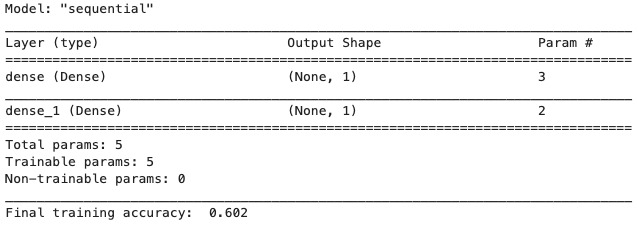
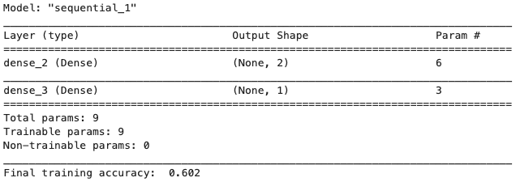
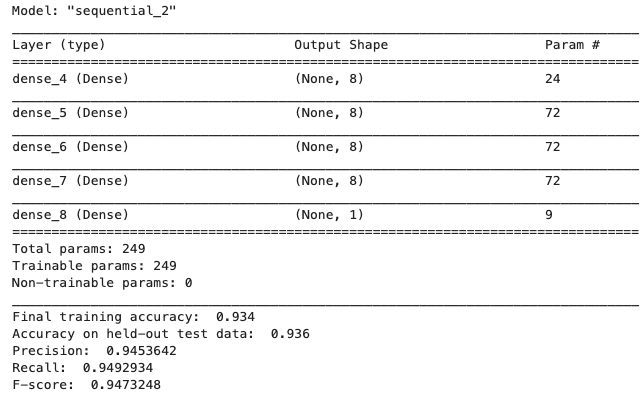
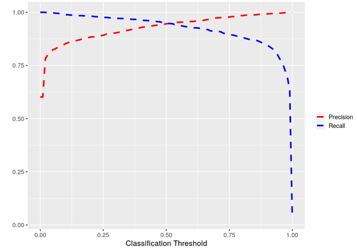
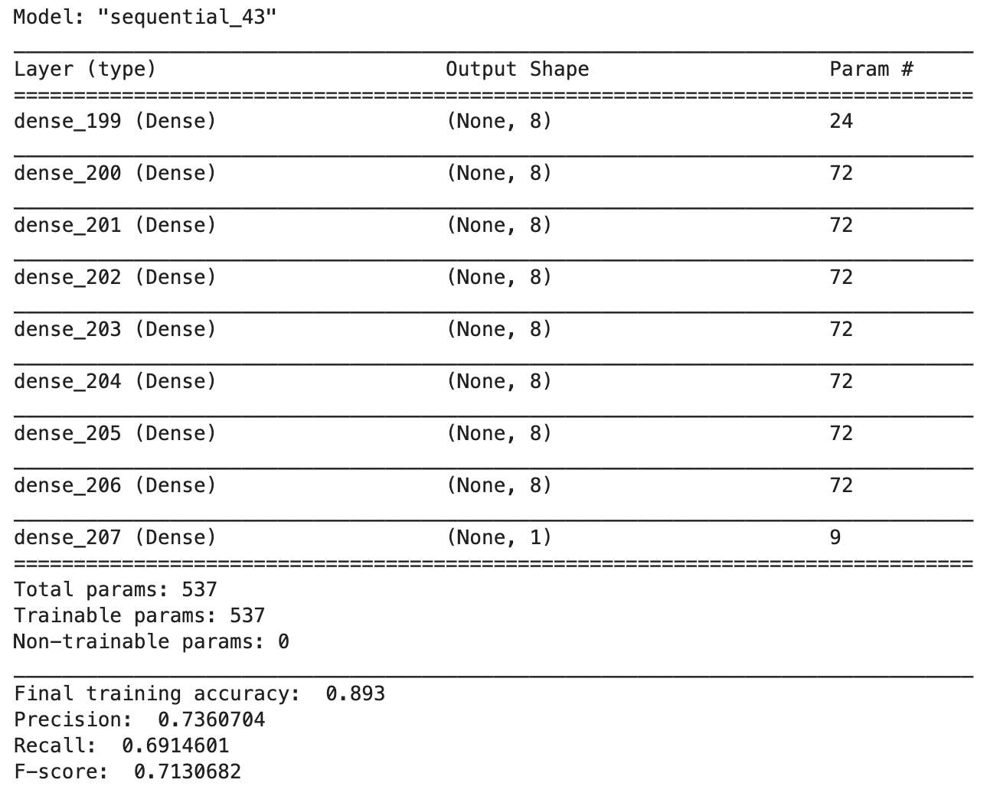
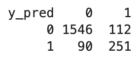

# Supervised Learning Neural Networks: Theory

### Learning objectives
- Build and train neural networks for binary classification
- Observe the influence of network architecture on model performance
- Assess model performance using the following metrics 
    - Accuracy
    - Precision 
    - Recall 
    - F-Score
    - Receiver operating characteristic (ROC) curves
    - Area under the ROC curve 
- Account for the stochasticity of model training when assessing model performance


**Important points from the lecture**

- For binary classification problems, the output node often uses a *sigmoid activation function*.
- A *classification threshold* is applied to the output of the sigmoid activation function to determine which label is predicted.
- *Accuracy* is a popular measure of model performance, but it is not useful for class-imbalanced data.
- The area under the *ROC curve * is a measure of model performance that considers the full range of possible classification thresholds.
- Like accuracy, the area under the ROC curve can also be misleading in datasets with strong class imbalance 
- Regression and classification problems require different measures of model performance.


#### Import libraries
We first need to import some libraries. You have seen all of these in previous tutorials. Keras will play an especially prominent role in this tutorial.


```{r message=FALSE, warning=FALSE}
library(tidyverse)
library(rsample)
library(reticulate)
use_condaenv()
library(keras)
library(pROC)
# plot size 
options(repr.plot.width = 10, repr.plot.height = 7)
```

#### Construct a toy dataset
For this exercise we will create a toy dataset that illusrates some of the vagaries (unexpected changes that cannot be controlled but can influence a situation) of classification, as well as some of the pros and cons of model performance measures. 

In this toy dataset, each example has two real-valued features on the unit interval (i.e., these values are between 0 and 1). Each example has one of two labels, $\color{green}{\text{green}}$ or $\color{blue}{\text{blue}}$. The dataset is constructed such that those examples _within_ a specified radius of the point (0.5, 0.5) are assigned a $\color{green}{\text{green}}$ label and those _outside_ this radius are assigned a $\color{blue}{\text{blue}}$ label.

```{r}
# Seed the random number generator for reproducible results
set.seed(41)

#  Number of examples
N <- 10000 

#  Square radius  of inner circle
radius_2 <- 0.125 

#  Noise applied to the boundary separating green and blue examples
noise <- 0.025 

#  Place N points on the unit square. 
#  Label those within some radius 0, and those outside 1.
x1 <- runif(n = N, min = 0, max = 1) 
x2 <- runif(n = N, min = 0, max = 1) 
y  <- ((x1-0.5)**2 + (x2-0.5)**2) + rnorm(n = N,mean = 0, sd = noise) > radius_2

#  Create a data frame
df_data <- data.frame(x1 = x1, x2 = x2, y = y*1)

#  Split the data into training (80%) and test (20%) sets
#  Make a breakpoint at 80%
breakpoint <- as.integer(0.8 * nrow(df_data))

#  training data
df_train <- df_data[1:breakpoint,]

#  testing data
df_test <- df_data[(breakpoint + 1):nrow(df_data),]
```

Let's visualize our data to get a feel for the classification task at hand. Let's also visualize the true decision boundary used to delineate the $\color{green}{\text{green}}$ from the $\color{blue}{\text{blue}}$ labels, and print the number of examples per label. 

_Notice_ that there are more examples labeled $\color{blue}{\text{blue}}$ than there are examples labeled $\color{green}{\text{green}}$. 

This means the data are **class imbalanced** (but not heavily).


```{r}
# visualize our data
df_data %>% 
  
    ggplot(aes(x = x1 , y = x2, color  =  as.factor(y))) +
  
    geom_point() +
  
    geom_path(aes(x =  0.5 + sqrt(radius_2) * cos(seq(0, 2 * pi, length.out =  N)),
                  y =  0.5 + sqrt(radius_2) * sin(seq(0, 2 * pi, length.out =  N)),
                  linetype = ' True \n Decision \n Boundary'),
                  color = 'black',
                  size = 3) +
  
    scale_color_manual(name = 'Class', 
                       values = c('0' = "green", '1' = 'blue')) +
  
    labs(linetype = '') +
  
    theme_grey(base_size = 15)


# print some summary statistics about these data
cat('Proportion of data in class blue: ' , sum(df_data$y) / length(df_data$y), '\n')
cat('Proportion of data in class green: ' , 1 - sum(df_data$y) / length(df_data$y), '\n')
```

A more appropriate way to split the data into training and test sets is to take care such that each label is represented to its proportion in both sets (_stratified splitting_). To this end, we use the `rsample` package and we choose `strata = y`. That is crucial especially for heavily class imbalanced data sets. In essence, what we want to avoid is to have an over representantion of one class in the training data set and an under representation of this class in the the test data set.


```{r}
# split with r sample and strata = y
split <- initial_split(df_data, prop = 0.8, strata = 'y')

#train set
df_train <- training(split)

#test set
df_test <- testing(split)

#print statistics for each set

## training set

cat("Training set \n")
cat('Proportion of data in class blue: ' , sum(df_train$y) / length(df_train$y), '\n')
cat('Proportion of data in class green: ' , 1 - sum(df_train$y) / length(df_train$y), '\n')

##test set

cat("\nTest set \n")
cat('Proportion of data in class blue: ' , sum(df_test$y) / length(df_test$y), '\n')
cat('Proportion of data in class green: ' , 1 - sum(df_test$y) / length(df_test$y), '\n')

```

As it is obvious now, each label is represented to its initial proportion in training and test set.

## Build and train a neural network for classification

As you saw in your previous tutorial, Keras is a powerful API for building, training, and evaluating artificial neural networks. In that lecture, you used Keras to construct, train, and analyze extremely simple neural networks, comprising just a single layer of a single node. 

Here we'll build and consider more complex network architectures. To do so, we'll generalize the `build_and_train_model` function from our previous tutorial. Specifically, we'll change the function such that it builds and trains a network with an arbitrary number of layers and nodes per layer, such that the number of nodes per layer is the same for all layers, except the output layer, which will contain just a single node with a sigmoid activation function.


*Neural Networks: A closer look*

Before we procceed further let's have a closer look on neural networks and what keras hides from the user. To this end, we will manually create a neural network with 1 hidden layer with 5 units and an output layer (with 1 unit).

Let 's assume that we have d features (x) and therefore $W_1$(weights) is a matrix with dimension $d\times 5$ and $b_1$ has a dimension $5\times 1$(biases). Then the output of the 1st hidden layer is

$$1st\_hidden = xW_1 + b_1$$
    
The dimension of the $1st\_hidden$ is 5 (equals the number of units or more intuitively 5 different linear models output). On top of this we apply an activation function such as relu,sigmoid etc.

So,

$$1st\_hidden\_out = activation(1st\_hidden)$$

    
For the ouput layer we just take the values of 1st\_hidden\_out (now those are our new 'features') and we apply a matrix multiplication as we did with our features. 

$$ output\_layer = 1st\_hidden\_out W_2 + b_2$$ 
    
where $W_2$ has dimension $5\times 1$(equals the dimension of the previous layer output) and b_2 a dimension of 1 . Therefore

$$ y = activation(output\_layer)$$
    
where the output activation for a binary classification problem is the sigmoid.

In total, $$y = activation(activation(xW_1 + b_1)*W_2 +b_2)$$

As it is obvious a neural network is a collection of connected linear models with an activation function on top of each. We can stack several hidden layers (each of those has its own number of units) following the same procedure as above.


```{r}
# Learning rate
lr <- 0.01

# Number of epochs
ne <- 100

# Batch size
bs <-  512

build_and_train_model <- function (data = df_train,
                                  learning_rate = lr, 
                                  num_epochs = ne, 
                                  batch_size = bs, 
                                  num_layers, 
                                  num_units_per_layer,
                                  print_model_summary = F
                                 ){
    
    # Most models are so-called 'sequential' models
    model <- keras_model_sequential()
    
    # Keras makes building neural networks as simple as adding layer upon layer with simple sequential 
    # calls to the function "layer_dense". Take a moment to appreciate how easy that makes things.
    
    # The input layer is the only layer that requires the user to specify its shape. The shape of all
    # subsequent layers is automatically determined based on the output of the preceding layer. Let's
    # use a ReLU activation function in each node in the input and hidden layers.
    model <- model %>% layer_dense(units = num_units_per_layer, 
                                   input_shape = (ncol(data) - 1), 
                                   activation = "relu")
    
    # Add the hidden layers. Note this requires just a simple for loop that calls the function "layer_dense"
    # again and again.
    if (num_layers>1){
        for (i in 1:(num_layers-1)){
            model <- model %>% layer_dense(units = num_units_per_layer, 
                                           activation = "relu")
        }
    }
    
    # Add the output layer. Note that it uses a sigmoid activation function. Make sure you know why.
    model <- model %>% layer_dense(units = 1, activation = "sigmoid")    
    
    # Print the model description
    if (print_model_summary){
    
        summary(model)        
    }
         
    #  Specify the learning rate for stochastic gradient descent
    opt <- optimizer_adam(lr = learning_rate)

    # Compile the model, using binary cross-entropy to define loss. Measure accuracy during training.
    # Note how easy Keras makes this. Did you have to write any functions for loss or for measuring model
    # performance during training? No, Keras takes care of all of this for you.
    model %>% compile(optimizer = opt, 
                      loss ='binary_crossentropy', 
                      metrics = list('accuracy'))         

    # Fit the model
    history <- model %>% fit(x = as.matrix(data[, c('x1', 'x2')]),
                            y = data$y,
                            epochs = num_epochs,
                            batch_size = batch_size,
                            )

    # Return the model and the training history
    return(list(model = model, history = history))                                      
}
```

**Checkpoint**

Why does the output layer use a sigmoid activation function rather than a linear activation function? Can you think of a case where you'd want the output layer to use a linear activation function?

**Solution**

For a continuous response y then the output activation should be linear. 

Can we train an accurate classifier with just a single layer of a single node? 

Let's try. And let's assess model performance using a metric called **Accuracy**. This is simply the number of correct predictions divided by the number of predictions. 

In the context of this toy dataset, it's the number of examples predicted to be blue that actually are blue plus the number of examples predicted to be green that actually are green, divided by the number of predictions.


```{eval = F}
c(model, history) %<-% build_and_train_model(data = df_train,
                                            learning_rate = 0.01,
                                            batch_size = 512,
                                            num_epochs = 100,
                                            num_layers = 1,
                                            num_units_per_layer =  1,
                                            print_model_summary = T)

cat('Final training accuracy: ', round(history$metrics$acc[ne], 3), '\n')
```

```{r eval = F}
##    Model: "sequential"
##    ________________________________________________________________________________
##    Layer (type)                        Output Shape                    Param #     
##    ================================================================================
##    dense (Dense)                       (None, 1)                       3           
##    ________________________________________________________________________________
##    dense_1 (Dense)                     (None, 1)                       2           
##    ================================================================================
##    Total params: 5
##    Trainable params: 5
##    Non-trainable params: 0
##    ________________________________________________________________________________
##    Final training accuracy:  0.602 
```



Note the final training accuracy. 

Let's have a look at how accuracy and loss change during model training.


```{r eval = F}
plot(history)
```


Observe how quickly accuracy converges to the final value. And note the final value - wow, we're doing better than a coin flip (a coin flip choice would have an accuracy of 0.5) during training, using just a single layer of a single node! How is this possible? Take a moment to think about how this might be happening. Think about what you already know about these data (What is the percentage of each class? Is it possible a classifier that only predicts the largest class to seems better than a coin flip?).

To see if you're intuition is correct, let's plot our model predictions on the test data. Note that in making these predictions, we need to choose a classification threshold. The reason is that the output layer yields a real value between 0 and 1, which needs to be discretized for the purpose of binary classification. For now, let's just set this threshold at 0.5. We'll see how changing the threshold impacts model performance later.


```{r eval = F}
# Predict on test data. Note how easy this is to do in Keras.
pred <- predict(model, as.matrix(df_test[, c('x1', 'x2')]))

# Set the classification threshold to 0.5
threshold <- 0.5

# Make label predictions based on the classification threshold
y_pred <- (pred >= threshold) * 1

# Plot the predictions
df_test %>%
    ggplot(aes(x = x1, y = x2)) +
    geom_point(color = ifelse(y_pred == 1, 'blue', 'green'))

# Evaluate and print model performance on test data
c(loss, acc) %<-% evaluate(model, as.matrix(df_test[,c('x1', 'x2')]), df_test$y)

cat('Accuracy on held-out test data: ' , round(acc, 3), '\n')
```

```{r echo = F}
cat("Accuracy on held-out test data:  0.602")
```


Aha, the model is always predicting blue! Why is this simple trick effective? It's because the data are class imbalanced, meaning that one class is more prevalent than the other in our dataset. Specifically, there are more blue examples than green examples. So by simply using the rule "$\color{blue}{\text{always blue}}$", we can obtain an accuracy that's better than a coin toss. 

This shows that _accuracy_ has its limitations as a model performance metric and reveals the need for more nuanced metrics, such as the following:

* `True positives`: The number of positive examples predicted to be positive **(+ / +)**
* `True negatives`: The number of negative examples predicted to be negative **(- / -)**
* `False positives`: The number of negative examples predicted to be positive **(+ / -)**
* `False negatives`: The number of positive examples predicted to be negative **(- / +)**

These metrics can be summarized in the so-called **_confusion matrix_**.


In this toy dataset, we'll call the $\color{blue}{\text{blue}}$ examples $\color{blue}{\text{'positive'}}$ and the $\color{green}{\text{green}}$ examples $\color{green}{\text{'negative'}}$. This terminology makes more sense in more realistic classification problems, such as delineating spam email from non-spam.

### Evaluate model performance
Let's write a function that calculates the building blocks of the confusion matrix.


```{r}
confusion <- function(y_true, pred_out, threshold = 0.5, verbose = T){
  
  true_positives  = sum((pred_out >= threshold) & (y_true == 1))
  true_negatives  = sum((pred_out < threshold)  & (y_true == 0))
  false_positives = sum((pred_out >= threshold) & (y_true == 0))
  false_negatives = sum((pred_out < threshold)  & (y_true == 1))
  
  if (verbose) {
    cat('true positives: ',  true_positives,  '\n')
    cat('true negatives: ',  true_negatives,  '\n')
    cat('false positives: ', false_positives, '\n')
    cat('false negatives: ', false_negatives, '\n')
  }
  return (list(tp = true_positives, tn = true_negatives, fp = false_positives, fn = false_negatives))
}
```

Note that we can also define _accuracy_ in terms of true/false positives/negatives

* Accuracy: $ \frac{\mbox{TP} + \mbox{TN}}{\mbox{TP + TN + FP + FN}}$

where `TP + FN` is the number of _positive cases (P)_ while `TN + FP` is the number of _negative cases (N)_.

Let's apply this function to our model predictions.


```{r eval = F}
c(true_positives, true_negatives, false_positives, false_negatives) %<-% confusion(df_test$y,  pred, threshold)
```

```{r echo = F}
cat('true positives: 1203 \n')
cat('true negatives: 0 \n')
cat('false positives: 796 \n')
cat('false negatives: 0 \n')
```

This reveals a more nuanced picture of model performance. Sure, accuracy is better than a coin toss, but we now see that we do not correctly predict _a single negative example_. 

These four metrics are the basis for two additional, commonly used performance metrics:

This reveals a more nuanced picture of model performance. Sure, accuracy is better than a coin toss, but we now see that we do not correctly predict _a single negative example_. 

These four metrics are the basis for two additional, commonly used performance metrics:

- **precision**: $\frac{\mbox{TP}}{\mbox{TP + FP}}$
- **recall**: $\frac{\mbox{TP}}{\mbox{TP + FN}} = \frac{\mbox{TP}}{\mbox{P}}$


**_Precision_** tells us the proportion of positive predictions that were actually correct, whereas **_Recall_** tells us the proportion of positive examples that were correctly predicted to be positive. 

Let's define a function that calculates precision and recall.


```{r}
precision_and_recall <- function(true_positives, true_negatives,false_positives, false_negatives, verbose=T){
  
  # Protect against division by zero
  if ((true_positives + false_positives) > 0){
    precision = true_positives / (true_positives + false_positives)
  }
  else{
    precision = 1
  }
  
  if ((true_positives + false_negatives) > 0){    
    recall = true_positives / (true_positives + false_negatives)
  }
  else{
      recall = 0
  }
  
  if (verbose){
    cat("Precision: ", precision, "\n")
    cat("Recall: ", recall, "\n")
  }
  
  return (list(precision = precision, recall = recall))
}
```

Let's apply this function to our model predictions.


```{r eval = F}
c(precision, recall) %<-% precision_and_recall(true_positives, 
                                               true_negatives, 
                                               false_positives, 
                                               false_negatives)
```

```{r echo = F}
cat("Precision: 0.6018009 \n")
cat("Recall: 1 \n")
```


Now we see that the model $\color{blue}{\text{always blue}}$ does a great job at correctly predicting positive examples (_'recall'_), but many of its positive predictions are incorrect (_'precision'_).

Wouldn't it be nice if we could combine _precision_ and _recall_ into a single metric? 
Ideally, this metric would take on a high value when both _precision_ and _recall_ are large and a low value when either _precision_ or _recall_ is small.

The **F-score** does exactly that:

* `F-score` : $2 \cdot \frac{\mbox{precision $\cdot$ recall}}{\mbox{precision + recall}}$

The _F-score_ takes values on the interval [0,1]. An F-score of 1 indicates that both precision and recall are 1 and an F-score of 0 corresponds to a value of 0 for either precision or recall.

So now let's also define a function for the F-score and apply it to the previous example.


```{r eval = F}
f_score <- function(precision, recall, verbose = T){
    
    #Calculate F
    f = 2 * precision * recall / (precision + recall)
    
    # If the user has requested verbose output, provide it
    if(verbose){
        cat("F-score: ", f)
    }
    
    # Return F
    return(f)
}

f <- f_score(precision, recall)
```

```{r echo = F}
cat("F-score: 0.7514054")
```
## Evaluate the influence of network architecture on model performance

Might more complex network architectures allow us to make better predictions? 

Let's try a single layer of two nodes.


```{r eval = F}
c(model, history) %<-% build_and_train_model(num_layers = 1, 
                                             num_units_per_layer =  2, 
                                             print_model_summary = T)

cat('Final training accuracy: ', round(history$metrics$acc[ne], 3), '\n')
```



Do you observe an improvement in training accuracy? 

If not, keep trying until you do. This may take several attempts. _Note_ the reason you can obtain different results each time you train your model is that training is stochastic, meaning that certain steps, such as the initialization of the edge weights, depend on the generation of random numbers. Each time you construct and train a model, new random numbers are generated, and this makes each training session unique. We'll come back to this later.

Now that you've obtained a model with improved training accuracy, let's see how it achieves this improvement:


```{r eval = F}
# Predict on test data
pred <- predict(model, as.matrix(df_test[, c('x1', 'x2')]))

# Set the classification threshold
threshold <- 0.5

# Make label predictions based on the classification threshold
y_pred <- (pred >= threshold) * 1

# Plot our predictions
df_test %>%
    ggplot(aes(x = x1, y = x2)) +
    geom_point(color = ifelse(y_pred == 1, 'blue', 'red'))

# Evaluate model performance on test data
c(loss,acc) %<-% evaluate(model, as.matrix(df_test[, c('x1', 'x2')]), df_test$y)

cat('Accuracy on held-out test data: ', round(acc, 3), '\n')

# Print precision,recall and F-score
c(true_positives, true_negatives, false_positives, false_negatives) %<-% confusion(df_test$y, 
                                                                                   pred, 
                                                                                   threshold, 
                                                                                   verbose = F)

c(precision, recall) %<-% precision_and_recall(true_positives, 
                                               true_negatives, 
                                               false_positives, 
                                               false_negatives)

f <- f_score(precision, recall)
```

```{r echo = F}
    cat("Accuracy on held-out test data: 0.75 ")
    cat("Precision: 0.8490566 ")
    cat("Recall: 0.7107232 ")
    cat("F-score: 0.7737557")
```

What do you observe?

A few points to note:
* Accuracy is _improved_.
* The improvement in accuracy comes at the cost of _reduced recall_, but with the benefit of _increased precision_.
* The decision boundary learned by the model _differs substantially from the true decision boundary_.

Now let's consider more complex network architecture. Specifically, consider:

* Four layers of eight nodes

To do so, simply alter the input arguments to `build_and_train_model`.

Do we see improvements? 

Again, you may have to train the model several times due to the stochastic nature of the training process.

```{r eval = F}
c(model, history) %<-% build_and_train_model(num_layers = 4, 
                                             num_units_per_layer =  8, 
                                             print_model_summary = T)

cat('Final training accuracy: ', round(history$metrics$acc[ne],3),'\n')

# predict on test data 
pred <- predict(model, as.matrix(df_test[, c('x1', 'x2')]))

# set the classification threshold
threshold <- 0.5

# make predictions
y_pred <- (pred >= threshold) * 1

# plot our predictions
df_test %>%
    ggplot(aes(x = x1, y = x2)) +
    geom_point(color = ifelse(y_pred == 1, 'blue', 'red'))

#evaluate model performance on test data
c(loss, acc) %<-% evaluate(model, as.matrix(df_test[, c('x1', 'x2')]), df_test$y)

cat('Accuracy on held-out test data: ', round(acc, 3), '\n')

#print precision, recall and F-score
c(true_positives, true_negatives, false_positives, false_negatives) %<-% confusion(df_test$y, 
                                                                                   pred, 
                                                                                   threshold, 
                                                                                   verbose = F)

c(precision, recall) %<-% precision_and_recall(true_positives, 
                                               true_negatives, 
                                               false_positives, 
                                               false_negatives)

f <- f_score(precision, recall)
```



What do you observe? Does model performance improve with model complexity? If so, is this always the case?

**Checkpoint**

Compare the number of trainable parameters of this model with the previous one. Comment on this.


**Solution**

The number of trainable parameters for the 1st model is 9 while for the last is 249. This increase is huge (almost 28 times the previous one). 

Something we've glossed over so far is the dependence of model performance metrics on the classification threshold, which we've held fixed at 0.5. 

Let's see what happens when we change this threshold. 

First, calculate precision and recall for thresholds between 0.05 and 0.95.


```{r eval = F}
# Consider 100 thresholds between 0 and 1
num_thresholds <- 100
thresholds <- seq(0, 1, length.out = num_thresholds)

# Allocate space for the four metrics of the confusion matrix, as well as for precision and recall
fp <- rep(NA, num_thresholds)
fn <- rep(NA, num_thresholds)
tp <- rep(NA, num_thresholds)
tn <- rep(NA, num_thresholds)
precision <- rep(NA, num_thresholds)
recall <- rep(NA, num_thresholds)

# Loop over the thresholds, calculate the confusion matrix as well as precision and recall
for (i in 1:num_thresholds){
    
    c(tp[i], tn[i], fp[i], fn[i]) %<-% confusion(df_test$y, pred, thresholds[i], verbose = F)
  
    c(precision[i], recall[i]) %<-% precision_and_recall(tp[i], 
                                                         tn[i], 
                                                         fp[i], 
                                                         fn[i], verbose = F)
    }
```

Plot precision and recall as a function of the classification threshold.


```{r eval = F}
df_pre_rec <- data.frame(x = thresholds, 
                         metrics = c(precision, recall), 
                         type = rep(c('precision','recall'), each = num_thresholds))

df_pre_rec %>%
  
    ggplot(aes(x = x, 
               y = metrics, 
               color = type)) +
  
    geom_line(lwd = 1.5, 
              lty = 2) +
  
    scale_color_manual(name = '', 
                       labels = c('Precision','Recall'), 
                       values = c('Red','Blue')) +
  
    labs(x = 'Classification Threshold', y = '') +
  
    theme_grey(base_size = 15)
```



As it is obvious from the graph, precision and recall experience an opposite behaivor as the classification threshold varies. 

Namely, precision increases as the classification threshold gets larger while recall drops. In contrast, for a low classification threshold precision decreases and recall reaches a high value. 

Intutuively, this behaivor was expected since if the model predict very easily the positive class (low classification threshold) then we have a lot of false positives and thus a low precision. However in this case, we identify most of the positives instances and therefore we achieve a high recall. 

On the other hand, if we desire our model to be very confident while predicting the positive class (high classification threshold) we expect a high precision. But in this case, we are eager to misclassify a lot of positive examples and therefore a low recall is anticipated.

**Checkpoint**

1. Can you think of a real world examples where it's neccessary to have a high precision model (and potentially low recall)?

2. Can you think of a real world example where it's necassary to have a high recall model (and potentially low precision)? 


**Solution**

1. Consider that you create a model for company X where the aim is to decide who is allowed to pass the company's office entrance. The input of the model is a real time face photo and the prediction is Yes or No. You do not want to allow strangers to get inside the offices. You only want company's related people. In this case your model should not have false positives. So you demand a high classication threshold and therefore a high precision. 

2. Let 's say that you are working on a hospital helping doctors to predict if a patient has a specific illness. Your model takes as input a value of a test and predicts if the patient is positive or negative. In this case, you care more about to find all those patients who are indeed positives. So you want a low classification threshold and thus a high recall model. In case you have some false positives  you can just inform the patient to make some other different health tests.


This plot reveals a tradeoff between precision and recall, which is often the case. To understand this tradeoff, remember how precision and recall are calculated:

* **precision**: $\frac{\mbox{TP}}{\mbox{TP + FP}}$

* **recall**: $\frac{\mbox{TP}}{\mbox{TP + FN}} = \frac{\mbox{TP}}{\mbox{P}}$

All that differs between them is one term in the denominator - _false positives_ vs. _false negatives_. Precision approaches 1 as the number of false positives approaches 0, and recall approaches 1 as the number of false negatives approaches 0. 

So why the tradeoff? Because the number of false positives and the number of false negatives depends on the classification threshold. For example, when the threshold is low, the model will often predict positive, yielding many false positives, but few false negatives. When the threshold is high, the model will often predict negative, yielding many false negatives, but few false positives.
    
The model performance under various thresholds is often assessed by the **AUC-ROC** (Area Under the Reciever Operating Characteristic curve) which plots Recall as a function of False Positive Rate. 
    
* **False Positive Rate** : $\frac{\mbox{FP}}{\mbox{TN + FP}} =  \frac{\mbox{FP}}{\mbox{N}}$ 

The False Positive Rate and the Precision have an opposite behavior for the various threshold. Namely, a high threshold results in low False Positive Rate, whereas a small threshold leads to large False Positive Rate
    
Let's write a function to calculate the ROC curve and the area under it.


```{r}
# Area Under Curve
simple_auc <- function(x, y){
  
  # Revert order
  x <- rev(x)
  y <- rev(y)  
  
  # Define rectangles, calculate area and add those
  dx <- c(diff(x), 0)
  dy <- c(diff(y), 0)
  sum(y * dx) + sum(dy * dx) / 2
}

# ROC CURVE
ROC <- function(fpr, recall, viz = T){
     
    # Calculate the area under the ROC
    auc = simple_auc(fpr, recall)
     
    # Visualize the ROC
    if (viz){
        
        x = seq(0, 1, length.out = 100)
        g = ggplot() +
        geom_line(aes(x = fpr, y = recall,  color = 'Model') , 
                  lty = 2, 
                  lwd = 1.2) +
          
        geom_line(aes(x = x, y = x, color = 'Baseline'), 
                  inherit.aes = F, 
                  lty = 2, 
                  alpha = 0.8) +
          
        labs(x = 'False Positive Rate',
             y = 'Recall',
             color ='',
             title ='Area Under The curve ROC',
            subtitle = paste("AUC : ", round(auc, 2))) +
          
        theme_grey(base_size = 20)
    }
    else{
        g = NA
    }
    
    return (list(plot = g, value = auc))
}
```

Now let's apply this function to our model predictions.


```{r eval = F}
fpr <- fp / (fp + tn)
auc <- ROC(fpr, recall, viz = T)
cat("AUC Value: ", auc$value)
auc$plot
```

```{r echo = F}
cat("AUC Value: 0.986246172675514")
```


Models with ROC curves that lie on the identity line (here the 'Baseline' in red-ish) are no better than a random guess. As the ROC curve approaches the upper left corner of the plot, the model is improving (_Total Recall!_). 

What is crucial to understand here is that for a low classification threshold (resulting in a model that often predicts positive) the false positive rate and recall will approach 1. In contrast, for a high classification threshold (resulting in a model that rarely predicts positive), we would like to have a high value of recall, which means that our model is very confident in predicting positive cases (even with a high classification threshold). Indeed, the best model is one with perfect recall for all false positive rates. In such a case, the ROC curve would trace the left border and top border of the plot above.

As we've seen, a simple statistic that summarizes an ROC curve is the area under the ROC curve. You can think of this as the probability that a model ranks a random positive example more highly than a random negative example. A model whose predictions are always wrong has an area under the ROC curve of 0, whereas a model whose predictions are always right has an area under the ROC curve of 1.

We note here that instead of building the `ROC` function from scratch we can alternatively use the package `pROC`


```{r eval = F}
# ROC Curve - pROC package
roc_object <- roc(df_test$y ~ c(pred), 
                  plot = TRUE, 
                  print.auc = TRUE, 
                  col = "blue", 
                  lwd  = 4, 
                  legacy.axes = TRUE, 
                  main = "ROC Curve")
```


```{r eval = F}
# AUC - pROC package
auc(roc_object)
```

```{r echo = F}
0.986307263666629
```

Let's put these metrics into practice by comparing different network architectures. To do so, we need to remember that model training is stochastic. Different random initializations can lead to different outcomes, and for some model architectures, some outcomes are more likely than others. For example, we've seen that the "$\color{blue}{\text{always blue}}$" outcome is particularly seducing. To account for this stochasticity, we need to train our models multiple times, and take the average performance across random initializations.

Let's compare four model architectures:
* One layer with two nodes
* Two layers with two nodes
* Four layers with four nodes
* Eight layers with eight nodes

Because we're averaging over 10 random initializations per model, this script will take a bit of time - just enough for you to go prepare a cup of tea.


```{r eval = F}
# Consider 100 thresholds between 0 and 1
num_thresholds <- 100
thresholds <- seq(0, 1, length.out = num_thresholds)

# Consider 10 random initializations of the model
num_initializations <- 10

# Consider 4 model architectures
num_layers <- c(1, 2, 4, 8)
num_units_per_layer <- c(2, 2, 4, 8)
num_models <- length(num_layers)

# Allocate space for model performance metrics
fp <- array(NA, dim = c(num_thresholds, num_initializations, num_models))
fn <- array(NA, dim = c(num_thresholds, num_initializations, num_models))
tp <- array(NA, dim = c(num_thresholds, num_initializations, num_models))
tn <- array(NA, dim = c(num_thresholds, num_initializations, num_models))
precision <- array(NA, dim = c(num_thresholds, num_initializations, num_models))
recall <- array(NA, dim = c(num_thresholds, num_initializations, num_models))

# Loop over the four network architectures
for (i in 1:num_models){
        
    # Loop over the 10 random initializations
    for (k in 1:num_initializations){
            
        # Print some satisfying output    
        message("You look nice today. Model configuration " , as.character(i) , " initialization " , as.character(k),'\n')
    
        # Build and train the model
        c(model, history) %<-% build_and_train_model(num_layers = num_layers[i],
                                                     num_units_per_layer = num_units_per_layer[i], 
                                                     print_model_summary = F)
        
        # Predict on test data
        pred = predict(model, as.matrix(df_test[,c('x1','x2')]))
    
        # Loop over thresholds to assess model performance
        for (j in 1:num_thresholds){

            c(tp[j,k,i], tn[j,k,i],fp[j,k,i], fn[j,k,i]) %<-% confusion(df_test$y, 
                                                                        pred, 
                                                                        thresholds[j],
                                                                        verbose = F)
          
            c(precision[j,k,i], recall[j,k,i]) %<-% precision_and_recall(tp[j,k,i], 
                                                                         tn[j,k,i], 
                                                                         fp[j,k,i], 
                                                                         fn[j,k,i], verbose = F)
            
        }
    }
}
```

Now let's average our measures of model performance across the 10 random initializations. By now it should be clear why we do this, but to drive the point home we'll say it again: Model training is stochastic, so every time you train a model with a different random initialization, you may get a different final model, even for models based with the same network architectures.


```{r eval = F}
# Average over the 10 random initializations        
average_precision <- matrix(NA, nrow = num_thresholds, ncol =  num_models)

average_fpr <- matrix(NA, nrow = num_thresholds, ncol =  num_models)

average_recall <- matrix(NA, nrow = num_thresholds, ncol =  num_models)

# Allocate space for the area under the ROC curves
aucs <- rep(NA, num_models)

# Loop over the models
for (i in 1:num_models){
    
    #Loop over the thresholds
    for (j in 1:num_thresholds){
        average_fpr[j,i] = mean(fp[j,,i] / (fp[j,,i] + tn[j,,i]))
        average_recall[j,i] = mean(recall[j,,i])
    }

    # Calculate the ROC curve and the area under it     
    auc = ROC(average_fpr[,i], average_recall[,i])
    aucs[i] = auc$value
    
    # Print the area under the ROC curve
    cat("Auc for model ", as.character(i), " is ", as.character(round(auc$value, 3)), '\n')
}
```

```{r echo = F}
cat("Auc for model  1  is  0.677")
cat("Auc for model  2  is  0.611")
cat("Auc for model  3  is  0.929")
cat("Auc for model  4  is  0.981")
```

What do you observe?

The most complex model (8 layers, each with 8 nodes) clearly outperforms its competitors. Let's see this in more detail by visualizing the ROC curves.


```{r eval = F}
# Create a vector of points between 0 and 1
x <- seq(0, 1, length.out = 101)

# Name the different models
model_name <- c('Layers: 1 , Units : 2','Layers: 2 , Units : 2','Layers: 4 , Units : 4','Layers: 8 , Units : 8')

# Build a data frame
df <- data.frame(avg_fpr = c(average_fpr[,1], 
                             average_fpr[,2], 
                             average_fpr[,3], 
                             average_fpr[,4]),
                 
                 avg_recall = c(average_recall[,1], 
                                average_recall[,2], 
                                average_recall[,3], 
                                average_recall[,4]),
                 
               Model = rep(model_name, 
                           each = num_thresholds))

# Plot the results
df %>% ggplot(aes(x = avg_fpr, 
                  y = avg_recall, 
                  color = Model)) +
  
      geom_line(lwd = 1, lty = 2) +
  
      geom_line(data = data.frame(x = x), 
                mapping = aes(x = x, y = x), 
                inherit.aes = F, 
                alpha = 0.7) +
  
      labs(title='Area Under the Curve ROC', 
           x = 'False Positive Rate', 
           y = 'Recall') +
  
      xlim(0,1) +
  
      scale_color_discrete(labels = c(paste(model_name,' AUC: ',
                                          c(round(aucs[1], 3),
                                            round(aucs[2], 3),
                                            round(aucs[3], 3),
                                            round(aucs[4], 3))))) +
      theme_grey(base_size = 20)

```


Again you can see the most complex model ($\color{purple}{\text{8 layers, each with 8 nodes}}$) clearly outperforms the less complex ones.

It is important to point out that the area under the ROC curve is not always an appropriate performance metric. Specifically, this measure can be misleading when the data are heavily class-imbalanced. 

To see this, let's create a toy dataset that is even more class imbalanced.


```{r eval = F}
# Seed the random number generator for reproducible results
set.seed(41)

# Number of examples
N <- 10000 

# Square radius  of inner circle
radius_2 <- 0.055 

# Noise applied to the boundary separating green and blue examples
noise <- 0.045 

# Place N points on the unit square. 
# Label those within some radius 0, and those outside 1.
x1 <- runif(n = N, min = 0, max = 1) 
x2 <- runif(n = N, min = 0, max = 1) 
y  <- ((x1 - 0.5)**2 + (x2 - 0.5)**2) + rnorm(n = N, mean = 0, sd = noise) <= radius_2

# Create a data frame
df_new <- data.frame(x1 = x1, x2 = x2, y = y*1)

# split with r sample and strata = y
split  <- initial_split(df_new, prop = 0.8, strata = 'y')

# train set
df_train_new <- training(split)

# test set
df_test_new  <- testing(split)

# Print some summary statistics about these new data
cat('Proportion of data in class blue: ' , sum(df_new$y) / length(df_new$y), '\n')
cat('Proportion of data in class green: ' , 1 - sum(df_new$y) / length(df_new$y),'\n')
```

```{r echo = F}
cat("Proportion of data in class blue:  0.1817 ")
cat("Proportion of data in class green:  0.8183 ")
```

Our data now are now heavily imbalanced with 82% of examples in the negative class. 

Let's build and train the most complex model considered above (8 layers, each with 8 nodes) to classify these data and calculate several performance metrics of our trained model.


```{r eval = F}
# Build and train the model
c(model, history) %<-% build_and_train_model(data = df_train_new , 
                                             num_layers = 8, 
                                             num_units_per_layer =  8, 
                                             print_model_summary = T)

# Print the final training accuracy
cat('Final training accuracy: ', round(history$metrics$acc[ne], 3), '\n')

# Predict on test data
pred = predict(model, as.matrix(df_test_new[, c('x1', 'x2')]))

# set decisions threshold
threshold = 0.5
y_pred = (pred >= threshold)*1

# Print precision,recall, and F-score
c(true_positives, true_negatives, false_positives, false_negatives) %<-% confusion(df_test_new$y, 
                                                                                   pred, 
                                                                                   threshold, 
                                                                                   verbose = F)

c(precision, recall) %<-% precision_and_recall(true_positives, 
                                               true_negatives, 
                                               false_positives, 
                                               false_negatives)

f <- f_score(precision, recall)
```


Observe that training accuracy is high, whereas precision, recall, and the F-score are all relatively low. 

Let's also have a look at the confusion matrix.


```{r eval = F}
table(y_pred, df_test_new$y)
```


 
So let's also calculate the areas under the ROC curve.


```{r eval = F}
# Create 100 threhsolds between 0 and 1
num_thresholds <- 100

thresholds <- seq(0, 1, length.out = num_thresholds)
 
# Allocate space for the performance metrics
fp <- rep(NA, num_thresholds)
fn <- rep(NA, num_thresholds)
tp <- rep(NA, num_thresholds)
tn <- rep(NA, num_thresholds)
precision <- rep(NA, num_thresholds)
recall <- rep(NA, num_thresholds)

# Loop over the thresholds and measure model performance
for (i in 1:num_thresholds){
    
    c(tp[i], tn[i],fp[i], fn[i]) %<-% confusion(df_test_new$y, 
                                                pred, 
                                                thresholds[i], 
                                                verbose = F)
  
    c(precision[i], recall[i]) %<-% precision_and_recall(tp[i], 
                                                         tn[i], 
                                                         fp[i], 
                                                         fn[i], 
                                                         verbose = F)
    
    }

# Calculate and plot the ROC curve
auc <- ROC(fp / (fp + tn), recall, viz = T)
auc$plot
```


The area under the ROC curve indicates an adequate model, whereas the precision and recall are relatively low. This is misleading! 

To understand why this occurs, remember that the denominator of the false positive rate includes the number of negative examples. Because the proportion of the negative class is high (82%), the false positive rate tends to be low when recall is high, pushing the ROC curve away from the diagonal line and toward the upper left corner. As such, when the data are heavily class imbalanced, precision, recall, and the F1 score are more informative measures of model performance.

## Exercise

For this exercise your task is to create 3 neural network models and to compare their performance. The provided data contains 2 classes (0 and 1). Our aim is to compare those models using the majority of the metrics we have seen in tutorial 10.

Tasks:

  1. Read in the data.
  2. Visualize the data and print the proportion of data belonging to each class.
  3. Split into training and test set using Stratified split.
  4. Create 3 different neural network models of your taste ranging from a simple to a very complex one.
  5. For each model calculate accuracy, presicion, recall and f-score on the test data.
  6. For each model plot the desicions on the test data.
  7. For the best performing model make the ROC curve and calculate the corresponding AUC.
  8. Train the best performing model 5 times. For each time calculate the probability output on the test data. Average the probabilities over the 5 models and then make decisions. Print accuracy, presicion, recall and f-score on the test data.
  
The required libraries and some useful functions are already imported in the following chunks. For the ROC curve you can also use the `pROC` package.

### Import libraries
```{r eval = F}
library(tidyverse)
library(reticulate)
library(pROC)
use_condaenv()
library(keras)
library(rsample)
```

### Import functions
```{r  eval = F}
# Area Under Curve
simple_auc <- function(x, y){
  
  # Revert order
  x <- rev(x)
  y <- rev(y)  
  
  #Define rectangles, calculate area and add those
  dx <- c(diff(x), 0)
  dy <- c(diff(y), 0)
  sum(y * dx) + sum(dy * dx) / 2
}

# ROC CURVE
ROC <- function(fpr, recall, viz = T){
     
    # Calculate the area under the ROC
    auc = simple_auc(fpr, recall)
     
    # Visualize the ROC
    if (viz){
        
        x = seq(0,1,length.out = 100)
        
        g = ggplot() +
          
        geom_line(aes(x = fpr, y = recall, color = 'Model'), 
                  lty = 2, 
                  lwd = 1.2) +
          
        geom_line(aes(x = x, y = x, color = 'Baseline'), 
                  inherit.aes = F, 
                  lty = 2, 
                  alpha = 0.8) +
          
        labs(x = 'False Positive Rate',
             y = 'Recall',
             color = '',
             title = 'Area Under The curve ROC',
            subtitle = paste("AUC : ", round(auc, 2))) +
          
        theme_grey(base_size = 20)
    }
    else{
        g = NA
    }
    
    return (list(plot = g, value = auc))
}

confusion <- function(y_true, pred_out, threshold = 0.5, verbose = T){
  
  true_positives  = sum((pred_out >= threshold) & (y_true == 1))
  true_negatives  = sum((pred_out < threshold)  & (y_true == 0))
  false_positives = sum((pred_out >= threshold) & (y_true == 0))
  false_negatives = sum((pred_out < threshold)  & (y_true == 1))
  
  if (verbose) {
    cat('true positives: ',  true_positives,  '\n')
    cat('true negatives: ',  true_negatives,  '\n')
    cat('false positives: ', false_positives, '\n')
    cat('false negatives: ', false_negatives, '\n')
  }
  return (list(tp = true_positives, tn = true_negatives, fp = false_positives, fn = false_negatives))
}

precision_and_recall <- function(true_positives, true_negatives,false_positives, false_negatives, verbose = T){
  
  # Protect against division by zero
  if ((true_positives + false_positives) > 0){
    precision = true_positives / (true_positives + false_positives)
  }
  else{
    precision = 1
  }
  
  if ((true_positives + false_negatives) > 0){    
    recall = true_positives / (true_positives + false_negatives)
  }
  else{
      recall = 0
  }
  
  if (verbose){
    cat("Precision: ", precision, "\n")
    cat("Recall: ", recall, "\n")
  }
  
  return (list(precision = precision, recall = recall))
}

f_score <- function(precision, recall, verbose = T){
    
    # Calculate F
    f = 2 * precision * recall / (precision + recall)
    
    # If the user has requested verbose output, provide it
    if(verbose){
        cat("F-score: ",f,"\n")
    }
    
    # Return F
    return(f)
}
```

IMPORTANT NOTE: READ CAREFULLY!

Do not skip this part or you'll run into issues later on!
In a moment, after you've read the following instructions carefully, you should:
- run the code chunk immediately below this text (`keras_model_sequential()`). 
- look down in the *Console* it asks if you want to install some packages: ("Would you like to install Miniconda? [Y/n]:"). 
- write _n_ and press enter. You should see the following code in the console: `Would you like to install Miniconda? [Y/n]: n`. 
Now, you can normally continue with the exercise.

If you were too eager and already pressed _Y_ (yes) and enter, don't panic! Just close your environment, re-open it and make sure that next time you go with _n_ (no).

```{r echo=F}
keras_model_sequential()
```

### Read in the data
```{r echo = F}


```

### Visualize data and print proportion of data belongs to each class.
```{r echo = F}


```

### Split into training and test set (Stratified split).
```{r echo = F}


```


### Create models
```{r echo = F}

```


### Calculate output and make decisions for each model on test set.
```{r echo = F}

```


### Visualize test predictions for each model.
```{r echo = F}

```


### Calculate metrics for each model on test set.

```{r echo = F}

```

### Calculate ROC and AUC for the best model.
```{r echo = F}

```

### ROC Curve
```{r echo = F}

```

### Train 5 times the best model, take probability outputs on test set for each time. 

```{r echo = F}


```

### Average over the models output and then make decisions. Print Metrics.
```{r echo = F}

    
```


