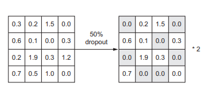
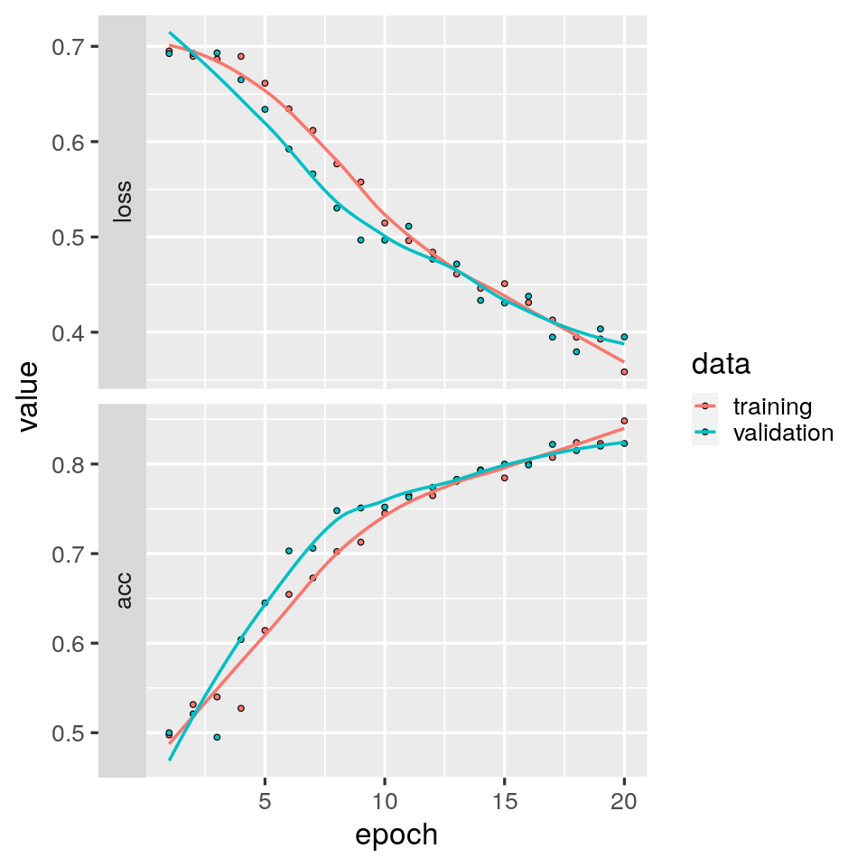
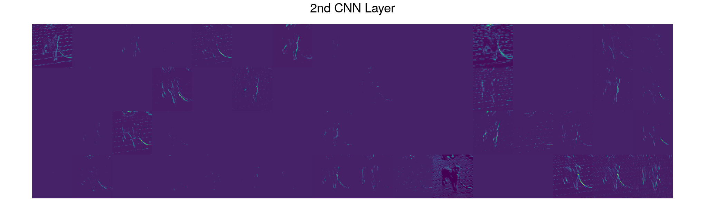

# Supervised Deep Learning I {#ch-12}

## Introduction

In this tutorial, we'll use convolutional neural networks for image classification. The dataset we'll work with comes from a 2013 Kaggle competition, which you can read about [here](https://www.kaggle.com/c/dogs-vs-cats/overview). Kaggle is an online community for data scientists and machine learning engineers, where they can explore datasets, build models and enter contests to attempt solving data science hurdles.

The dataset contains 25,000 images of dogs and cats. We'll use just a subset of these - 6,000 images to be precise. These we'll break down into a training set of 4,000 images, a validation set of 1000 images, and a testing set of 1000 images. This tutorial is based on Chapter 5 of [Deep learning with Python](https://www.manning.com/books/deep-learning-with-python#toc) by F. Chollet - highly recommended reading!

### Learning objectives
* Use Keras to implement a deep convolutional neural network for image classification
* Avoid overfitting using weight regularization, dropout and data augmentation
* Visualize what convolutional neural networks learn via the visualization of intermediate activations

*Important points from the lecture*
- Convolutional neural networks are a powerful kind of machine learning for image classification
- They comprise a series of convolution and max pooling layers, the output of which is then fed into one or more dense layers
- The lower convolution layers learn local patterns in small windows, like edges and textures
- A spatial hierarchy of local patterns are then learned by the higher convolution layers
- The final dense layer then learns global patterns in this spatial hierarchy of lower-level patterns
- Convolutional neural networks are partially "white box", because you can visualize much of what the network learns, for example by visualizing intermediate activations.


## Tutorial
### Building Blocks of CNNs

You probably already know this or at least guessed it but CNN stands for convolutional neural network. CNNs built for classification tasks typically make use the following types of layers (displayed in Figure \@ref(fig:CNN-blocks):

- **Convolutional Layers**: Layers implementing the actual convolution. Their outputs are feature maps which are then passed through an activation function in order to introduce non-linearities into the system. Convolutional layers can be seen as extracting features that are passed on deeper into the model thus enabling the model to learn higher-level features that make the classification task easier.

- **Pooling Layers**: Downsampling or pooling layers concentrate the information so that deeper layers focus more on abstract/high-level patterns. A common choice is max-pooling, where only the maximum value occurring in a certain region is propagated to the output.

- **Dense Layers**: A dense or fully-connected layer connects every node in the input to every node in the output. This is the type of layer you already used in the previous tutorial. If the input dimension is large, the amount of learnable parameters introduced by using a dense layer can quickly explode. Hence, dense layers are usually added on deeper levels of the model, where the pooling operations have already reduced the dimensionality of the data. Typically, the dense layers are added last in a classification model, performing the actual classification on the features extracted by the convolutional layers.

```{r CNN-blocks, echo=F, out.width="32%", out.height="75%", fig.show='hold', fig.cap="Building blocks of a CNN. Figures taken from Chapter 5 of [Deep learning with Python](https://www.manning.com/books/deep-learning-with-python#toc). Left: Features extraction from a CNN (convolutional neural network). Right: Instance classification."}
knitr::include_graphics(c("./figures/Chollet_Fig5.4.png",
                          "./figures/Chollet_Fig5.2.png"))
```

You can think of a convolution as sliding a window, also called kernel or filter, over each pixel of an image and computing a dot product between the filter's values and the image's values that the window (or filter) is covering. This operation produces one output value for every location on the image over which we slide the filter. In Figure \@ref(fig:conv-pool), in blue is the input image and in shaded blue the 3-by-3 filter that we are convolving the input image with and green is the output image. After the convolutional layer usually a max-pooling layer is applied which downsamples the feature map. Through this only certain aspects of information in our original image are extracted.

```{r conv-pool, echo = F, out.height="49%", fig.show='hold', fig.cap="Animation on the left displays the sliding filter across the input feature map ([source](https://computersciencewiki.org/images/8/8a/MaxpoolSample2.png)). The image on the right shows a pooling layer where the highest value of a quadrant is taken as value in a reduced feature map ([source](https://computersciencewiki.org/images/8/8a/MaxpoolSample2.png))."}
knitr::include_graphics(c("./figures/12_conv.gif",
                          "./figures/12_maxpool.png"))

```
We can stack several convolutional-pooling layers. The final pooling layer output is given to a feed forward neural network (i.e dense layers) which is in charge to make the prediction.

Let's dive into our example for a practical application of this.

```{r}
# import libraries
library(reticulate)
# use_condaenv()
library(keras)
library(tensorflow)
library(tidyverse)
library(patchwork)
```

We'll start by creating some useful functions which will be used later in the tutorial.

```{r}
# a function that specifies the size of the plot
fig_size <- function(width, height){
     options(repr.plot.width = width, repr.plot.height = height)
}

# a function that visualize the corresponding RGB image derived from a tensor
plotRGB  = function(img_tensor){
     
    #take dimension of image
    width = dim(img_tensor)[1]
    height = dim(img_tensor)[2]
    
    #take color channels
    red = as.numeric(img_tensor[,,1])
    green = as.numeric(img_tensor[,,2])
    blue = as.numeric(img_tensor[,,3])
    
    #create dataframe
    img = data.frame(x = rep(1:height,each = width), y = rep(height:1,times = width) , r = red , g = green, b = blue)
    
    #plot RGB image
    img %>% ggplot(aes(x=x, y=y, fill=rgb(r,g,b))) + 
        geom_raster()+
        scale_y_continuous()+
        scale_x_continuous()+ 
        scale_fill_identity()+
        theme_void()
    }

# a function that plot the output of the given filter activation
plot_filter  = function(filter_activation){
    
    #create dataframe
    height = dim(filter_activation)[1]
    width = dim(filter_activation)[2]
    filter = data.frame(x = rep(1:width,each = height), y = rep(height:1,times = width) , fill =  as.numeric(filter_activation))
    
    #plot filter
    p = filter %>% ggplot(aes(x = x,y = y))+
        geom_raster(aes(fill = fill),show.legend = FALSE)+
        scale_y_continuous()+
        scale_x_continuous()+
        scale_fill_viridis_c()+
        theme_void()
    return(p)
    }

```


```{r}
# data directory
base_dir = './data/SDL_I/dogs_v_cats_small'

# train data directory
train_dir = file.path(base_dir,'train')

#validation data directory
validation_dir = file.path(base_dir,'validation')

#test data directory
test_dir = file.path(base_dir,'test')

```

To get an overview of our data, we'll start by printing the number cat vs dog images in each given data set (training, validation & testing).


```{r}
#train set
cat('total training cat images:', length(list.files(file.path(train_dir,'cats'))),"\n", 
    'total training dog images:', length(list.files(file.path(train_dir,'dogs'))),"\n")

#validation set
cat('total validation cat images:', length(list.files(file.path(validation_dir,'cats'))),"\n",
    'total validation dog images:', length(list.files(file.path(validation_dir,'dogs'))),"\n")

#test set
cat('total test cat images:', length(list.files(file.path(test_dir,'cats'))),"\n",
    'total test dog images:', length(list.files(file.path(test_dir,'dogs'))),"\n")
```

Note that this data set is class balanced, meaning that accuracy is a useful measure of model performance.

A sample image from each class:


Keras has built-in functionality for feeding batches of training and validation data to the optimization function. This is useful if, for example, you want to make random changes to your training and validation data on the fly, in order to avoid overfitting. You'll get to read more about this below. This functionality comes in the form of the `ImageDataGenerator` function, which you can read about [here](https://keras.io/api/preprocessing/image/).

Let's use `ImageDataGenerator` to generate batches of training and validation data.


```{r eval = F}
# Specify image size
IMAGE_HEIGHT = 150
IMAGE_WIDTH = 150
IMAGE_CHANNELS = 3
IMAGE_SIZE = c(IMAGE_HEIGHT,IMAGE_WIDTH)

# Specify batch size for each set
N_TRAIN = length(list.files(train_dir,recursive = T))
N_VALIDATION = length(list.files(validation_dir,recursive = T))
N_TEST = length(list.files(test_dir,recursive = T))
BATCH_SIZE_TRAIN = 32
BATCH_SIZE_VALIDATION = 50
BATCH_SIZE_TEST = 50

#Rescale images by 1/255 to get numbers between 0 and 1
train_datagen = image_data_generator(rescale = 1/255)
test_datagen = image_data_generator(rescale= 1/255)

#Create a generator for the training data
train_generator = flow_images_from_directory(
                        directory = train_dir,
                        generator = train_datagen,
                        target_size = IMAGE_SIZE,
                        batch_size = BATCH_SIZE_TRAIN,
                        class_mode = "binary"
                        )


#Create a generator for the validation data
validation_generator = flow_images_from_directory(
                            directory = validation_dir,
                            generator = test_datagen,
                            target_size = IMAGE_SIZE,
                            batch_size = BATCH_SIZE_TEST,
                            class_mode = "binary"
                          )

#Create a generator for the test data
test_generator = flow_images_from_directory(
                            directory = test_dir,
                            generator = test_datagen,
                            target_size = IMAGE_SIZE,
                            batch_size = BATCH_SIZE_TEST,
                            class_mode = "binary"
                          )

#Let's have a look at one batch of data from train_generator:
batch = iter_next(train_generator)
cat('data batch shape:', dim(batch[[1]]),"\n")
cat('labels batch shape:', dim(batch[[2]]),"\n")
```

Notice the dimensions of the tensor `data_batch`: 
- The _first_ dimension is the number of images in the batch. 
- The _second_ and _third_ dimensions are the dimensions of each image. 
- The _fourth_ dimension is 3 because these are color images - one for each RGB (red-blue-green) channel.

### Build the model
Let's write a function to build a deep convolutional neural network with the following specifications:

* 4 convolution layers with 32, 64, 128, and 128 filters per layer. Each with a ReLU activation function.
* A max pooling layer after each convolution layer that halves each feature map.
* A dense layer with 512 neurons, each with a ReLU activation function.
* A single output neuron with a sigmoid activation function.

The function takes two input parameters: (1) the L2 regularization rate and (2) the dropout rate. We'll look into these in detail later.


```{r}
build_model = function(L2_rate = 0, drop_rate = 0){
  
  #Name the model
  model.name = paste('convnet_L2_',L2_rate,'_dropout_',drop_rate,sep="")  
    
  #sequential model
  model = keras_model_sequential(name = model.name)
  
  model = model %>%
    #Add the first convolution layer, with 32 3x3 filters and ReLU activation
    #Note that you only need to provide the input dimensions for the 1st layer.
    #Note also that we don't add regularization to this layer. The reason is it has fewer parameters
    #than subsequent layers and is therefore less likely to be a source of overfitting. However, you
    #could add regularization here too, if you'd like.
    layer_conv_2d(filter = 32 , kernel_size = c(3,3),activation = 'relu',input_shape = c(IMAGE_SIZE,IMAGE_CHANNELS)) %>%
    
    #Add a max pooling layer with 2x2 windows. This will halve the dimension of data.
    layer_max_pooling_2d(pool_size = c(2,2)) %>%
    
    #Add a convolution layer with 64 3x3 filters and ReLU activation 
    layer_conv_2d(filters = 64,kernel_size = c(3,3),activation = 'relu') %>%
    
    #Add a max pooling layer with 2x2 windows. This will halve the dimension of data.
    layer_max_pooling_2d(pool_size = c(2,2)) %>%
    
    #Add a convolution layer with 128 3x3 filters and ReLU activation
    #add L2 regularization
    layer_conv_2d(filter = 128, kernel_size = c(3,3),activation = 'relu',kernel_regularizer =  regularizer_l2(l =  L2_rate)) %>%
    
    #Add a max pooling layer with 2x2 windows. This will halve the dimension of data.
    layer_max_pooling_2d(pool_size = c(2,2)) %>%
    
    #add a dropout layer
    layer_dropout(rate = drop_rate)%>%
    
    #Add a convolution layer with 128 3x3 filters and ReLU activation
    #add L2 regularization
    layer_conv_2d(filter = 128, kernel_size = c(3,3),activation = 'relu',kernel_regularizer =  regularizer_l2(l =  L2_rate)) %>%
    
    #Add a max pooling layer with 2x2 windows. This will halve the dimension of data.
    layer_max_pooling_2d(pool_size = c(2,2)) %>%
    
    #Squash the output of the final max pooling layer into a 1D vector
    layer_flatten()%>%
    #add a dropout layer here
    layer_dropout(rate = drop_rate)%>%
    
    #Use this 1D vector as input to a single dense layer with 512 neurons
    #add L2 regularization
    layer_dense(units = 512,activation = 'relu',kernel_regularizer =  regularizer_l2(l =  L2_rate)) %>%
    
    #add a dropout layer
    layer_dropout(rate = drop_rate)%>%
    
    #Finally, add a single neuron with a sigmoid activation function
    layer_dense(units = 1,activation = 'sigmoid')
  
    #Print out a model summary  
    summary(model)     
  
  return (model) 
}


```

### Compile and train the model
Now let's write a function to compile and train our model, using the data generators created above to feed the images into the training function. We'll measure loss using binary cross-entropy and calculate accuracy during training as a measure of model performance. Remember, this is a useful measure for this dataset because there are an equal number of dog and cat photos.

There is however something new in this function: namely a _callback_ function. As used here, this callback function monitors validation loss during training. If it does not improve over specified number of epochs (usually 5), training is terminated. This way, if training has stopped improving, you don't have to wait for the specified maximum number of epochs for training to stop. We will use this functionality later on when we train our final model. You can read more about this callback function [here](https://keras.io/api/callbacks/early_stopping/).


```{r}
compile_and_train = function(model, learning_rate, max_epochs, early_stopping = F){
    
    #Compile the model
    model %>% compile(loss = 'binary_crossentropy', 
                  optimizer = optimizer_adam(lr = learning_rate), 
                  metrics = list('acc')
                  ) 
    #create callback object
    callbacks_cnn = list()
    
    #If early stopping is requested
    if (early_stopping){
        
        #create callback that reduces the learning rate when no improvement is observed after 3 epochs
        callbacks_cnn = append(callbacks_cnn,callback_reduce_lr_on_plateau(monitor = "val_loss",patience = 3 ,factor = 0.1))
        
        #create callback for early stopping
        callbacks_cnn = append(callbacks_cnn,callback_early_stopping(monitor='val_loss',patience = 5,mode = 'min'))
        
        #create folder to save the models
        dir.create("./saved_models")
        
        #create callbacks to save the best model when the training process terminates
        callbacks_cnn = append(callbacks_cnn,
                               callback_model_checkpoint(file.path("./",'saved_models',paste(model$name,".h5",sep="")),
                                                         monitor='val_loss',save_best_only = T,mode = 'min'))
        }
    
    #Train the model, using the data generators created above
    history = model %>% 
      fit_generator(    
        train_generator,
        steps_per_epoch = as.integer(N_TRAIN/BATCH_SIZE_TRAIN), 
        epochs = max_epochs,
        validation_data = validation_generator,
        validation_steps = as.integer(N_VALIDATION/BATCH_SIZE_VALIDATION),
        callbacks = callbacks_cnn
      )
    
    return (history)
}


```

Now let's compile and train our model, using a learning rate of 0.001, a maximum number of 20 epochs, but for now without early stopping, regularization, or dropout. This will take some time. Go make a cup of tea, coffee or even hot chocolate.


```{r eval = F}
model_baseline = build_model(0, 0)
history_baseline = compile_and_train(model_baseline, 1e-3, 20, F)
```

**Checkpoint**
Take some time to digest this model summary. Make sure you understand and can answer the following questions:
    
- **A**: Why is the dimensionality of the output of the first convolution layer (148, 148, 32) rather than (150, 150, 32)?
- **B**: Why does the first convolution layer have 896 free parameters? 
- **C**: Why don't the max-pooling layers have any free parameters?
- **D**: Why does the last layer contain only a single neuron with a sigmoid activation function?


**Solutions**

- **A**: Because the size of the filter is 3 x 3 
- **B**: There are 3x3 = 9 parameters for each filter, times 3 channels (RGB), plus one bias term per filter. Thus: 32 x (9x3+1)
- **C**: There are no parameters associated with these layers. The max operation is hard-coded.
- **D**: This is a classification problem.

Let's have a look at loss and accuracy during training. Both are measured on the training data and the validation data.


```{r eval = F}
#load history of trained models
history = readRDS('./data/SDL_I/saved_models/models_history.rds')
fig_size(8,8)
plot(history$baseline) + theme_grey(base_size = 20)
```


What do you observe?

Notice that toward the end of model training, training accuracy approaches 1, whereas validation accuracy plateaus at a lower value, around 0.75. Similarly, training loss approaches 0, yet after around 8 epochs, validation loss begins to increase.  

### Reduce Overfitting

These are classic symptoms of overfitting. In the lectures, we've learned about some techniques to avoid overfitting. Specifically, early stopping, regularization, and dropout. 
In the function `compile_and_train_model`, you can turn on early stopping by setting the parameter `early_stopping` to 1. This will force early stopping if validation loss does not decrease for 5 epochs. You can also add regularization and dropout using the first two input parameters. Below, we'll also use another approach that is particularly amenable to image classification, namely data augmentation, and to which dropout can be applied to further improve model performance (this will be our final trained model).

#### Weight Regularization

Given some training data and a network architecture, multiple sets of weight
values (multiple models) could explain the data. Simpler models are less likely to overfit than complex ones.

A simple model in this context is a model with fewer parameters. Thus a common way to mitigate overfitting is to put constraints on the complexity of a network by forcing its weights to take only small values, which makes the distribution of weight values more regular. This is called _weight regularization_, and it’s
done by adding to the loss function of the network a cost associated with having large weights. For this course, we will focus on L2 regularization.

* **L2 regularization**: The cost added is proportional to the square of the value of the weight coefficients (the L2 norm of the weights). L2 regularization is also called _weight decay_ in the context of neural networks. 

The L2 rate specifies how much we desire to shrink the weights. A value of 0 indicates no regularization while a large rate value (heavy regularization) can cause the weights to take a value very small (close to 0 which can lead to underfitting). Therefore we should choose the L2 rate very carefully.

A quick note here: _weight regularization_ can be applied to every model we have seen in this course so far (it is not only related to neural networks as dropout).

Let's now create a model with an _L2 rate_ that equals 0.005. 


```{r eval = F}
model_L2 = build_model(L2_rate = 0.005)
history_L2_reg = compile_and_train(model_L2, 1e-3, 20, F)
```

```{r}
## Model: "convnet_L2_0.005_dropout_0"
## ______________________________________________________________________________________________________________
## Layer (type)                                     Output Shape                                Param #          
## ==============================================================================================================
## conv2d (Conv2D)                                  (None, 148, 148, 32)                        896              
## ______________________________________________________________________________________________________________
## max_pooling2d (MaxPooling2D)                     (None, 74, 74, 32)                          0                
## ______________________________________________________________________________________________________________
## conv2d_1 (Conv2D)                                (None, 72, 72, 64)                          18496            
## ______________________________________________________________________________________________________________
## max_pooling2d_1 (MaxPooling2D)                   (None, 36, 36, 64)                          0                
## ______________________________________________________________________________________________________________
## conv2d_2 (Conv2D)                                (None, 34, 34, 128)                         73856            
## ______________________________________________________________________________________________________________
## max_pooling2d_2 (MaxPooling2D)                   (None, 17, 17, 128)                         0                
## ______________________________________________________________________________________________________________
## dropout (Dropout)                                (None, 17, 17, 128)                         0                
## ______________________________________________________________________________________________________________
## conv2d_3 (Conv2D)                                (None, 15, 15, 128)                         147584           
## ______________________________________________________________________________________________________________
## max_pooling2d_3 (MaxPooling2D)                   (None, 7, 7, 128)                           0                
## ______________________________________________________________________________________________________________
## flatten (Flatten)                                (None, 6272)                                0                
## ______________________________________________________________________________________________________________
## dropout_1 (Dropout)                              (None, 6272)                                0                
## ______________________________________________________________________________________________________________
## dense (Dense)                                    (None, 512)                                 3211776          
## ______________________________________________________________________________________________________________
## dropout_2 (Dropout)                              (None, 512)                                 0                
## ______________________________________________________________________________________________________________
## dense_1 (Dense)                                  (None, 1)                                   513              
## ==============================================================================================================
## Total params: 3,453,121
## Trainable params: 3,453,121
## Non-trainable params: 0
## ______________________________________________________________________________________________________________
```


Let's have again a look at loss and accuracy during training, both measured on the training data and the validation data. 

```{r eval = F}
fig_size(8,8)
plot(history$L2_reg) + theme_grey(base_size = 20)
```


It seems that overfitting has been prevented with L2 regularization since validation loss keeps decreasing as long as training loss also decreases.

#### Dropout

_Dropout_ is a simple and effective way to reduce overfitting. The idea behind this method is to add noise to the output of certain layers during training, thereby reducing the chance they memorize spurious (false or fake) correlations in the training data. 

In practice, dropout works by simply changing a certain fraction of outputs in the specified layers to zero, thus 'dropping them out'. This fraction is specified by the _dropout rate_, which is typically set between 0.2 and 0.5. Exactly which neurons get dropped out randomly changes for each example. To compensate for the decreased number of active neurons in layers with dropout, the layer's outputs are scaled by the inverse of the (`1-dropout rate`). This is shown graphically in Figure \@ref(fig:dropout) with the dropout rate being 0.5.

```{r dropout, out.width = "75%", echo=FALSE, fig.cap="Visualization of dropout using a 0.5 dropout rate."}

```
Dropout applied to an activation matrix at training time, with rescaling happening during training. At test time, the activation matrix is unchanged.

```{r eval = F}
model_dropout = build_model(0, 0.5)
history_dropout = compile_and_train(model_dropout, 1e-3, 20, F)
```

```{r eval = F}
fig_size(8,8)
plot(history$drop) + theme_grey(base_size = 20)
```


What do you observe? Compare this to the figures above using L2 regularization.

#### Data augmentation

Overfitting commonly occurs on small training sets. For image data, that we are considering here, one approach to avoid such overfitting is _data augmentation_. In this approach, you generate new images via a random transformation of the training images. You thus augment your training set by generating new, believable looking images. By doing so, your model will never see the same image twice during training. 

Keras makes this easy with the class ImageDataGenerator. Just by tweaking a few lines of our `train_datagen` function, we can augment our dataset during training. Let's take a look at this.

```{r eval = F}
# Image generatos for data augmentation
train_datagen = image_data_generator(
  rescale = 1./255,
  rotation_range = 15,
  width_shift_range = 0.1,
  height_shift_range = 0.1,
  shear_range = 0.1,
  zoom_range = 0.2,
  horizontal_flip = T,
  fill_mode = 'nearest'
  )

# Create a generator for the training data
train_generator = flow_images_from_directory(
                        directory = train_dir,
                        generator = train_datagen,
                        target_size = IMAGE_SIZE,
                        batch_size = BATCH_SIZE_TRAIN,
                        class_mode = "binary"
                        )
```

Let's have a closer look at the parameters of this function.

- `rescale`: You've seen this in our first use of 'ImageDataGenerator'. This simply rescales the RGB values to be between 0 and 1.  
 
- `rotation_range`: is the range in degrees of permitted image rotations.   
 
- `width_shift_range`: shifts the image to the left or to the right by the fraction of the total width specified (i.e., 0.1 in this example). 
 
- `height_shift_range`: shifts the image up or down by the fraction of the total height specified (i.e., 0.1 in this example). 
 
- `shear_range`: distorts the image along an axis, in effect approximating a change in the position of the photographer.  
 
- `zoom_range`: zooms in and out of the image.  
 
- `horizontal_flip`: randomly flips the image along the horizontal axis. 
 
- `fill_mode`: This defines how pixels are to be filled, for example when the image is shifted such that some pixels become empty.

You can read more details about this function [here](https://keras.io/api/preprocessing/image/).

If you'd like to see more examples of how the parameters of this function affect images, see [this blog post](https://fairyonice.github.io/Learn-about-ImageDataGenerator.html).

To get your own feel for what this function does, and to enjoy some funny cat pictures, execute the code cell below with different cats by just changing the index to the list *fnames* on line 5.


```{r eval = F}
#Get the file names of the test images for cats
fnames = list.files(file.path(train_dir,'cats'),full.names = T)

#Choose a cat
cat = 1000
img_path= fnames[cat]

#Read, resize, and rescale the image
img = image_load(img_path, target_size = IMAGE_SIZE)
img_tensor = image_to_array(img)
x = array_reshape(img_tensor,dim = c(-1,IMAGE_SIZE,IMAGE_CHANNELS))

#Visualize the image
fig_size(10,6)
i = 6
plots = list()
for(j in 1:i){
    batch = iter_next(flow_images_from_data(generator = train_datagen,x = x,batch_size = 1))
    plots[[j]]=plotRGB(batch[1,,,])
}
p = plots[[1]] 
for (j in 1:(i-1)){
    p = p + plots[[j+1]]
}
p  + plot_layout(nrow = 2)
```


Get the idea? Data augmentation stretches, moves, rotates, shears, and inverts your raw data images to produce new images, with the goal of never showing your model the same image twice during training.

Now let's put our new `train_datagen` function to work.


```{r eval = F}
model_data_augment = build_model(0, 0)
history_data_augment = compile_and_train(model_data_augment, 1e-3, 20, F)
```

```{r}

## Model: "convnet_L2_0_dropout_0"
## ________________________________________________________________________________
## Layer (type)                        Output Shape                    Param #     
## ================================================================================
## conv2d_12 (Conv2D)                  (None, 148, 148, 32)            896         
## ________________________________________________________________________________
## max_pooling2d_12 (MaxPooling2D)     (None, 74, 74, 32)              0           
## ________________________________________________________________________________
## conv2d_13 (Conv2D)                  (None, 72, 72, 64)              18496       
## ________________________________________________________________________________
## max_pooling2d_13 (MaxPooling2D)     (None, 36, 36, 64)              0           
## ________________________________________________________________________________
## conv2d_14 (Conv2D)                  (None, 34, 34, 128)             73856       
## ________________________________________________________________________________
## max_pooling2d_14 (MaxPooling2D)     (None, 17, 17, 128)             0           
## ________________________________________________________________________________
## dropout_9 (Dropout)                 (None, 17, 17, 128)             0           
## ________________________________________________________________________________
## conv2d_15 (Conv2D)                  (None, 15, 15, 128)             147584      
## ________________________________________________________________________________
## max_pooling2d_15 (MaxPooling2D)     (None, 7, 7, 128)               0           
## ________________________________________________________________________________
## flatten_3 (Flatten)                 (None, 6272)                    0           
## ________________________________________________________________________________
## dropout_10 (Dropout)                (None, 6272)                    0           
## ________________________________________________________________________________
## dense_6 (Dense)                     (None, 512)                     3211776     
## ________________________________________________________________________________
## dropout_11 (Dropout)                (None, 512)                     0           
## ________________________________________________________________________________
## dense_7 (Dense)                     (None, 1)                       513         
## ================================================================================
## Total params: 3,453,121
## Trainable params: 3,453,121
## Non-trainable params: 0
## ________________________________________________________________________________
```

Let's again plot the learning curves

```{r eval = F}
fig_size(8,8)
plot(history$augment) + theme_grey(base_size = 20)
```



As you can see clearly above, overfitting is avoided by using the data augmentation technique.

This was a lot of information and different techniques of how to avoid overfitting. So, to avoid complete confusion and provide a visual comparison, we will summarize all the different models below. This way you can see how the different techniques for reducing overfitting can change the behaviour of training and validation metrics.

```{r eval = F}
p_base = plot(history$baseline) + labs(title = 'Baseline') +theme_gray(base_size = 15) + theme(plot.title = element_text(size=17,hjust = 0.5)) 

p_L2 = plot(history$L2_reg) + labs(title = 'L2 Regularization') +theme_gray(base_size = 15) + theme(plot.title = element_text(size=17,hjust = 0.5)) 

p_dropout = plot(history$drop) + labs(title = 'Dropout') +theme_gray(base_size = 15) + theme(plot.title = element_text(size=17,hjust = 0.5)) 

p_data_augment = plot(history$augment) + labs(title = 'Data Augmentation') +theme_gray(base_size = 15) + theme(plot.title = element_text(size=17,hjust = 0.5)) 

p_base + p_L2 + p_dropout + p_data_augment + plot_layout(nrow = 2)
```


Now, it's time to train our final model so it can be used in the next section. We will be using data augmentation and dropout. Further, we'll use early stopping and a maximum of 100 epochs. The best model will be saved automatically with the callback `callback_model_checkpoint`


```{r eval = F}
model_final = build_model(0, 0.5)
history_final = compile_and_train(model_final, 1e-3, 100, T)
```

```{r}
##   Model: "convnet_L2_0_dropout_0.5"
##   ________________________________________________________________________________
##   Layer (type)                        Output Shape                    Param #     
##   ================================================================================
##   conv2d_16 (Conv2D)                  (None, 148, 148, 32)            896         
##   ________________________________________________________________________________
##   max_pooling2d_16 (MaxPooling2D)     (None, 74, 74, 32)              0           
##   ________________________________________________________________________________
##   conv2d_17 (Conv2D)                  (None, 72, 72, 64)              18496       
##   ________________________________________________________________________________
##   max_pooling2d_17 (MaxPooling2D)     (None, 36, 36, 64)              0           
##   ________________________________________________________________________________
##   conv2d_18 (Conv2D)                  (None, 34, 34, 128)             73856       
##   ________________________________________________________________________________
##   max_pooling2d_18 (MaxPooling2D)     (None, 17, 17, 128)             0           
##   ________________________________________________________________________________
##   dropout_12 (Dropout)                (None, 17, 17, 128)             0           
##   ________________________________________________________________________________
##   conv2d_19 (Conv2D)                  (None, 15, 15, 128)             147584      
##   ________________________________________________________________________________
##   max_pooling2d_19 (MaxPooling2D)     (None, 7, 7, 128)               0           
##   ________________________________________________________________________________
##   flatten_4 (Flatten)                 (None, 6272)                    0           
##   ________________________________________________________________________________
##   dropout_13 (Dropout)                (None, 6272)                    0           
##   ________________________________________________________________________________
##   dense_8 (Dense)                     (None, 512)                     3211776     
##   ________________________________________________________________________________
##   dropout_14 (Dropout)                (None, 512)                     0           
##   ________________________________________________________________________________
##   dense_9 (Dense)                     (None, 1)                       513         
##   ================================================================================
##   Total params: 3,453,121
##   Trainable params: 3,453,121
##   Non-trainable params: 0
##   ________________________________________________________________________________
```


```{r eval = F}
model = load_model_hdf5('./data/SDL_I/saved_models/final_model.h5')
```

Let's also evaluate the perfomance on the test set.

```{r eval = F}
 validation_eval = evaluate_generator(model, validation_generator,steps = as.integer(N_VALIDATION/BATCH_SIZE_VALIDATION))
 test_eval = evaluate_generator(model, test_generator,steps = as.integer(N_TEST/BATCH_SIZE_TEST))

# Evaluate model on validation and test data
 cat("Validation accuracy: ",validation_eval$acc,"\n")
 cat("Test accuracy: ",test_eval$acc,"\n")
```

```{r echo = F}
# evaluate_generator() causes R to crash because of C stack overflow.
# Results taken from calculations done on Renku.io

cat("Validation accuracy: 0.846 \n")
cat("Test accuracy: 0.849 \n")
```

Great, we have a well performing model. Now let's interpret what the CNN learns.


### Visualizing a CNN

There are multiple ways to visualize what convolutional neural networks learn, here are three examples:

1) _**Visualizing intermediate activations**_ - this shows you how successive convolutional layers transform their input.

2) _**Visualizing convolutional filters**_ - this shows you what visual pattern or concept a filter responds to.

3) _**Visualizing heatmaps of class activation in an image**_ - this shows you which parts of an image were identified as belonging to a particular class.

The activation of a layer is the output of the activation function for that layer, given some input. This shows how an input is decomposed by the different filters learned by a convolutional neural network.

Let's visualize the intermediate activations of the last convolutional neural network you trained - the one with data augmentation and dropout. We'll start by loading the model and, as a reminder, printing its summary.

Now let's grab a random image of a cat from the test set, get it in the right format, and visualize it.


```{r eval = F}
# Get the file names of the test images for cats
fnames = list.files(file.path(test_dir,'dogs'),full.names = T)

# Choose a cat
cat = 50
img_path= fnames[cat]

# Read, resize, and rescale the image
img = image_load(img_path, target_size = IMAGE_SIZE)
img_tensor = image_to_array(img)
img_tensor = img_tensor * 1/255

# Visualize the image
fig_size(7,7)
plotRGB(img_tensor)
```

To visualize the intermediate activations, you'll create a Keras model that takes an image as input and outputs the activations of all the convolution layers. This is simply a model that shows you how the neurons in each layer of your trained network respond to a particular image.

```{r eval = F}
#Extract the outputs of the top eight convolution layers
n_layers = 8
layers_outputs = list()
for ( i in 1:n_layers){
    layers_outputs[[i]] = get_layer(model,index = i)$output
}

#Create a model that returns the activation of the top eight convolution layers, 
#given an input image
activation_model = keras_model(inputs = model$input, outputs = layers_outputs)

#Get the activations of the top eight convolution layers, given the cat 
#image selected above
activations = predict(activation_model,array_reshape(img_tensor,dim = c(-1,IMAGE_SIZE,IMAGE_CHANNELS)))
```

```{r eval = F}
#Get the first layer activations
first_layer_activation = activations[[1]]

#Get filter i from the first layer
i = 3
fig_size(7,7)
plot_filter(first_layer_activation[1,,,i])
```


What do you observe? 
It appears this 3rd filter encodes an edge detector. 

How about other filters? 
Rerun the code cell for different filters. You can do this by changing the value of _i_, currently _i=3_, on line 5 of the code cell above to any number between 1 and 32. 

See anything else that interests you?

Let's go ahead and visualize the intermediate activations of all of the filters of all of the convolution layers.

Go and choose pic 50 from dogs. What do you observe? Can you see how the filter works as a leash detector? This makes a lot of sense considering that dogs are seldom without a leash and cats always! That can be a very powerful feature for our classifier.


```{r eval = F}
#Get the layer names
layer_names = list()
for ( i in 1:n_layers){
    layer_names[[i]] = get_layer(model,index = i)$name
}


#Set the number of images per row
images_per_row = 16

plots = list()

for (i in 1:n_layers){
    
    #Number of features in this feature map
    n_features = dim(activations[[i]])[4]
    
    #The feature map has the shape (I, size, size, n_features)
    size = dim(activations[[i]])[2]
    
    #Number of columns for display
    n_rows = as.integer(n_features/images_per_row)
    display_grid = matrix(NA,nrow = size * n_rows,ncol = images_per_row * size)
    
    for(row in 1:n_rows){
        for(col in 1:images_per_row){
            
            #Get the activation response
            filter_image = activations[[i]][1,,,(row-1) * images_per_row + col]
            
            #Do some post-processing to make the image easier to see
            filter_image = filter_image - mean(filter_image)
            filter_image = filter_image*64
            filter_image = filter_image + 128
            filter_image = pmax(pmin(filter_image, 255), 0)
            
            #Add to the grid of images
            display_grid[((row-1)*size+1):(row*size),((col-1)*size+1):(col*size)] = filter_image
        }
    }
    
    #Only visualize the intermediate activations of the convolutional layers
    if(length(grep('conv',layer_names[[i]]))!=0){
        conv_layers = c(1,3,5,7)
        plots[[which(i == conv_layers)]] = plot_filter(display_grid)
    
    }
}

# Plot all the filters for each layer

# 1st layer
n_filters = dim(activations[[1]])[4]
n_rows = as.integer(n_filters/images_per_row)
fig_size(images_per_row +1,n_rows +1)
plots[[1]]+labs(title = "1st CNN Layer")+ theme(plot.title = element_text(size=22,hjust = 0.5))

# 2nd layer
n_filters = dim(activations[[3]])[4]
n_rows = as.integer(n_filters/images_per_row)
fig_size(images_per_row +1,n_rows+1)
plots[[2]]+labs(title = "2nd CNN Layer")+ theme(plot.title = element_text(size=22,hjust = 0.5))

# 3rd layer
n_filters = dim(activations[[5]])[4]
n_rows = as.integer(n_filters/images_per_row)
fig_size(images_per_row +1,n_rows+1)
plots[[3]]+labs(title = "3rd CNN Layer")+ theme(plot.title = element_text(size=22,hjust = 0.5))

# 4th layer
n_filters = dim(activations[[7]])[4]
n_rows = as.integer(n_filters/images_per_row)
fig_size(images_per_row +1,n_rows+1)
plots[[4]]+labs(title = "4th CNN Layer")+ theme(plot.title = element_text(size=22,hjust = 0.5))
```





To guide you a little, here are a few things to note:

* The first layer is a collection of edge detectors. The activations maintain most of the information present in the original image. They still look like cats.

* As you go to deeper layers, the activations become increasingly abstract and harder to interpret. They encode higher-level concepts, like "cat ear". These activations carry increasingly less information about the raw content of the image and increasingly more information about the class of the image.

* As you go into even deeper layers, there is a greater proportion of empty activations. This means the patterns encoded by these higher-level layers are not found in this particular image.

These three points relate to a universal characteristic of data representation in convolutional neural networks. As you go deeper into the network, the features extracted by each layer become increasingly abstract. They carry less information about the specific input image and more about its label. In this way, convolutional neural networks act as information distillation pipelines.

Go back a few cells and see what happens with other cats. It's really fun to see what these filters are picking up!


## Exercise

The purpose of this exercise is to create a CNN model for a multiclass classification problem. 

So far, a binary classification problem was considered. However, in practice, there are several cases where more than 2 classes have to be considered. For example, the [mnist](https://en.wikipedia.org/wiki/MNIST_database) dataset consists of handwritten digit images and in total contains 10 different classes (number 0 to number 9). 

The goal of this exercise is to create a model that takes the handwritten image as input and predicts the number which is written in this image.

Regarding the modelling part of multiclass classification problem the only thing that changes, compared to a binary classification problem, is the number of nodes and the activation function on the output layer. Also, a different loss function has to be considered ('categorical_crossentropy'). In other words, the number of nodes of the output layer should equal the number of discrete classes (10 in our case). 
Furthermore, the activation function of the output layer is the 'softmax' activation which converts each output node to a probability of the corresponding class. Therefore, for a prediction, we choose the class where its node gives the maximum probability.

Furthermore, a skeleton code is provided which does the preprocessing and creates a baseline model.


Your task is to create a CNN architecture that outperforms the baseline model. The data are class balanced so accuracy can be used in this case. You should use dropout and/or regularization to avoid overfitting. Also, comment on the number of trainable parameters for each model. 


### Import libraries and data
```{r eval = F}
library(reticulate)
# use_condaenv()
library(keras)
library(tensorflow)
library(tidyverse)
library(rsample)
```

IMPORTANT NOTE: READ CAREFULLY!

Do not skip this part or you'll run into issues later on!
In a moment, after you've read the following instructions carefully, you should:
- run the code chunk immediately below this text (`keras_model_sequential()`). 
- look down in the *Console* it asks if you want to install some packages: ("Would you like to install Miniconda? [Y/n]:"). 
- write _n_ and press enter. You should see the following code in the console: `Would you like to install Miniconda? [Y/n]: n`. 
Now, you can normally continue with the exercise.

If you were too eager and already pressed _Y_ (yes) and enter, don't panic! Just close your environment, re-open it and make sure that next time you go with _n_ (no).

### Tasks

```{r eval = F}
keras_model_sequential()
```

*Load mnist dataset:*

```{r eval = F}
mnist = dataset_mnist()

# take train and test set
train = mnist$train
test = mnist$test
```


1. Plot an image
```{r eval = F}
index_image = 5 ## change this index to see different image.
input_matrix = train$x[index_image,,]
output_matrix <- apply(input_matrix, 2, rev)
output_matrix <- t(output_matrix)
image(output_matrix, col=gray.colors(256), xlab=paste('Image for digit ', train$y[index_image]), ylab="")
```

2. Specify image size and number of classes

```{r eval = F}
img_size = dim(train$x)[2:3]
img_channels = 1
n_classes = length(unique(train$y))
cat('Image size: ',c(img_size,img_channels),"\n")
cat('Total classes: ',n_classes)
```


3. Create a validation set using stratified split and rescale input to [0,1]

```{r eval = F}
#make stratified split
split = initial_split(data.frame('y'=train$y),prop = 0.8,strata = 'y')

#train set
x_train = train$x[split$in_id,,]
##rescale to [0,1]
x_train = x_train/255
y_train = train$y[split$in_id]

#validation set
x_val = train$x[-split$in_id,,]
##rescale to [0,1]
x_val = x_val/255
y_val = train$y[-split$in_id]

#test set
x_test = test$x
##rescale to [0,1]
x_test = x_test/255
y_test = test$y

```

4. Encode classes to one-hot vectors

```{r eval = F}
y_train = to_categorical(y_train, n_classes)
y_val =  to_categorical(y_val,n_classes)
y_test = to_categorical(y_test, n_classes)

head(y_train)
```

5. Create and train the baseline model

A simple approach would be to create a vector (flatten the 2d input matrix) from the input image and then to apply a feed-forward neural network (i.e. dense layers). You are already provided with a trained model (because it takes a long time to train it from scratch), so you do not have to run the fit function. You just have to load the model.

You don't have to run the following chunk but have a look at this model nevertheless.

```{r eval = F}
ffnn_model = keras_model_sequential()

ffnn_model %>% layer_flatten(input_shape = img_size) %>%
          layer_dense(units = 1024,activation = 'relu')%>%
          layer_dense(units = 512,activation = 'relu')%>%
          layer_dense(units = 256,activation = 'relu') %>%
          layer_dense(units = 128,activation = 'relu') %>%
          layer_dense(units = 10,activation = 'softmax')

ffnn_model %>% compile(
  loss = 'categorical_crossentropy',
  optimizer = optimizer_adam(lr = 0.001),
  metrics = c('accuracy')
)

dir.create(file.path('saved_models'))
save_ffnn = file.path('saved_models','baseline.h5') 
  
callbacks_ffnn = list(callback_early_stopping(monitor='val_loss',patience = 5,mode = 'min'),
                      callback_model_checkpoint(save_ffnn,monitor='val_loss',save_best_only = T,mode = 'min'))

#history_ffnn = fit(ffnn_model,x_train, y_train, epochs = 20, batch_size = 128,
#                  validation_data = list(x_val,y_val),callbacks = callbacks_ffnn)
```

6. Load the saved Baseline model and evaluate the performance on validation and test set

```{r eval = F}
model_ffnn = load_model_hdf5("./data/SDL_I/saved_models/baseline.h5")

#evalute accuracy
val_acc = evaluate(model_ffnn,x_val,y_val)[[2]]
test_acc = evaluate(model_ffnn,x_test,y_test)[[2]]

cat('Validation Accuracy: ', val_acc,'\n')
cat('Test Accuracy: ',test_acc,'\n')
```


*Next steps to code:*

1. Create a CNN architecture
2. Train the model
  Hint: reshape your inputs so that they match the desired dimension of the input_shape in `layer_conv_2d`. Use callbacks for early stopping and model checkpoint (look at the baseline model).
3. Load the saved model, evaluate performance on validation and test set
4. Print summary of both models and comment on the number of parameters
