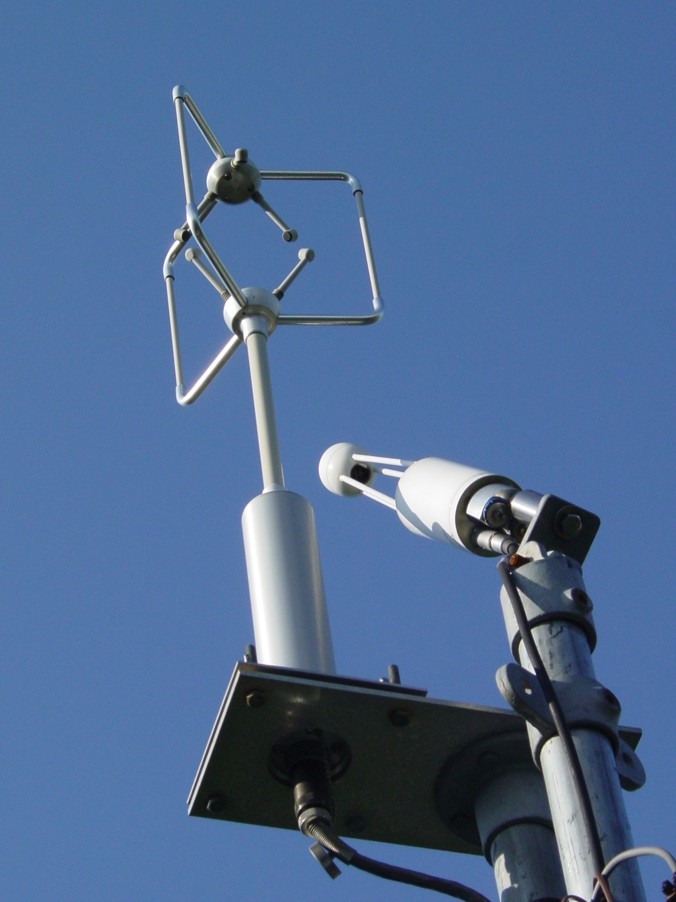
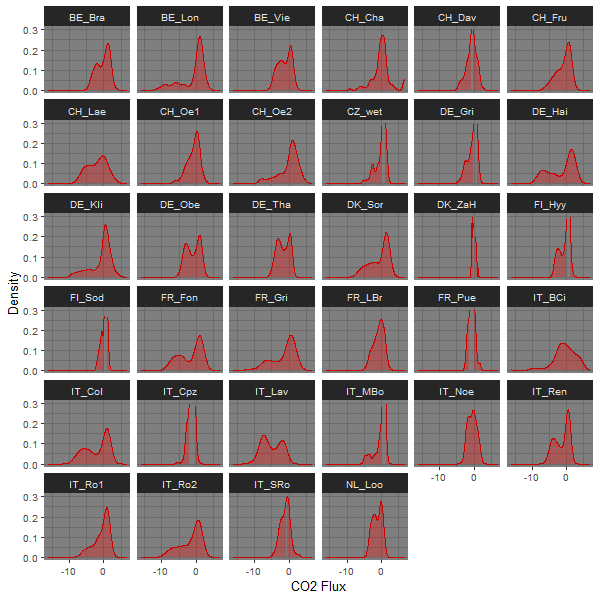

# Supervised Deep Learning II {#ch-13}


## Introduction
In this tutorial, we will put into practice and apply many of the models seen earlier in the course, in order to achieve a simple goal: efficiently extrapolate an environmental dataset. For this, we will use satellite data (specifically NDVI) as an accurate and "cheap" predictor of a specific environmental variable (C0~2~ - vegetation fluxes) that is measured scarcely by expensive physical devices (eddy covariance towers, see see Chapters \@ref(ch-02) and \@ref(ch-03)). Sit down and relax. This tutorial invites you to take a step back, and reflect on all the knowledge you have acquired on modelling so far. 

### Learning objectives
- Understand the link between research objective, data type and machine learning methods.
- Develop critical judgement, assess the relevance of a method for a particular modelling objective.
- Be able to cite examples of possible applications of various machine learning methods to problems in environmental systems science.
- Build intuitions for future machine learning applications in own projects. 
- Understand the difference between forward Neural Networks, CNN and embeddings. 
- Appreciate similarities and differences between simpler statistical models and NN.

**Important points from the lecture**

- Several types of models are commonly used in the Environmental Sciences. Those include linear models, general linear models, random forests, and neural networks.
- Linear models are suited for obtaining *simple* relationships between predictors and variables (for those with a normally distributed response variable): $y = \beta_0 + \beta_1 x + \epsilon, \quad \epsilon \sim \mathcal{N} (0,\sigma^2)$
- Generalized linear models are similar to linear models. However, they allow for less restrictive assumptions on the distribution of the predicted variable (e.g., can be binomial for predicting presence/absence).
- Randoms forests can be used for classification or label predictions.
- Neural Networks can be used for capturing more *complex* relationships between predictors and variable. This comes at the cost of interpretability. Convolutional Neural Networks are a special type of neural network which is suited to for example capturing the effect of the spatial structure of the predictors. 
- Neural Networks can be combined with mechanistic models to reduce the dimensionality of a problem.


## Tutorial 
### Description of the modelling task

Using the eddy-covariance technique, it is possible to measure the CO~2~ gas exchange fluxes between the vegetation and the atmosphere at high temporal resolution and throughout the year (see Figure \@ref(fig:eddytower). This is a key scientific measurement, for studying as an example the CO~2~ cycle. Technical details on the measurement can be found [here](https://en.wikipedia.org/wiki/Eddy_covariance).

```{r eddytower, out.width="25%", fig.cap="Close-up of measuring device for $CO_2$ and other environmental parameters that is attached to eddy covariance towers. Image taken from [Wikipedia](https://upload.wikimedia.org/wikipedia/commons/5/52/Eddy_Covariance_IRGA_Sonic.jpg)."}

```

Vegetation-atmosphere CO~2~ fluxes are driven by photosynthesis and respiration. The latter is responsible for ecosystem-level CO~2~ uptake, and the latter reverses the uptake flux. As a reminder, the equation of the reactions that happens during photosynthesis is the following:

$$
\begin{array}{rcl}
& 6 \, CO_2 \, &+ \, &6 \, H_2O &\xrightarrow{LIGHT} & C_6H_{12}O_6 \, &+ \,6 \, O_2  \\
 & Carbon \, Dioxde &+ &Water &\xrightarrow{ } & Sugar &+\, Oxygen
\end{array}
$$

Although photosynthesis is performed differently by different species, the process always begins when energy from light is absorbed by proteins called reaction centres that contain green chlorophyll pigments. The pigment absorbs visible light (from 0.4 to 0.7 µm) for use in photosynthesis. The cell structure of the leaves, on the other hand, strongly reflects near-infrared light (from 0.7 to 1.1 µm). 

[The Normalised Difference Vegetation Index](https://en.wikipedia.org/wiki/Normalized_difference_vegetation_index) (NDVI) uses this property, by measuring the difference between the difference in reflectance between red light (*Red*) and near-infrared light (*NIR*) as:

$$
NDVI = \frac{NIR - Red}{NIR + Red}$$


NDVI is a measure for live green foliage and is strongly related to the fraction of absorbed photosynthetically active radiation. In other words, it should scale (more or less linearly) with GPP. NDVI is easy to obtain at a fine spatial resolution, through satellite imagery. On the other hand, eddy covariance measurement sites are very scarce, and can only estimate CO~2~ fluxes at a few geographical positions.


### Goal of the tutorial

Our aim is to build a model that can estimate CO~2~ exchange rates between the vegetation and the atmosphere, extending the range of measurements from the towers to the entire Earth system.
We will compare different approaches to find the function $f$ that best captures the relationship between NDVI (and other explanatory variables) to CO~2~ fluxes ($y_{CO2}$): $y_{CO2} = f(x_{NDVI},...)$

### Dataset

As a first step of any modeling problem, we need to get and process the data to be used. Those steps have been detailed in Tutorial: **Data scraping**.

#### FLUXNET
We will once again be using the FLUXNET dataset, that you have gotten familiar with in the previous tutorials. We want to try to predict the variable [`NEE_CUT_REF`](https://fluxnet.org/data/fluxnet2015-dataset/fullset-data-product/), which expresses the fluxes in gC $m^{-2} d^{-1}$, using the ndvi value of the corresponding region. Figure \@ref(fig:map) shows a map of the locations of all 34 European towers available in our dataset:

```{r map, out.width="50%", fig.cap="Locations of all eddy covariance towers in Europe."}
knitr::include_graphics("./figures/location_of_towers.png")
```

#### NDVI (MODIS product)

NASA offers a dataset obtained by the imaging sensor MODIS, which stands for [Moderate Resolution Imaging Spectroradiometer](https://en.wikipedia.org/wiki/Moderate_Resolution_Imaging_Spectroradiometer). This dataset contains NDVI values measured in 16-day intervals and at multiple spatial resolutions, in order to allow consistent spatial and temporal comparisons of vegetation. For this application, we use the [MOD13A3](https://lpdaac.usgs.gov/products/mod13a3v006/) MODIS product which provides a spatial resolution of 1km monthly NDVI. In other words, each pixel of our NDVI images defines the NDVI value for a region of 1 $km^{2}$ for the respective month. Our dataset consists of NDVI images which take into account a 30km buffer around each tower. To avoid confusion and put it simply each tower is in the centre of a square that's sides are 60km long. Therefore, each of our NDVI images contains $66\times 66$ pixels. 

Note that the choice for considering such a wide area around the tower is not one made by our scientific understanding of the controls on CO2 gas exchange, but rather one that allows us to apply a large variety methods for data preparation and types of models for predicting fluxes. The "footprint" of eddy covariance towers, that is, the area around each tower that influence the gas exchange at the point of measurements above the canopy, is typically on the order of a few hundred metres (and not 30 km).

Each MODIS product gives a tile with the desired information. From this tile a region around each tower is extracted. The following picture shows you an example of such a tile and the area around the CH Oensingen tower. Extracted Region (black square) around the Tower of CH Oensingen (red cross) in the given Modis tile in Figure \@ref(fig:Oe2).

```{r Oe2, out.width="49%", fig.show='hold', fig.cap = "Left: MODIS tile with extracted region in black and location of eddy covariance tower in CH Oensingen as red cross. Right: Monthly NDVI vs $CO_{2}$ Flux of CH Oensingen Tower in 2014."}
knitr::include_graphics(c("./figures/extracted_region_CH_Oe2.jpg",
                        "./figures/ndvi_vs_CO2.gif"))
```

The square region around the tower is our model input and the CO~2~ flux value (`NEE_CUT_REF`) of the red cross is our model output.

This might all seems a little abstract, so let's visualise it! The two animations below show (i) our monthly inputs (NDVI images) and (ii) the corresponding monthly outputs (CO~2~ flux plot) for the CH Oensingen tower in the year 2014.

What do you observe? Can you see any emerging patterns? Do you see any link between the input (NDVI image) and the output (CO~2~ flux)?

### Let's dive into the code
First we need to load the libraries required for our modelling task. We'll be using the [Keras](https://keras.io) library for the neural networks.


```{r message = FALSE, warning = FALSE}
# import libraries
library(imputeTS)   # Library for Imputation
library(patchwork)
library(tidyverse)
library(reticulate)
use_condaenv()
library(keras)      # Python library for deep learning
library(tensorflow) # Google API for Machine Learning

# set plot size 
options(repr.plot.width = 10, repr.plot.height = 5)
```

Before we start on the modelling part, it would be good to check how much data is available at each tower for the desired time (2000-2014). Take a look at the plots in Figure \@ref(fig:tower-data), showing the monthly available data for each tower over the years. Blue shows data is available, while red shows data is unavailable.

```{r tower-data, out.width="49%", fig.show='hold', fig.cap = "Available data for all towers in data set from years 2000 to 2014. On the y- and x-axis with have the year, respectively the month of that year. Each plot denotes one of the total 34 towers in the data set."}
knitr::include_graphics(c("./figures/data_available_1.png",
                          "./figures/data_available_2.png"))
```


#### Read in the Data

We split the data into 
- a training set: this data will be used to fit the function parameters $f$ 
- a validation set: this data will be used to tune the model hyperpameters and as an indication for training end for the neural network models
- a test set: this data will be used for model assessment on a held out dataset

We keep 70%, 15% and 15% of the data for training, validation and test set respectively. Note that is essential that we ensure that each tower is represented in each of the datasets to not have skewed or biased results.


```{r}
# read data of tower features
train <- readRDS("./data/SDL_II/train/towers_feature/features.rds")
val   <- readRDS("./data/SDL_II/validation/towers_feature/features.rds")
test <- readRDS("./data/SDL_II/test/towers_feature/features.rds")

# have a look at the data
head(train)
```

```{r}
# take CO2 flux
y_train <- train$co2
y_val <- val$co2
y_test <-  test$co2

# take ndvi images
ndvi_train <- readRDS("./data/SDL_II/train/NDVI/ndvi_train.rds")
ndvi_val   <- readRDS("./data/SDL_II/validation/NDVI/ndvi_val.rds")
ndvi_test  <- readRDS("./data/SDL_II/test/NDVI/ndvi_test.rds")

# print some statistics of the data
cat("Size of training set is ", length(y_train), "\n",
    "Size of test set is ", length(y_test))
```

Let 's have a look at the distribution of CO~2~ flux by tower displayed in Figure \@ref(fig:tower-dist).
```{r tower-dist, out.width = "75%", fig.cap="Distribution of CO~2~ Flux by Tower."}

```

## Naive models (Old World)

### Linear Model

We first build a linear model, which assumes a linear relationship between *label* (output) and *feature* (input) $ y = f(x) +\epsilon $. That is, $f$ is of the form $f(x) = \beta_1 x + \beta_0$ with $\beta_0,\beta_1 \in \mathbb{R}$.

However, it seems reasonable to simply average the NDVI values per image, and use it as a predictor for the CO~2~ flux. To this end we can make use of the function `extract_features` which extracts the average value from the NDVI image as a feature and then uses this as the input.


```{r}
# This is a function that extracts average value of set of ndvi images

extract_features <- function(ndvi){
  x_avg <- c()
  for ( i in 1:dim(ndvi)[1]){
    x_avg <- c(x_avg,mean(ndvi[i,,],na.rm = T))
  }
  return(data.frame(avg_ndvi = x_avg))
}

# Extract average
train_features <- extract_features(ndvi_train)
val_features <- extract_features(ndvi_val)
test_features <- extract_features(ndvi_test)
```

A specific built in function `lm` can be used to estimate $f$

```{r}
#create dataframes
df_train <- data.frame(y = y_train, train_features)
df_val   <- data.frame(y = y_val, val_features)
df_test  <- data.frame(y = y_test, test_features)

#have a look
head(df_train)

#create linear model
lm_fit <- lm(y ~ ., data = df_train) 
summary(lm_fit)
```

According to p-value which is less than 0.05 , the average NDVI value is important for the CO~2~ flux.
Let's also create a plot of the linear model:


```{r}
y_lab <- expression(paste("CO2 flux (gC m"^-2, "d"^-1, ")"))
df_train %>%
  ggplot(aes(x = avg_ndvi, y = y)) +
  geom_point() +
  geom_smooth(method = "lm", color = "red",lwd = 2, se = F) +
  theme_gray(base_size = 20) + 
  labs(x = 'Average NDVI', y = y_lab )
    
```


**Checkpoint**
Can you build a multi-variate linear model, using other statistical summary of NDVI values, such as standard deviation, minimum and maximum value?

**Solution:**
```{r}
extract_features_ <- function(ndvi){
  
  # This is a function that extracts basic statistics from a set of ndvi images
  
  x_avg <- c()
  x_std <- c()
  x_max <- c()
  x_min <- c()
  for ( i in 1:dim(ndvi)[1]){
    x_avg <- c(x_avg,mean(ndvi[i,,],na.rm = T))
    x_std <- c(x_std,sd(ndvi[i,,],na.rm = T))
    x_max <- c(x_max,max(ndvi[i,,],na.rm = T))
    x_min <- c(x_min,min(ndvi[i,,],na.rm = T))
  }
  return(data.frame(avg = x_avg, std = x_std, maximum = x_max, minimum = x_min))
}

train_features_ <- extract_features_(ndvi_train)
val_features_ <- extract_features_(ndvi_val)
test_features_ <- extract_features_(ndvi_test)

df_train_ <- data.frame(y = y_train,train_features_)
df_val_ <- data.frame(y = y_val,val_features_)
df_test_ <- data.frame(y = y_test,test_features_)

lm_fit_ <- lm(y~ . ,df_train_)
summary(lm_fit_)
```

### Polynomial Model

We can also fit a more complex model keeping the average NDVI value as the only input value. Let's fit polynomial of the 2^nd^ degree.

```{r}
# polynomial model degree 2
poly_fit <- lm(y ~ poly(avg_ndvi, 2), data = df_train)
summary(poly_fit)    
```

And as before, let's plot the model:

```{r}
df_train %>%
  ggplot(aes(x = avg_ndvi, y = y)) +
  geom_point() +
  geom_smooth(method = "lm", formula = y ~ poly(x, 2) ,color = "red",lwd = 2, se = F) +
  theme_gray(base_size = 20) + 
  labs(x = 'Average NDVI', y = y_lab )
```


## Neural Networks (New World)

### Feed Forward Neural Network
Instead of a Linear or Polynomial model, let's see what happens when we approximate $f$ using a Feed Forward Neural Network with two hidden layers. Contrary to beforehand, we don't have to extract statistical information from the NDVI dataset. Instead, we can directly feed every pixel in the function.

The first step and key step as always is preprocessing!

```{r eval = F}
#specify image size
IMAGE_WIDTH <- dim(ndvi_train)[2]
IMAGE_HEIGHT <- dim(ndvi_train)[3]
IMAGE_CHANNELS <- 1
IMAGE_SIZE <- c(IMAGE_WIDTH,IMAGE_HEIGHT,IMAGE_CHANNELS)


#fill missing values , rescale images to [0,1] , reshape to be a valid input for NN

preprocess_images <- function(ndvi){
  
  min_ndvi <- -2000
  max_ndvi <- 10000
  
  #fill missing values
  nd <- apply(ndvi,c(2,3),function(i) na_interpolation(i))
  
  #rescale to [0,1]
  nd <- (nd-min_ndvi)/(max_ndvi-min_ndvi)
  
  #reshape adding an extra dimension
  nd <- array_reshape(nd,dim<-c(-1,IMAGE_SIZE))
  
  return (nd)
}
             
#take preprocessed images
ndvi_train_pr <- preprocess_images(ndvi_train)
ndvi_val_pr <- preprocess_images(ndvi_val)
ndvi_test_pr <- preprocess_images(ndvi_test)
```

Then we define the `model` (our function $f$), as follows with:
- an input layer, with dimensions the size of the NDVI image
- a hidden layer, with `relu` activation, with a size of 64
- a hidden layer, with `relu` activation, with a size of 32
- an ouput layer, of size 1 with `linear` activation

```{r eval = F}
# ffnn
model <- keras_model_sequential()
model %>% layer_flatten(input_shape = IMAGE_SIZE) %>% 
  layer_dense(units = 64,activation = 'relu') %>%
  layer_dense(units = 32,activation = 'relu') %>%
  layer_dense(units = 1)
```

We can also have a look at the number of trainable parameters of the model.

```{r eval = F}
summary(model)
```

```{r}
## Model: "sequential"
## ________________________________________________________________________________
## Layer (type)                        Output Shape                    Param #     
## ================================================================================
## flatten (Flatten)                   (None, 4356)                    0           
## ________________________________________________________________________________
## dense (Dense)                       (None, 64)                      278848      
## ________________________________________________________________________________
## dense_1 (Dense)                     (None, 32)                      2080        
## ________________________________________________________________________________
## dense_2 (Dense)                     (None, 1)                       33          
## ================================================================================
## Total params: 280,961
## Trainable params: 280,961
## Non-trainable params: 0
## ________________________________________________________________________________

```


Hmm, remember for the linear model we just had 1 parameter to train. Here we have 281.000. The difference is huge!

It's time to train the model.


```{r eval = F}
#optimizer
opt <- optimizer_adam(lr = 0.01) 

#compile
compile(model, loss = 'mse', optimizer = opt, metrics = list('mse'))

#file path for ffnn
dir.create('saved_models')
dir.create(file.path('saved_models','FFNN'))
save_path_ffnn <- file.path('/saved_models','FFNN')

#callbacks for FFNN
callbacks_ffnn <- list(
  callback_model_checkpoint(file.path(save_path_ffnn,"model_ffnn.h5"),
                            monitor ='val_loss', save_best_only = T, mode = 'min'),
  callback_reduce_lr_on_plateau(monitor = "val_loss", patience = 5 , factor = 0.1),
  callback_early_stopping(monitor ='val_loss', patience = 10, mode = 'min')
)

# train the model
history_ffnn <- fit(model,x = ndvi_train_pr,y = y_train,batch_size = 128, epochs = 200,
                    shuffle = T,validation_data = list(ndvi_val_pr,y_val),callbacks = callbacks_ffnn)
```

Let's see our model's training history.

```{r eval = F}
# load pretained models history
history <- readRDS("./data/SDL_II/saved_models/models_history.rds")

# plot ffnn history
plot(history$ffnn)
```


### Convolutional Neural Networks
#### Building Blocks of a CNN
- `Convolutional Layers`: Layers implementing the actual convolution. Their outputs are feature maps which are then passed through an activation function in order to introduce non-linearities into the system. Convolutional layers can be seen as extracting features that are passed on deeper into the model thus enabling the model to learn higher-level features that make the classification task easier.

- `Pooling Layers`: Downsampling or pooling layers concentrate the information so that deeper layers focus more on abstract/high-level patterns. A common choice is max-pooling, where only the maximum value occurring in a certain region is propagated to the output.

- `Dense Layers`: A dense or fully-connected layer connects every node in the input to every node in the output. This is the type of layer you already used in the previous tutorial. If the input dimension is large, the amount of learnable parameters introduced by using a dense layer can quickly explode. Hence, dense layers are usually added on deeper levels of the model, where the pooling operations have already reduced the dimensionality of the data. Typically, the dense layers are added last in a predictive model, performing the actual prediction on the features extracted by the convolutional layers.

In image recognition, CNNs are widely used. They take advantage of the hierarchical patterns in data and assemble more complex patterns using smaller and simpler patterns. In our case, they can find the best way to combine the NDVI values around the point of interest, by relating one pixel value to the others. Furthermore, they can take into account local trends of small regions in comparison with the previous defined linear model which uses a global NVDI average of the whole region as the feature.

Note again, that the scale of the relevant eddy covariance tower footpring (a few hundred metres) is much smaller than the scale of the NDVI "scene" we're using here. This is *a priori* knowledge about the system that we should absolutely and always use when building any type of empirical model. It saves us from deviating into a world of spurious results, that, when being surprising enough, make it into high-impact journals nonetheless. Let us, for just now, ignore this and carry on using the entire NDVI scene for predicting local fluxes with a CNN.

CNNs use relatively little pre-processing compared to other image classification algorithms. This means that the network learns the filters that in traditional algorithms were hand-engineered. This independence from prior knowledge and human effort in feature design is a major advantage of these networks.


```{r eval = F}
# Create CNN model

create_cnn <- function(){
  
  #input --> ndvi images
  input_1 <- layer_input(shape=IMAGE_SIZE)
  
  # cnn layer
  cnn_layer <- layer_conv_2d(input_1,filters = 4, kernel_size = c(3,3), activation = 'relu',padding = 'same')
  
  # pool layer
  pool <- layer_max_pooling_2d(cnn_layer,pool_size = c(3, 3)) 
  
  # cnn layer
  cnn_layer_2 <- layer_conv_2d(pool,filters = 16,kernel_size = c(3,3),activation = 'relu', padding = 'same')
                      
  # pool layer
  pool_2 <- layer_max_pooling_2d(cnn_layer_2,pool_size = c(3,3))
  
  # drop some features to avoid overfitting
  drop_ft <- layer_dropout(pool_2,rate = 0.2)
  
  # flatten the features
  flat <- layer_flatten(drop_ft)
  
  # mlp of the features --> project to dim 64
  flat_proj <- layer_dense(flat,units = 64,activation = 'relu')
  
  #output
  output <- layer_dense(flat_proj,units = 1, activation = 'linear')
  
  #create model
  model <- keras_model(input_1,output)
  
  return(model)
}

model <- create_cnn()
summary(model)
```

```{r}
## Model: "model"
## _________________________________________________________________________________________________
## Layer (type)                               Output Shape                           Param #        
## =================================================================================================
## input_1 (InputLayer)                       [(None, 66, 66, 1)]                    0              
## _________________________________________________________________________________________________
## conv2d (Conv2D)                            (None, 66, 66, 4)                      40             
## _________________________________________________________________________________________________
## max_pooling2d (MaxPooling2D)               (None, 22, 22, 4)                      0              
## _________________________________________________________________________________________________
## conv2d_1 (Conv2D)                          (None, 22, 22, 16)                     592            
## _________________________________________________________________________________________________
## max_pooling2d_1 (MaxPooling2D)             (None, 7, 7, 16)                       0              
## _________________________________________________________________________________________________
## dropout (Dropout)                          (None, 7, 7, 16)                       0              
## _________________________________________________________________________________________________
## flatten_2 (Flatten)                        (None, 784)                            0              
## _________________________________________________________________________________________________
## dense_6 (Dense)                            (None, 64)                             50240          
## _________________________________________________________________________________________________
## dense_7 (Dense)                            (None, 1)                              65             
## =================================================================================================
## Total params: 50,937
## Trainable params: 50,937
## Non-trainable params: 0
## _________________________________________________________________________________________________
```


The number of trainable parameters are still large but less than for the Feed Forward Neural Network. However, does this model achieve a better performance?

```{r eval = F}
# optimizer
opt <- optimizer_adam(lr = 0.01) 

# file path for cnn
dir.create(file.path('saved_models','CNN'))
save_path_cnn <- file.path('saved_models','CNN')

# callback for CNN
callbacks_cnn <- list(
  callback_model_checkpoint(file.path(save_path_cnn,"model_cnn.h5"), monitor='val_loss',save_best_only = T, mode = 'min'),
  callback_reduce_lr_on_plateau(monitor = "val_loss", patience = 5 , factor = 0.1),
  callback_early_stopping(monitor='val_loss', patience = 10, mode = 'min')
)

# compile
compile(model, loss = 'mse',optimizer = opt, metrics = list('mse'))

# train the model
history_cnn = fit(model,x = ndvi_train_pr,y = y_train,batch_size = 128, epochs = 200,shuffle = T,validation_data = list(ndvi_val_pr,y_val),callbacks = callbacks_cnn)

#plot cnn history
plot(history$cnn)
```


**Checkpoint**
Can you name a major advantage of a CNN model in comparison with a FFNN model?

**Solution**

Of course the number of parameters. The CNN model outperforms the FFNN one and with much less trainable parameters.


## Mixed Model: CNN Features + Tower Location 

One can also use CNN together with other features. In our case, the tower location seems relevant as a predictor. We treat the tower location as a categorical feature with 34 discrete categories (equal to the number of towers in our dataset).

However, to insert a categorical feature inside a neural network model, one needs to add it as an embedding layer.

- `Embedding Layer`: each category of a categorical feature is given a certain user-specified number of trainable weights. After training those weights, each category captures a hidden concept. 
    
In other words what an embedding layer does is to take a categorical or discrete variable and map it to a continous number vector. This way embeddings in a NN can reduce the dimensionality, while still adequately representing the categories. Furthermore, in each category is given a unique token so that it can be encoded in the embedding layer. More on embeddings [here](https://towardsdatascience.com/neural-network-embeddings-explained-4d028e6f0526).

In our case, the embedding should capture the distribution of CO~2~ flux for the specific tower location. So in essence, it can take into account the special distribution of CO~2~ flux for each discrete place (country, city etc.).

Further, it would be of great interest to insert the month of each sample as a categorical feature so we can capture the seasonal trends in CO~2~ flux.

The extracted feature of the CNN model is connected with the categorical tower features given by the embedding layer. Those concatenated features are given to a feed-forward neural network (i.e. dense layers) which is in charge to make the prediction.

A visual representation of the *mixed model* is given in Figure \@ref(fig:token).

```{r toke, fig.cap="Visualization of adding a tokenization layer to a CNN."}
knitr::include_graphics("./figures/mixed_model.jpeg")
```

```{r eval = F}
# Mixed model : CNN + tower location 

create_mixed <- function(){
  
  # input --> ndvi images
  input_1 <- layer_input(shape = IMAGE_SIZE)
  
  # input --> tower 
  input_2 <- layer_input(shape= c(1))
  
  # cnn layer
  cnn_layer <- layer_conv_2d(input_1,filters = 4, kernel_size = c(3,3), activation = 'relu', padding = 'same')
  
  # pool layer
  pool <-  layer_max_pooling_2d(cnn_layer, pool_size = c(3, 3)) 
  
  # cnn layer
  cnn_layer_2 <- layer_conv_2d(pool, filters = 16, kernel_size = c(3,3), activation = 'relu', padding = 'same')
  
  # pool layer
  pool_2 <-  layer_max_pooling_2d(cnn_layer_2, pool_size = c(3,3))
  
  # drop some features to avoid overfitting
  drop_ft <- layer_dropout(pool_2, rate = 0.2)
  
  # flatten the features
  flat <- layer_flatten(drop_ft)
  
  # mlp of the features --> project to dim 64
  flat_proj <- layer_dense(flat, units = 64, activation = 'relu')
  
  
  # feature --> tower 
  
  # tower embedding --> input_dim <- 34 (number of discrete towers), output_dim <- 10 (number of requested trainable weights)
  tower_emb <- layer_embedding(input_2, input_dim = 34, output_dim = 10)
  # reshape
  tower_emb <- k_reshape(tower_emb, shape <- c(-1,10))
  
  # concatenate cnn feature + tower embedding  
  ft_concat<- k_concatenate(list(flat_proj, tower_emb))
  
  #output
  output <-  layer_dense(ft_concat, units = 1, activation = 'linear')
  
  #create model
  model <- keras_model(list(input_1, input_2), output)
  
  return(model)
}

model <- create_mixed()
summary(model)
```

```{r}
##   Model: "model_1"
##   ________________________________________________________________________________
##   Layer (type)              Output Shape      Param #  Connected to               
##   ================================================================================
##   input_2 (InputLayer)      [(None, 66, 66, 1 0                                   
##   ________________________________________________________________________________
##   conv2d_2 (Conv2D)         (None, 66, 66, 4) 40       input_2[0][0]              
##   ________________________________________________________________________________
##   max_pooling2d_2 (MaxPooli (None, 22, 22, 4) 0        conv2d_2[0][0]             
##   ________________________________________________________________________________
##   conv2d_3 (Conv2D)         (None, 22, 22, 16 592      max_pooling2d_2[0][0]      
##   ________________________________________________________________________________
##   max_pooling2d_3 (MaxPooli (None, 7, 7, 16)  0        conv2d_3[0][0]             
##   ________________________________________________________________________________
##   input_3 (InputLayer)      [(None, 1)]       0                                   
##   ________________________________________________________________________________
##   dropout_1 (Dropout)       (None, 7, 7, 16)  0        max_pooling2d_3[0][0]      
##   ________________________________________________________________________________
##   tf_op_layer_strided_slice [(None,)]         0        input_3[0][0]              
##   ________________________________________________________________________________
##   flatten_2 (Flatten)       (None, 784)       0        dropout_1[0][0]            
##   ________________________________________________________________________________
##   embedding (Embedding)     (None, 10)        340      tf_op_layer_strided_slice[0
##   ________________________________________________________________________________
##   dense_5 (Dense)           (None, 64)        50240    flatten_2[0][0]            
##   ________________________________________________________________________________
##   tf_op_layer_Reshape (Tens [(None, 10)]      0        embedding[0][0]            
##   ________________________________________________________________________________
##   tf_op_layer_concat (Tenso [(None, 74)]      0        dense_5[0][0]              
##                                                        tf_op_layer_Reshape[0][0]  
##   ________________________________________________________________________________
##   dense_6 (Dense)           (None, 1)         75       tf_op_layer_concat[0][0]   
##   ================================================================================
##   Total params: 51,287
##   Trainable params: 51,287
##   Non-trainable params: 0
##   ________________________________________________________________________________
```


We also have to create a function that tokenizes the categorical features. Each discrete category is represented with a unique number.

```{r eval = F}
# create function which tokenizes tower

tokenize_data <- function(data){
  
  # tokenize tower
  tower_token <- rep(NA, length(data$tower))
  
  for ( i in 1:length(unique(data$tower))){
    ind_tow <- which(data$tower == unique(data$tower)[i])
    tower_token[ind_tow] = i-1
  }
  
  return (as.matrix(data.frame(tower_token = tower_token)))
}


# take tokens of tower 
train_tokens <- tokenize_data(train)
val_tokens <- tokenize_data(val)
test_tokens <- tokenize_data(test)
```


```{r eval = F}
# optimizer
opt <- optimizer_adam(lr = 0.01) 

#file path for mixed
dir.create(file.path('/saved_models','Mixed'))
save_path_mixed <- file.path('/saved_models','Mixed')

# callback for mixed
callbacks_mixed <- list(
  callback_model_checkpoint(file.path(save_path_mixed, "model_mixed.h5"),
                            monitor = 'val_loss', save_best_only = T, mode = 'min'),
  callback_reduce_lr_on_plateau(monitor = "val_loss", patience = 5 , factor = 0.1),
  callback_early_stopping(monitor = 'val_loss', patience = 10, mode = 'min')
)

# compile
compile(model, loss = 'mse', optimizer = opt,metrics = list('mse'))

# train the model
history_mixed <- fit(model,x = list(ndvi_train_pr,train_tokens),y = y_train,batch_size = 128,
             epochs = 200,shuffle = T,validation_data = list(list(ndvi_val_pr,val_tokens),y_val),
             callbacks = callbacks_mixed)

# plot mixed history
plot(history$mixed)
```


## Results

Now we are ready to compare all the different modeling approaches. Namely, we compare the MSE of the validation and test set for each model.

```{r eval = F}
# define mse
mse <- function(model,x,y){
  pr <- predict(model,x)
  return (round(mean((pr-y)^2),2))
}

#load models
model_ffnn <- load_model_hdf5("./data/SDL_II/saved_models/FFNN/model_ffnn.h5")
model_cnn <- load_model_hdf5("./data/SDL_II/saved_models/CNN/model_cnn.h5")
model_mixed <- load_model_hdf5("./data/SDL_II/saved_models/Mixed/model_mixed.h5")

# Validation Mse
lm_val_mse <- mse(lm_fit,df_val,y_val)
poly_val_mse <- mse(poly_fit,df_val,y_val)
ffnn_val_mse <- mse(model_ffnn,ndvi_val_pr,y_val)
cnn_val_mse <- mse(model_cnn,ndvi_val_pr,y_val)
mixed_val_mse <- mse(model_mixed,list(ndvi_val_pr,val_tokens),y_val)

#test mse
lm_test_mse <- mse(lm_fit,df_test,y_test)
poly_test_mse <- mse(poly_fit,df_test,y_test)
ffnn_test_mse <- mse(model_ffnn,ndvi_test_pr,y_test)
cnn_test_mse <- mse(model_cnn,ndvi_test_pr,y_test)
mixed_test_mse <- mse(model_mixed,list(ndvi_test_pr,test_tokens),y_test)

#create dataframe with results
results <- data.frame(Model = c('Linear','Polynomial','FFNN','CNN','Mixed'),
                     Val_MSE = c(lm_val_mse,poly_val_mse,ffnn_val_mse,cnn_val_mse,mixed_val_mse), 
                     Test_MSE = c(lm_test_mse,poly_test_mse,ffnn_test_mse,cnn_test_mse,mixed_test_mse))

results
```

```{r echo = F}
data.frame(Model = c("Linear", "Polynomial", "FFNN", "CNN", "Mixed"),
           Val_MSE = c(4.69, 4.36, 4.05, 2.50, 2.36),
           Test_MSE = c(5.79, 5.40, 4.57, 2.85, 2.61))
```

```{r eval = F}
results %>%
rename(Validation = Val_MSE, Test = Test_MSE)%>%
pivot_longer(cols = 2:3,names_to = 'set',values_to = 'result')%>%
 ggplot(aes(x= set, y=result, fill=Model)) + 
   geom_bar( stat="identity", position = "dodge") +
   geom_text(aes(label=result), vjust=1.6, color="white", position = position_dodge(0.9), size=5)+
   scale_fill_brewer(palette = 'Set1',breaks = c("Linear","Polynomial","FFNN","CNN","Mixed"))+
   theme_minimal(base_size = 17)+
   labs(x = 'SET', y = 'MSE')

```


What do you notice in the above bar chart?

Let's make a plot with the MSE for each tower separately using the CNN and mixed model.

```{r eval = F}
# Find test MSE per Tower for cnn and mixed model
towers = unique(test$tower)
mse_tower_cnn = rep(NA,length(towers))
names(mse_tower_cnn) = towers

towers = unique(test$tower)
mse_tower_mixed = rep(NA,length(towers))
names(mse_tower_mixed) = towers

 for (i in 1:length(towers)){
     tow = towers[i]
     keep_ind = test$tower==tow
     tower_test = ndvi_test_pr[keep_ind,,,]
     tower_test = array_reshape(tower_test,dim=c(-1,IMAGE_SIZE))
     mse_tower_cnn[tow] = mse(model_cnn,tower_test,y_test[keep_ind])
     tower_test_tokens = test_tokens[keep_ind,]
     mse_tower_mixed[tow] = mse(model_mixed,list(tower_test,tower_test_tokens),y_test[keep_ind])
 }

```


```{r eval = F}
options(repr.plot.width = 18, repr.plot.height = 10)

#mse per tower
MSE_Tower = data.frame(mse_cnn = mse_tower_cnn,mse_mixed = mse_tower_mixed, tower = names(mse_tower_cnn))%>% arrange(mse_cnn)
MSE_Tower$tower = factor(MSE_Tower$tower,levels=MSE_Tower$tower)

#cnn
g1 =   MSE_Tower%>%
        ggplot(aes(x = tower,y = mse_cnn))+
        geom_bar( stat="identity", position = "dodge", fill="steelblue")+
        geom_text(aes(label=mse_cnn), hjust=1.3, color="white", position = position_dodge(0.9), size=4)+
        geom_hline(aes(yintercept = cnn_test_mse,color='Total'),linetype='dashed')+
        scale_color_manual(name = '',values = c(Total='red'),labels=paste('Total Test MSE: ',round(cnn_test_mse,3)))+
        labs(y = "Test MSE",x = "Tower", title = 'CNN Model')+
        theme_minimal(base_size= 15)+
        theme(legend.position = 'top')+
        coord_flip()
 
#mixed
g2 =   MSE_Tower%>%
        ggplot(aes(x = tower,y = mse_mixed))+
        geom_bar( stat="identity", position = "dodge", fill="steelblue")+
        geom_text(aes(label=mse_mixed), hjust=1.3, color="white", position = position_dodge(0.9), size=4)+
        geom_hline(aes(yintercept = mixed_test_mse,color='Total'),linetype='dashed')+
        geom_hline(yintercept = cnn_test_mse,color='red',alpha =0.3,linetype='dashed')+
        annotate(geom = "text", x = 23, y = 3, label = "CNN MSE", hjust = 0, vjust = 1, size = 3)+
        scale_color_manual(name = '',values = c(Total='red'),labels=c(paste('Total Test MSE: ', round(mixed_test_mse,3))))+
        labs(y = "Test MSE",x = "Tower",title = 'Mixed Model')+
        theme_minimal(base_size= 15)+
        theme(legend.position = 'top')+
        coord_flip()

g1 + g2
```


## Exercise 

As you could see above, the mixed model - that also contains information on the tower location - improves the MSE for most towers in comparison to the CNN model. By providing the period in the year for each image in the mixed model, the result should greatly improve. This is because seasonality plays an important role in vegetation metabolism. This is the exercise for this week.

This exercise has two parts. 

In the **first** part you will create a feed forward neural network using only the NDVI image as input. In this case each pixel of the image is considered as a feature.

In the **second** part you have to create a mixed model. As we have already seen in tutorial 13, categorical features can also be incorporated into a neural network model. Specifically, in tutorial 13, a mixed model combining the CNN features and the tower location (as a categorical feature) is created. The goal of this part is to also incorporate the corresponding month for each NDVI input image along with the tower location. The reason for such a refinement is that seasonality plays an important role in vegetation metabolism and therefore can affect the CO2 fluxes.

For the **second** part a skeleton code is provided. You have only to fill in the missing code where is necessary. Is there an improvement in the model performance on the validation and test set?

### Import libraries

```{r eval = F}
library(imputeTS) # Library for Imputation
library(tidyverse)
library(reticulate)
use_condaenv()
library(keras) # Python library for deep learning
library(tensorflow) 
```

IMPORTANT NOTE: READ CAREFULLY!

Do not skip this part or you'll run into issues later on!
In a moment, after you've read the following instructions carefully, you should:
- run the code chunk immediately below this text (`keras_model_sequential()`). 
- look down in the *Console* it asks if you want to install some packages: ("Would you like to install Miniconda? [Y/n]:"). 
- write *n*and press enter. You should see the following code in the console: `Would you like to install Miniconda? [Y/n]: n`. 
Now, you can normally continue with the exercise.

If you were too eager and already pressed *Y* (yes) and enter, don't panic! Just close your environment, re-open it and make sure that next time you go with *n* (no).


```{r eval = F}
keras_model_sequential()
```

### Read in the data

```{r eval = F}
#read in the data
train <- readRDS("./data/SDL_II/train/towers_feature/features.rds")
val   <- readRDS("./data/SDL_II/validation/towers_feature/features.rds")
test <- readRDS("./data/SDL_II/test/towers_feature/features.rds")

# have a look
head(train)
```


```{r eval = F}
## take CO2 flux
y_train = train$co2
y_val = val$co2
y_test =  test$co2
##ndvi images
ndvi_train <- readRDS("./data/SDL_II/train/NDVI/ndvi_train.rds")
ndvi_val   <- readRDS("./data/SDL_II/validation/NDVI/ndvi_val.rds")
ndvi_test  <- readRDS("./data/SDL_II/test/NDVI/ndvi_test.rds")

#print some statistics of the data
paste("Size of training set is ",length(y_train))
paste("Size of validation set is ",length(y_val))
paste("Size of test set is ",length(y_test))
```

### Preprocess NDVI images

```{r eval = F}
#specify image size
IMAGE_WIDTH = dim(ndvi_train)[2]
IMAGE_HEIGHT = dim(ndvi_train)[3]
IMAGE_CHANNELS = 1
IMAGE_SIZE = c(IMAGE_WIDTH,IMAGE_HEIGHT,IMAGE_CHANNELS)


#fill in the missing values, rescale images to [0,1] , reshape to be a valid input for a NN

preprocess_images = function(ndvi){
  
  min_ndvi = -2000
  max_ndvi = 10000
  
  #fill missing values
  nd = apply(ndvi,c(2,3),function(i) na_interpolation(i))
  
  #rescale to [0,1]
  nd = (nd-min_ndvi)/(max_ndvi-min_ndvi)
  
  #reshape adding an extra dimension
  nd = array_reshape(nd,dim=c(-1,IMAGE_SIZE))
  
  return (nd)
 }
             
#take preprocessed images
ndvi_train_pr = preprocess_images(ndvi_train)
ndvi_val_pr = preprocess_images(ndvi_val)
ndvi_test_pr = preprocess_images(ndvi_test)
```

### Part 1

1. Create a feed forward neural network using only the NDVI image This model should be more complex than the one provided in tutorial 13.
2. Train the model. Hint: In tutorial 13 you can find some ideas on how to train the model and which are the proper callbacks to use
3. Plot the training history
4. Load the trained model and evaluate performance on validation and test set. Hint: In tutorial 13 we have already seen how to retrieve a trained model made by the checkpoint callback.

### Part 2

1. Create a mixed model: CNN features + tower location + month

In this model we want to incorporate the month of the NDVI input image along with CNN features and the tower location. Our goal is to insert categorical features inside a neural network model and to examine if the performance can be further improved. Obviously, a model which can take into account extra information about the NDVI input image, such as the month that the image was taken, and the spatial location of it makes it more realistic. As a result, further improvement of the model performance can be expected.

Below, you'll have to fill in some missing code in order to create the model.

```{r eval = F}
create_mixed = function(){
  
  #input --> ndvi images
  input_1 = layer_input(shape=IMAGE_SIZE)
  
  #input --> tower + month
  input_2 = layer_input(shape=#FILL IN THE SHAPE)
  
  # cnn layer
  cnn_layer = layer_conv_2d(input_1,filters = 4, kernel_size = c(3,3), activation = 'relu',padding = 'same')
  
  # pool layer
  pool =  layer_max_pooling_2d(cnn_layer,pool_size = c(3, 3)) 
  
  # cnn layer
  cnn_layer_2 = layer_conv_2d(pool,filters = 16,kernel_size = c(3,3),activation = 'relu', padding = 'same')
  
  # pool layer
  pool_2 =  layer_max_pooling_2d(cnn_layer_2,pool_size = c(3,3))
  
  # drop some features to avoid overfitting
  drop_ft = layer_dropout(pool_2,rate = 0.2)
  
  # flatten the features
  flat = layer_flatten(drop_ft)
  
  # mlp of the features --> project to dim 64
  flat_proj = layer_dense(flat,units = 64,activation = 'relu')
  
  
  # features --> tower , month
  
  #tower embedding --> input_dim = 34 (number of discrete towers), output_dim = 10 (number of requested trainable weights)
  tower_emb = layer_embedding(input_2[,1],input_dim = 34,output_dim = 10)
  #reshape
  tower_emb = k_reshape(tower_emb,shape = c(-1,10))
  
  #month embedding --> input_dim = 12 (number of discrete months), output_dim = 10 (number of requested trainable weights)
  
  #FILL IN THE CODE
  month_emb = #create an embedding layer for the month 
  #reshape
  month_emb = k_reshape(month_emb,shape = c(-1,10))
  
  #concatenate embeddings
  emb_concat = k_concatenate(list(tower_emb,month_emb))
  
  # ffnn of embedings
  emb_proj = layer_dense(emb_concat,units = 32,activation = 'relu')
  
  # concatenate cnn feautures and embeddings of tower and months
  ft_concat= k_concatenate(list(flat_proj,emb_proj))
  
  #output
  output =  layer_dense(ft_concat,units = 1, activation = 'linear')
  
  #create model
  model = keras_model(list(input_1,input_2),output)
  
  return(model)
}


model = create_mixed()

summary(model)
```

2. Tokenize tower location and month

```{r eval = F}
#create function which tokenizes tower and month

tokenize_data = function(data){
  
  #tokenize tower
  tower_token = rep(NA,length(data$tower))
  
  for ( i in 1:length(unique(data$tower))){
    ind_tow= which(data$tower==unique(data$tower)[i])
    tower_token[ind_tow]=i-1
  }
  
  #tokenize month
  month_token = data$month -1
  
  return (as.matrix(data.frame(tower_token = tower_token,month_token = month_token)))
}


# take tokens of tower , year , month
train_tokens = tokenize_data(train)
val_tokens = tokenize_data(val)
test_tokens = tokenize_data(test)
```

3. Train the model

```{r eval = F}
# optimizer
opt=optimizer_adam(lr=0.01) 

#file path for mixed
dir.create('saved_models')
dir.create(file.path('saved_models','Mixed'))
save_path_mixed = file.path('saved_models','Mixed')

# callback for mixed
callbacks_mixed = list(
  callback_model_checkpoint(file.path(save_path_mixed,"model_mixed.h5"),monitor='val_loss',save_best_only = T,mode = 'min'),
  callback_reduce_lr_on_plateau(monitor = "val_loss",patience = 5 ,factor = 0.1),
  callback_early_stopping(monitor='val_loss',patience = 10,mode = 'min')
)

#compile
compile(model,loss = 'mse',optimizer = opt,metrics=list('mse'))

# train the model
history_mixed = fit(model,x = list(ndvi_train_pr,train_tokens),y = y_train,batch_size = 128,
              epochs = 200,shuffle = T,validation_data = list(list(ndvi_val_pr,val_tokens),y_val),
             callbacks = callbacks_mixed)

```

4. Plot the training history

```{r eval = F}
#plot mixed history
plot(history_mixed)
```

5. Load the trained model and evaluate performance on the validation and test set

```{r eval = F}
# define mse
mse = function(model,x,y){
  pr = predict(model,x)
  return (round(mean((pr-y)^2),2))
}

#load models
model_mixed = load_model_hdf5(file.path(save_path_mixed,"model_mixed.h5"))

# Validation Mse
mixed_val_mse = mse(model_mixed,list(ndvi_val_pr,val_tokens),y_val)

#test mse
mixed_test_mse = mse(model_mixed,list(ndvi_test_pr,test_tokens),y_test)

#
cat('Validation MSE: ',mixed_val_mse,'\n')
cat('Test MSE: ',mixed_test_mse,'\n')

```
