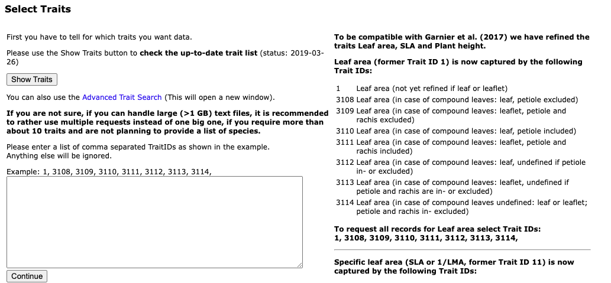
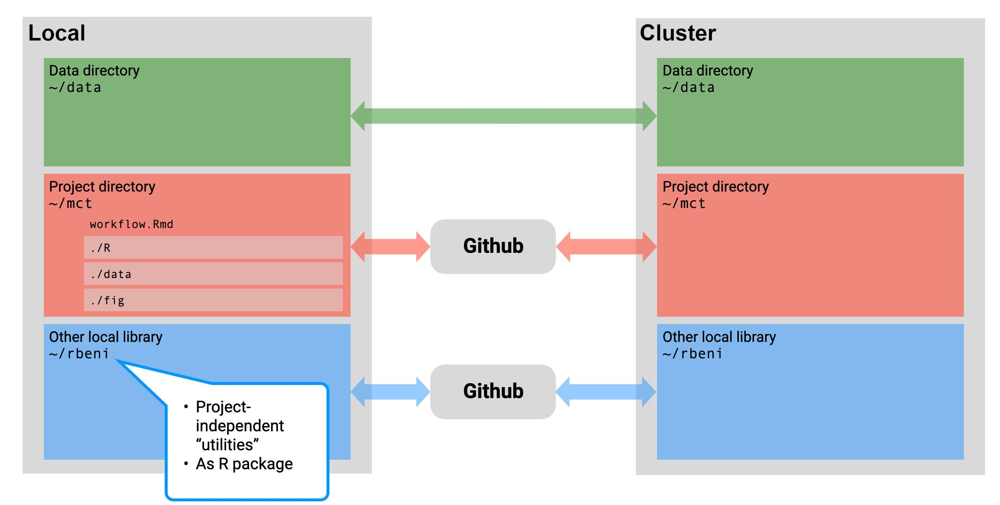
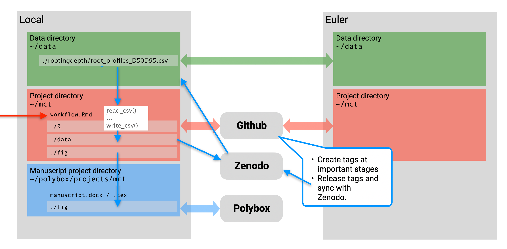
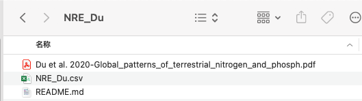
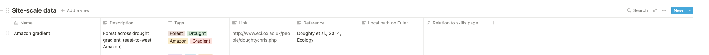
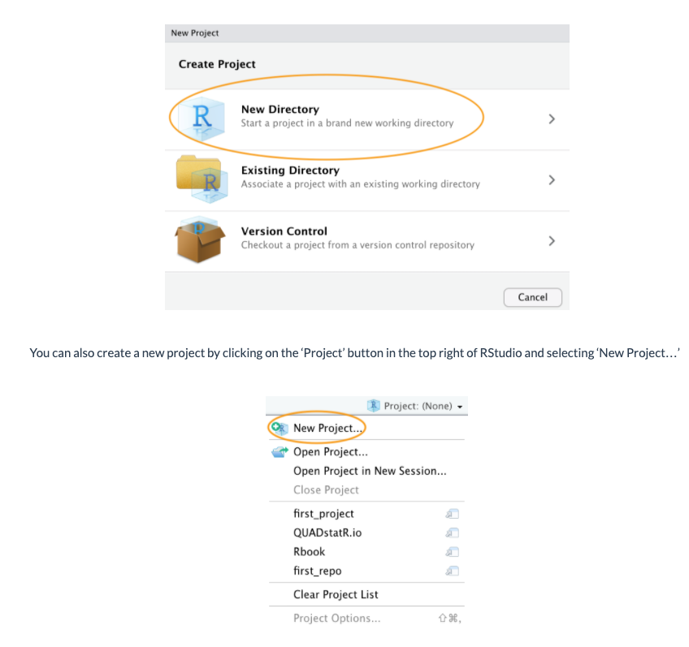
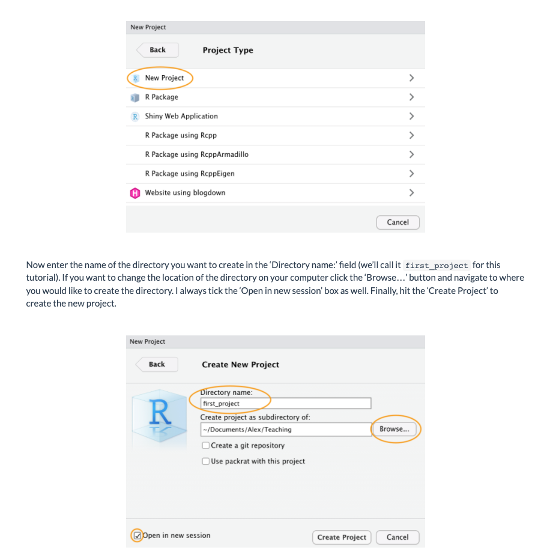
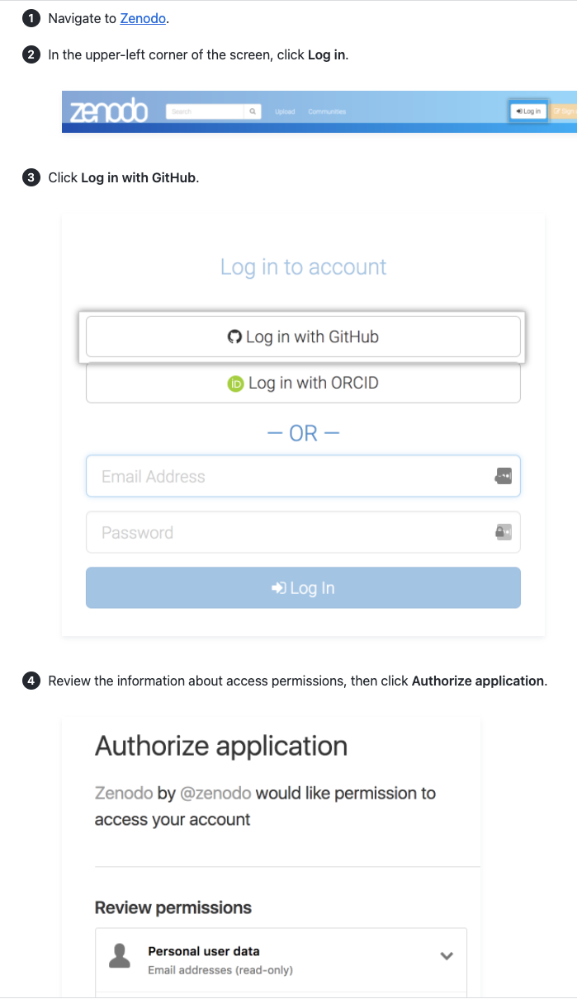
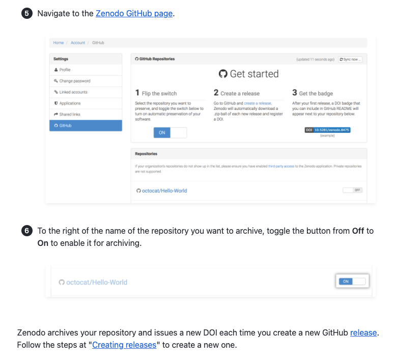
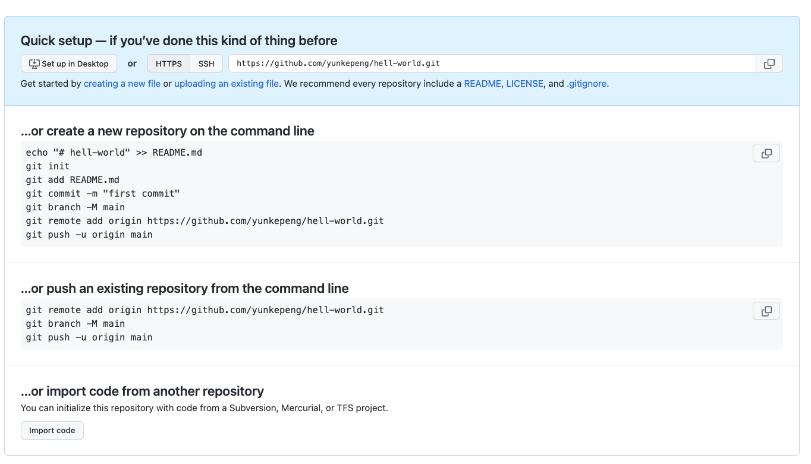

# Open Science

*Authors: Francesco Giardina, Yunke Peng, Koen Hufkens, Benjamin Stocker*

# Motivation

## Why should I care?

The immediate benefits of working reproducibly for the individual are
manifold. They include:

1.  Resuming work after absence becomes easier.

2.  By consequence, implementation of revisions of a paper become
    faster.

3.  Writing legible code and documenting a project ensures that you can
    hand it off easily to collaborators.

4.  Using a project-based approach (read below for more info) retains
    most data in one spot. This way, data and code can easily be moved
    from system to system.

5.  Movable projects allow for local development but remote (cluster)
    deployment of projects.

6.  Legible code and the use of version control software allow for a
    team to quickly iterate over a problem if needed.

## Some history

The importance of good data management transcends the success of a
scientific project itself: It guarantees the reproducibility of results,
thus encouraging the scientific community to reuse a workflow - a key
concept for the advancement of science.

After an attempt to standardize the practice of open science in 2007, it
was not until 2016 that representatives of academia, industry, funding
agencies and publishers convened to define a set of principles that
would become known as the **FAIR Data Principles**. Later that year,
during its 2016 G20 Hangzhou summit, the G20 approved the use of FAIR
principle within research. In short, the FAIR data principles mean that
data is:

-   **Findable**: Data should be easy to find, both by humans and
    machines. There is a strong emphasis on the use of metadata and the
    assignment of data identifiers.
-   **Accessible**: The access to data should be open, free and
    universally implementable. If necessary, an authentication and
    authorization procedure should be clearly explained.
-   **Interoperable**: This refers to the ease of integration with other
    data. It should be easy to interoperate within a workflow for
    analysis, storage and processing
-   **Reusable**: The documentation of data should be clear enough to
    allow reusability, which is the ultimate goal of FAIR principles

## Why is it important?

Open Science refers to the effort to make scientific research available
to peers in academia and to the public, to foster the dissemination of
findings and the development of knowledge. It involves a methodical
change to the research cycle, promoting more exchange and collaboration.
The shift to an open science practice is not trivial, and often
encompasses a cultural change, but it is essential for strengthening the
link between scientific research and society. Contributing towards this
effort, the European Union is leading the way with several initiatives
([The Facilitate Open Science Training for European Research
(FOSTER)](https://www.fosteropenscience.eu/foster-taxonomy/open-science-policies),
[The European Open Science Cloud
(EOSC)](https://eosc-portal.eu/about/eosc),
[OpenAIRE](https://www.openaire.eu)).

The transition to open science over the past few years has been
motivated by a "reproducibility crisis", i.e. the failure to replicate
scientific results. Recent evidence has found that in the field of medicine, less than half of
scientific findings may not be reliable (Ioannidis, 2005). Practicing open science offers
a solution to this problem, as sharing materials and data eases the
replication of original studies by other scientists. Open science is
made possible by **open data**, i.e. when the data itself is freely
accessible to other peers and the public. Policies enabling open data
allow researchers to innovate, starting from existing knowledge. Other
essential benefits for scientists include reputational gains, increased
visibility and impact, and a broader increase in the reliability of
research, as it enables the replication and verification of scientific
results. This in turn boosts citizens' trust in science.

The revolution of open science is not limited to the academic world
alone. Society is a consumer of science - from the computer you're
reading this article on, to the vaccines that are taking the world out
of the current pandemic.

Another key advantage of scientific results being accessible without a
fee is that anyone can benefit from them, regardless of their location
or economic situation. This is especially important for the scientific
community in developing countries. In the end, open science speeds up
the circulation of new information and helps generate solutions to the
current great challenges. As Isaac Newton said in his 1675 letter: "If I
have seen further, it is by standing on the shoulders of Giants."

Last but not least, by making your code, data, and methods freely
available, you are creating more citable items per published project.
This will grant more visibility to your research, as well as possibly
increasing the total number of times your work get referenced. It can
trigger new collaborations and strengthens the impact of your research.

## Obstacles to Open Science

Obstacles to the development of open science trace back to when journals
were still in paper format, and storing and sharing materials and data
was difficult. Luckily for us, technology is making it easier to
practice open science.

Another problem is that journal articles are basically a summary of long
months (and sometimes years) of research. This means that in the final
report, some part of the analysis must be summarized or excluded, for
the sake of brevity. Papers with a clean story and clear results tend to
be published more easily. In the end, what we are presented with in a
published article can be far from the actual trial and error steps of
the scientific method. Nevertheless, this phenomenon causes a
impoverishment of science, as other scientists could benefit from those
"failed" attempts.

Finally, another obstacle is the time constraint imposed by the current
incentive structure. In the current academic world, publications are the
easiest way for scientists to propel their careers forward. In this
frame of things, it is thus hard to dedicate more time to a process
which may not bring direct benefits in terms of primary research
articles. However, considering the bigger picture as described above,
open science bring advantages both to the single researcher and the
scientific community.

# Data resources

## Environmental data repositories

The following is a limited list of permanent data repositories for
(environmental) data.

-   [Copernicus Climate Data Store](https://cds.climate.copernicus.eu/)

-   [Pangaea](https://www.pangaea.de/)

-   [NASA Earth Data](https://earthdata.nasa.gov/)

-   [ORNL DAAC](https://daac.ornl.gov/)

## Some of our favourites

-   **TRY database**: <https://www.try-db.org/TryWeb/Prop2.php> It
    includes all possible leaf traits (mainly in natural environments).
    Following instructions below. You can find a traits list in left
    bottom "show traits" and each number would mean an unique traits
    (e.g. 1 means leaf area). Then just add all numbers you want
    together, and press continue to fill rest of information. Please
    note, never putting too many variables one time as it it could make
    the document too large to download. 

-   ...

## General permanent data repositories

-   **Dryad**: <https://datadryad.org/search> A public database to
    search, browse and download data, and especially include many
    ecology, plant sciences and climate data globally or regionally.
    Each database includes a doi so you can cite when using them in your
    publication.

-   **Zenodo**: <https://zenodo.org/> This seems to be more widely used
    than Dryad, as it encompassed all possible research areas than just
    ecology data. Many publications have used this place to deliver this
    data locally and forming an unique doi.

-   **Github**: an example here: <https://github.com/forc-db/ForC> A few
    research also derlivers their data in Github. Although Github cannot
    produce doi directly (it can only form doi when combing with
    Zenodo), the advantage of using Github is that, it enables multiple
    data providers to update data together, and also, it is convenient
    for them to update data frequently. But this also has side effect -
    it is difficult to cite them, and also, has to prevent the risk that
    when data is recently updated but you still use old version of data.
    So, always keep in mind to git pull repository when downloading this
    sort of data. 

-   **Other sources**: Many other public data used for forcing or
    modelling were already available in Euler. For example, WFDEI,
    CRU...Always checked Euler first to see if it already exists

## Software for data interfacing

### R

-   MODISTools

-   ...

### Python

-   ...

# Open science practice

The following describes principles and rules for open science practice
as performed in our research group - *Computational Ecosystem Science*
at ETH Zurich. The key concepts are general and specific rules to be
considered as examples.

## Organizing the working environment

Keep things separate and in the right place is key. You may want to use
the same code and data across multiple computers and possibly a remote
server for High Performance Computing. It is therefore advisable to
adopt an identical directory structure on each computer. This allows you
use identical relative paths (see
[here](https://www.geeksforgeeks.org/absolute-relative-pathnames-unix/))
in scripts that work across platforms, and enables easy syncing of files
across platforms.

It is advisable to keep all git repositories at a top level in your
working environment, e.g., in your home, e.g., (`~/my_repo1`,
`~/my_repo2`, etc.). Code for your project (containing all steps from
reading original data to final results and figures) goes into these and
is synced with github (or any other git remote host service, see Chapter
'Git in Project Management'). Note that figures produced by your code
and intermediate output should *not* be added to git.

You may want to collect any particularly useful functions that may be
used in several different projects in your own personal utility
package/library. An example is the
[*rbeni*](https://www.notion.so/TBC-rbeni-c7afcfef13cf4c9e838773d5adeeb22f)
package by Benjamin Stocker. Make sure it's well documented.

Original data, as downloaded from the web, goes into a sub-directory,
which is also sitting at a top level in your working environment, e.g.,
in your home (`~/data`).

The project directory and other utility packages are synced with Github.
Using *git*, the code of entire projects can be synced across multiple
workstations and with your personal directory on your institution's
cluster or cloud services (e.g. the HPC cluster 'Euler' at ETH Zurich).



## Where does the data go?

Original data, as downloaded from the web, should always be in the local
data directory `~/data` and synced with the remote server. Once you
downloaded data files from a particular source (e.g. accompanying a
paper, or a particular satellite mission, etc.), create a sub-directory
within `~/data` and place it in there, along with a `README` file (plain
text) where you specify when and how the data was obtained (contact
person, URL, etc.), what the data contains (variables, units of
variables if not provided in the files directly, etc.), what data use
policies apply, who obtained the data (your name) and how it should be
cited. If original data was processed to a different format or
re-gridded, please note it in the README and refer to respective scripts
which may be added to the same directory (e.g., `proc_this_data.sh`)
(but not any further analysis).

Note that intermediate outputs produced by your project's code should
not go on git. Git is only to back up code (and small plain-text data
files, on the order of a about \<100 MB). Still you may want to sync
these intermediate outputs with your cluster as a backup of your
analysis.


## Reproducibility

Making your analysis reproducible - from the original files you
downloaded on the web to final results and figures - is our highest
standard. No excuses! Before submission of a paper, you should be able
to demonstrate reproducibility.

The key file here is a "workflow" script written on RMarkdown or Jupyter
Notebook, that may run all steps of your analysis in the right order (or
at least contains accurate descriptions of how stuff is run). Upon
publication, all code and important outputs of the analysis are to be
uploaded to a permanent repository and assigned a digital object
identifiyer (DOI), e.g, on *Zenodo* (or any other service that generates
DOIs). Regularly *tag* your *git* project at important stages (e.g.
first submission, final submission, etc.). Tags can form a *release*
within Github and releases can be synced with *Zenodo* where each
release gets its DOI (see chapter below). Refer to the code and output
DOIs in your published paper.



## A quick note on *.bash_profile*

To ease the access to a cluster, it is possible to use *.bash_profile*.
This is a configuration script generally located in your home directory
(file path must be: \~/.bash_profile). It is used to customize your bash
environment and can contain variable specifications, login information,
etc. You can add bash functions there. It is basically a normal bash
script that is executed each time you open a bash shell (terminal window
or tab). The bash profile is named `.bash_profile` and sits in your home
(`~`).

To open and edit your bash_profile do:

``` bash
subl ~/.bash_profile
```

In your *.bash_profile*, you can list aliases (shorthands), environment
variables, and functions that may be useful. Just add them to your
bash_profile.

Once you made changes to bash_profile, they are not immediately
effective in the shell windows already opened. To make them effective,
you can do

``` bash
source ~/.bash_profile
```

The bash profile can contain specifications of environment variables and
functions. The first line is (as for every bash script) `#!/bin/bash` .
Then come the environment specifications.

## Best practice notes

-   When working on git, avoid creating new files with "\_v2". Git makes
    this obsolete. If you want, you can always go back to earlier
    versions. If you want to keep a stable version while trying out
    something new, create a new "branch", while the "master" remains the
    stable version. If the "\_v2" files are the ones that are specific
    to *your* development and you are afraid of messing up the original
    code: don't worry! You have already forked the repo and if the
    maintainer of the original code doesn't want to adopt the changes in
    your fork, they won't.
-   Avoid writing data into programming language-specific formats (e.g.
    `.RData`, or `.rds`), unless these are temporary files used for
    intermediate steps. All published data must be made accessible under
    *FAIR* principles. This means that data formats should be readable
    without reliance on proprietary software. In general, write data
    frames into CSV files and geo-located raster data into NetCDF or
    GeoTIFF.
-   Make sure that important figures (e.g. the ones in published papers)
    can be easily reproduced, starting from original data that were
    downloaded from (possibly open access-) sources. A good place to
    describe how to reproduce figures are RMarkdown files or the README
    file.
-   When creating `.RData`, or `.rds` files, put only one variable into
    them and name the file the same as the variable. E.g. file
    `df_combined.RData` contains only one variable, namely
    `df_combined.RData`.

## In a nutshell

-   For each project that you are working on, create a separate
    directory in your home (e.g., `~/my_current_project/`). All scripts
    that you use for the analysis go in here. Outputs from analyses or
    model runs, go to a separate sub-directory `data/`. Figures may go
    to `fig/`.
-   Separate original data and analysis/model outputs. Original data is
    what was collected in the field, obtained from collaborators, or
    downloaded from public sources. Place original data outside the
    project directory, it is *not* part of the respective git
    repository.
-   Create a new git repository for each project folder and sync all
    source code files in it with your github (or gitlab, or bitbucket)
    account.
-   To make all your analyses reproducible, place a RMarkdown (for R) or
    Jupyter Notebook (for Python) file in the main directory
    `~/my_current_project/` (or in a subdirectory `analysis/`) that
    documents all the steps - from reading in the original data, to data
    processing steps (document any decision regarding processing you
    made), and to final published plots and numbers. For bigger
    projects, you may keep separate analysis scripts (RMarkdown or
    Jupyter Notebooks) for different parts of the analysis, and you may
    add text describing which other scripts performed what part of the
    analysis in what order. For such bigger projects, it is important to
    document the main steps of the analysis and respective scripts in
    the `README`.
-   The outputs (html, PDF, ...) from RMarkdown files or Jupyter
    Notebooks serve not only as a lab report for yourself, but can also
    be used to communicate your results with others, or provided as a
    supplementary material, accompanying papers.

# An open science workflow

The following provides an example that contains all steps of an open
science workflow:

-   Obtain and document data

-   Organise analysis code in a git repository (and RStudio project)

-   Document analysis and communicate results

-   Sync analysis outputs with a remote server

-   Code versioning and publication

## Obtain data

Below is an example to get data publicly. Generally, please always read
README carefully, and especially the data-use policy for further
analysis and publications.

## Document data

-   After downloading data, please make sure one file just stored one
    source of data. Taking below file as an example, it includes
    original csv, original paper, and a README. Here README was created
    just to note myself, you can add when and where you download this
    data (email or public link?), which variables did it generally
    include, important note, unit, or any others you wish to note to
    your self. 
-   Then you can mark in Notion:
    <https://www.notion.so/computationales/Site-scale-data-d1438daa123448858fd962d23b0f2185>
    So that everyone else can find it easily when browsing this data
    again. 

## Organise analysis code in a Rstudio project

See link for a very good guideance:
[\<https://alexd106.github.io/intro2R/project_setup.html\>](https://alexd106.github.io/intro2R/project_setup.html){.uri}

What advantages would creating a project bring? It helps to best manage
a project. For example, all analyses used within this project can be
managed, and it will never mix with other types of analysis.

Main steps:

1.  Create a project

2.   

3.  Then you will see this new Rproj at the window
    

4.  Then you can set your project work path in Rstudio, which is just
    exactly the same place shown in above window.
    setwd('/Users/yunpeng/../first_project')

## Document and communicate analysis

-   Below is an example for using ingestr function to download daily
    climate data (e.g. Average temperature). This data is available in
    Euler. To run analysis, you can either download data from Euler to
    your own hard-drive to run, or directly run in Euler. See below
    commented path that relevant to Euler.

```{r eval = FALSE}
library(ingestr)
library(ggplot2)

siteinfo <- tibble(sitename="site1",lon=
-79.2,lat=34.8,elv=61,year_start=1992,year_end=1992)

df_watch <- ingest( siteinfo = siteinfo1, source = "watch_wfdei",
getvars = c("temp"), dir = "/Volumes/My Passport/data/watch_wfdei/", #In
Euler: /cluster/work/climate/bestocke/data/watch_wfdei/ settings =
list(correct_bias = "worldclim", dir_bias = "/Volumes/My
Passport/data/worldclim/")) #In Euler:
/cluster/work/climate/bestocke/data/worldclim/

ggplot(data=as.data.frame(df_watch$data),aes(x=date,
y=temp))+geom_point()+ ggtitle("Daily air temperature at example
site") + xlab("Date") + ylab("Temperature")
```


Some other tips

-   Structure your code into parts that naturally go together. A code
    file should not contain more than a few hundred lines of code.
-   Visually highlight the structure inside your code files.
-   Implement the entire workflow of your project in one or a few
    RMarkdown files. RMarkdown is a great tool to give structure to your
    code and make your code readable.
-   If additional scripts are used outside of your main workflow
    script/RMarkdown file, point to them (by file name).
-   Consider a hierarchy of sections. Explain briefly what is done by
    each code chunk.
-   The final aim is to make it easy for someone to reproduce your
    published Figure X.
-   When using RMarkdown or Markdown, please follow the syntax for a
    nicely readable formatting

## Sync outputs

-   After processing of data analysis and before publication, all data
    used or saved in desktop should be uploaded to Euler so that it
    benefits re-use from other users. It is recommended to use
    Filezilla. The left is page at desktop, the right is page at remote
    (Euler). You can just directly move the file from left to right (for
    upload) or move file from right to left (for download).
-   Very important: We recommend to keep path consistently between
    desktop and remote place. For data saving, my desktop path is
    "/Users/yunpeng/data/" and Euler path is
    "/cluster/work/climate/bestocke/data". But they can both be written
    as "\~/data/" so that it can be consistently inputted in any
    analysis.


## Code versioning and publication

XXX Explain git tags and github releases, see
[here](https://docs.github.com/en/repositories/releasing-projects-on-github/managing-releases-in-a-repository)

XXX For public code, make consistent versioning, see
[here](https://r-pkgs.org/release.html#release-version).

-   Sharing raw and processed data on a server/cluster (e.g. euler at
    ETH, other at Imperial). See above point.
-   Make data publicly available (Zenodo, dryad) and quote its DOI for
    the use of paper.
-   Make code publicly available in Github, and publish its release.
-   How to make code publicly availble in Github and publish its release
    and zenodo? See here:
    [\<https://docs.github.com/en/repositories/archiving-a-github-repository/referencing-and-citing-content\>](https://docs.github.com/en/repositories/archiving-a-github-repository/referencing-and-citing-content){.uri}

 

# Remaining bits

## Getting public data

Getting public data from widely used portals e.g. Copernicus data, NASA
data, etc. using their APIs

Here we show an example about how to ingest (download) climate data from
Euler. Here, we are interested in downloading air temperature at a
certain range of time and site.

Guidance of installing ingestr is here:
<https://github.com/computationales/ingestr>

The source data are all available in Euler. See comments below. You can
either download data from Euler to hard drive/desktop and then run this
code in desktop, or directly run this code in Euler.

## Git Attributes

Using .gitattrributes to keep data on git:
[\<https://git-scm.com/book/en/v2/Customizing-Git-Git-Attributes#Binary-Files\>](https://git-scm.com/book/en/v2/Customizing-Git-Git-Attributes#Binary-Files){.uri}


Git add: Adding (updating) changed file in current desktop. Storing this
change from working directory to staging area.

Git commit: Commit this change along with some comments at staging area,
and prepared before submission.

Git push: push this change from local-repo to remote-repo. In other
words, this change can now be shared with other users.

Git pull: Pull the latest version of remote repo's updates into current
local desktop.

Git merge/checkout: merge local and remote's code together.

Git tag: create tag so that it will points out important release of
code. See complete step here:
[\<https://stackoverflow.com/questions/18216991/create-a-tag-in-a-github-repository\>](https://stackoverflow.com/questions/18216991/create-a-tag-in-a-github-repository){.uri}

### How to create a new repo in Github?

See link:
[\<https://docs.github.com/en/get-started/quickstart/create-a-repo\>](https://docs.github.com/en/get-started/quickstart/create-a-repo){.uri}

First press "Create a repository" in Github. Follow the instructions and
then finish. Then, following instructions shown in below. Using "cd
file-path" to point out your saved path. Then add files manually, commit
and git push



### How to fork a repo in Github?

See link:
[\<https://docs.github.com/en/get-started/quickstart/fork-a-repo\>](https://docs.github.com/en/get-started/quickstart/fork-a-repo){.uri}

First, find the repo you wish to fork, then cloned it to your own
github, and your own desktop basing on below.

When using other users code, why we prefer choose to use fork a repo,
rather than directly using others repo (e.g.
devtools::install_github("../.."))? Because:

(1) in this way, it will help us to easier to edit the code. We knew
    exactly where we saved this code, and we can edit them, trace them
    (through git.), and push them into our own github anytime!

(2) it will also help us to communicate with other users. For example,
    you find an apparent mistakes in original branch - you can edit it
    your own, submit to github and then report to original author.

 

# References and further reading

1.  Allen C, Mehler DMA (2019) Open science challenges, benefits and
    tips in early career and beyond. PLOS Biology 17(12): e3000587.
    <https://doi.org/10.1371/journal.pbio.3000587>
2.  Wilkinson, Mark D et al. "The FAIR Guiding Principles for scientific
    data management and stewardship." *Scientific data* vol. 3 160018.
    15 Mar. 2016, <doi:10.1038/sdata.2016.18>
3.  Ioannidis JPA (2005) Why Most Published Research Findings Are False. PLoS Med 2(8): e124. https://doi.org/10.1371/journal.pmed.0020124
4.  Wilson G, Aruliah DA, Brown CT, Chue Hong NP, Davis M, Guy RT, et
    al. (2014) Best Practices for Scientific Computing. *PLoS Biol*
    12(1): e1001745. <https://doi.org/10.1371/journal.pbio.1001745>
5.  RMarkdown resources:
    [basics](https://rmarkdown.rstudio.com/authoring_basics.html), [PDF
    Cheatsheet](https://www.rstudio.com/wp-content/uploads/2015/02/rmarkdown-cheatsheet.pdf),
    [Another longer
    cheatsheet](https://github.com/adam-p/markdown-here/wiki/Markdown-Cheatsheet)
