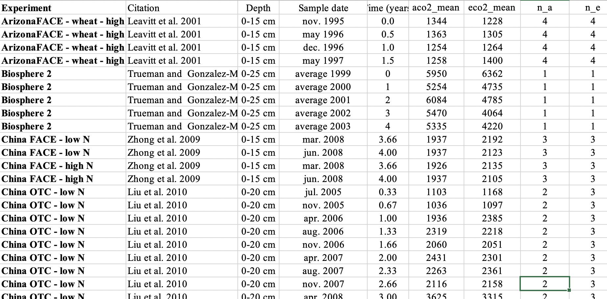

# Intro: What is this file here?

This is a RMarkdown file. It allows you to combine normal text with executable code - much like a Jupyter Notebook. Markdown is a simple formatting syntax for authoring HTML, PDF, and MS Word documents. For more details on using R Markdown see <http://rmarkdown.rstudio.com>.

When you click the **Knit** button a document will be generated that includes both content as well as the output of any embedded R code chunks within the document. You can embed an R code chunk like this:
```{r}
summary(cars)
```

You can also embed plots, for example:
```{r}
hist(rnorm(1000))
```

You can also run individual cells by putting to cursor into it and do command + enter, or in RStudio by clicking the green "play" icon in the top-right corner of the cell. You can also run all cells of the RMarkdown file sequentially by clicking on "Run" in the top right corner of this window. This embeds all output of the cells (be it a plot or text returned to the R console).

# Solution

**1. Manually manipulate the .xls file to make it tidy.**
After manually editing the file in Excel, we get it into a tidy shape. This should look like the screenshot below.



***
**2. Save the data as a .csv file (comma-separated-values).**
This sheet can now be exported into a comma-separated-values (CSV) file. Here, we're exporting it into a file named `""groenigen14sci_database_s1.csv""`. CSV is a file format that is readable across platforms and without relying on proprietary software. 

***
**3. Read the .csv file into RStudio.**
After reading it into R we get a data frame that we can now (finally) work with.
```{r}
library(tidyverse)
df_groenigen <- read_csv("../data/groenigen14sci_tidy.csv")
```


***
**4. Calculate the logarithmic response ratio as the logarithm of the ratio of soil C contents at elevated CO2 divided by soil C contents at ambient CO2, for each data point (experiment and sample date).**

To define a vector with values of the logarithmic response ratios of each experiment and sample data point, we can work, for example, with the vectors of SOC at elevated and ambient CO2 extracted from the data frame.
```{r}
rr <- log(df_groenigen$eco2_mean / df_groenigen$aco2_mean)
```

Alternatively, we could create a new column in the data frame as:
```{r}
df_groenigen <- cbind(df_groenigen, log(df_groenigen$eco2_mean / df_groenigen$aco2_mean))
names(df_groenigen) <- c(names(df_groenigen)[-ncol(df_groenigen)], "rr")
```
This was a annoyingly complicated. Much better to work with tidyverse functions to which you'll be properly introduced in Chapter 4. In the tidyverse, we can create a new column containing logarithmic response ratio using the `mutate()` function as:
```{r}
df_groenigen <- df_groenigen %>% 
  mutate(rr = log(eco2_mean / aco2_mean))
```

***
**5. Visualise the distribution of the response ratio and save the plot as a .pdf file.**
To visualise the distribution of response ratios, we can plot a histogram. Applied directly to the vector defined above, this can be done as:
```{r}
hist(rr, xlab = "Response ratio of SOC: log(aCO2 / eCO2)")
```

In the tidyverse, we would use the ggplot2 library as:
```{r}
library(ggplot2)
ggplot(data = df_groenigen, aes(x = rr)) +
  geom_histogram() +
  labs(x = "Response ratio of SOC: log(aCO2 / eCO2)")
```

